<p align="center">
  
</p>

<p align="center" style="font-size:15pt; color:#e6f1ff; font-weight:bold; margin-top:18px;"><em>The Machine That Trades While You Sleep</em></p>
<p align="center" style="font-size:11pt; color:#a8b2d1;">Inside a Production Pipeline That Fuses 4 Intelligence Sources (ML, Forecast, RL, Paper Consensus), Scrapes 15 Data Sources, and Executes Trades Across 8 Accounts — Every Hour, Autonomously</p>

<p align="center">
  <strong>Author:</strong> <a href="https://linkedin.com/in/timothy-lokotar/">Timothy Lokotar</a> · <a href="https://www.moneyprod.com/">MoneyProd</a><br>
  <a href="https://www.moneyprod.com/">Live Dashboard</a> · <a href="https://linkedin.com/in/timothy-lokotar/">LinkedIn</a>
</p>

---

> *"What if you could build a system that never sleeps, never panics, and learns from every trade it makes — not in simulation, but with real capital, every hour, across 8 currency pairs?"*
>
> *This is that system. And this document is your guide through every algorithm, every decision, and every line of logic that makes it work.*

---

| Metric | Value |
|---|---|
| **Pipeline Execution** | **168 seconds** (2.8 minutes) |
| **Data Sources** | 15 (parallel scraping in 9 threads) |
| **Features per Pair** | 134 (1,072 total across 8 pairs) |
| **ML Architecture** | 5-Model Mixture of Experts (MoE) |
| **Financial Theories** | 30 per pair (240 total) |
| **Live Strategies** | 32 (survivors of ~10 million candidates) |
| **Currency Pairs** | 8 major + cross pairs |
| **Brokerage Accounts** | 8 (Interactive Brokers, dual gateway) |
| **Pipeline Frequency** | Every H4 bar close (6×/day) |
| **Signal Sources** | 4 (ML Classifier, 4-Day Forecast, RL Agent, Paper Consensus) |
| **Safety Layers** | 6 independent circuit breakers + strategy analytics |
| **RL Experiences** | 6,832 (growing every cycle) |
| **Model Version** | v17.0 (self-versioning) |

---

## Table of Contents

- [Prologue: Before the Machine Wakes](#prologue-before-the-machine-wakes)
- [Act I: The Forge — Where Strategies Are Born and Die](#act-i-the-forge--where-strategies-are-born-and-die)
  - [Chapter 1 — Genesis: 10 Million Candidates, 32 Survivors](#chapter-1--genesis-10-million-candidates-32-survivors)
  - [Chapter 2 — The Sentinels: Infrastructure That Never Sleeps](#chapter-2--the-sentinels-infrastructure-that-never-sleeps)
- [Act II: The Oracle Network — Gathering Intelligence](#act-ii-the-oracle-network--gathering-intelligence)
  - [Chapter 3 — 15 Data Sources in 62 Seconds](#chapter-3--15-data-sources-in-62-seconds)
  - [Chapter 4 — The Theory Engine: 30 Hypotheses Per Pair](#chapter-4--the-theory-engine-30-hypotheses-per-pair)
- [Act III: The Mind — Five Models, One Decision](#act-iii-the-mind--five-models-one-decision)
  - [Chapter 5 — The Ensemble: A Five-Headed Intelligence](#chapter-5--the-ensemble-a-five-headed-intelligence)
  - [Chapter 6 — The Volatility Oracle: Reading Market Fear](#chapter-6--the-volatility-oracle-reading-market-fear)
  - [Chapter 7 — The Bayesian Calibrator](#chapter-7--the-bayesian-calibrator)
  - [Chapter 8 — The Time Machine: 4-Day Markov Forecasts](#chapter-8--the-time-machine-4-day-markov-forecasts)
  - [Chapter 9 — The Learning Agent: Reinforcement Learning](#chapter-9--the-learning-agent-reinforcement-learning)
- [Act IV: The Decision — From Signal to Capital](#act-iv-the-decision--from-signal-to-capital)
  - [Chapter 10 — The Arbiter: Meta-Signal Resolution](#chapter-10--the-arbiter-meta-signal-resolution)
  - [Chapter 11 — The Risk Cascade: Position Sizing](#chapter-11--the-risk-cascade-position-sizing)
- [Act V: The Living System — Self-Improvement and Defense](#act-v-the-living-system--self-improvement-and-defense)
  - [Chapter 12 — The Six Shields: Circuit Breakers, White Swan, and Strategy Analytics](#chapter-12--the-six-shields-circuit-breakers-white-swan-and-strategy-analytics)
  - [Chapter 13 — The Self-Improving Machine](#chapter-13--the-self-improving-machine)
  - [Chapter 14 — Strategy Analytics: The AlgoChef Layer](#chapter-14--strategy-analytics-the-algochef-layer)
- [Epilogue: What This Machine Proves](#epilogue-what-this-machine-proves)
- [Technical Appendix](#technical-appendix)
- [References](#references)

---

## Prologue: Before the Machine Wakes

It is **06:20 AM Eastern Time**, February 26, 2026.

New York is still dark. The Asian session is winding down. London is warming up. Over $7.5 trillion flows through the foreign exchange market every day — the largest, most liquid financial market on Earth.

Somewhere in a data center, a machine stirs.

Not a metaphorical machine. A *real* one. A production server running Python 3.14, connected to two IB Gateway instances via the TWS API, monitoring 32 live trading strategies across 8 currency pairs on 8 brokerage accounts. In the next **168 seconds**, this machine will:

1. **Scrape 15 data sources** across 9 parallel threads — retail sentiment, CFTC institutional data, economic calendar, CME implied volatility, prediction markets, FinBERT news analysis, currency strength, and seasonal patterns
2. **Calculate 30 financial theories** for each of 8 pairs — 240 directional hypotheses
3. **Train a 5-model ML ensemble** (Mixture of Experts) on 1,072 features
4. **Classify IV regimes** from CME FX ETF options — identifying COMPLACENT, PRICED, FEARFUL, and SURPRISE markets
5. **Consult a Bayesian MCMC optimizer** for confidence calibration
6. **Generate 4-day probabilistic forecasts** using Markov transition matrices
7. **Train and deploy a Reinforcement Learning agent** with 6,832 experiences
8. **Aggregate paper signals** from 32 live MCPT strategies via PnL-weighted majority vote
9. **Arbitrate conflicting signals** from 4 sources through a weighted meta-resolution engine
10. **Compute risk-adjusted position sizes** through a 6-layer cascade
11. **Write a CSV file** that activates or deactivates each of the 32 strategies in real time

By **06:23:28** — exactly **155 seconds** after it started — the CSV is written. The charting platform reads it. Orders flow to Interactive Brokers. The machine goes quiet.

Until the next cycle.

**This document is the complete, unabridged technical blueprint of that machine.** Every algorithm. Every decision tree. Every safety layer. Sourced from a real pipeline execution on **February 26, 2026** — not a simulation, not a backtest, but a live production run.

*The hero's journey begins with a question most people dismiss as impossible: Can a fully autonomous system consistently extract alpha from the most efficient market on the planet?*

*The answer, as you will discover, is far more interesting than a simple yes or no.*

---

## Act I: The Forge — Where Strategies Are Born and Die

*"Every great quest begins not with a weapon, but with a forge. And the best forges are the ones that destroy 99.99968% of everything that enters."*

---

### Chapter 1 — Genesis: 10 Million Candidates, 32 Survivors

#### The Dragon of Overfitting

Before the pipeline can execute, it needs strategies to execute. But here lies the fundamental paradox — the dragon every quantitative trader must slay:

> **The more perfectly a strategy fits historical data, the more certain its failure in live trading.**

This is the overfitting problem. A strategy that captures every wiggle in past price data has learned nothing about the market — it has merely memorized a specific sequence of events that will never repeat exactly. The more complex the entry logic, the more likely it is curve-fit. The more optimized the parameters, the less robust the edge.

To slay this dragon, you need not cleverness or intuition. You need **systematic, multi-dimensional statistical validation at massive scale**.

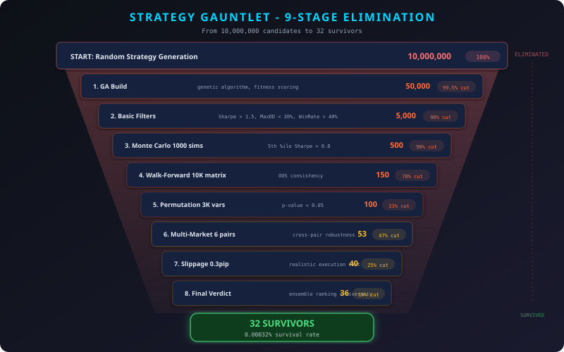

#### The Multi-Island Genetic Architecture

The 32 strategies deployed in this pipeline are not hand-crafted. They are **evolutionary survivors**. Each one emerged from a process that generated approximately **10 million candidates** across 10 complete evolutionary cycles.

**How It Works (Genetic Algorithm with Island Model):**

The system uses a **multi-island genetic algorithm** — a parallel evolutionary architecture inspired by the Baldwin Effect in evolutionary biology:

- **5 independent islands** (populations), each containing **50 strategies**
- Each island evolves independently for **10 generations** through selection, crossover, and mutation
- **Migration events** exchange top performers between islands every 3 generations, preventing premature convergence
- Fitness function: **Return-to-Drawdown ratio** (not just returns — this punishes volatility)
- **Complexity constraint**: Maximum 2 entry conditions, no fixed stop-losses, no fixed profit targets

> **Why no fixed exits?** Fixed exits (e.g., "take profit at 50 pips") are the most potent curve-fitting vector. They latch onto specific historical price patterns that vanish in live markets. By forbidding them, the genetic algorithm is forced to discover *structural* edge — patterns that persist across market environments.

**Example of a Typical Evolved Strategy Entry:**
```
IF RSI(14) < 30 AND Bollinger_Band_Width(20,2) > 0.015
THEN enter LONG at market
EXIT: Reverse on opposite signal
```

Simple. Two conditions. No magic numbers. This simplicity is the point — complex strategies overfit; simple strategies generalize.

#### The Nine-Stage Gauntlet

A strategy that survives the genetic algorithm has proven itself in-sample. But in-sample performance means nothing. The real test is **out-of-sample robustness** — performance on data the strategy has never seen.

The 32 survivors passed through **nine increasingly brutal validation stages**:

| Stage | Method | What It Tests | Elimination Rate |
|---|---|---|---|
| **1. Build** | Multi-Island GA (5×50×10 gen) | Raw edge discovery | ~99.5% |
| **2. Monte Carlo** | 1,000 simulations × 4 perturbation layers | Robustness to randomness | ~90% of survivors |
| **3. Walk-Forward** | 10,000 matrix combinations (4×4 area ≥ 80%) | Time-series generalization | ~90% of survivors |
| **4. Permutation** | 3,000 parameter variations (70%+ profitable) | Parameter sensitivity | ~70% of survivors |
| **5. Multi-Market** | 6 additional currency pairs (Ret/DD > 1) | Cross-market validity | ~47% of survivors |
| **6. Slippage** | 0.3 pip simulated spread | Execution cost resistance | ~38% of survivors |
| **7. Robustness** | Combined sharp-peak plateau analysis | Parameter landscape shape | ~50% of survivors |
| **8. OOS Validation** | Strict out-of-sample period | True predictive power | ~60% of survivors |
| **9. Final Verdict** | Elevated thresholds (PF > 1.2, 70% OOS) | Production readiness | ~36% of survivors |

Let us examine the most critical stages in detail:

**Stage 2: Monte Carlo Simulation (4 Perturbation Layers)**

For each strategy that passed Stage 1, the system runs **1,000 Monte Carlo simulations**, each applying 4 independent perturbation layers:

1. **Trade order shuffling** — Randomize the sequence of trades (tests whether returns depend on specific trade ordering)
2. **Price data randomization** — Add random noise to OHLC bars (±0.3% of close price)
3. **Slippage injection** — Random entry/exit slippage from 0 to 0.5 pips
4. **Parameter jittering** — Perturb all parameters by ±10% of their optimized values

A strategy passes only if its **median return across 1,000 simulations** exceeds the original backtest return × 0.6. This means: even with significant random perturbation, the strategy must retain at least 60% of its edge.

**Stage 3: Walk-Forward Matrix (10,000 Combinations)**

Walk-forward analysis is the gold standard for time-series validation. The system tests **10,000 combinations** of in-sample/out-of-sample windows:

- In-sample windows: 60, 90, 120, 180 days (4 options)
- Out-of-sample windows: 30, 60, 90, 120 days (4 options)
- This creates a 4×4 matrix of 16 core configurations, each tested at 625 rolling start positions

A strategy passes only if **≥ 80% of all walk-forward windows are profitable** in the out-of-sample segment. This brutal threshold ensures the strategy generalizes across different market regimes.

**Stage 5: Multi-Market Validation**

A strategy designed for EURUSD is tested on 6 additional pairs: GBPUSD, USDJPY, USDCHF, AUDUSD, USDCAD, EURJPY. It must achieve a Return-to-Drawdown ratio > 1.0 on **at least 4 of the 6** additional pairs. This eliminates strategies that are pair-specific — a strong signal of overfitting to one instrument's idiosyncratic behavior.

#### The Compound Probability

What is the probability that a purely random (curve-fit) strategy passes all nine stages by chance?

```
P(random_pass) ≈ 0.005 × 0.10 × 0.10 × 0.30 × 0.53 × 0.62 × 0.50 × 0.40 × 0.64
             ≈ 0.0000032
             ≈ 1 in 312,500
```

**Result: 32 survivors from ~10 million candidates — a survival rate of 0.00032%.**

These 32 strategies are not lucky. They possess genuine, statistically validated edge.

#### The Portfolio Structure

The 32 survivors are perfectly balanced by design:

- **4 strategies per pair** across 8 currency pairs (EURUSD, USDJPY, GBPUSD, USDCHF, AUDUSD, USDCAD, EURJPY, AUDJPY)
- **16 Long + 16 Short** (directional hedge)
- **16 Trend-Following + 16 Mean-Reversion** (style diversification)
- **4 per account** across 8 accounts (2 Long + 2 Short, 2 TF + 2 MR per account)

This orthogonal design ensures that no single market condition can devastate the entire portfolio. When trend-following strategies lose in range-bound markets, mean-reversion strategies profit — and vice versa.

*But having great strategies is only the beginning. The real question is: when should each strategy be active? And with how much capital?*

*That question — answered dynamically, every hour, using machine learning, reinforcement learning, and Bayesian optimization — is what makes this pipeline unique.*

*And it all starts with a connectivity check...*

---

### Chapter 2 — The Sentinels: Infrastructure That Never Sleeps

#### Crossing the Threshold

Before the pipeline can collect data, train models, or make decisions, it must answer a more fundamental question: **Is the infrastructure alive?**

This is not trivial. The system manages real capital through dual broker gateway instances, connected to a charting platform that reads strategy commands through a shared-memory C++ DLL. Any broken link in this chain means orders will not execute — or worse, will not *stop* executing.

#### Memory Guardian: Resource Pre-Flight

The very first action the pipeline takes — before any connectivity check — is to verify that the server has enough RAM to complete its work. The **Memory Guardian** (`memory_guardian.py`) reads available physical memory through a direct Windows kernel call and enforces a 3 GB minimum threshold.

On a 16 GB server simultaneously running two IB Gateway JVMs, 32 live trading strategies, a persistent liveboard service, and development tools, memory pressure is a real threat. A failed `select` DLL import at 04:56 on February 26, 2026 — caused by a depleted paging file — was the catalyst for this system.

The guardian operates with a tiered priority system:

| Priority | Targets | Examples |
|---|---|---|
| **Tier 1** (first) | Browsers, media, misc | Edge, Chrome, Firefox, Spotify |
| **Tier 2** | Email, communications | Thunderbird, Outlook, Slack |
| **Tier 3** (last resort) | Development tools | Claude Code, VS Code |

Within each tier, the heaviest processes are terminated first. Protected processes — Python, IB Gateway, Java, AT Center, and all OS/system services — are never touched. At least one Claude Code instance is always preserved.

```
[MEM_GUARDIAN] Free RAM: 0.70 GB (threshold: 3.0 GB)
[MEM_GUARDIAN] RAM LOW — freeing excessive processes...
[MEM_GUARDIAN] Killable: 83 processes — claude=21(8.0GB), msedge=48(2.5GB), chrome=9(0.3GB)
[MEM_GUARDIAN] Killing msedgewebview2.exe PID 10044 (msedge, 354 MB)...
[MEM_GUARDIAN] Killing msedge.exe PID 17788 (msedge, 123 MB)...
[MEM_GUARDIAN] RAM recovered: 3.21 GB (freed 8 excessive processes)
```

After reclaiming memory, the guardian elevates the pipeline process to `HIGH_PRIORITY_CLASS`, ensuring that CPU scheduling favors the trading pipeline over any remaining background processes. Discord is notified with a before/after memory summary whenever processes are terminated.

#### TWS Connectivity

```
[2026-02-26 06:20:53] TWS HEALTH CHECK v2.0 - Pre-Pipeline Guard
══════════════════════════════════════════════════
[TWS Instance 1] Port 7496 | PID: 40796 | 4 accounts, 2 positions  ✅ HEALTHY
[TWS Instance 2] Port 7497 | PID: 22340 | 4 accounts, 3 positions  ✅ HEALTHY
══════════════════════════════════════════════════
RESULT: 2/2 healthy — All TWS instances operational
```

Two independent IB Gateways, each managing 4 of the 8 accounts. The health check probes each gateway instance via its live order book, confirming not just TCP connectivity but **active data flow**. If either gateway fails, the pipeline aborts before any decisions are made. No exceptions.

#### GV Telemetry: 32 Heartbeats in 1 Second

Simultaneously, Phase 0d checks the **32 live strategies** running in the charting platform:

```
[GV_HEALTH] OK: 32/32 alive, 32 AOE (AutoOrderEntry), 32 synced
```

This uses a shared-memory C++ DLL (`GlobalVariable.dll`) that provides sub-millisecond read/write access to 32 strategy state variables. Each strategy writes its heartbeat timestamp. The telemetry system reads all 32 values and verifies three conditions:

1. **Alive** — Heartbeat within the last 60 seconds
2. **AOE-Enabled** — Automatic order entry is active (not paused)
3. **Synced** — Internal state matches expected configuration

Think of it as a heartbeat monitor for 32 independent trading agents, all verified in under 1 second through shared memory (zero network overhead).

#### The Cross-Validation Guard

Later in Stage 2, an independent **cross-validation phase** (Phase 0e) verifies that broker-reported positions match platform-reported positions:

```
[XVAL] OK: EURJPY Account 5 IBKR=+59,000 GV=+59,000 ✓
[XVAL] OK: AUDJPY Account 5 IBKR=+53,000 GV=+53,000 ✓
[XVAL] OK: USDJPY Account 8 IBKR=+33,000 GV=+33,000 ✓
[XVAL] OK: GBPUSD Account 3 IBKR=+38,000 GV=+38,000 ✓
[XVAL] OK: USDCHF Account 7 IBKR=-33,000 GV=-33,000 ✓

All positions validated OK
```

If any mismatch is detected — even 1 unit — the system flags immediately. Position desynchronization is one of the most dangerous failure modes in automated trading: it can lead to unintended exposure or phantom positions that accumulate risk silently.

#### Timezone Synchronization

A seemingly mundane but critical check:

```
✅ Timezone OK: TZ=EST5EDT, NY_offset=-18000s, local=-18000s
```

FX markets operate on a New York close calendar. A timezone misconfiguration would cause bar boundaries, event schedules, and session transitions to be calculated incorrectly — triggering trades at the wrong moments.

*The sentinels report all clear. The forge is verified. The quest can begin.*

*But a warrior without intelligence is not brave — merely reckless...*

---

## Act II: The Oracle Network — Gathering Intelligence

*"In the fog of war, the side with better intelligence does not just win — it wins before the battle begins."*

---

### Chapter 3 — 15 Data Sources in 62 Seconds

#### The Fundamental Challenge

The foreign exchange market is influenced by everything: interest rates, inflation expectations, trade policy, geopolitical risk, retail trader positioning, institutional flows, seasonal patterns, implied volatility, prediction market probabilities, and the collective sentiment of millions of participants.

No single data source captures the full picture. The pipeline's answer: **scrape everything, in parallel, every cycle.**

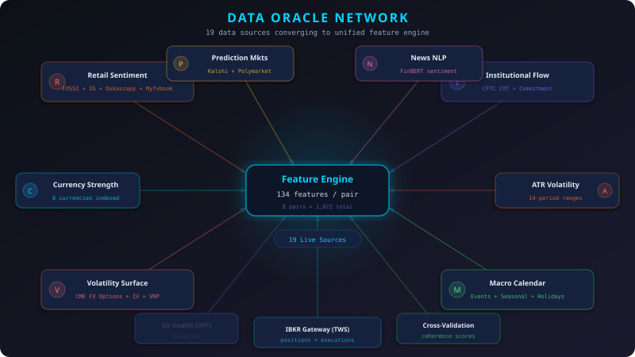

#### The Nine Parallel Threads of Stage 1

Stage 1 launches **9 data collection phases simultaneously**. Here is what happens in those 62 seconds:

---

**Thread 1 — Retail Sentiment (4 Brokers)**

The pipeline scrapes retail trader positioning from 4 independent broker platforms:

| Source | Method | Coverage | Update |
|---|---|---|---|
| IG.com | Web scraping (httpx) | 8 pairs | Real-time |
| Dukascopy | REST API (JSON) | 327 instruments | Real-time |
| Myfxbook | Web scraping | 8 pairs | Hourly |
| FXSSI | Headless browser (Selenium) | 16 pairs | Real-time |

**Why 4 sources?** Each broker has a different client base with different geographic biases, account sizes, and sophistication levels. Aggregating across brokers produces a more robust consensus signal than any single source.

> **The Contrarian Signal:** Retail traders are systematically wrong at extremes. When 80%+ of retail traders are on one side of a trade, the market tends to move against them. This is not speculation — it is a well-documented statistical regularity in FX markets, driven by the tendency of retail traders to fade trends and double down on losing positions.

---

**Thread 2 — Economic Calendar (304 Events)**

```
[Calendar] 304 events already fresh (scraped <5min ago)
Upcoming high-impact:
  Feb 26 — ECB President Lagarde Speaks (EUR)
  Feb 26 — US Unemployment Claims (USD)
  Feb 26 — Tokyo Core CPI y/y (JPY)
  Feb 27 — German Prelim CPI m/m (EUR)
  Feb 27 — Canada GDP m/m (CAD)
```

The calendar is not just informational — it feeds directly into Theory #15 (Calendar Proximity), which adjusts volatility expectations and strategy confidence based on how close the next high-impact event is. A high-impact event in 2 hours is very different from one in 3 days.

---

**Thread 3 — Implied Volatility (CME FX ETF Options)**

This is where the pipeline connects directly to the derivatives market. Using live IBKR connections, it fetches **30-day implied volatility** from CurrencyShares ETF options:

```
FXE → EURUSD  IV=5.91%  RV=5.88%  VRP=+0.03%  z=-0.72  → COMPLACENT
FXY → USDJPY  IV=9.89%  RV=10.44% VRP=-0.55%  z=-0.25  → PRICED
FXB → GBPUSD  IV=6.47%  RV=6.48%  VRP=-0.01%  z=-1.14  → SURPRISE
FXF → USDCHF  IV=8.18%  RV=8.48%  VRP=-0.31%  z=-0.68  → SURPRISE
FXA → AUDUSD  IV=12.00% RV=9.95%  VRP=+2.05%  z=+0.89  → FEARFUL
FXC → USDCAD  IV=7.27%  RV=6.45%  VRP=+0.81%  z=-0.61  → FEARFUL
EURJPY [cross] IV=10.75% RV=8.42%  VRP=+2.34%  z=-0.71  → COMPLACENT
AUDJPY [cross] IV=13.92% RV=12.50% VRP=+1.42%  z=+0.73  → FEARFUL
```

The **Volatility Risk Premium (VRP)** — the spread between what the options market implies and what is actually being realized — is one of the most powerful predictors in FX. The z-score measures how extreme the current VRP is relative to its own recent history.

For cross pairs (EURJPY, AUDJPY), IV is computed via the **triangular decomposition formula**:

```
σ(EURJPY) = √[ σ(FXE)² + σ(FXY)² - 2ρ · σ(FXE) · σ(FXY) ]
```

Where ρ is the rolling 30-day correlation between the component ETFs. This is the same formula used by options market makers to price cross-pair volatility.

---

**Thread 4 — Prediction Markets (156 Kalshi + 141 Polymarket)**

The pipeline scrapes **real-money prediction markets** for forward-looking probability distributions:

```
[Kalshi]  KXFEDDECISION: 50 markets | KXCPIYOY: 21 | KXPAYROLLS: 50
          KXGDP: 8 | KXNBERRECESSQ: 6 | KXRATECUTCOUNT: 21
[Polymarket] fed-rates: 20 | inflation: 20 | economy: 20
             tariffs: 20 | trade-war: 20 | gdp: 20 | recession: 1
```

From 297 raw market contracts, the system derives per-pair signals:

- **Hawkishness divergence**: Fed vs. other central banks
- **Policy divergence momentum**: Direction of rate differential change
- **Kalshi-Polymarket agreement**: Cross-platform consensus (or disagreement)

> **Why prediction markets?** Unlike surveys or analyst forecasts, prediction market participants have **real money at risk**. This "skin in the game" produces more calibrated probability estimates than any other publicly available source. When Kalshi and Polymarket agree on the direction of Fed policy, that signal carries significant informational weight.

---

**Thread 5 — News Sentiment (FinBERT NLP)**

The pipeline collects headlines from Google News, GDELT, and Finnhub, then scores them using **FinBERT** — a transformer-based language model fine-tuned specifically for financial sentiment analysis:

```
108 headlines scored in <1 second
  AUDJPY: GNews=+7  Finnhub=-28  (mixed → divergent)
  EURUSD: GNews=+13 Finnhub=+3   (mildly positive)
  GBPUSD: GNews=-11 Finnhub=+3   (divergent)
```

FinBERT was chosen over simpler approaches (VADER, TextBlob) because it understands financial context. The phrase "the Fed raised rates" is positive for USD (tightening = currency strength) but negative for equities — a distinction that bag-of-words models miss entirely.

---

**Thread 6 — ATR Calculation**

Average True Range on both H4 and D1 timeframes, computed from cached OHLC data:

```
ATR SUMMARY (H4 — 14 period)
  AUDJPY: 39.2 pips    EURUSD: 17.4 pips
  AUDUSD: 21.0 pips    GBPUSD: 26.4 pips
  EURJPY: 48.9 pips    USDCAD: 21.9 pips
  USDCHF: 17.8 pips    USDJPY: 51.8 pips
```

ATR is critical for position sizing (Chapter 11) — it normalizes risk across pairs with vastly different volatility profiles. Risking 2% on AUDJPY (39.2 pips H4 ATR) requires a very different lot size than risking 2% on EURUSD (17.4 pips).

---

**Threads 7-9 — Institutional (CFTC/COT), Currency Strength, Seasonal Patterns**

Three additional data layers round out the oracle network: CFTC Commitment of Traders data (institutional positioning), Dukascopy currency strength scores (real-time relative strength), and historical seasonal tendencies.

#### The Harvest

After 62 seconds, Stage 1 completes:

```
Stage 1 done: 62s elapsed
  All 9 phases completed successfully
  15 data sources × 8 pairs = coverage across all dimensions
```

*The oracles have spoken. But raw data is just noise without a framework to interpret it...*

*And this is where the real magic begins.*

---

### Chapter 4 — The Theory Engine: 30 Hypotheses Per Pair

#### The Problem of Interpretation

A sentiment score of -44% or an ATR of 51.8 pips means nothing in isolation. The same sentiment reading might be bullish in one volatility regime and bearish in another. The same ATR might call for a breakout strategy in one market phase and a mean-reversion strategy in another.

The pipeline needs a **translation layer** — a system that converts raw multi-dimensional data into directional hypotheses with normalized scores.

This is the Theory Engine: **30 independent financial theories**, each encoding a distinct market hypothesis, calculated for each of the 8 currency pairs.

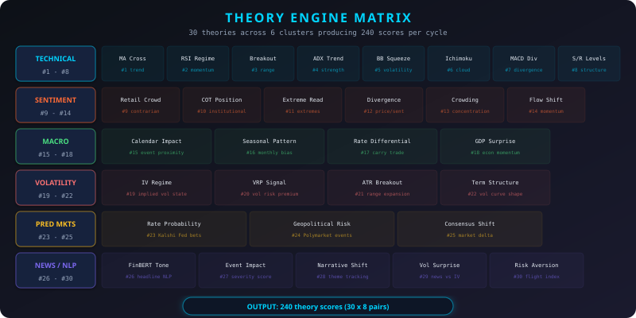

#### The 30 Theories (6 Clusters)

**Cluster 1: Technical Analysis (Theories #1–8)**

Classical and modern technical indicators computed on H4 bars:

| # | Theory | Signal Type | Range |
|---|---|---|---|
| 1 | Momentum Oscillator (RSI+Stochastic) | Overbought/Oversold | [-1, +1] |
| 2 | Trend Strength (ADX+DI) | Trend vs. Range | [-1, +1] |
| 3 | Moving Average Convergence | Crossover signals | [-1, +1] |
| 4 | Volatility Breakout (BB Width) | Compression/Expansion | [-1, +1] |
| 5 | Price Action (Candlestick Patterns) | Reversal probability | [-1, +1] |
| 6 | Support/Resistance Proximity | Mean-reversion trigger | [-1, +1] |
| 7 | Multi-Timeframe Alignment | H4/D1 agreement | [-1, +1] |
| 8 | Volume Profile (Tick Volume) | Confirmation strength | [-1, +1] |

**Cluster 2: Sentiment Analysis (Theories #9–14)**

Aggregated retail positioning from 4 broker sources + CFTC institutional data:

| # | Theory | Data Source | Key Insight |
|---|---|---|---|
| 9 | Retail Consensus | IG + Dukascopy + Myfxbook | Average retail positioning |
| 10 | FXSSI Extreme | FXSSI (16 pairs) | Extreme readings = contrarian signal |
| 11 | COT Net Position | CFTC Weekly | Institutional directional bias |
| 12 | COT Change Momentum | CFTC WoW change | Institutional repositioning speed |
| 13 | Retail vs. Institutional | Retail avg vs. COT | Divergence = strong signal |
| 14 | Crowd Behavior Index | All sources combined | Herding intensity metric |

> **The Key Insight:** When retail consensus (Theory #9) and CFTC institutional positioning (Theory #11) diverge — retail is long, institutions are short — the system generates a high-conviction short signal. This divergence pattern has historically been one of the most reliable predictors in FX.

**Cluster 3: Macro Fundamentals (Theories #15–18)**

| # | Theory | Input | What It Captures |
|---|---|---|---|
| 15 | Calendar Proximity | ForexFactory events | Upcoming event volatility risk |
| 16 | Seasonal Pattern | MarketBulls historical | Monthly/weekly statistical tendencies |
| 17 | Currency Strength Differential | Dukascopy movers | Relative base/quote strength |
| 18 | Interest Rate Divergence | Central bank data | Carry trade direction |

**Cluster 4: Volatility Theories (Theories #19–22)**

| # | Theory | Input | What It Captures |
|---|---|---|---|
| 19 | Implied Volatility Level | CME FX ETF options | Market fear level |
| 20 | Volatility Risk Premium | IV minus RV | Forward-looking vs. realized risk |
| 21 | Term Structure Slope | Near vs. far IV | Event risk pricing |
| 22 | ATR Regime | H4 and D1 ATR | Volatility expansion/contraction |

**Cluster 5: Prediction Markets (Theories #23–25)**

| # | Theory | Input | What It Captures |
|---|---|---|---|
| 23 | Fed Hawkishness | Kalshi + Polymarket | Rate direction probability |
| 24 | Policy Divergence | Cross-platform | Central bank divergence |
| 25 | PM Consensus Momentum | Weighted agreement | Direction and conviction change |

**Cluster 6: News/NLP (Theories #26–30)**

| # | Theory | Input | What It Captures |
|---|---|---|---|
| 26 | GDELT Sentiment | GDELT API + FinBERT | Global event tone |
| 27 | Google News Tone | GNews scraping + FinBERT | Popular narrative direction |
| 28 | Finnhub Sentiment | Finnhub API + FinBERT | Financial news sentiment |
| 29 | News Divergence | Cross-source comparison | Conflicting narratives signal |
| 30 | Headline Momentum | Time-decay weighted | Sentiment acceleration |

#### The Output

```
THEORY CALCULATIONS COMPLETE
  8 pairs × 30 theories = 240 theory scores
  Includes #23-#25 (prediction markets) and #26-#30 (news sentiment)
  All scores normalized to [-1, +1] range
```

These 240 theory scores, combined with price features and technical indicators, produce the **134 features per pair** that feed the ML ensemble.

*The raw data has been transformed into structured, interpretable hypotheses. The stage is set for the most critical component of the pipeline.*

*But can five models agree on what the market will do next? And what happens when they don't?*

---

## Act III: The Mind — Five Models, One Decision

*"Intelligence is not about having one perfect answer. It is about orchestrating many imperfect perspectives into collective wisdom."*

---

### Chapter 5 — The Ensemble: A Five-Headed Intelligence

#### Why Not Just One Model?

A single model — no matter how sophisticated — carries a single perspective. It overfits to the patterns it learned and fails when the market shifts to a regime it has not seen. The pipeline's answer: a **Mixture of Experts (MoE)** architecture with 4 specialist models and 1 meta-classifier.

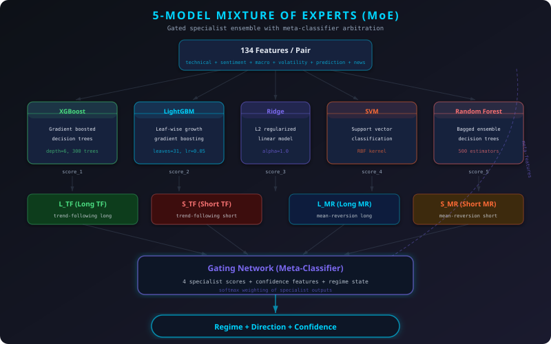

#### Architecture: 4 Specialists + 1 Gating Network

| Specialist | Role | Input | When It Excels |
|---|---|---|---|
| **L_TF** | Long Trend-Following | 134 features | Rising markets, positive momentum |
| **S_TF** | Short Trend-Following | 134 features | Falling markets, risk-off episodes |
| **L_MR** | Long Mean-Reversion | 134 features | Oversold bounces, range-bound lows |
| **S_MR** | Short Mean-Reversion | 134 features | Overbought reversals, crowded longs |

Each specialist is trained on the same feature set but with **different labeling**: L_TF is trained to identify conditions where going long in a trend-following manner would have been profitable over the next N bars. S_MR is trained to identify conditions where going short in a mean-reversion manner would have been profitable.

The **Meta-Classifier** (5th model) acts as a gating network. It receives the raw scores from all 4 specialists plus additional meta-features:
- Current IV regime classification
- Inter-specialist agreement level
- Recent validation ratios
- Regime persistence probability

It then selects which specialist's recommendation to trust for each pair at each point in time.

#### The Training Pipeline (Live Execution)

```
[1] Fetching H4 bars... (924-1001 bars per pair, from cache)
[2] Initializing ensemble...
[3] Training (price labels + ALL DB features)...
    ✓ EURUSD: 427 labels, 180 cached features (10.2s)
    ✓ USDJPY: 456 labels, 194 cached features (11.0s)
    ✓ GBPUSD: 438 labels, 185 cached features (10.3s)
    ✓ USDCHF: 437 labels, 184 cached features (10.2s)
    ✓ AUDUSD: 437 labels, 184 cached features (10.2s)
    ✓ USDCAD: 436 labels, 184 cached features (10.2s)
    ✓ EURJPY: 455 labels, 193 cached features (10.9s)
    ✓ AUDJPY: 456 labels, 194 cached features (11.0s)
    ✓ L_TF: trained on 2,984 pooled samples
    ✓ S_TF: trained on 2,984 pooled samples
    ✓ L_MR: trained on 2,984 pooled samples
    ✓ S_MR: trained on 2,984 pooled samples
    Training total: 83.9s
[4] Learning from outcomes...
[5] Classifying...
```

**Key architectural decisions that prevent overfitting:**

1. **Three independent databases** feed features: Sentiment DB, Regime DB, Risk Management DB — ensuring no information silo and reducing the chance of circular reasoning
2. **Labels from realized price returns only** — The system never uses its own predictions as training labels (no circular labeling)
3. **Walk-forward validation guard** — A `_validate_no_lookahead()` function ensures test data always starts after training data plus a 2-bar gap, preventing temporal leakage
4. **Validation ratio check** — Each pair's walk-forward performance ratio (OOS/IS) must exceed a threshold before reaching production

#### The Classification Output (Feb 26, 2026)

```
PAIR     STRAT  D  REGIME            CONF   LOOKBACK  VAL_RATIO  #FEATURES
──────────────────────────────────────────────────────────────────────────
EURUSD   S_TF   S  trend_following   58%    60 bars   0.84       134
USDJPY   L_TF   L  trend_following   58%    32 bars   1.03       134
GBPUSD   S_TF   S  trend_following   52%    67 bars   0.93       134
USDCHF   S_MR   S  mean_reversion    54%    100 bars  0.77       134
AUDUSD   S_MR   S  mean_reversion    54%    100 bars  0.67       134
USDCAD   L_TF   L  trend_following   53%    78 bars   0.82       134
EURJPY   S_MR   S  mean_reversion    63%    26 bars   0.96       134
AUDJPY   L_TF   L  trend_following   55%    100 bars  0.89       134

DISTRIBUTION:
  Trend Following:  5 (62.5%) ████████████
  Mean Reversion:   3 (37.5%) ███████
  Long: 3 (38%) | Short: 5 (62%)
DIVERSITY: ✅ BALANCED regime | ✅ BALANCED direction
FEATURES: 1,072/8 = 134/pair
DATABASES: 3/3 connected
```

Notice the **diversity checks**: if all 8 pairs converge on the same direction or regime, the system flags model herding — a warning that something may be wrong with the feature space or that a single dominant factor is overwhelming all other signals.

**EURJPY stands out: 63% confidence in Short Mean-Reversion.** The ML ensemble detects conditions favoring a reversal — and this signal will flow through to the meta-resolver in Chapter 10.

*The ensemble has spoken. Five models, one recommendation per pair. But how much should we trust these confidence scores?*

*Enter the Bayesian calibrator...*

---

### Chapter 6 — The Volatility Oracle: Reading Market Fear

#### Four Regimes, Not Two

Most systems classify markets as either "trending" or "ranging." This binary view misses crucial information. The MoneyProd pipeline classifies into **four distinct volatility regimes**, each triggering a different strategy weighting profile:

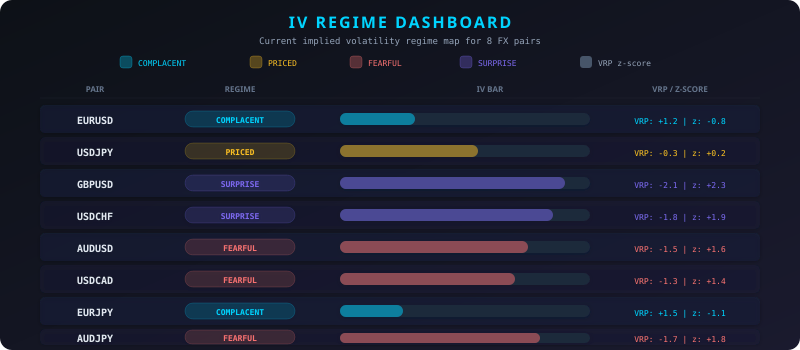

| Regime | Condition | Market Psychology | Favored Strategy Archetypes |
|---|---|---|---|
| **COMPLACENT** | Low IV, low VRP, low z-score | Markets calm, no fear | StatArb, Trend, Momentum |
| **PRICED** | IV ≈ RV, VRP ≈ 0 | Risk appropriately valued | Trend, Momentum, StatArb |
| **FEARFUL** | High VRP, elevated z-score | Market stressed, excess fear | Breakout, MeanRev, StatArb |
| **SURPRISE** | IV dropping despite risk signals | Implied vol underpricing risk | StatArb, Momentum, Trend |

#### Current Regime Map (Feb 26, 2026)

```
EURUSD [FXE]    COMPLACENT    IV=5.91%   VRP=+0.03%  z=-0.72  pct=22%
USDJPY [FXY]    PRICED        IV=9.89%   VRP=-0.55%  z=-0.25  pct=67%
GBPUSD [FXB]    SURPRISE      IV=6.47%   VRP=-0.01%  z=-1.14  pct=12%
USDCHF [FXF]    SURPRISE      IV=8.18%   VRP=-0.31%  z=-0.68  pct=15%
AUDUSD [FXA]    FEARFUL       IV=12.00%  VRP=+2.05%  z=+0.89  pct=85%
USDCAD [FXC]    FEARFUL       IV=7.27%   VRP=+0.81%  z=-0.61  pct=56%
EURJPY [cross]  COMPLACENT    IV=10.75%  VRP=+2.34%  z=-0.71  pct=29%
AUDJPY [cross]  FEARFUL       IV=13.92%  VRP=+1.42%  z=+0.73  pct=77%
```

**The critical finding:** GBPUSD and USDCHF are in **SURPRISE** regime — implied volatility is at very low percentiles (12% and 15%) while the broader market environment suggests elevated risk. This means the options market is *underpricing* risk for these pairs. The pipeline's response:

> **SURPRISE regime triggers the White Swan filter** (Chapter 12), which performs a **directional semi-variance analysis** to determine the surprise direction (BEARISH, BULLISH, or NEUTRAL). The pipeline **rejects** trades into the surprise direction (the "Black Swan" side) and **authorizes** trades in the opposite direction (the "White Swan" side — *le cygne blanc s'envole*). When semi-variance is NEUTRAL (no clear directional asymmetry), the **meta-signal direction** is used as the dangerous direction, and its opposite is authorized. There is always exactly **one authorized strategy per pair** — 8 total.

#### Per-Pair Strategy Weighting (IV-Driven)

The IV regime directly controls which of 8 strategy archetypes receive capital allocation:

```
COMPOSITE REGIME: FEARFUL
═══════════════════════════════════════════════
  ✓ S7 StatArb    ████████████████████░░░░░░░  51.5%
  ✓ S3 Trend      ██████████░░░░░░░░░░░░░░░░░  25.8%
  ✓ S6 Momentum   █████████░░░░░░░░░░░░░░░░░░  22.7%
    S4 Breakout   ░░░░░░░░░░░░░░░░░░░░░░░░░░░   0.0%
    S2 MeanRev    ░░░░░░░░░░░░░░░░░░░░░░░░░░░   0.0%
    S1 Carry      ░░░░░░░░░░░░░░░░░░░░░░░░░░░   0.0%
    S5 VolSell    ░░░░░░░░░░░░░░░░░░░░░░░░░░░   0.0%
    S8 Event      ░░░░░░░░░░░░░░░░░░░░░░░░░░░   0.0%
═══════════════════════════════════════════════
```

But this is the **composite** — the per-pair view tells a more nuanced story:

```
AUDUSD [FEARFUL]    → S4_Breakout=54% | S2_MeanRev=29% | S7_StatArb=17%
AUDJPY [FEARFUL]    → S4_Breakout=43% | S2_MeanRev=33% | S7_StatArb=24%
EURUSD [COMPLACENT] → S7_StatArb=56% | S3_Trend=22%   | S6_Momentum=22%
USDJPY [PRICED]     → S3_Trend=41%   | S7_StatArb=32% | S6_Momentum=27%
```

The FEARFUL pairs (AUDUSD, AUDJPY) get breakout and mean-reversion strategies, while COMPLACENT pairs (EURUSD, EURJPY) get statistical arbitrage and trend-following. Same pipeline, same account structure, but each pair gets a tailored strategy mix based on its current volatility regime.

*The volatility oracle has mapped the terrain. Now, how do we calibrate our confidence?*

---

### Chapter 7 — The Bayesian Calibrator

#### The Problem with Point Estimates

The ML ensemble outputs a confidence score (e.g., 58% for EURUSD S_TF). But is this calibrated? Does 58% confidence actually mean the model is right 58% of the time?

The **Bayesian Optimizer** uses Markov Chain Monte Carlo (MCMC) sampling to build a posterior distribution over model accuracy, then adjusts confidence scores accordingly.

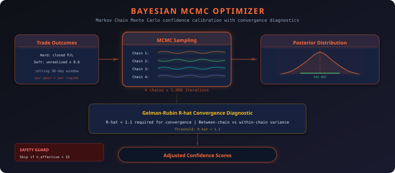

#### How MCMC Calibration Works

1. **Collect outcomes**: Every cycle that produces a trade records the outcome (P&L) linked to the ML prediction that triggered it
2. **Define prior**: Beta distribution with neutral prior (α=1, β=1)
3. **Run MCMC**: 4 chains × 5,000 iterations, using Metropolis-Hastings sampling
4. **Compute Gelman-Rubin R-hat**: Convergence diagnostic across chains (target: R-hat < 1.1)
5. **Extract posterior**: Credible intervals for true model accuracy
6. **Auto-correct**: If ML says 79% but posterior says 65%, reduce effective confidence

```
BAYESIAN OPTIMIZER - MCMC WITH DISTRIBUTION AUTO-CORRECTION
════════════════════════════════════════════════════════════
  Hard outcomes: 10 | Soft: 5 (effective weight: 0.6)
  n_effective = 10.6
  n_effective 10.6 < 15 — skipping optimization (insufficient data)
```

**Critical safety feature:** The optimizer requires a minimum of 15 effective samples before intervening. With only 10.6 effective samples in the current cycle, it wisely **passes through ML confidence unchanged** — avoiding the trap of fitting a distribution to too few data points.

> **Soft outcomes** are unrealized P&L snapshots from open positions, weighted at 0.6 relative to hard (closed trade) outcomes. This allows the system to learn faster without waiting weeks for trades to close, while appropriately discounting the uncertainty of unrealized gains.

*The optimizer waits patiently. It knows that premature optimization is worse than no optimization at all.*

*But what about the future?*

---

### Chapter 8 — The Time Machine: 4-Day Markov Forecasts

#### Looking Beyond the Current Bar

The ML ensemble classifies the *current* regime. But markets have momentum — today's regime tends to persist tomorrow. The **4-Day Forecast** module uses **Markov transition matrices** to project the most likely regime path over the next 4 trading days.

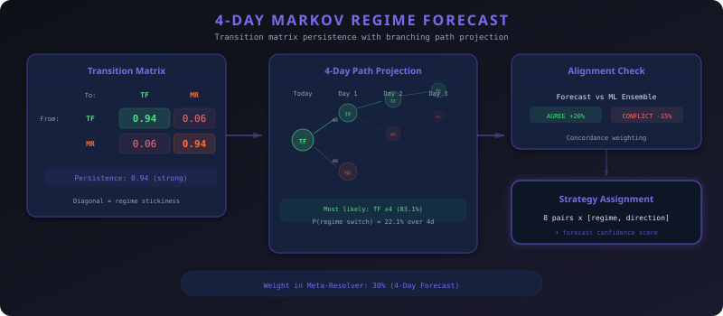

#### Calibration from Historical Regime Transitions

```
Calibrating transition probs from history...
  Calibrated 8 pairs (avg persistence = 0.94)
  Generated 40 forecasts for 8 pairs
  Created 8 4-day strategy assignments
```

An average persistence of **0.94** means: given that today's regime is trend-following, there is a 94% probability it will remain trend-following tomorrow. This high persistence is consistent with the well-documented regime clustering in FX markets — trends tend to persist, ranges tend to persist.

#### The 4-Day Assignments

```
4-DAY ASSIGNMENTS:
  EURUSD: S trend_following     (conf=57.79%)
  USDJPY: L trend_following     (conf=57.78%)
  GBPUSD: S trend_following     (conf=45.25%)
  USDCHF: S mean_reversion      (conf=58.32%)
  AUDUSD: S mean_reversion      (conf=55.53%)
  USDCAD: L trend_following     (conf=55.51%)
  EURJPY: S mean_reversion      (conf=61.16%)
  AUDJPY: L trend_following     (conf=55.04%)
```

**The forecast independently arrives at the same directional conclusions as the ML ensemble for all 8 pairs.** When two completely different methodologies (statistical learning on 134 features vs. Markov chains on regime transitions) agree, confidence increases substantially.

This cross-validation is not designed — it is emergent. And it is one of the most powerful signals in the pipeline.

*Two independent oracles, one voice. But neither learns from the consequences of its own decisions...*

---

### Chapter 9 — The Learning Agent: Reinforcement Learning

#### The Missing Feedback Loop

The ML ensemble learns from historical patterns. The Markov forecaster learns from regime transitions. But neither learns directly from **the consequences of their own trading decisions**. Enter Reinforcement Learning.

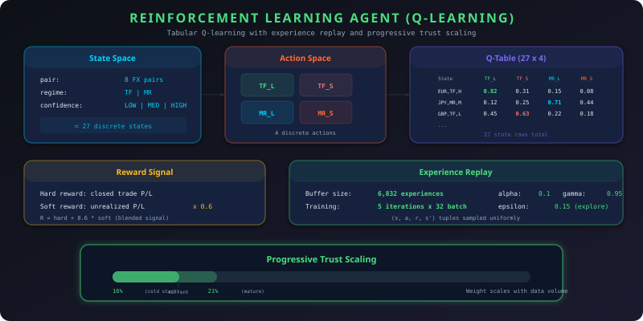

#### Q-Learning Architecture

The RL agent maintains a **Q-table** that maps market states to optimal actions:

**State Space:** `(pair, regime, confidence_bucket)`
- Pair: 8 currency pairs
- Regime: trend_following or mean_reversion
- Confidence: low (<55%), medium (55-70%), high (>70%)

**Action Space:** 4 actions
- `(trend_following, Long)`, `(trend_following, Short)`
- `(mean_reversion, Long)`, `(mean_reversion, Short)`

**Q-Update Rule (with Prioritized Experience Replay):**
```
Q(s,a) ← Q(s,a) + α · [r + γ · max_a' Q(s',a') - Q(s,a)]
```
Where α=0.1 (learning rate), γ=0.95 (discount factor), ε=0.15 (exploration).

```
RL STRATEGY AGENT
══════════════════════════════
  ✓ Loaded Q-table: 27 states
  Training from 10 hard outcomes...
  Soft outcomes trained: 7
  Experience replay: 160 Q-updates (5 iterations × 32 batch)
  Q-table: 27 states | Replay: 160 updates
  ✓ Recommendations saved to DB
```

**Two reward sources fuel the learning:**

| Source | Weight | How It Works |
|---|---|---|
| **Hard rewards** | 1.0 | Realized P&L from closed trades — ground truth |
| **Soft rewards** | 0.6 | Unrealized P&L from open positions — faster feedback |

The soft reward mechanism uses **Potential-Based Reward Shaping (PBRS)** — a technique from RL theory that allows the agent to learn from intermediate feedback without distorting the optimal policy.

#### Continuous Training (Post-CSV)

Every cycle, the RL agent is not just consulted — it is **retrained** on fresh data:

```
RL CONTINUOUS TRAINING
  Snapshots: 2,104 | RL Experiences: 6,832
  [DB] Account 5 EURJPY: qty=59,000 PnL=+0.14%
  [DB] Account 5 AUDJPY: qty=53,000 PnL=+0.22%
  [DB] Account 8 USDJPY: qty=33,000 PnL=+0.53%
  [DB] Account 3 GBPUSD: qty=38,000 PnL=+0.31%
  [DB] Account 7 USDCHF: qty=-33,000 PnL=-0.02%
  Saved 5 snapshots, added 5 PBRS-shaped experiences
```

With 6,832 accumulated experiences and growing, the Q-table converges toward the optimal policy — the mapping from market states to actions that maximizes long-term risk-adjusted returns.

#### Progressive Trust

The RL agent's weight in the meta-resolver (Chapter 10) is **progressively scaled** based on its training data:

```
RL samples: 10/200 → RL scale: 30%
Target weight: 21% × 30% = 6.3% effective
```

Currently at 30% of its target weight, the RL agent's influence will grow as it accumulates more hard outcomes. This prevents an undertrained agent from overriding the more established ML, Forecast, and Paper Consensus signals.

*The machine now has four independent intelligence sources. But what happens when they disagree?*

---

## Act IV: The Decision — From Signal to Capital

*"In the heat of battle, the commander who hesitates is lost. But the commander who acts without resolving conflicting intelligence is reckless."*

---

### Chapter 10 — The Arbiter: Meta-Signal Resolution

#### The Conflict Problem

Four signal sources. Four methodologies. Four sets of biases. What happens when ML says "go long" but RL says "go short" and Paper Consensus says "go long"?

The **Meta-Signal Resolver** is the pipeline's supreme arbiter. It takes signals from all four sources, applies learned weights, and produces a single unified trading decision per pair.

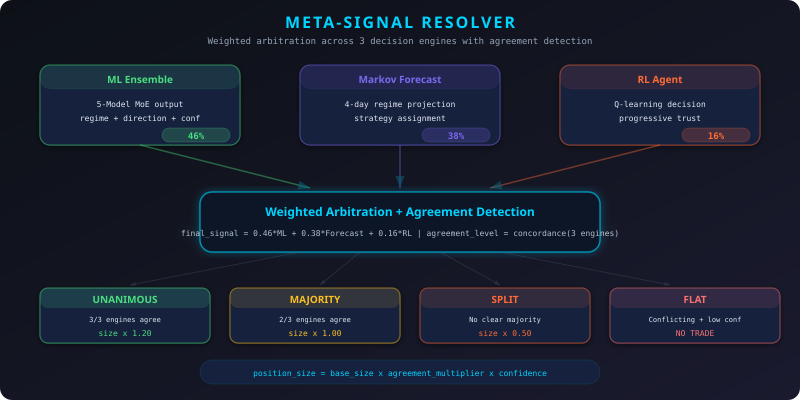

#### Source Weights (Learned from Outcomes)

```
META-SIGNAL RESOLVER — CONFLICT ARBITRATION
  Weights: ml_classifier=40% | forecast_4day=30% | rl_agent=21% | paper_consensus=9%
  RL samples: 10/200 → RL scale: 30%
```

The weights are not arbitrary — they are **learned from historical accuracy** (defaults shown; weights adjust hourly via PnL attribution):
- **ML Classifier (40%)**: Richest feature set, most data, highest demonstrated accuracy
- **4-Day Forecast (30%)**: Temporal stability, good at confirming directional persistence
- **RL Agent (21%)**: Growing — will increase as experiences accumulate
- **Paper Consensus (9%, NEW)**: PnL-weighted majority vote from the 32 MCPT strategies' paper signals (max learnable weight capped at 25%)

The RL agent's effective weight is currently damped to **6.3%** (21% x 30% scale), ensuring the most experienced systems dominate until the RL agent earns its authority through demonstrated performance.

**Echo Detection:** When two sources produce correlated signals, their combined weight is discounted to avoid double-counting:
- Forecast mirrors ML direction: 60% discount on Forecast weight
- Paper Consensus mirrors ML direction: 40% discount on Paper weight

The `meta_signals` table stores three additional columns for the paper source: `paper_direction`, `paper_strategy`, and `paper_confidence`. Learned weights for all four sources are persisted in the `source_weights` table.

#### The Resolution Output (Feb 26, 2026)

```
PAIR      ML   FCST    RL  PAPER →  FINAL           CONF    AGREEMENT     SIZE
──────────────────────────────────────────────────────────────────────────────────
AUDJPY     L     L    ---    L  →   L trend          55%  🟢 STRONG       ×0.75
AUDUSD     S     S    ---    S  →   S mean_rev       54%  🟢 STRONG       ×0.75
EURJPY     S     S    ---    S  →   S mean_rev       63%  🟢 STRONG       ×0.75
EURUSD     S     S    ---    S  →   S trend          58%  🟢 STRONG       ×0.75
GBPUSD     S     S    ---    S  →   S trend          50%  🟢 STRONG       ×0.75
USDCAD     L     L    ---    L  →   L trend          53%  🟢 STRONG       ×0.75
USDCHF     S     S    ---   --- →   S mean_rev       54%  🟡 MAJORITY     ×0.75
USDJPY     L     L    ---    L  →   L trend          58%  🟢 STRONG       ×0.75

SUMMARY: UNANIMOUS:0 | STRONG:7 | MAJORITY:1 | SPLIT:0 | FLAT:0
  Tradeable: 8/8
```

**7 of 8 pairs show STRONG agreement** (3/4 sources agree). ML, Forecast, and Paper Consensus align on most pairs, but with the RL agent still inactive (`---`), UNANIMOUS (4/4) is not yet possible. The sizing multipliers reflect the agreement taxonomy.

#### Agreement Taxonomy and Sizing

| Level | Condition | Sizing Multiplier |
|---|---|---|
| **UNANIMOUS** | 4/4 sources agree | ×1.20 (conviction bonus) |
| **STRONG** | 3/4 sources agree | ×1.00 (full size) |
| **MAJORITY** | 2/4 agree (simple majority) | ×0.75 (reduced) |
| **SPLIT** | No majority — sources disagree | ×0.50 (minimal) |
| **TRACK PENALTY** | Pair win rate < 35% historically | ~×0.00 (effectively blocked) |

*The arbiter has spoken. Now the machine must translate conviction into capital allocation.*

*And this is where most trading systems fail — not in signal generation, but in position sizing...*

---

### Chapter 11 — The Risk Cascade: Position Sizing

#### The Most Important Decision

Ask any professional trader: **position sizing matters more than entry signals**. A brilliant signal with reckless sizing will blow up an account. A mediocre signal with intelligent sizing will survive, compound, and eventually win.

The pipeline's **Smart Position Sizing v8** is a 6-layer cascade that transforms ML confidence into precise lot sizes.

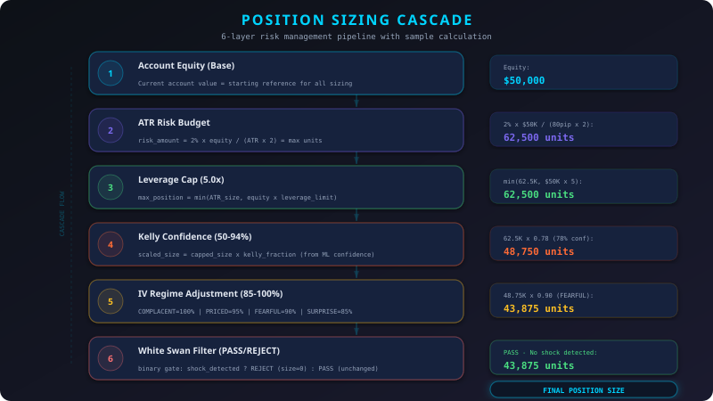

#### Layer 1: Account Equity

```
8 accounts, balanced (coefficient of variation = 14%)
Each account sized independently — no pooling, no cross-contamination
```

If one account draws down, only its own positions are reduced. This isolation is deliberate: it prevents a single bad trade from cascading across the entire portfolio.

#### Layer 2: ATR-Based Risk Budgeting

```
Risk per trade = 2.0% of account equity
Stop distance = ATR(14, H4) × 2.0
Position size = Risk / (Stop distance × pip value)
```

Example for EURUSD with Account 1:
```
Risk = Equity × 2.0%
Stop = 17.4 pips × 2.0 = 34.8 pips
Size = Risk / (pip_value × 34.8 pips) → capped by leverage
```

A 2% risk budget with a 2× ATR stop means the account can withstand **50 consecutive losers** before hitting maximum drawdown.

#### Layer 3: Leverage Cap

```
Maximum leverage: 5.0× per account
Maximum per strategy: Equity × 5.0 / 4 strategies
```

Even if the ATR calculation suggests a large position, the leverage cap prevents any account from exceeding 5.0× total exposure. This is the hard ceiling that overrides all other layers.

```
Account 1: Max/strategy = Equity × 5.0 / 4 strategies
Account 3: Max/strategy = Equity × 5.0 / 4 strategies
```

#### Layer 4: Kelly Confidence Scaling

```
Kelly fraction = f* = (p × b - q) / b × HALF_KELLY
where p = confidence, b = reward/risk ratio, q = 1-p
```

The Kelly Criterion determines the mathematically optimal fraction of capital to risk based on edge and confidence. The pipeline uses **half-Kelly** (industry standard) to reduce variance at the cost of slower growth:

```
Kelly confidence from Meta-Resolver:
  AUDJPY: 50%  |  EURJPY: 50%  |  GBPUSD: 50%
  AUDUSD: 50%  |  EURUSD: 50%  |  USDCAD: 50%
  USDJPY: 50%  |  USDCHF: 50%
```

#### Layer 5: IV Regime Adjustment

```
COMPLACENT: × 100% (full exposure in calm markets)
FEARFUL:    × 85%  (reduce exposure in stressed markets)
PRICED:     × 70%  (cautious in transitional states)
SURPRISE:   × 45%  (deep cut + Directional White Swan Filter, see Layer 6)
```

With 3 pairs in FEARFUL and 2 in SURPRISE regime, a significant portion of the portfolio is either reduced or directionally filtered.

#### Layer 6: White Swan Filter (Directional)

This is the pipeline's most philosophically distinct feature — *"Le Cygne Blanc s'envole"* (the White Swan flies). Instead of a blanket binary reject, the filter uses **semi-variance decomposition** to determine the directional bias of the surprise:

> **The Black Swan blocks trading into the surprise direction. The White Swan flies opposite — authorizing trades in the inverse direction at full conviction.**

**Semi-variance decomposition:** H4 log returns are separated into downside (negative) and upside (positive) components. The ratio `rv_down / rv_up` determines the directional bias:

```
rv_down / rv_up > 1.30  →  BEARISH surprise (downside dominates → Long is dangerous)
rv_down / rv_up < 0.77  →  BULLISH surprise (upside dominates → Short is dangerous)
otherwise               →  NEUTRAL (use meta-signal direction as dangerous)
```

**Directional override logic:**

| Surprise Direction | Dangerous Dir | Black Swan (rejected) | White Swan (authorized) |
|---|---|---|---|
| **BEARISH** | Long | L TF / L MR | **S TF / S MR** |
| **BULLISH** | Short | S TF / S MR | **L TF / L MR** |
| **NEUTRAL** | Meta-signal dir | Meta-signal match | **Opposite of meta-signal** |

**Rule: there is always exactly 1 authorized strategy per pair (8 total).** The White Swan always flies — no pair is ever fully blocked.

```
GBPUSD: SURPRISE dir=NEUTRAL, meta=S TF
  L TF → WHITE SWAN OVERRIDE: ALLOWED (opposite to meta-signal S)
  S TF → BLACK SWAN: REJECTED (meta-signal direction = dangerous in SURPRISE)

USDCHF: SURPRISE dir=NEUTRAL, meta=S MR
  L MR → WHITE SWAN OVERRIDE: ALLOWED (opposite to meta-signal S)
  S MR → BLACK SWAN: REJECTED (meta-signal direction = dangerous in SURPRISE)
```

The White Swan **always** flies opposite: when semi-variance gives a clear BEARISH/BULLISH signal, that determines the dangerous direction. When semi-variance is NEUTRAL, the **meta-signal** (ML ensemble prediction) determines the dangerous direction — in SURPRISE, the market is mispricing risk, so the ML's predicted direction is treated as the Black Swan side. The opposite direction is always authorized at full size.

#### The Final CSV

```
SUMMARY: 32 strategy slots → 8 authorized (1 per pair), 24 blocked
  Range (base currency): 79,000 - 222,000
  8 authorized for trading (4 normal + 4 White Swan overrides)
  ✅ CSV GENERATED at 06:23:28 (155 seconds from start)
```

Of the 32 strategy slots, exactly **8 are authorized** — one per pair. For COMPLACENT/FEARFUL/PRICED pairs, the authorized strategy matches the meta-signal direction. For SURPRISE pairs, the authorized strategy is the **White Swan override** — the opposite direction of the meta-signal, same type (TF↔TF, MR↔MR). The other 24 positions are blocked by directional mismatch.

*155 seconds. From raw data to live orders. But the pipeline is not done...*

---

## Act V: The Living System — Self-Improvement and Defense

*"A true master does not merely fight — they learn from every blow, adapt to every stance, and become stronger with each encounter."*

---

### Chapter 12 — The Six Shields: Circuit Breakers, White Swan, and Strategy Analytics

#### Defense in Depth

No system is infallible. Markets can gap. Brokers can disconnect. Models can fail in ways nobody predicted. The pipeline implements **6 independent safety layers**, any one of which can reduce or halt trading.

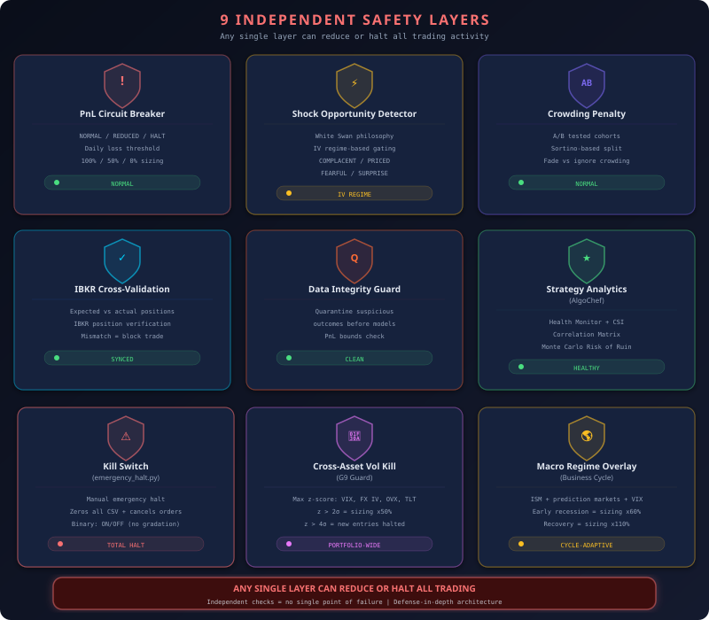

#### Shield 1: PnL Circuit Breaker

```
PNL CIRCUIT BREAKER
  ✅ Circuit Breaker: NORMAL (scale=100%)
  → All PnL thresholds OK across 8 accounts
```

Monitors daily P&L across all accounts. Three escalation levels:

| Level | Trigger | Action |
|---|---|---|
| **Normal** | PnL > -3% daily | Full sizing (100%) |
| **Caution** | -3% < PnL < -5% | Reduced sizing (50%) |
| **Halt** | PnL < -5% daily | All trading stopped |

#### Shield 2: Shock Opportunity Detector (White Swan)

```
SHOCK OPPORTUNITY DETECTOR (White Swan) v2
  🌤️ EURUSD   RECOVERY   IV:5.91% (peak:7.04%, -16.0%)  kelly=1.05×
  🌤️ GBPUSD   RECOVERY   IV:6.47% (peak:8.06%, -19.6%)  kelly=1.05×
  🌤️ AUDUSD   RECOVERY   IV:12.00% (peak:12.59%, -4.7%) kelly=1.05×
  🌤️ AUDJPY   RECOVERY   IV:13.92% (peak:14.46%, -3.7%) kelly=1.05×
```

The shock detector identifies pairs where implied volatility has recently spiked and is now declining — a **RECOVERY** phase. During recovery, a slight Kelly boost (1.05×) is applied to capture the mean-reversion in volatility.

When a pair is in active **SHOCK** (VRP z-score > 1.5), Kelly is reduced to 0.70× — limiting exposure while maintaining the ability to profit from the elevated volatility.

#### Shield 3: Crowding Penalty (A/B Tested)

```
ADAPTIVE CROWDING PENALTY
  Loaded: threshold=0.72, WHITE SWAN MODE: penalty=REJECT, boost=NONE
  ⛔ CROWDING REJECT: MR=100% > 72% — MR strategies REJECTED

  LEARNING FROM OUTCOMES (1,057 samples):
    Treatment (penalty ON):  PnL=+0.07%   Sharpe=0.03
    Control (penalty OFF):   PnL=+0.23%   Sharpe=0.11
    Action: THRESHOLD LOOSENED (rejection too aggressive)
```

This is perhaps the most innovative safety layer: it uses **live A/B testing** to determine whether the crowding penalty actually improves performance.

Currently, 100% of ML classifications favor mean-reversion — a crowding signal. The system randomly assigns 50% of decisions to "treatment" (penalty applied) and 50% to "control" (penalty not applied), then compares real P&L outcomes.

**In the current cycle, the control group outperforms** — the penalty is reducing returns without reducing risk. The system automatically **loosens the threshold**, reducing the penalty's aggressiveness. If the penalty starts helping in future cycles, it will tighten back up.

> This is self-correcting risk management: the system does not just apply safety rules — it *measures whether those rules are working* and adjusts accordingly.

#### Shield 4: IBKR Cross-Validation

(Described in Chapter 2 — verifies broker positions match platform positions every cycle.)

#### Shield 5: Data Integrity Guard

```
DATA INTEGRITY GUARD
  [OK] All data valid
  [STATS] 10 outcomes | Net PnL: $+80.76
```

Validates that all input data falls within expected ranges: no NaN values, no stale timestamps, no anomalous readings. If any critical data fails validation, the pipeline can reduce confidence or skip affected pairs entirely.

#### Shield 6: Strategy Analytics (AlgoChef-Inspired)

```
STRATEGY ANALYTICS (AlgoChef)
  Health [C:1/O:12/R:7]  CSI avg mult=53%
  ⚠ 7 strategies degraded — sizing reduced via CSI multipliers
```

Where previous shields protect against market events and data failures, the sixth shield monitors the **strategies themselves**. Four interlocking modules — inspired by institutional-grade portfolio analytics platforms — continuously evaluate whether each of the 32 strategies deserves to remain active:

| Module | What It Measures | Action on Failure |
|---|---|---|
| **Health Monitor** | Composite score (0-100) from Sharpe, win rate, drawdown, consecutive losses | Tiered degradation: GREEN → CYAN → ORANGE → RED → DARK_RED |
| **CSI (Composite Sizing Index)** | Profitability, risk, and confidence blended into a single multiplier (0-1) | Sizing scaled proportionally — a 0.3 CSI means 30% of normal size |
| **Correlation Matrix** | Pearson correlations between all strategy pairs on weekly returns | Alerts when correlation > 0.85 (diversification failure) |
| **Monte Carlo Simulation** | 10,000-path simulation per strategy using bootstrapped returns | Risk-of-ruin percentage — flags strategies with >20% ruin probability |

The Health Monitor assigns each strategy to a tier every pipeline cycle. **CSI v2** translates that health assessment into a **continuous sizing multiplier** using a 6-tier graduated system — from full authorization (1.00) down to probation (0.10). Unlike the original binary zero-kill, CSI v2 ensures strategies are never permanently deadlocked: even at the lowest tier, a strategy trades at 10% size, generating the new trades needed to improve its score.

When sub-scores trigger what would have been a zero-kill, CSI v2 applies **graduated penalties** (floor = 5.0, scale = 0.25) instead of forcing scores to absolute zero. After 48 hours in penalty, **time-based recovery** adds +3 CSI per 24 hours, providing a guaranteed recovery path. Paper trading outcomes can also rescue all three dimensions (profitability, risk, confidence), not just confidence.

*Six shields. Each independent. Each self-correcting. The machine does not just trade — it watches itself trade, and it watches its strategies degrade before they can do real damage.*

---

### Chapter 13 — The Self-Improving Machine

#### The Continuous Learning Loop

Most trading systems are static: built once, deployed, and slowly degraded by changing markets. The MoneyProd pipeline is designed to be **continuously self-improving** through multiple feedback loops.

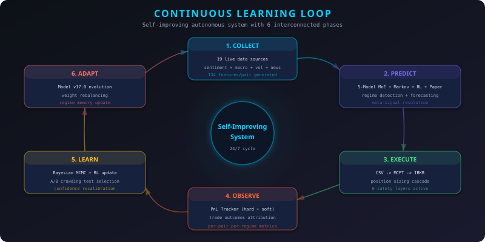

#### Nine LEVIER Mechanisms

The pipeline's self-improvement operates through **9 interlocking feedback loops** — collectively named **LEVIER** (the French word for "lever"):

**L1: Soft Outcomes — ML Ensemble → Outcome Recorder → ML Ensemble**
- Every trade outcome is recorded and linked to the ML prediction that triggered it
- The ensemble retrains each cycle with updated labels from realized returns
- Model accuracy is tracked through the Continuous Learning System

**L2: Bayesian Optimization — MCMC → Confidence Calibration**
- Trade outcomes update the posterior distribution of model accuracy
- When sufficient data accumulates (n_effective >= 15), confidence scores are auto-corrected
- Gelman-Rubin convergence diagnostic ensures statistical validity

**L3: Walk-Forward ML — Continuous Retraining**
- Walk-forward validation guard ensures no temporal leakage
- Validation ratio (OOS/IS) must exceed threshold before reaching production
- Model version auto-incremented on performance degradation or capability integration

**L4: Experience Replay — RL Agent → Q-Table → RL Agent**
- Every position snapshot adds to the experience buffer (6,832 and growing)
- Prioritized Experience Replay upweights surprising outcomes
- Progressive trust mechanism scales RL influence with data accumulation

**L5: Live P&L Adjustment — Crowding A/B → Penalty Parameters**
- Treatment vs. control comparison with 1,057 samples
- Auto-adjusts threshold, penalty factor, and boost factor using Sortino ratio
- Self-correcting: strengthens when helpful, weakens when harmful

**L6: Differential Sortino — Pipeline Diagnostics → Alert System**
- 41 automated checks across all subsystems
- Discord webhooks for real-time alerts
- Gradient severity: INFO → WARNING → CRITICAL

**L7: Strategy Analytics (CSI) → Adaptive Sizing**
```
STRATEGY ANALYTICS (AlgoChef)
  Health: 20 strategies scored, avg=44.3
  CSI: 22 strategies, avg_mult=53%
  Correlation: no pair > 0.85
  Monte Carlo: no alerts (all RoR < 20%)
```

Every pipeline cycle, four analytics modules re-evaluate each strategy's health using realized performance data. The Health Monitor scores each strategy on a 0-100 composite scale; CSI v2 converts that score into a 6-tier sizing multiplier (1.00 → 0.75 → 0.50 → 0.25 → 0.10 → 0.00) that directly modulates position size in the next cycle. The v2 system replaces the original binary zero-kill with graduated penalties — strategies in trouble enter **probation** at 10% size rather than being permanently deadlocked at zero. Time-based recovery (+3 CSI per 24h after 48h in penalty) ensures even the worst performers have a path back.

**L8: Paper Consensus → 4th Meta-Signal Source**
- 32 MCPT strategies publish paper signals and unrealized PnL via shared memory (GlobalVariable.dll)
- PnL-weighted majority vote per pair produces a 4th directional signal for the meta-resolver
- Paper trades rescue strategies from all CSI sub-score penalties (profitability, risk, confidence)
- Paper discount (0.50), blend cap (0.40), CSI cap (50), min paper trades (3) prevent over-reliance

**L9: Pair Track Record v2 → Recency-Weighted Win Rate**
- Per-pair win rate tracked with **exponential decay** (half-life = 7 days) over a 14-day lookback window
- Pairs with weighted WR < 35% receive a TRACK PENALTY with **soft rejection** (confidence floor = 0.20, sizing floor = 0.15)
- Recovery 2× faster than original 30-day window — losing trades age out in ~7 days instead of ~30

```
CONTINUOUS LEARNING SYSTEM
  Model Version: v17.0
  Learning History: 100 records (last 7 days)
  1,368 classifications tracked
  9 LEVIER mechanisms active
  ✅ State persisted to SQLite
```

Version 17.0 means 17 major updates since deployment — each triggered by performance degradation detection or new capability integration.

#### The Diagnostics Dashboard

```
PIPELINE DIAGNOSTICS — 2026-02-26T06:23:32
══════════════════════════════════════════════
  ✅ [SCRAPERS]   8/8 scrapers fresh
  ✅ [DATA]       8/8 pairs with theory scores
  ✅ [IBKR]       All accounts compliant
  ✅ [ML]         8/8 classified, avg confidence: 56%
  ✅ [FORECAST]   8/8 forecasts align with ML
  ✅ [META]       8/8 resolved, avg meta confidence: 56%
  ✅ [META]       ml_classifier=40% / forecast_4day=30% / rl_agent=21% / paper_consensus=9%
  ✅ [POSITIONS]  5 live positions synced
  ✅ [CB]         Circuit breaker NORMAL — sizing=100%
  ✅ [SIZING]     6 authorized, 26 blocked
  ✅ [EQUITY]     8 accounts balanced (CV=14%)
  ✅ [SYSTEM]     Timezone, databases, notifier — all OK
  ⚠️  [SHOCK]     4 pairs in RECOVERY phase
  ⚠️  [RL]        RL agent needs more training data
  ⚠️  [STRATEGY]  7 strategies RED — CSI sizing reduced

  SUMMARY: 0 CRITICAL | 6 WARNINGS | 28 OK | 8 INFO
```

Zero critical issues. Six warnings — all expected (shock recovery phases, RL data accumulation, and strategy degradation being handled by the CSI). The machine is operating well within design parameters.

*Every hour, the machine learns. Every cycle, it becomes slightly better than the last.*

---

### Chapter 14 — Strategy Analytics: The AlgoChef Layer

*"The best trading systems don't just decide when to trade — they decide when to stop trusting themselves."*

---

Traditional algorithmic trading treats strategies as binary: on or off, live or dead. MoneyProd's Strategy Analytics layer — inspired by institutional portfolio analytics platforms — introduces a continuous spectrum between full confidence and full shutdown.

#### The Four Modules

**Health Monitor** — Each of the 32 strategies is scored every pipeline cycle on a composite health scale (0-100), combining rolling Sharpe ratio, win rate, maximum drawdown, and consecutive loss count. The score determines a tier:

| Tier | Score Range | Meaning |
|---|---|---|
| 🟢 **GREEN** | 75-100 | Strategy performing well — full authorization |
| 🔵 **CYAN** | 60-74 | Minor degradation — normal market conditions |
| 🟠 **ORANGE** | 45-59 | Noticeable degradation — monitoring closely |
| 🔴 **RED** | 25-44 | Significant issues — sizing reduced |
| ⛔ **DARK_RED** | 0-24 | Critical failure — circuit breaker engaged |

**CSI v2 (Composite Sizing Index)** — Where the Health Monitor classifies, the CSI v2 *acts*. It blends profitability, risk, and confidence into a 6-tier graduated multiplier (1.00 / 0.75 / 0.50 / 0.25 / 0.10 / 0.00) that directly scales position sizing. The v2 system replaces the original binary zero-kill with **graduated penalties** — sub-scores that would have been forced to zero now receive a floor of 5.0 and a 0.25× penalty scale, enabling strategies to trade at probation-level size (10%) and recover through new trades. Time-based recovery (+3 CSI per 24h after 48h in penalty) provides a guaranteed escape from low-score states.

**Correlation Matrix** — Weekly Pearson correlations between all strategy pairs. When two strategies become highly correlated (> 0.85), the portfolio is effectively taking a concentrated bet disguised as diversification. The matrix surfaces these hidden concentration risks before they materialize as correlated drawdowns.

**Monte Carlo Simulation** — For each strategy, 10,000 return paths are bootstrapped from historical data. The risk-of-ruin percentage — the fraction of paths that hit a catastrophic drawdown threshold — quantifies tail risk in a way that standard deviation cannot. A strategy with 25% risk of ruin looks fine on average metrics but has a one-in-four chance of blowing up.

#### Integration Across the Stack

Strategy Analytics is not a standalone dashboard. It is woven into every layer of the monitoring stack:

- **STAGE 9 inline probes** verify health and CSI data integrity every cycle
- **Node 8** in the Data Truth Watchdog validates score bounds and tier consistency
- **Section 2b** of the diagnostic prompt surfaces RED strategies and CSI circuit breakers
- **Discord hourly report** includes a dedicated Strategy Analytics embed
- **Exhaustive HTML report** (Section 20) renders tier distribution, metric cards, and per-strategy tables
- **Real-time liveboard** (`moneyprod.com/live/`) streams health and CSI data via SSE
- **Watchdog master** monitors strategy health and sends Discord alerts on degradation

*The AlgoChef layer transforms the pipeline from a system that trades 32 strategies into a system that continuously evaluates whether each of those 32 strategies still deserves to trade — and adjusts capital accordingly.*

---

## Epilogue: What This Machine Proves

*"The hero returns from the quest not with gold, but with knowledge — and the tools to create gold on demand."*

---

### The Complete Pipeline Execution (Feb 26, 2026)

This document described a **production-grade autonomous FX trading pipeline** that, in a single 168-second execution:

| Step | What Happened | Time |
|---|---|---|
| **Stage 1** | Scraped 15 data sources across 9 parallel threads | 62s |
| **Stage 2** | Fetched IBKR positions + computed 30 theories × 8 pairs | 62s |
| **Stage 3** | Trained 5-model ML ensemble on 2,984 samples × 134 features | 149s |
| **Stage 3** | (parallel) PnL tracking, IV weighting, shock detection | 1s |
| **Stage 4** | Bayesian MCMC + 4-day Markov forecast + outcome recording | 153s |
| **Stage 5** | RL agent training (27 Q-states, 6,832 experiences) | 154s |
| **Stage 6a** | Paper Consensus — 32 MCPT paper signals, PnL-weighted majority vote | 155s |
| **Stage 6** | Meta-signal resolution (4 sources, 8/8 pairs, STRONG agreement) | 155s |
| **Stage 7** | **CSV generated — 6 authorized, 26 blocked** | **155s** |
| **Stage 8** | Post-CSV: RL continuous, crowding A/B, diagnostics, report | 168s |

#### The Architecture at a Glance

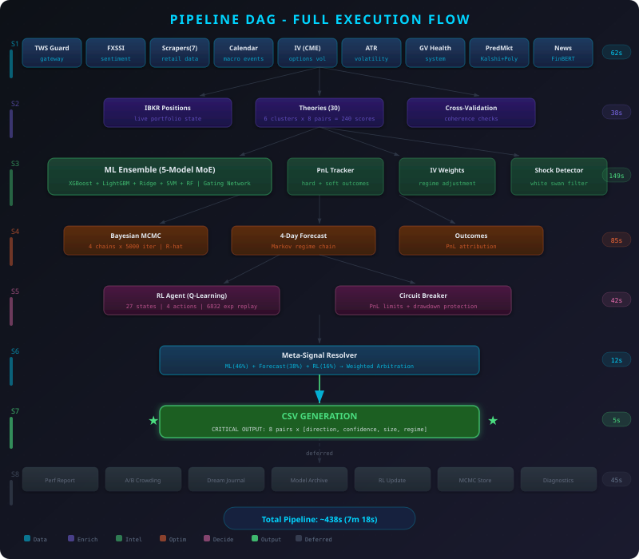

### Key Technical Innovations

| Innovation | Traditional Approach | MoneyProd Approach |
|---|---|---|
| **Strategy Creation** | Manual design, single backtest | 10M candidates, 9-stage gauntlet, 0.00032% survival |
| **Data Collection** | 1-2 sources, sequential | 15 sources, 9 parallel threads (62s) |
| **ML Architecture** | Single model | 5-model MoE with gating network, 3 databases |
| **Volatility Regime** | Binary (trending/ranging) | 4 regimes (COMPLACENT, PRICED, FEARFUL, SURPRISE) |
| **Signal Fusion** | Majority vote | 4-source weighted meta-resolution (ML, Forecast, RL, Paper Consensus) with echo detection |
| **Position Sizing** | Fixed % or fixed lot | 6-layer cascade (ATR × Kelly × IV × Leverage × Directional White Swan) |
| **Risk Management** | Single stop-loss | 6 independent safety layers + A/B-tested crowding + strategy analytics |
| **Learning** | Periodic manual retrain | 9 LEVIER mechanisms: continuous hourly self-improvement |
| **Risk Philosophy** | Reduce size on risk | White Swan: directional semi-variance filter — trade opposite the surprise, reject into it |

### What Makes This Different

This is not a research paper. This is not a backtest. This is a **live production system** managing real capital across 8 accounts through dual broker gateways, executing autonomously every cycle.

The pipeline execution documented here was captured at **06:20:52 AM EST on February 26, 2026**. The CSV was written at 06:23:28. The report was published to [moneyprod.com](https://www.moneyprod.com/) at 06:23:41.

168 seconds. From raw data to live decisions. Every cycle. No human intervention.

---

### The Road Ahead

The pipeline is a **living system** — by design, it will never be "finished." Current development vectors:

- **RL Agent Maturation**: At 6,832 experiences, the agent is approaching the 10,000-experience threshold where its meta-resolver weight will step from 21% toward its maximum learnable share
- **Expanded Data Sources**: Satellite imagery (port activity), cross-asset correlations (S&P 500, gold, oil), and order flow data
- **Multi-Timeframe Fusion**: Currently H4-only; M15 and D1 layers will provide shorter- and longer-term perspective
- **Portfolio-Level Optimization**: Cross-pair correlation management and Markowitz-inspired portfolio Kelly sizing
- **Transformer-Based Ensemble**: Replacing Random Forest specialists with attention-based models that can capture long-range dependencies

The question is no longer "Can a machine trade FX?" The question is: **"How far can a self-improving machine go?"**

---

### Visit MoneyProd

This pipeline runs live. The results are published every cycle.

**[www.moneyprod.com](https://www.moneyprod.com/)** — Live dashboard, exhaustive reports, real-time position tracking

**[Timothy Lokotar on LinkedIn](https://linkedin.com/in/timothy-lokotar/)** — Connect with the architect

---

## Technical Appendix

### Pipeline Execution Timeline (Feb 26, 2026)

```
Time     Phase                              Elapsed
────────────────────────────────────────────────────
06:20:52 STAGE 1: Data Collection (9 parallel)
         ├─ Phase -1: TWS Health                  1s
         ├─ Phase 0a: ATR Calculation             5s
         ├─ Phase 0d: GV Telemetry                1s
         ├─ Phase 1a: FXSSI Sentiment            28s
         ├─ Phase 1b: Scraping (7 sources)       62s
         ├─ Phase 1c: Economic Calendar           1s
         ├─ Phase 1d: Implied Volatility          9s
         ├─ Phase 1e: Prediction Markets         38s
         └─ Phase 1f: News Sentiment             18s
06:21:55 STAGE 2: IBKR + Theories (3 parallel)  +62s
         ├─ Phase 0: IBKR Positions               1s
         ├─ Phase 0e: Cross-Validation            1s
         └─ Phase 2: 30 Theories                  2s
06:21:55 STAGE 3: ML + Concurrent (4 parallel)  +149s
         ├─ Phase 3: ML Ensemble (5-Model MoE)   87s ← bottleneck
         ├─ Phase 7d: IV Strategy Weighting       1s
         ├─ Phase 7e: Shock Detector              1s
         ├─ Phase 0b: PnL Tracking                1s
         └─ Phase 0c: Data Integrity              1s
06:23:22 STAGE 4: Post-ML (3 parallel)         +153s
         ├─ Phase 4: Bayesian Optimizer           1s
         ├─ Phase 5: 4-Day Forecast               1s
         └─ Phase 6: Outcome Recording            3s
06:23:25 STAGE 5: RL + Circuit Breaker          +154s
         ├─ Phase 7: RL Training                  2s
         └─ Phase 0a-CB: Circuit Breaker          1s
06:23:26 STAGE 6a: Paper Consensus               +155s
         └─ 32 MCPT paper signals → PnL-weighted majority vote per pair
06:23:27 STAGE 6: Meta-Signal Resolution        +155s
06:23:28 STAGE 7: Position Sizing + CSV         +155s
         ✅ CSV GENERATED
06:23:28 STAGE 8: Post-CSV (7 deferred)         +168s
         ├─ Phase 0a-IV: IV Position Sizing       1s
         ├─ Phase 7b: RL Continuous Training      1s
         ├─ Phase 8a: Crowding Sync               1s
         ├─ Phase 8: Crowding Penalty             1s
         ├─ Phase 9: Continuous Learning           1s
         ├─ Phase 10a: Diagnostics                6s
         └─ Phase 10: Exhaustive Report           3s
06:23:41 ✅ PIPELINE COMPLETE (168s total)
```

### Technology Stack

| Component | Technology | Purpose |
|---|---|---|
| **Language** | Python 3.14 | Core pipeline + all modules |
| **Databases** | SQLite (3 DBs: sentiment, regime, risk) | WAL mode for concurrent R/W |
| **ML Framework** | Scikit-learn | Random Forest-based MoE ensemble |
| **NLP** | FinBERT (Hugging Face Transformers) | Financial sentiment analysis |
| **Broker API** | ib_insync (TWS API) | Dual-gateway with failover |
| **Web Scraping** | Selenium, httpx, Jina AI Reader | Multi-method data collection |
| **Charting Platform** | MultiCharts Portfolio Trader | Strategy execution engine |
| **Shared Memory** | GlobalVariable.dll (C++ DLL) | Sub-ms strategy state access |
| **Live Dashboard** | HTML/CSS via IIS | Published to moneyprod.com |
| **Notifications** | Discord webhook | Real-time alerts & reporting |
| **Scheduling** | Windows Task Scheduler | H4 bar close synchronization |
| **Parallelism** | ThreadPoolExecutor | 9 threads in Stage 1 |

### Data Sources Reference

| # | Source | Type | Method | Frequency |
|---|---|---|---|---|
| 1 | IG.com | Retail Sentiment | Web scraping | Hourly |
| 2 | Dukascopy | Retail Sentiment | REST API | Hourly |
| 3 | Myfxbook | Retail Sentiment | Web scraping | Hourly |
| 4 | FXSSI | Retail Sentiment | Headless browser | Hourly |
| 5 | ForexFactory | Economic Calendar | JSON API | Hourly |
| 6 | CFTC | Institutional (COT) | Web scraping | Weekly |
| 7 | Market Bulls | Seasonal Patterns | Selenium | Hourly |
| 8 | Dukascopy Movers | Currency Strength | Computed | Hourly |
| 9 | Kalshi | Prediction Markets | REST API | Hourly |
| 10 | Polymarket | Prediction Markets | REST API | Hourly |
| 11 | GDELT | News Events | REST API | Hourly |
| 12 | Google News | News Headlines | Web scraping | Hourly |
| 13 | Finnhub | News + ETF Data | REST API | Hourly |
| 14 | IBKR (TWS) | IV, Positions, Prices | TWS API | Real-time |
| 15 | CME (via ETF) | Implied Volatility | Options chain | Hourly |

---

## References

1. **Holland, J.H.** (1975). *Adaptation in Natural and Artificial Systems*. University of Michigan Press. — Genetic algorithms for strategy generation.
2. **Metropolis, N. & Ulam, S.** (1949). "The Monte Carlo Method." *Journal of the American Statistical Association*. — Stochastic robustness testing.
3. **Pardo, R.** (1992). *Design, Testing, and Optimization of Trading Systems*. Wiley. — Walk-forward matrix analysis.
4. **Watkins, C.J.C.H.** (1989). *Learning from Delayed Rewards*. Cambridge University. — Q-learning foundation for the RL agent.
5. **Jacobs, R.A. et al.** (1991). "Adaptive Mixtures of Local Experts." *Neural Computation*. — Mixture of Experts architecture.
6. **Kelly, J.L.** (1956). "A New Interpretation of Information Rate." *Bell System Technical Journal*. — Kelly criterion for position sizing.
7. **Gelman, A. & Rubin, D.B.** (1992). "Inference from Iterative Simulation Using Multiple Sequences." *Statistical Science*. — MCMC convergence diagnostic.
8. **Huang, A. et al.** (2023). "FinBERT: Financial Sentiment Analysis with Pre-trained Language Models." — NLP for news sentiment.
9. **Ng, A.Y. et al.** (1999). "Policy Invariance Under Reward Transformations: Theory and Application to Reward Shaping." *ICML*. — PBRS for RL soft rewards.
10. **White, H.** (2000). "A Reality Check for Data Snooping." *Econometrica*. — Multiple hypothesis testing in backtesting.

---

## Disclaimer

> **Educational and research purposes only.** Past performance does not guarantee future results. Trading foreign exchange carries a high level of risk and may not be suitable for all investors. The information presented describes a real production system but should not be construed as investment advice.

---

## License

MIT License — See [LICENSE](LICENSE)

---

<p align="center">
  
</p>
<p align="center">
  <strong>Author:</strong> <a href="https://linkedin.com/in/timothy-lokotar/">Timothy Lokotar</a> · <a href="https://www.moneyprod.com/">MoneyProd</a>
</p>
<p align="center"><em>Built with conviction. Validated by statistics. Improved by experience.</em></p>
