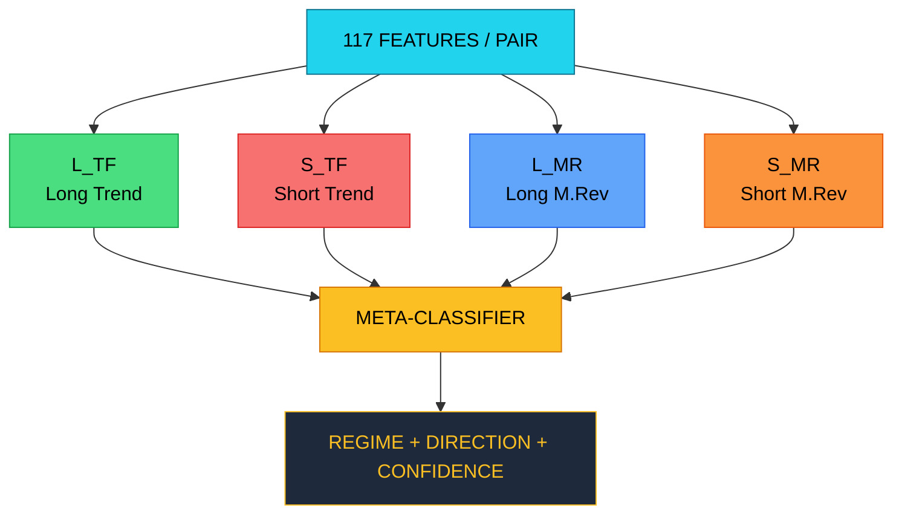
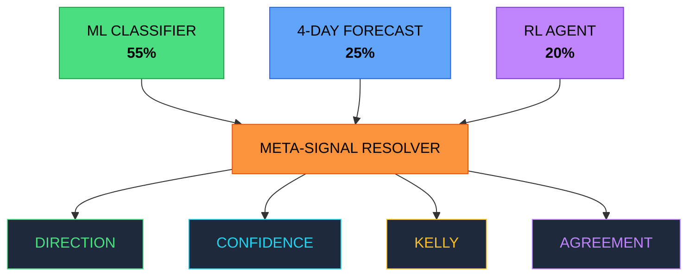
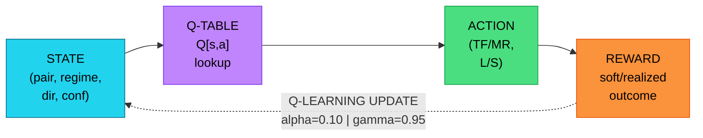
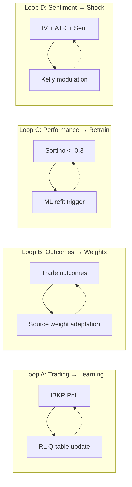

<div align="center">

# MoneyProd

### Institutional-Grade Autonomous FX Trading System

**A 30-Phase AI Pipeline: ML Ensemble + Bayesian Optimization + Reinforcement Learning + Real-Time Risk Management**

---

| ML Models | Phases | Pairs | Accounts | Strategies | Features | Databases | Scrapers |
|:---------:|:------:|:-----:|:--------:|:----------:|:--------:|:---------:|:--------:|
| **5** | **30** | **8** | **8** | **32** | **117/pair** | **3** | **7** |

---

**Author: Timothy Lokotar**

[LinkedIn](https://linkedin.com/in/timothy-lokotar/) &nbsp;|&nbsp; [MoneyProd.com](https://www.moneyprod.com/)

*Production System &nbsp;|&nbsp; Live Trading &nbsp;|&nbsp; Real IBKR Integration*

*Open Source Documentation &nbsp;|&nbsp; February 2026*

---

</div>

## ACT I: THE CALL TO ADVENTURE

> *"The market is a beast. You need a system that thinks faster than you."*

---

### 01 &mdash; THE PROBLEM: WHY MOST SYSTEMS FAIL

Every hour, the forex market processes over $250 billion in transactions. Eight major currency pairs dance between two fundamental regimes: **trending markets** where momentum rules, and **mean-reverting markets** where extremes snap back. The wrong strategy in the wrong regime is financial suicide.

Retail traders guess. Institutional quants build static models that decay. Both suffer the same fate: they cannot adapt in real-time to the market's shape-shifting nature.

What if a system could identify the current regime, select the optimal strategy, size positions dynamically, learn from every trade's outcome, and do all of this autonomously &mdash; every single hour?

> **What you are about to read is not a theoretical framework. It is a production system. Running. Now.**

---

### 02 &mdash; THE VISION: AN AUTONOMOUS TRADING BRAIN

MoneyProd is a 30-phase AI pipeline that executes every hour, 24/5, across 8 currency pairs and 8 live brokerage accounts. It ingests data from 7 independent web scrapers, computes 22 proprietary analytical theories, runs a 5-model Machine Learning ensemble, trains a Reinforcement Learning agent, optimizes theory weights via Bayesian MCMC, and produces precise position sizing &mdash; all within 3 minutes.

The system is not a backtester dreaming about the past. It is connected to real Interactive Brokers gateways, executing real trades, tracking real P&L, and learning from real outcomes.

#### System Architecture: 8-Stage Pipeline Flow

```mermaid
flowchart LR
    S1["S1<br/>DATA<br/>COLLECTION<br/><i>7 phases</i>"]:::cyan
    S2["S2<br/>IBKR<br/>POSITIONS<br/><i>3 phases</i>"]:::blue
    S3["S3<br/>ML<br/>ENSEMBLE<br/><i>5 phases</i>"]:::green
    S4["S4<br/>POST-ML<br/>BAYES/FCST<br/><i>3 phases</i>"]:::teal
    S5["S5<br/>RL<br/>AGENT<br/><i>2 phases</i>"]:::purple
    S6["S6<br/>META<br/>RESOLVER<br/><i>1 phase</i>"]:::orange
    S7["S7<br/>CSV<br/>OUTPUT<br/><i>1 phase</i>"]:::gold
    S8["S8<br/>POST<br/>PROCESS<br/><i>8 phases</i>"]:::red

    S1 --> S2 --> S3 --> S4 --> S5 --> S6 --> S7 --> S8

    classDef cyan fill:#22D3EE,stroke:#0E7490,color:#000
    classDef blue fill:#60A5FA,stroke:#2563EB,color:#000
    classDef green fill:#4ADE80,stroke:#16A34A,color:#000
    classDef teal fill:#2DD4BF,stroke:#0D9488,color:#000
    classDef purple fill:#C084FC,stroke:#7C3AED,color:#000
    classDef orange fill:#FB923C,stroke:#EA580C,color:#000
    classDef gold fill:#FBBf24,stroke:#D97706,color:#000
    classDef red fill:#F87171,stroke:#DC2626,color:#000
```



> **But how does each stage achieve its mission? Let us look inside...**

---

## ACT II: CROSSING THE THRESHOLD

> *"Inside the machine, 30 phases execute in orchestrated parallel."*

---

### 03 &mdash; PIPELINE ORCHESTRATION: 8 STAGES, 30 PHASES

The `unified_pipeline.py` is the conductor of this orchestra. It manages 8 execution stages with intelligent dependency resolution. Phases within each stage run in parallel via `ThreadPoolExecutor`; stages execute sequentially because each builds upon the previous one's output.

| Stage | Phases | Purpose | ~Time |
|:-----:|:------:|:--------|:-----:|
| **1: DATA** | 7 | TWS health, FXSSI, 7 scrapers, calendar, IV, ATR, GV sync | ~58s |
| **2: IBKR** | 3 | Fetch positions & FX rates, 22 theories, GV cross-validation | ~4s |
| **3: ML** | 5 | 5-model ensemble, PnL tracking, data integrity, IV weights, shock | ~110s |
| **4: POST-ML** | 3 | Bayesian optimizer, 4-day forecast, outcome recording | ~3s |
| **5: RL** | 2 | RL Q-learning training, PnL circuit breaker evaluation | ~9s |
| **6: META** | 1 | Conflict arbitration across ML / Forecast / RL sources | ~1s |
| **7: CSV** | 1 | Smart position sizing &rarr; `strategies_auth_simple.csv` | ~20s |
| **8: POST** | 8 | IV sizing, continuous learning, crowding, diagnostics, report | ~15s |

**Total pipeline execution: approximately 3 minutes.** The CSV is generated before the top of each hour, ready for downstream execution engines. Non-critical failures (FXSSI, calendar) do not abort the pipeline. Critical failures (TWS connectivity, IBKR position fetch) trigger an immediate halt and Discord alert.

> **The pipeline is the skeleton. Now let us examine its brain: the ML Ensemble...**

---

### 04 &mdash; STAGE 1: THE DATA HARVEST &mdash; 7 INDEPENDENT SOURCES

Before any model can think, it must see. MoneyProd gathers intelligence from 7 independent web scrapers, each providing a unique lens on market sentiment and positioning.

#### Data Collection & Processing Flow

```mermaid
flowchart LR
    subgraph Sources["7 Web Scrapers"]
        direction TB
        IG["IG.com"]:::cyan
        DK["Dukascopy"]:::blue
        MF["MyFxBook"]:::green
        MB["MarketBulls"]:::orange
        COT["COT/CFTC"]:::purple
        MV["Movers"]:::teal
        IV["CME IV"]:::red
    end

    subgraph Processing["Theory Engine"]
        direction TB
        TH["22 THEORIES"]:::gold
        SEN["Sentiment (8)"]
        COT2["COT (4)"]
        STR["Strength (4)"]
        CAL["Calendar (3)"]
        CMP["Composite (3)"]
    end

    subgraph Databases["3 SQLite Databases"]
        direction TB
        DB1[("forex_sentiment.db<br/><i>ML, theories, meta</i>")]:::cyan
        DB2[("forex_regime.db<br/><i>OHLC, IV, regime</i>")]:::green
        DB3[("risk_management.db<br/><i>PnL, accounts, ATR</i>")]:::red
    end

    Sources --> Processing --> Databases

    classDef cyan fill:#22D3EE,stroke:#0E7490,color:#000
    classDef blue fill:#60A5FA,stroke:#2563EB,color:#000
    classDef green fill:#4ADE80,stroke:#16A34A,color:#000
    classDef orange fill:#FB923C,stroke:#EA580C,color:#000
    classDef purple fill:#C084FC,stroke:#7C3AED,color:#000
    classDef teal fill:#2DD4BF,stroke:#0D9488,color:#000
    classDef red fill:#F87171,stroke:#DC2626,color:#000
    classDef gold fill:#FBBf24,stroke:#D97706,color:#000
```



| Source | Description |
|:-------|:-----------|
| **IG.com** | Retail client sentiment (long/short %) from one of Europe's largest brokers |
| **Dukascopy** | Institutional-grade sentiment from Swiss banking infrastructure |
| **MyFxBook** | Community-sourced positioning data from connected live accounts |
| **MarketBulls** | Seasonal tendency analysis &mdash; historical month-by-month bias patterns |
| **InsiderWeek** | CFTC Commitments of Traders &mdash; commercial, speculative, open interest |
| **CFTC Hist.** | Extended COT time series for z-score calculations |
| **Duka Movers** | Real-time currency strength rankings across 8 major currencies |

#### Implied Volatility Collection (CME FX Options)

MoneyProd connects directly to IBKR's TWS gateway to fetch real implied volatility from CurrencyShares ETF options: FXE (EUR), FXB (GBP), FXY (JPY), FXF (CHF), FXA (AUD), FXC (CAD). For cross-pairs (EURJPY, AUDJPY), it decomposes volatility using the standard two-asset formula.

```
Cross-pair IV decomposition:
  sigma_cross = sqrt(sigma_base^2 + sigma_quote^2 - 2*rho*sigma_base*sigma_quote)
  Example: EURJPY sigma(FXE)=0.0594 sigma(FXY)=0.0959 rho=-0.119 -> IV=0.1067

Vol features per pair:
  VRP = IV_30d - RV_30d (Garman-Klass realized volatility)
  IV percentile = current rank within 252-day distribution
  Regime: COMPLACENT | FEARFUL | PRICED | SURPRISE
```

#### 22 Analytical Theories

From raw scraped data, the system computes 22 proprietary theories organized into 5 groups: Sentiment (8 theories), COT Positioning (4), Currency Strength (4), Calendar Impact (3), and Composite Multi-Factor (3). Each theory is normalized to [-1, +1] and stored in the `theory_scores` table for consumption by the ML ensemble.

```
Theory examples:
  retail_bias = weighted_avg(IG, FXSSI, Dukascopy, MyFxBook, Seasonal)
  cot_momentum = tanh((latest_net - prev_net) / prev_net * 5)
  sent_cot_agreement = retail_bias * cot_positioning  (cross-validation)
  calendar_density = (high_impact + medium_impact) / 10
```

> **Data collected. Theories computed. Now the ML Ensemble awakens...**

---

### 05 &mdash; THE 5-MODEL ML ENSEMBLE: MIXTURE OF EXPERTS

At the core of MoneyProd beats a 5-model Mixture of Experts (MoE) architecture. Four specialist models are trained to predict specific strategy-direction combinations: Long Trend-Following (L_TF), Short Trend-Following (S_TF), Long Mean-Reversion (L_MR), and Short Mean-Reversion (S_MR). A fifth Meta-Classifier arbitrates between them.

#### Mixture of Experts Architecture



#### Non-Circular Architecture: The Cardinal Rule

**Labels come from PRICE ONLY** &mdash; realized forward returns over 6 H4-bars. **Features come from ALL sources**: 3 databases, 100+ input features. This separation prevents the deadly sin of circular dependencies where a model trains on its own predictions. Walk-forward validation with a 2-bar temporal gap ensures no look-ahead bias contaminates the training set.

#### Feature Engineering: 117 Features Per Pair

The `ComprehensiveFeatureLoader` pulls features from 20+ distinct feature groups across 3 SQLite databases. Price features are computed on-the-fly from H4 OHLC bars cached in the regime database.

- **Hurst Exponent** &mdash; Trend persistence detection (H>0.6=trending, H<0.4=mean-reverting)
- **Half-Life** &mdash; Mean-reversion speed: `half_life = -ln(2) / theta`, clamped [1, 100] bars
- **Variance Ratio** &mdash; Multi-period vs single-period volatility: VR>1=trending, VR<1=reverting
- **Autocorrelation** &mdash; ACF at lags 1-5 to detect serial correlation in returns
- **Momentum** &mdash; Multi-timeframe: 1d, 5d, 10d, 20d lookback periods
- **Bollinger Z** &mdash; `(close - 20SMA) / 20StdDev`, clipped [-4, 4] for extremes
- **RSI-14** &mdash; Relative Strength Index normalized to [-1, 1]
- **Volatility** &mdash; Current, ratio, and vol-of-vol for regime detection

#### Meta-Classifier Decision Logic

```
Decision 1 - REGIME (TF vs MR):
  Hurst > 0.6 -> +TF | Hurst < 0.4 -> +MR
  VR > 1.05 -> +TF   | VR < 0.95 -> +MR
  Half-life < 30 -> +MR (fast reversion) | > 60 -> +TF
  Calendar proximity -> +MR (events cause reversals)

Decision 2 - DIRECTION (Long vs Short):
  TF: Follow momentum + currency strength + COT + seasonal
  MR: Contrarian to Bollinger extremes + RSI + sentiment fade
```

#### Live Pipeline Output (February 2026)

| Pair | Strat | Dir | Regime | Conf | Hurst | HL | VR | #Feat |
|:----:|:-----:|:---:|:------:|:----:|:-----:|:--:|:--:|:-----:|
| EURUSD | L_TF | L | trend_following | 65% | 0.718 | 30 | 0.97 | 117 |
| USDJPY | L_TF | L | trend_following | 75% | 0.769 | 100 | 0.96 | 117 |
| GBPUSD | L_TF | L | trend_following | 79% | 0.738 | 90 | 1.10 | 117 |
| USDCHF | S_MR | S | mean_reversion | 61% | 0.730 | 25 | 0.99 | 117 |
| AUDUSD | S_MR | S | mean_reversion | 69% | 0.714 | 27 | 0.96 | 117 |
| USDCAD | L_TF | L | trend_following | 74% | 0.727 | 76 | 1.09 | 117 |
| EURJPY | L_TF | L | trend_following | 82% | 0.731 | 100 | 0.92 | 117 |
| AUDJPY | S_TF | S | trend_following | 86% | 0.737 | 100 | 0.96 | 117 |

**Distribution: 75% Trend Following, 25% Mean Reversion. Long 62%, Short 38%.** Both regime and direction are balanced &mdash; a critical safeguard against overfitting to one market state.

> **The ML Ensemble has spoken. But what happens when three oracles disagree?**

---

### 06 &mdash; META-SIGNAL RESOLVER: THE COURT OF THREE ORACLES

Three independent signal sources may disagree: the ML Classifier, the 4-Day Forecast, and the RL Agent. The Meta-Signal Resolver acts as a supreme arbiter, weighing each source's vote and producing a single, unified trading decision per currency pair.

#### Three-Source Arbitration Flow



#### Weighted Voting System

```
Default weights:
  ML Classifier:  55% (most reliable, production-tested)
  4-Day Forecast: 25% (echoes ML by design, confidence modulator)
  RL Agent:       20% (capped until 200+ observed outcomes)

Agreement levels:
  UNANIMOUS (3/3): +10% confidence, kelly = 1.00x
  MAJORITY  (2/3): no bonus,        kelly = 0.75x
  SINGLE    (1/3): -5% confidence,   kelly = 0.50x
  SPLIT:           -30% confidence,  kelly = 0.25x
```

#### Correlation Discount

A subtle but critical innovation: when the 4-Day Forecast agrees with the ML Classifier, the Forecast's weight is **discounted by 50%**. Why? Because the Forecast propagates the ML regime by design &mdash; agreement is expected, not independent confirmation. This prevents false consensus from inflating confidence.

#### Live PnL Adjustment (LEVIER 5)

The resolver dynamically adjusts confidence based on the unrealized P&L of open positions. Profitable positions aligned with the final direction receive up to **+10% confidence boost**. Unprofitable positions receive up to **-15% penalty**. This creates a self-correcting feedback loop.

#### Live Resolution Output

| Pair | ML | Fcst | RL | Final | Conf | Agreement | Kelly |
|:----:|:--:|:----:|:--:|:-----:|:----:|:---------:|:-----:|
| AUDJPY | S | S | S | S trend | 81% | UNANIMOUS | x0.71 |
| AUDUSD | S | S | S | S mean_rev | 79% | UNANIMOUS | x0.69 |
| EURJPY | L | L | -- | L trend | 83% | UNANIMOUS | x0.73 |
| EURUSD | S | S | S | S trend | 77% | UNANIMOUS | x0.67 |
| GBPUSD | S | S | -- | S trend | 87% | UNANIMOUS | x0.77 |
| USDCAD | L | L | -- | L trend | 71% | UNANIMOUS | x0.61 |
| USDCHF | L | L | L | L mean_rev | 67% | UNANIMOUS | x0.57 |
| USDJPY | L | L | L | L trend | 92% | UNANIMOUS | x0.82 |

**Result: 8/8 pairs UNANIMOUS.** All three oracles agree &mdash; maximum confidence deployed.

> **Unanimous agreement is rare. But the system has a secret weapon for when volatility explodes...**

---

### 07 &mdash; REINFORCEMENT LEARNING: THE ADAPTIVE WARRIOR

While the ML Ensemble classifies the present, and the Forecast projects the future, the RL Agent learns from the past. Using tabular Q-learning, it continuously updates its strategy preferences based on realized and unrealized trading outcomes.

#### Q-Learning Cycle



#### State-Action Architecture

```
State = (pair, regime, direction_signal, confidence_bucket)
  pair: 8 major FX pairs
  regime: trend_following | mean_reversion
  direction_signal: P (positive) | N (negative)
  confidence: lo (<55%) | md (55-70%) | hi (>70%)

Action = (strategy_type, direction)
  4 discrete actions: (TF,L), (TF,S), (MR,L), (MR,S)
```

#### Soft Outcomes: Learning Without Waiting (LEVIER 1)

Realized trades take 48-96 hours to close. The RL Agent cannot afford to wait. MoneyProd introduces **"soft outcomes"** &mdash; weighted signals derived from unrealized P&L that bridge the gap between real-time market feedback and delayed trade closure.

```
Soft weight calculation:
  time_factor  = min(hours_held / 48.0, 1.0)    -- ramps 0->1 over 48h
  stability    = 1 - exp(-hours_held / 12.0)     -- exponential convergence
  vol_penalty  = max(0.5, 1 - cv * 0.3)          -- penalize oscillating P&L
  final_weight = time_factor * stability * 0.50   -- max 50% of realized
  Minimum hold: 4 hours before emitting soft outcome
```

This innovation allows the RL agent to learn **every hour** instead of waiting days for closed trades. The 50% weight cap ensures soft signals never override real trade outcomes, maintaining data integrity.

> **The RL Agent learns from the present. But what about predicting the future?**

---

### 08 &mdash; 4-DAY FORECAST: CONFIDENCE THROUGH TIME

The forecast system propagates the ML regime forward using calibrated Markov transition probabilities. A critical design principle: **the forecast NEVER overrides the ML regime.** It only modulates confidence.

```
Markov Decay:
  P(same regime after N days) = p_persist ^ day_offset
  p_persist calibrated from last 100 ML classifications per pair
  Clamped [0.50, 0.95], default 0.75

Confidence modifiers:
  Calendar impact:  -10% if high-impact event within forecast horizon
  Momentum persist: +15% if historical regime supported current trend
  MR timing:        +10% if not at extended extreme
```

### 09 &mdash; BAYESIAN OPTIMIZER: MCMC WEIGHT REFINEMENT

The 22 theory weights are not static. They evolve through Bayesian optimization using Markov Chain Monte Carlo (MCMC) sampling with Gelman-Rubin convergence diagnostics.

```
MCMC Configuration:
  Chains: 4 (for convergence diagnostics)
  Iterations: 5,000 per chain
  Metropolis-Hastings: accept if exp((new - old) / T) > random
  Adaptive temperature: target 30% acceptance rate

Convergence (Gelman-Rubin R-hat):
  R-hat < 1.05: EXCELLENT (chains converged)
  R-hat < 1.10: GOOD (acceptable)
  R-hat > 1.20: FAIL (increase iterations)

Safety guard: Revert to prior weights if < 15 effective samples
```

> **Weights refined. Forecasts projected. But what happens when the market erupts?**

---

### 10 &mdash; WHITE SWAN DETECTOR: CRISIS AS OPPORTUNITY

Most systems freeze during volatility spikes. MoneyProd hunts them. The Shock Opportunity Detector identifies three phases of volatility events and adapts position sizing for each.

#### Shock Phase Transitions


```
Detection signals:
  1. IV percentile >= 75th        (historically elevated implied vol)
  2. VRP z-score >= 1.5           (volatility risk premium spike)
  3. ATR expansion >= 1.8x        (realized moves exceeding normal)

Contrarian direction:
  Extreme bearish sentiment -> GO LONG
  Extreme bullish sentiment -> GO SHORT
```

#### Live Shock Dashboard (Feb 2026)

| Pair | Phase | IV_pct | VRP_z | ATR_x | Kelly | Conf |
|:----:|:-----:|:------:|:-----:|:-----:|:-----:|:----:|
| EURUSD | RECOVERY | 37% | +9.58 | 1.28x | 1.05x | 47% |
| GBPUSD | SHOCK | 89% | +12.14 | 1.02x | 0.70x | 47% |
| USDCAD | RECOVERY | 87% | +7.49 | 1.19x | 1.05x | 47% |
| EURJPY | RECOVERY | 5% | +1.95 | 0.88x | 1.05x | 47% |

---

### 11 &mdash; MULTI-LAYER RISK MANAGEMENT

#### Nested Defense Architecture

```
+-----------------------------------------------------------------------------------+
|  DATA INTEGRITY GUARD                     Quarantine corrupt records               |
|  +-----------------------------------------------------------------------------+  |
|  |  PnL CIRCUIT BREAKER                   NORMAL/CAUTIOUS/CONSERVATIVE/HALT     |  |
|  |  +-----------------------------------------------------------------------+  |  |
|  |  |  CROWDING PENALTY                   Regime concentration limiter       |  |  |
|  |  |  +-----------------------------------------------------------------+  |  |  |
|  |  |  |  POSITION SIZING                 7-input Kelly-based             |  |  |  |
|  |  |  +-----------------------------------------------------------------+  |  |  |
|  |  +-----------------------------------------------------------------------+  |  |
|  +-----------------------------------------------------------------------------+  |
+-----------------------------------------------------------------------------------+
```

#### PnL Circuit Breaker

```
Mode transitions based on daily P&L:
  NORMAL:       sizing_scale = 1.00  (full throttle)
  CAUTIOUS:     sizing_scale = 0.75  (unrealized DD <= -2%)
  CONSERVATIVE: sizing_scale = 0.50  (daily PnL <= -2%)
  HALT:         sizing_scale = 0.00  (daily PnL <= -4%)
```

#### Data Integrity Guard

Every cycle, the Data Integrity Guard validates all P&L data against physical FX constraints: no single trade can move more than 10% (spot FX impossibility), no position smaller than 100 units, and entry/exit price ratios must fall within [0.5, 2.0]. Corrupt records are **quarantined** with full audit trails &mdash; never silently deleted.

#### Crowding Penalty System

When too many pairs cluster into the same regime (>70% concentration), the crowding penalty system reduces weights for the crowded regime by 25% and boosts the sparse regime by 33%. Validated through a built-in A/B testing framework with deterministic cohort assignment.

> **Risk managed. Positions guarded. But how does the system decide HOW MUCH to trade?**

---

### 12 &mdash; IV-DRIVEN STRATEGY WEIGHTING: 8 ARCHETYPES

MoneyProd maintains 8 strategy archetypes, each with a sigmoid-based affinity function that maps implied volatility features to activation weights. At any given time, only **3 strategies are active per pair** &mdash; preventing dilution across too many concurrent approaches.

#### Strategy Activation Across IV Spectrum

```
LOW IV ◄──────────────────────────────────────────────────────► HIGH IV
  │         │          │          │          │         │         │        │
Carry   Stat Arb  Momentum  Mean Rev    Trend   Breakout  Vol Sell   Event

Sigmoid activation  |  Max 3 active per pair  |  Min weight 0.10  |  32 strategies total
```

| # | Strategy | Thrives In | IV Response |
|:-:|:--------:|:-----------|:------------|
| S1 | Carry | Low IV + positive VRP + contango | Collect premium in quiet markets |
| S2 | Mean Rev | High VRP (IV >> RV ranges hold) | Fade extremes when vol is elevated |
| S3 | Trend | Medium-High IV (trends survive vol) | Follow momentum through volatility |
| S4 | Breakout | High IV + inverted term structure | Capitalize on vol expansion moves |
| S5 | Vol Sell | Very high VRP + contango | Sell premium when fear is highest |
| S6 | Momentum | Medium IV + RV > IV | Ride surprises where trends emerge |
| S7 | Stat Arb | Low-Medium IV + stable correlations | Spread plays in calm markets |
| S8 | Event | Term inversion + extreme skew | Position around scheduled events |

#### Smart Position Sizing: 7-Input Formula

```
                ┌──────┐   ┌──────┐   ┌──────┐   ┌──────┐   ┌──────┐   ┌──────┐   ┌──────┐
 FINAL SIZE  =  │ BASE │ x │ CONF │ x │1/ATR │ x │KELLY │ x │CROWD │ x │IV WT │ x │SHOCK │
                │ SIZE │   │0.50- │   │ vol- │   │0.25- │   │0.75- │   │sigm- │   │0.60- │
                │      │   │ 0.93 │   │  inv │   │ 1.00 │   │ 1.33 │   │  oid │   │ 1.30 │
                └──────┘   └──────┘   └──────┘   └──────┘   └──────┘   └──────┘   └──────┘
```

```
Constraints:
  Min: 25,000 units (IBKR IdealPro requirement)
  Max: equity x 2.5x leverage x 0.90 safety buffer
  Risk per trade: 2.0% of account equity
  Circuit breaker scaling: 0.00-1.00x
```

> **Positions sized. CSV generated. But the learning never stops...**

---

### 13 &mdash; CONTINUOUS LEARNING: THE SELF-IMPROVING SYSTEM

MoneyProd does not deploy a model and hope for the best. Every cycle, it monitors its own performance through rolling risk metrics and triggers retraining when degradation is detected.

#### Performance Metrics

```
Primary: Sortino Ratio = mean_pnl / downside_std x sqrt(260)
  (Only penalizes downside volatility -- upside is welcome)

Secondary: Sharpe Ratio = mean_pnl / total_std x sqrt(260)
  (Industry comparability standard)

Operational:
  Win Rate:      % of trades with pnl > 0
  Profit Factor: sum(wins) / sum(losses)
  Max Drawdown:  peak-to-trough equity decline
  Calmar Ratio:  annual_return / max_drawdown
```

#### Adaptive Retraining Schedule

- **Sortino > 0.5** (strong alpha): Retrain monthly &mdash; don't fix what isn't broken
- **Sortino -0.3 to 0.5** (moderate): Retrain weekly &mdash; maintain edge
- **Sortino < -0.3** (losing alpha): Retrain daily &mdash; urgent course correction

### 14 &mdash; FEEDBACK LOOPS: THE VIRTUOUS CYCLE

Four distinct feedback loops create a self-reinforcing system of continuous improvement:



---

## ACT III: THE RETURN WITH THE ELIXIR

> *"The hero returns transformed, carrying knowledge no one else possesses."*

---

### 15 &mdash; INFRASTRUCTURE: PRODUCTION AT SCALE

#### Multi-Database Architecture

Three SQLite databases, each purpose-built, communicate through the unified pipeline:

- **forex_sentiment.db** &mdash; Sentiment hub: ML classifications, theories, meta-signals, crowding, optimizer weights
- **forex_regime.db** &mdash; Price & regime hub: OHLC bars, ensemble output, IV features, shock opportunities
- **risk_management.db** &mdash; Account hub: IBKR account metrics, positions, realized PnL, ATR data

#### Dual-Gateway IBKR Architecture

Two independent IBKR gateways (DOM and VAL) provide redundancy and load distribution across 8 live trading accounts (Account 1 through Account 8). A central port registry prevents `clientId` collisions across 26 distinct scripts.

#### 32-Strategy Execution via Broker Integration

32 individual strategies (8 pairs x 4 variants: L_TF, S_TF, L_MR, S_MR) execute through a C++ GlobalVariable DLL shared memory interface. Real-time health monitoring ensures all strategies maintain synchronization between internal market position and broker position. The GV cross-validation phase detects phantom positions and auto-purges them during market hours.

#### Discord-Integrated Monitoring

The entire system reports to Discord via webhook integration with intelligent features: 15-minute cooldown deduplication, color-coded severity (INFO blue, WARNING yellow, ERROR red), position change alerts, drawdown warnings, and gateway connectivity status. An exhaustive HTML report is published to moneyprod.com after each cycle.

---

### 16 &mdash; TECHNOLOGY STACK

| Technology | Purpose |
|:-----------|:--------|
| **Python 3.10+** | Core language &mdash; all 48 modules, 15,000+ lines of production code |
| **ib_insync** | IBKR TWS API client &mdash; positions, market data, order execution |
| **scikit-learn** | Ridge regression specialists, walk-forward validation |
| **SQLite3** | All data persistence &mdash; 3 databases, 40+ tables, WAL mode for concurrency |
| **pandas / numpy** | Data manipulation, feature engineering, statistical computations |
| **Playwright** | Async browser automation for FXSSI sentiment scraping |
| **Selenium** | MarketBulls seasonal tendency extraction |
| **requests** | HTTP for Discord webhooks, API scrapers, FX rate fetching |
| **IIS + HTML/CSS** | Exhaustive report served via moneyprod.com |

---

### 17 &mdash; DESIGN PRINCIPLES: THE 11 COMMANDMENTS

1. **Non-circular architecture** &mdash; Labels from PRICE ONLY, features from ALL sources
2. **Walk-forward validation** &mdash; Temporal gap prevents look-ahead bias in ML training
3. **Real data only** &mdash; No simulation: connected to actual IBKR accounts with real money
4. **Soft outcomes bridge** &mdash; Allows learning from unrealized positions (weighted, max 50%)
5. **Never go FLAT** &mdash; Always picks a direction (minimum 0.01 confidence for grid search)
6. **Kelly Criterion** &mdash; Dynamic sizing based on win rate and profit factor
7. **Agreement bonus** &mdash; Three signals unanimous = higher confidence + larger kelly
8. **Correlation discount** &mdash; Forecast echo reduced 50% (not independent confirmation)
9. **Shock detection** &mdash; Contrarian positioning during IV spikes (White Swan framework)
10. **Continuous learning** &mdash; Sortino-triggered retraining with EWMA decay adaptation
11. **Holistic modeling** &mdash; All 8 pairs feed all 5 ML models simultaneously

---

### 18 &mdash; HYPERPARAMETER REFERENCE

| Component | Parameter | Value | Purpose |
|:----------|:----------|:-----:|:--------|
| ML Ensemble | MIN_TRAIN_SAMPLES | 30 | Labels per specialist model |
| ML Ensemble | FORWARD_BARS | 6 | H4 bars for label generation |
| ML Ensemble | LOOKBACK_BARS | 90 | Price history for features |
| RL Agent | MIN_RL_OUTCOMES | 50 | Before active recommendations |
| RL Agent | LEARNING_RATE | 0.10 | Q-learning step size |
| RL Agent | DISCOUNT_FACTOR | 0.95 | Future reward weighting |
| RL Agent | EPSILON_BASE | 0.15 | Exploration probability |
| Meta-Signal | ML_WEIGHT | 0.55 | ML classifier voting weight |
| Meta-Signal | FORECAST_WEIGHT | 0.25 | 4-day forecast weight |
| Meta-Signal | RL_WEIGHT | 0.20 | RL agent weight (capped) |
| Shock Detect | IV_PCT_THRESHOLD | 75 | IV percentile for shock |
| Shock Detect | VRP_Z_THRESHOLD | 1.5 | VRP z-score trigger |
| Shock Detect | ATR_EXPANSION | 1.8x | ATR ratio threshold |
| Crowding | CONCENTRATION | 0.70 | Regime concentration trigger |
| Crowding | PENALTY_FACTOR | 0.75 | Crowded regime reduction |
| PnL Tracker | SOFT_WEIGHT_MAX | 0.50 | Max unrealized weight |
| PnL Tracker | MIN_HOLD_HOURS | 4 | Before soft outcomes emit |
| Cont. Learning | SORTINO_TRIGGER | -0.3 | Retraining threshold |
| Data Guard | MAX_PNL_PCT | 10.0% | FX physics sanity limit |
| Sizing | RISK_PER_TRADE | 2.0% | Equity risk per position |
| Sizing | MAX_LEVERAGE | 2.5x | Total account leverage cap |
| Bayesian | MIN_EFF_SAMPLES | 15 | Before using MCMC weights |
| Bayesian | N_CHAINS | 4 | MCMC convergence chains |
| Strategy Wt | MAX_ACTIVE | 3 | Active strategies per pair |

---

<div align="center">

## THE JOURNEY CONTINUES

MoneyProd is not a finished product. It is a living system that evolves with every market cycle. Every trade teaches it something new. Every volatility spike sharpens its reflexes. Every feedback loop makes it more precise.

This document represents a snapshot of a system that has been architected from the ground up to solve one of the hardest problems in quantitative finance: **adapting to regime changes in real-time, with real money, across multiple accounts and currency pairs.**

---

### Explore More

**[https://www.moneyprod.com/](https://www.moneyprod.com/)**

### Connect with the Author

**[https://linkedin.com/in/timothy-lokotar/](https://linkedin.com/in/timothy-lokotar/)**

---

**MoneyProd** &mdash; *Where AI meets institutional FX trading.*

</div>
