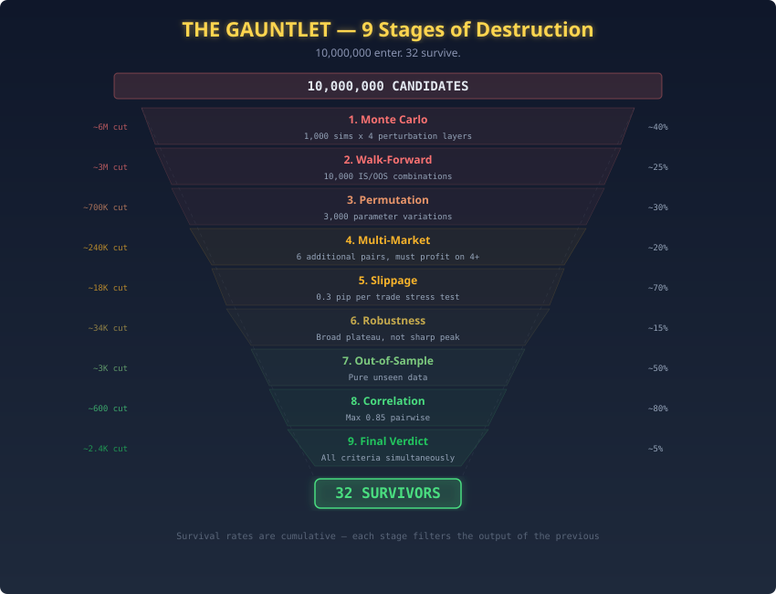
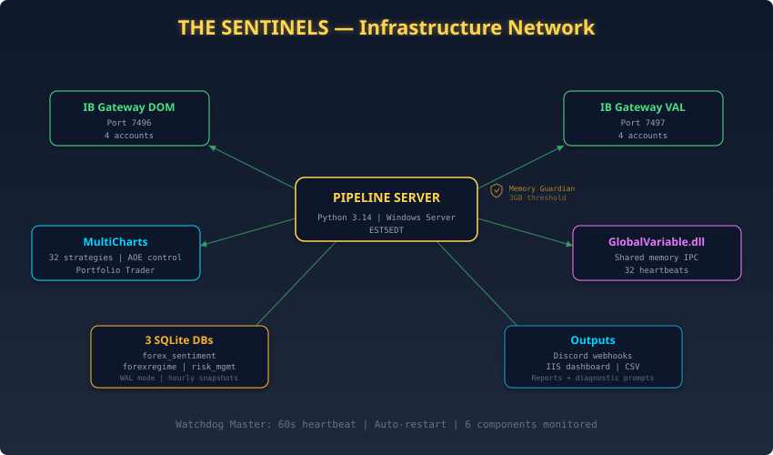
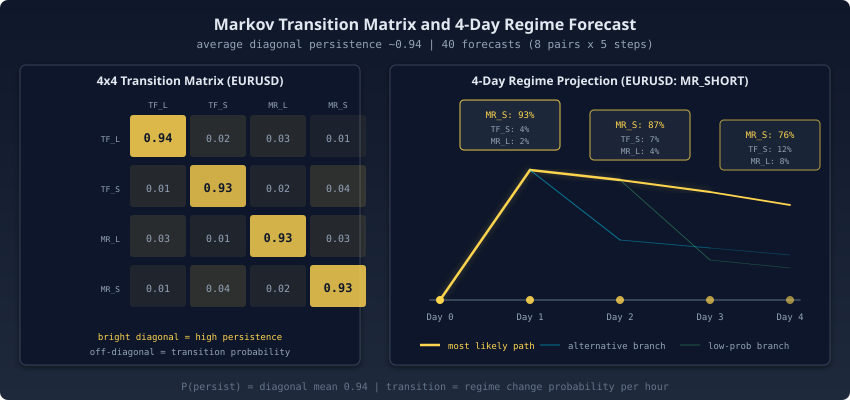
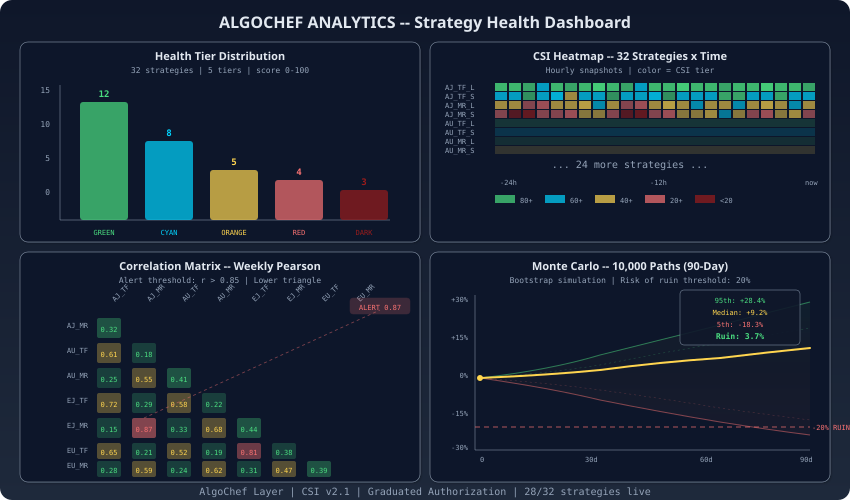

> *"What if you could build a system that never sleeps, never panics, and learns from every trade it makes, not in simulation, but with real capital, every hour, across 8 currency pairs?"*
>
> *This is that system. And this document is your guide through every algorithm, every decision, and every line of logic that makes it work.*

---

## Prologue: Before the Machine Wakes

### *168 Seconds to Autonomy*

It is **06:20 AM Eastern Time**, February 26, 2026.

New York is still dark. Snow from the previous night has left a thin crust on the windowsills of the financial district, and the streetlights along Water Street throw pale cones into the pre-dawn grey. The Asian session is winding down, Tokyo traders finishing their books, Sydney already closed, the Nikkei futures thinning out. Six time zones east, London is warming up. Coffee machines in Canary Wharf hum to life. The first EUR/GBP quotes of the London pre-open begin to tighten.

Over $7.5 trillion flows through the foreign exchange market every day, the largest, most liquid, most unforgiving financial market on the planet. It never closes. It never pauses. It runs 24 hours a day, five and a half days a week, in an unbroken chain of overlapping sessions that circles the globe like a financial terminator line: Wellington opens, Sydney follows, Tokyo takes over, Hong Kong overlaps, Singapore bridges the gap, London ignites the real volume, and New York slams the hammer down. By the time New York winds down, Wellington is already waking up again.

Somewhere in a data center, a machine stirs.

Not a metaphorical machine. A *real* one. A production server running Python 3.14, connected to two IB Gateway instances via the TWS API, monitoring 32 live trading strategies across 8 currency pairs on 8 brokerage accounts. It has been running, hour after hour, for weeks. It does not sleep. It does not check its phone. It does not second-guess itself after a losing trade or get euphoric after a winning streak. It simply executes.

In the next **168 seconds**, this machine will:

1. **Scrape 19 data sources** across 10 parallel threads, retail sentiment, CFTC institutional data, economic calendar, CME implied volatility, prediction markets, FinBERT news analysis, currency strength, seasonal patterns, and cross-asset macro data (VIX, bond yields, equity indices, oil volatility, copper, gold, 25 series via Yahoo Finance + FRED)
2. **Calculate 30 financial theories** for each of 8 pairs, 240 directional hypotheses
3. **Train a 5-model ML ensemble** (Mixture of Experts) on 134 features per pair (1,072 total)
4. **Classify IV regimes** from CME FX ETF options, identifying COMPLACENT, PRICED, FEARFUL, and SURPRISE markets
5. **Consult a Bayesian MCMC optimizer** for confidence calibration
6. **Generate 4-day probabilistic forecasts** using Markov transition matrices
7. **Train and deploy a Reinforcement Learning agent** with 6,832 experiences
8. **Aggregate paper signals** from 32 live MCPT strategies for CSI evaluation (firewalled from arbitration)
9. **Compute macro composite signals** from 8 pair-specific cross-asset factor models
10. **Classify the macro regime** (Expansion/Late Expansion/Early Recession/Late Recession/Recovery) and activate a cross-asset volatility kill switch
11. **Arbitrate conflicting signals** from 4 sources through a weighted meta-resolution engine
12. **Compute risk-adjusted position sizes** through an 8-layer cascade (including vol kill switch and macro regime overlay)
13. **Write a CSV file** that activates or deactivates each of the 32 strategies in real time

By **06:23:28**, exactly **155 seconds** after it started, the CSV is written. The charting platform reads it. Orders flow to Interactive Brokers. The machine goes quiet.

Until the next cycle. Fifty-five minutes from now, at 07:55 Eastern, the entire sequence will fire again. And again at 08:55. And 09:55. And so on, every hour, around the clock, five days a week, data collection, machine learning, signal arbitration, and risk management, repeating on the same hourly schedule.

| Metric | Value |
|---|---|
| **Pipeline Execution** | **168 seconds** (2.8 minutes) |
| **Data Sources** | 19 (25 series, parallel scraping in 10 threads) |
| **Features per Pair** | 134 (1,072 total across 8 pairs) |
| **ML Architecture** | 5-Model Mixture of Experts (MoE) |
| **Financial Theories** | 30 per pair (240 total) |
| **Live Strategies** | 32 (survivors of ~10 million candidates) |
| **Currency Pairs** | 8 major + cross pairs |
| **Brokerage Accounts** | 8 (Interactive Brokers, dual gateway) |
| **Pipeline Frequency** | Hourly (at :55 past each hour) |
| **Signal Sources** | 4 (ML 50%, Forecast 28%, RL 12%, Macro 10%) + Paper Consensus (evaluation-only) |
| **Safety Layers** | 9 independent shields + RME Guard v4 (9 guards) |
| **RL Experiences** | 6,832 (growing every cycle) |

**This document is the complete, unabridged technical blueprint of that machine.** Every algorithm. Every decision tree. Every safety layer. Sourced from a real pipeline execution on **February 26, 2026**, a live production run with real capital at risk.

> *The hero's journey begins with a question most people dismiss as impossible: Can a fully autonomous system consistently extract alpha from the most efficient market on the planet?*

The answer involves evolutionary algorithms that destroyed ten million pretenders to find thirty-two survivors. Four competing intelligences, a machine learning classifier, a probabilistic forecaster, a reinforcement learning agent, and a macro composite model, vote every hour on market direction, with a fifth voice arbitrating their disputes. Nine independent safety shields, each monitoring a different failure mode, are layered so that no single point of failure can reach the broker.

First, the machine needs strategies worth trading. Finding 32 required destroying ten million candidates.

---

## Act I: The Forge: Where Strategies Are Born and Die

> *"The forge does not create strength, it reveals it. What survives the fire was always strong. What doesn't was always an illusion."*

The first act of this story predates the pipeline itself. Before there were data scrapers, before there was a meta-signal resolver, before a single line of the unified pipeline existed, there was a question that had to be answered with statistical certainty: *Do tradeable edges exist in the FX market, and if so, can they be discovered algorithmically?*

The answer required building a forge, a system designed not to create strategies, but to annihilate weak ones. What survived would form the foundation of everything that followed.

---

### Chapter 1: Genesis: 10 Million Candidates, 32 Survivors

#### *Slaying the Dragon of Overfitting*

The most dangerous strategy is the one that looks perfect.

A beautiful equity curve, smooth, rising, drawdown-free, is the siren call of quantitative trading. It promises easy profits. It flatters the ego of its creator. And in live trading, with real capital on the line, it loses money with the quiet, devastating reliability of a rigged game.

This is the Dragon of Overfitting, and it guards the entrance to every quantitative trading system ever built. The paradox is cruel: the more complexity you add to a strategy, the more indicators, the more conditions, the more precisely tuned parameters, the better it performs on historical data. Every additional degree of freedom gives the optimizer one more knob to twist, one more curve to fit, one more historical quirk to memorize. The backtest improves. The sharpe ratio climbs. The maximum drawdown shrinks.

And the strategy becomes more and more perfectly adapted to a past that will never repeat.

> *The more perfectly a strategy fits historical data, the more certain its failure in live trading. This is a mathematical certainty.*

To slay this dragon, you need not cleverness or intuition. You need **systematic, multi-dimensional statistical validation at massive scale**. You need a forge so hot and so thorough that only genuine structural edge, patterns that persist because they arise from market microstructure, behavioral biases, and institutional flow dynamics, can survive.



#### The Multi-Island Genetic Architecture

The 32 strategies deployed in this pipeline are not hand-crafted. They are not the product of a trader's intuition or a weekend of chart-staring. They are **evolutionary survivors**, the final remnants of a process that generated approximately **10 million candidates** across 10 complete evolutionary cycles.

The system uses a **multi-island genetic algorithm**, a parallel evolutionary architecture inspired by the Baldwin Effect in evolutionary biology. In nature, isolated island populations evolve different solutions to the same survival problem. Periodic migration events between islands prevent any single population from converging prematurely on a local optimum. The result is a diverse, robust set of solutions that a single monolithic population could never produce.

**Architecture:**

- **5 independent islands** (populations), each containing **50 strategies**
- Each island evolves independently for **10 generations** through selection, crossover, and mutation
- **Migration events** exchange top performers between islands every 3 generations, preventing premature convergence
- Fitness function: **Return-to-Drawdown ratio** (not raw returns, this punishes volatility and rewards consistency)
- **Complexity constraint**: Maximum 2 entry conditions, no fixed stop-losses, no fixed profit targets

The complexity constraint is the single most important design decision in the entire system. It is also the most counterintuitive.

> *Why no fixed exits?* Fixed exits, "take profit at 50 pips," "stop loss at 30 pips", are the most potent curve-fitting vector in quantitative trading. They latch onto specific historical price patterns that vanish in live markets. By forbidding them, the genetic algorithm is forced to discover *structural* edge: patterns that persist across market environments because they reflect something real about how markets move, not something specific about how EURUSD behaved on a Tuesday in March 2019.

A typical evolved strategy looks like this:

```
IF RSI(14) < 30 AND Bollinger_Band_Width(20,2) > 0.015
THEN enter LONG at market
EXIT: Reverse on opposite signal
```

Two conditions. No magic numbers beyond the indicator defaults. No hard-coded profit targets. The simplicity is the point. Complex strategies overfit. Simple strategies generalize. Only strategies that generalize survive live trading.

#### The Nine-Stage Gauntlet

A strategy that survives the genetic algorithm has proven itself in-sample. But in-sample performance means nothing. The backtest is a mirror: it shows you what you want to see. The real test is **out-of-sample robustness**, performance on data the strategy has never touched, under conditions it was never optimized for.

The 32 survivors passed through **nine increasingly brutal validation stages**, each designed to test a different dimension of robustness:

| Stage | Method | What It Tests | Elimination Rate |
|---|---|---|---|
| **1. Build** | Multi-Island GA (5x50x10 gen) | Raw edge discovery | ~99.5% |
| **2. Monte Carlo** | 1,000 simulations x 4 perturbation layers | Robustness to randomness | ~90% of survivors |
| **3. Walk-Forward** | 10,000 matrix combinations (IS/OOS periods) | Time-series generalization | ~90% of survivors |
| **4. Permutation** | 3,000 parameter variations | Parameter sensitivity | ~70% of survivors |
| **5. Multi-Market** | 6 additional pairs (must profit on 4+) | Cross-market validity | ~47% of survivors |
| **6. Slippage** | 0.3 pip per trade stress test | Execution cost resistance | ~38% of survivors |
| **7. Robustness** | Sharp-peak vs broad-plateau detection | Parameter landscape shape | ~50% of survivors |
| **8. OOS Validation** | Pure unseen data validation | True predictive power | ~60% of survivors |
| **9. Final Verdict** | Elevated thresholds (PF > 1.2, 70% OOS) | Production readiness | ~36% of survivors |

Each stage is a door. Most strategies never make it past the second.

**Stage 2: Monte Carlo Simulation (1,000 Runs x 4 Perturbation Layers)**

For each strategy that passed the genetic algorithm, the system runs **1,000 Monte Carlo simulations**, each applying four independent perturbation layers simultaneously:

1. **Trade order shuffling**, Randomize the sequence of trades. If a strategy's returns depend on a specific sequence of wins and losses, it is exploiting serial correlation in the test data, not a genuine edge.
2. **Price data randomization**, Add random noise to OHLC bars (+/-0.3% of the close price). A robust strategy should tolerate small price variations without collapsing.
3. **Slippage injection**, Random entry and exit slippage from 0 to 0.5 pips. Markets are not frictionless; strategies that only work with perfect fills are useless.
4. **Parameter jittering**, Perturb all parameters by +/-10% of their optimized values. If a strategy requires RSI(14) exactly and fails at RSI(13) or RSI(15), it has found a sharp peak, not a plateau.

A strategy passes only if its **median return across 1,000 simulations** exceeds the original backtest return multiplied by 0.6. Even with significant random noise injected into every dimension, the strategy must retain at least 60% of its edge. This is a punishing threshold. It eliminates approximately 90% of strategies that passed Stage 1.

**Stage 3: Walk-Forward Matrix (10,000 Combinations)**

Walk-forward analysis is the gold standard for time-series validation. The system tests **10,000 combinations** of in-sample and out-of-sample windows:

- In-sample windows: 60, 90, 120, 180 days
- Out-of-sample windows: 30, 60, 90, 120 days
- This creates a 4x4 matrix of 16 core configurations, each tested at 625 rolling start positions

A strategy passes only if **80% or more of all walk-forward windows are profitable** in the out-of-sample segment. This threshold is strict. A strategy that works in 79% of walk-forward windows has demonstrated strong, but not sufficient, generalization. The 80% bar ensures that only strategies with deep structural edge survive.

**Stage 5: Multi-Market Validation**

A strategy designed for EURUSD is tested on 6 additional pairs: GBPUSD, USDJPY, USDCHF, AUDUSD, USDCAD, EURJPY. It must achieve a Return-to-Drawdown ratio above 1.0 on **at least 4 of the 6** additional pairs.

This is one of the most noteworthy test. A strategy that only works on one pair may have discovered a genuine microstructural quirk of that specific instrument, but it is far more likely that it has memorized pair-specific noise. A strategy that works across multiple pairs has discovered something about how *markets* behave, not how one instrument behaves. That distinction is the difference between a fragile illusion and a durable edge.

**Stage 7: Robustness (Sharp-Peak vs. Broad-Plateau Detection)**

The system varies every strategy parameter across its feasible range and maps the resulting performance surface. A strategy whose performance peaks sharply at a single parameter value and collapses on either side is sitting on a needle, it will fail the moment market conditions shift even slightly. A strategy whose performance remains strong across a broad plateau of parameter values has discovered a robust relationship that tolerates natural market evolution.

Only broad-plateau strategies pass. Needle strategies are destroyed.

#### The Compound Probability

What is the probability that a purely random, curve-fit strategy passes all nine stages by chance?

```
P(random_pass) = 0.005 x 0.10 x 0.10 x 0.30 x 0.53 x 0.62 x 0.50 x 0.40 x 0.64
 = 0.0000032
 = 1 in 312,500
```

**Result: 32 survivors from approximately 10 million candidates, a survival rate of 0.00032%.**

These 32 strategies are not lucky. They are not statistical flukes. They possess genuine, validated, multi-dimensionally stress-tested edge. Each one has been tortured by randomness, stretched across time, transplanted to foreign markets, burdened with execution costs, and tested on data it has never seen, and it survived every trial.

#### The Portfolio Structure

The 32 survivors are not thrown together haphazardly. They are arranged into a **perfectly balanced orthogonal portfolio**:

- **4 strategies per pair** across 8 currency pairs (EURUSD, USDJPY, GBPUSD, USDCHF, AUDUSD, USDCAD, EURJPY, AUDJPY)
- **16 Long + 16 Short** (directional hedge)
- **16 Trend-Following + 16 Mean-Reversion** (style diversification)
- **4 per account** across 8 brokerage accounts (2 Long + 2 Short, 2 TF + 2 MR per account)

This orthogonal design ensures that no single market condition can devastate the entire portfolio. When trend-following strategies lose in range-bound markets, mean-reversion strategies profit. When long strategies suffer in a dollar rally, short strategies capture the move. When one pair goes sideways, another trends. The portfolio is hedged across direction, style, pair, and account.

32 survivors. Each one a proven edge. Each one assigned to its pair, its direction, its account, its role in the larger machine.

An edge without infrastructure is fragile. A disconnected gateway at 3 AM, a memory leak mid-execution, or a timezone misconfiguration firing orders at the wrong bar boundary can each turn a valid signal into a loss. The pipeline verifies infrastructure health before making any decisions.

---

### Chapter 2: The Sentinels: Infrastructure That Never Sleeps



#### *Dual Gateways, Shared Memory, and the Watchdog That Never Blinks*

Before the pipeline can think, it must breathe.

This is the unsexy truth that separates production trading systems from research prototypes. Every quantitative developer has built a model that backtests beautifully. Far fewer have built the infrastructure to keep that model alive at 3:47 AM on a Saturday when a Java garbage collection pause freezes an IB Gateway instance, or when a Windows Update silently restarts the server and 32 strategies wake up to stale state and begin executing zombie orders from the previous session.

The sentinels are six independent monitoring systems, each guarding a different dimension of infrastructure health. They run before every pipeline cycle, and several of them run continuously between cycles. Together, they form a pre-flight checklist so thorough that a single anomaly in any system, memory, connectivity, strategy state, position reconciliation, process health, or timezone configuration, will halt the entire pipeline before it can make a single decision.

#### Memory Guardian: The First Breath

The very first action the pipeline takes, before any connectivity check, before any data scraping, before a single feature is computed, is to verify that the server has enough RAM to complete its work.

The **Memory Guardian** (`memory_guardian.py`) reads available physical memory through a direct Windows kernel call (`ctypes.windll.kernel32.GlobalMemoryStatusEx`) and enforces a **3 GB minimum threshold**.

On a 16 GB server simultaneously running two IB Gateway JVMs, MultiCharts with 32 live strategies, a persistent liveboard service, and a variable constellation of development tools, memory pressure is not theoretical. It is an operational reality that has caused production incidents. A failed DLL import at 04:56 on February 26, 2026, caused by a depleted paging file that prevented Python from loading a shared library, was the catalyst that birthed this system.

The guardian operates with a **tiered priority kill system**:

| Priority | Targets | Examples |
|---|---|---|
| **Tier 1** (killed first) | Browsers, media, misc | Chrome, Edge, Firefox, Spotify, OBS |
| **Tier 2** (killed second) | Email, communications | Thunderbird, Outlook, Slack, Discord |
| **Tier 3** (last resort) | Development tools | Claude Code, VS Code, Electron apps |

Within each tier, the heaviest processes are terminated first, the 354 MB Edge WebView process dies before the 12 MB Edge renderer. Protected processes, Python, IB Gateway, Java, the AT Center server, and all OS-critical services, are never touched under any circumstances. The protected list is hardcoded; it cannot be overridden by configuration or environment variables.

```
[MEM_GUARDIAN] Free RAM: 0.70 GB (threshold: 3.0 GB)
[MEM_GUARDIAN] RAM LOW -- freeing excessive processes...
[MEM_GUARDIAN] Killable: 83 processes -- claude=21(8.0GB), msedge=48(2.5GB), chrome=9(0.3GB)
[MEM_GUARDIAN] Killing msedgewebview2.exe PID 10044 (msedge, 354 MB)...
[MEM_GUARDIAN] Killing msedge.exe PID 17788 (msedge, 123 MB)...
[MEM_GUARDIAN] RAM recovered: 3.21 GB (freed 8 excessive processes)
```

After reclaiming memory, the guardian elevates the pipeline process to `HIGH_PRIORITY_CLASS` (Windows priority `0x00000080`), ensuring that the OS CPU scheduler favors the trading pipeline over any surviving background processes. A Discord notification fires with a before-and-after memory summary whenever processes are terminated. The maximum kill rounds are capped at 15, a safety valve that prevents runaway termination loops.

The Memory Guardian is a blunt instrument for a blunt problem: the server must have enough RAM, or nothing else works.

#### TWS Connectivity: Two Gateways, Eight Accounts

With memory secured, the pipeline checks its connection to the outside world.

```
[2026-02-26 06:20:53] TWS HEALTH CHECK v2.0 - Pre-Pipeline Guard
==========================================
[TWS Instance 1] Port 7496 | PID: 40796 | 4 accounts, 2 positions HEALTHY
[TWS Instance 2] Port 7497 | PID: 22340 | 4 accounts, 3 positions HEALTHY
==========================================
RESULT: 2/2 healthy -- All TWS instances operational
```

Two independent IB Gateway instances run simultaneously, designated **GW_DOM** (port 7496) and **GW_VAL** (port 7497). Each manages 4 of the 8 brokerage accounts. The health check does not merely verify TCP connectivity, it probes each gateway's **live order book**, confirming active data flow. A gateway that accepts TCP connections but returns empty account lists is a zombie: technically alive, functionally dead. The health probe catches zombies.

If either gateway fails, the pipeline aborts before any decisions are made. No partial execution. No fallback to a single gateway. The system was designed with the conviction that trading with degraded infrastructure is worse than not trading at all. A missed opportunity costs nothing. A position entered through a degraded gateway that cannot receive its exit order can cost everything.

#### GV Telemetry: 32 Heartbeats in Shared Memory

While the gateway probes run, a parallel check reaches into the charting platform itself, where the 32 live strategies are executing.

```
[GV_HEALTH] OK: 32/32 alive, 32 AOE (AutoOrderEntry), 32 synced
```

This is the **GlobalVariable.dll telemetry system**, a shared-memory IPC mechanism built on a C++ DLL that ships with MultiCharts. Each of the 32 strategies writes its state to a named global variable in shared memory. The Python pipeline reads all 32 values through `ctypes` calls to `GV_GetNamedInt`, completing the entire sweep in under one second. Zero network overhead. Zero serialization. Sub-millisecond access per read.

For each strategy, the telemetry system verifies three conditions:

1. **Alive**, The strategy's heartbeat timestamp is within the last 60 seconds. A strategy that has not updated its heartbeat is frozen, crashed, or disconnected from its data feed.
2. **AOE-Enabled**, Automatic Order Entry is active. A strategy can be alive but have AOE disabled, meaning it computes signals but does not send orders. This state is invisible from the broker's perspective and can only be detected through the shared-memory channel.
3. **Synced**, The strategy's internal state matches the expected configuration from the pipeline's CSV. A desynchronized strategy might be trading the wrong direction or with the wrong position size.

a heartbeat monitor for 32 independent trading agents, all verified in under one second through shared memory. If any strategy fails any condition, the pipeline knows *before* it generates new signals, and can adjust its sizing accordingly.

#### The Cross-Validation Guard: Trust but Verify

Later in Stage 2, after IBKR positions have been fetched and strategy states have been read, an independent **cross-validation phase** reconciles the two views:

```
[XVAL] OK: EURJPY Account A IBKR=+2.4% GV=+2.4%
[XVAL] OK: AUDJPY Account A IBKR=+2.1% GV=+2.1%
[XVAL] OK: USDJPY Account D IBKR=+1.3% GV=+1.3%
[XVAL] OK: GBPUSD Account B IBKR=+1.5% GV=+1.5%
[XVAL] OK: USDCHF Account C IBKR=-1.3% GV=-1.3%

All positions validated OK
```

The broker says Account A holds +2.4% of equity in EURJPY. The charting platform says its EURJPY strategy on Account A is long the same amount. If these numbers disagree, even by a fraction of a percent, the system flags immediately. Position desynchronization is one of the most insidious failure modes in automated trading: it can lead to unintended exposure, phantom positions that accumulate risk silently, or exit orders that fire against the wrong position and leave the account naked in the opposite direction.

A micro-position threshold of 500 units filters out test debris, tiny positions left over from development or manual testing that would otherwise trigger false alarms on every cycle.

#### Timezone Synchronization: The Invisible Trap

A seemingly mundane but mission-critical check:

```
Timezone OK: TZ=EST5EDT, NY_offset=-18000s, local=-18000s
```

FX markets operate on a **New York close calendar**. Daily bars close at 17:00 Eastern. Session transitions, Asian to London, London to New York, are defined by Eastern Time boundaries. The economic calendar timestamps events in Eastern Time. A timezone misconfiguration of even one hour would cause bar boundaries, event schedules, and session transitions to be calculated incorrectly.

The pipeline verifies that the system timezone is `EST5EDT` (America/New_York), that the UTC offset matches the expected value for the current DST state, and that the local clock agrees with the NTP reference. If any of these checks fail, the pipeline halts. A trade entered one hour early because of a DST transition error produces errors that appear correct in every log file, making them nearly impossible to diagnose after the fact.

#### Watchdog Master: The Sentinel That Never Sleeps

Beyond the per-cycle pre-flight checks, a persistent **Watchdog Master** (`watchdog_master.py`) runs on a 60-second interval, continuously monitoring six components:

| Component | Check Method | Critical | Auto-Restart |
|---|---|---|---|
| **MultiCharts64** | Process detection | Yes | Manual (requires GUI) |
| **GW_DOM** (port 7496) | Process + TCP port probe | Yes | Manual (requires 2FA) |
| **GW_VAL** (port 7497) | Process + TCP port probe | Yes | Manual (requires 2FA) |
| **MCPT AOE** | GV shared-memory read | Yes | Manual (requires MC GUI) |
| **Discord Notifier** | Process + cmdline match | No | Automatic |
| **MCPT Monitor** | Process + port 5099 | No | Automatic |

Critical components that go down trigger immediate Discord alerts with debug instructions. Non-critical components are auto-restarted silently. The watchdog writes every check result to SQLite for historical analysis, and it respects quiet hours, suppressing non-critical alerts during known maintenance windows and market closures.

The watchdog does not prevent failures. It ensures that failures are detected within 60 seconds and that the right human is notified with the right diagnostic steps before the next pipeline cycle fires. In a system where each cycle is 55 minutes apart, a 60-second detection window leaves ample time for intervention.

The sentinels report all clear. Infrastructure verified. Memory secured, gateways healthy, strategies alive, positions reconciled, timezone locked, watchdog running.

But a warrior without intelligence is merely reckless, and the oracle network is about to harvest the world's data in 62 seconds.

---

## Act II: The Oracle Network: Gathering Intelligence

> *"In the fog of war, intelligence is the only weapon that strikes before the battle begins."*

The forge produced 32 warriors. The sentinels verified the arena. But warriors without intelligence are merely reckless, swords swinging blind in a market that punishes ignorance with mathematical precision. Before the pipeline can think, before the machine learning models can classify, before the reinforcement learning agent can act, before the macro composite can assess, there must be *data*. Not some data. Not a few indicators pulled from a single API. The pipeline requires a comprehensive, multi-dimensional portrait of the global financial landscape, scraped, cleaned, validated, and unified, every single hour.

This is the work of the Oracle Network: ten parallel threads, nineteen data sources, one unified truth. And it completes this work in 62 seconds.

---

### Chapter 3: 19 Sources in 62 Seconds: The Parallel Harvest

At 06:20:53, the pipeline opens nineteen connections simultaneously. In the time it takes a human trader to scan one headline, the machine will have read the entire world.


#### *Ten Threads, Nineteen Oracles, One Unified Truth*

The FX market is influenced by everything.

That statement sounds like hyperbole. It is not. A copper mine in Chile floods, and the Australian dollar weakens three hours later because Australia exports iron ore to the same Chinese smelters that buy Chilean copper. A Bundesbank official mentions "price stability" at a Frankfurt conference, and EUR/USD moves 40 pips before the speech ends because algorithmic systems parse the phrase as hawkish relative to consensus expectations. A hurricane forms in the Gulf of Mexico, and USD/CAD tightens because oil traders price in supply disruption before the storm makes landfall. A single data point from the ISM Manufacturing Survey, a number that most people will never read, reshapes the interest rate expectations of the world's largest economy, and every dollar-denominated pair adjusts within seconds.

To trade FX with an edge, you cannot look at currencies alone. You must look at *everything*, and you must look at it *fast*, because the market is looking at it too.

The pipeline's Stage 1 data collection launches **10 parallel threads**, each responsible for a distinct category of intelligence. These threads run simultaneously . The market does not wait for slow scrapers. The entire harvest completes in approximately 62 seconds.


#### The 19 Sources

| # | Thread | Source | Method | Coverage | Purpose |
|---|--------|--------|--------|----------|---------|
| 1 | Retail Sentiment | IG Group | HTML scrape | 8 pairs | Contrarian positioning |
| 2 | Retail Sentiment | Dukascopy | JSON API | 8 pairs | Contrarian positioning |
| 3 | Retail Sentiment | MyFxBook | HTML scrape | 8 pairs | Contrarian positioning |
| 4 | Retail Sentiment | FXSSI | Selenium render | 8 pairs | Contrarian positioning |
| 5 | Economic Calendar | ForexFactory | HTML scrape | 304+ events | Scheduled risk events |
| 6 | Implied Volatility | CME FX ETF Options | Yahoo Finance API | 6 ETFs | Vol regime classification |
| 7 | Prediction Markets | Kalshi | JSON API | 297 contracts | Policy expectation |
| 8 | Prediction Markets | Polymarket | JSON API | 297 contracts | Hawkishness divergence |
| 9 | News Sentiment | GDELT | REST API | Global | FinBERT NLP scoring |
| 10 | News Sentiment | Google News | RSS scrape | 8 pairs | Volume + tone |
| 11 | News Sentiment | Finnhub | REST API | Major FX | Institutional news flow |
| 12 | ATR Calculation | IBKR (H4 bars) | TWS API | 8 pairs | Intraday vol sizing |
| 13 | ATR Calculation | IBKR (D1 bars) | TWS API | 8 pairs | Daily vol sizing |
| 14 | CFTC COT | CFTC | Weekly report | 7 currencies | Institutional positioning |
| 15 | Currency Strength | Computed | Cross-rate matrix | 8 pairs | Relative momentum |
| 16 | Seasonal Patterns | MarketBulls | Selenium render | 8 pairs | Calendar anomalies |
| 17 | Cross-Asset Macro | Yahoo Finance | JSON API | 17 series | Equity, commodity, rates |
| 18 | Cross-Asset Macro | FRED | REST API | 8 series | Sovereign yields |
| 19 | Cross-Asset Macro | Yahoo Finance | JSON API (VIX, OVX) | 2 series | Vol indices |

#### Thread 1: Retail Sentiment: The Contrarian Engine

Four independent brokers, IG, Dukascopy, MyFxBook, and FXSSI, each publish the percentage of their retail clients holding long versus short positions on major FX pairs. The pipeline scrapes all four, every hour.

Why four sources? Because no single broker's client base is representative. IG skews European. Dukascopy skews institutional-retail. MyFxBook captures a global cross-section of MetaTrader users. FXSSI aggregates multiple smaller brokers. By triangulating across all four, the pipeline constructs a composite retail positioning picture that is far more robust than any individual source.

The signal is *contrarian*. Retail traders, as a population, are consistently wrong at extremes. When 85% of IG's retail clients are long EUR/USD, the pipeline reads that as a *bearish* signal, because extreme retail consensus has been empirically demonstrated to precede reversals. This is not theoretical. It is a well-documented behavioral bias: retail traders hold losing positions too long (hoping for recovery) and cut winning positions too early (fearing reversal). The result is that extreme positioning reliably indicates the exhaustion of a move, not its continuation.

The sentiment data feeds directly into six of the pipeline's 30 financial theories (Chapter 4) and provides raw features for the ML ensemble (Chapter 5 in Act III).

#### Thread 2: Economic Calendar: 304 Events That Move Markets

The ForexFactory economic calendar is scraped for every scheduled event in the next 7 days: Non-Farm Payrolls, CPI releases, central bank rate decisions, GDP prints, PMI surveys, employment reports, and hundreds of lesser events that nonetheless move markets when the actual value deviates from consensus.

Each event is tagged with its impact level (high, medium, low), its currency, and its scheduled release time. This data feeds Theory #15 (`upcoming_events`), which quantifies the asymmetric risk environment: a pair with three high-impact events in the next 24 hours faces a different risk landscape than a pair with no scheduled events.

The calendar scraper also computes **event density**, how many overlapping high-impact events are clustered in a time window. Dense event clusters create correlation spikes across pairs, and the pipeline adjusts its confidence accordingly.

#### Thread 3: Implied Volatility: What the Options Market Knows

The pipeline scrapes CME FX ETF options to extract implied volatility surfaces. The mapping from ETF to currency pair is not trivial:

| ETF | Underlying Pair | Method |
|-----|----------------|--------|
| FXE | EUR/USD | Direct |
| FXY | USD/JPY | Direct (inverted) |
| FXB | GBP/USD | Direct |
| FXA | AUD/USD | Direct |
| FXC | USD/CAD | Direct (inverted) |
| FXF | USD/CHF | Direct (inverted) |

For cross pairs like EUR/JPY and AUD/JPY, the pipeline uses **triangular decomposition**: EUR/JPY implied vol is derived from FXE vol and FXY vol using the standard cross-pair volatility formula, adjusting for the EUR-JPY correlation estimated from realized returns.

The volatility risk premium (VRP), the spread between implied and realized volatility, is a powerful regime indicator. When VRP is elevated, the options market is pricing in more future risk than the market has recently experienced. When VRP is compressed or negative, the market is complacent. These regimes, COMPLACENT, PRICED, FEARFUL, SURPRISE, feed directly into the IV regime classifier in Stage 3.

#### Thread 4: Prediction Markets: Policy Divergence in Real Time

Kalshi and Polymarket host prediction contracts on central bank rate decisions, economic data releases, and geopolitical events. The pipeline scrapes 297 active contracts and maps them to per-pair directional signals.

The key insight is **hawkishness divergence**: when prediction markets price in a 75% probability of a Fed rate hold but only a 40% probability of an ECB hold, the implied hawkishness differential favors EUR strength. The pipeline computes this differential for every pair, every hour, creating a real-time market-implied monetary policy expectation surface.

**Policy divergence momentum** adds a temporal dimension: not just the current divergence, but how fast it is changing. A stable 20% divergence is background noise. A divergence that jumped from 5% to 30% in the last 48 hours is a signal that the market is repricing relative monetary policy, and currencies follow repricing events with high reliability.

#### Thread 5: News Sentiment: FinBERT on Global Headlines

Three news sources, GDELT, Google News, and Finnhub, provide raw headline and article data. The pipeline processes this through **FinBERT**, a financial-domain BERT model fine-tuned on financial text, to extract per-pair sentiment scores ranging from -1.0 (extremely bearish) to +1.0 (extremely bullish).

The news thread extracts four distinct signals: **tone** (average sentiment polarity), **momentum** (change in tone over the last 24 hours), **volume** (article count, sudden spikes indicate breaking events), and **divergence** (disagreement between sources, which often precedes large moves as the market digests conflicting information).

GDELT, the Global Database of Events, Language, and Tone, is particularly valuable because it captures non-English-language sources that Western-focused scrapers miss entirely. A Chinese-language editorial about RBA policy has signal content for AUD pairs that English-only scrapers would never detect.

#### Thread 6: ATR: The Ruler That Measures the Market's Breath

Average True Range on H4 and D1 timeframes, pulled directly from IBKR historical data via the TWS API. ATR is a *scaling factor*, not a directional signal. A pair with a 14-period daily ATR of 120 pips requires different position sizing than a pair with an ATR of 40 pips.

The H4 ATR captures intraday volatility structure, while the D1 ATR captures the broader daily range. Both feed into the position sizing cascade in Stage 7, where they normalize risk exposure across pairs with wildly different pip values and volatility profiles.

#### Threads 7-9: COT, Currency Strength, Seasonals

**CFTC Commitments of Traders**: Weekly institutional positioning data for 7 currency futures. The pipeline tracks net speculative positioning, commercial hedger positioning, and week-over-week momentum. When commercials and speculators diverge sharply, it is a historically reliable reversal signal, commercials hedge at extremes, and they are usually right.

**Currency Strength**: A cross-rate matrix that computes the relative strength of each currency against all others. A currency that is strengthening against 6 of 7 counterparts has broad-based momentum; one that is strengthening against only 1 has a pair-specific story, not a currency story.

**Seasonal Patterns**: Calendar anomalies scraped from historical databases. EUR/USD has a documented tendency to weaken in September (corporate repatriation flows). AUD/USD has a documented tendency to strengthen in Q1 (commodity cycle restocking). These patterns are weak individually but add incremental edge when combined with other signals.

#### Thread 10: Cross-Asset Macro Data: 25 Series That Frame the World

The final thread is the most ambitious. It scrapes 25 time series from Yahoo Finance and FRED, spanning equities, commodities, fixed income, and volatility indices:

| Category | Series | Source |
|----------|--------|--------|
| Volatility | VIX, OVX | Yahoo Finance |
| Equities | Eurostoxx 50, MSCI US (URTH), Nikkei 225, FTSE 100 | Yahoo Finance |
| Commodities | Copper, WTI Oil, Gold, BHP (iron ore proxy) | Yahoo Finance |
| Fixed Income | TLT (long bond ETF) | Yahoo Finance |
| Rates | US 5Y, US 10Y | Yahoo Finance |
| Sovereign Yields | Italy 10Y, Germany 10Y, UK 10Y, Australia 10Y | FRED |

For each series, the pipeline computes a **55-day moving average** and a **1-year rolling z-score**. The moving average provides trend context (is this series above or below its recent norm?). The z-score provides magnitude context (how extreme is the current deviation from the 1-year distribution?).

This thread collects the raw data only. The transformation of 25 time series into 8 pair-specific directional signals, through cross-asset factor models, a volatility kill switch, and a macro regime classifier, is the work of Chapter 5. But the data must arrive first, clean and current, before any model can reason about it.

```
Stage 1 done: 62s elapsed
 All 10 phases completed successfully
 19 data sources x 8 pairs = coverage across all dimensions
 sentiment_hourly: 32 rows (4 sources x 8 pairs)
 news_article_counts: 24 rows (3 sources x 8 pairs)
 macro_data: 25 rows (25 series, latest values)
 theory_inputs: ready for Stage 2
```

Sixty-two seconds. Ten parallel threads. Nineteen data sources. Thousands of data points ingested, cleaned, validated, and stored in SQLite tables ready for the next stage.

19 sources scraped. Thousands of data points ingested. But raw data is noise, to become signal, it must be filtered through theory.

---

### Chapter 4: The Theory Engine: 30 Hypotheses Per Pair

The database holds 32 fresh sentiment readings, 24 news scores, 25 macro series. None of them mean anything yet.

#### *240 Directional Hypotheses from 6 Intellectual Traditions*

Data tells you what happened. Theory tells you what it means.

Consider a single data point: 78% of IG retail clients are long EUR/USD. What does that *mean*? Without a theory, it is just a number in a database. With a contrarian positioning theory, it becomes a bearish signal. With a momentum confirmation theory, it means something entirely different. With a divergence theory that compares it against Dukascopy's 62% long reading, it becomes an inter-source disagreement signal that might indicate an inflection point.

The same data, viewed through different theoretical lenses, produces different conclusions. This is the design philosophy of Stage 2. The pipeline does not commit to a single interpretation of the data. It generates **30 independent directional hypotheses per pair**, drawn from **6 distinct intellectual traditions**, and lets the downstream models weigh the evidence.

30 theories. 8 pairs. **240 hypotheses per pipeline cycle.**


#### The 30 Theories in 6 Clusters

| # | Cluster | Theory | Signal Logic |
|---|---------|--------|-------------|
| **1** | Sentiment | `retail_bias` | Contrarian: extreme retail long = bearish |
| **2** | Sentiment | `sentiment_momentum` | Direction of sentiment change over 24h |
| **3** | Sentiment | `sentiment_volatility` | Sentiment dispersion across sources |
| **4** | Sentiment | `extreme_sentiment` | Binary flag: >80% or <20% retail positioning |
| **5** | Sentiment | `sentiment_range` | Width of sentiment band across 4 brokers |
| **6** | Sentiment | `weighted_sentiment` | Source-quality-weighted composite |
| **7** | COT/Institutional | `seasonal_bias` | Calendar anomaly direction for current month |
| **8** | COT/Institutional | `retail_inst_divergence` | Retail vs institutional positioning gap |
| **9** | COT/Institutional | `cot_momentum` | Week-over-week change in net speculative |
| **10** | COT/Institutional | `cot_positioning` | Absolute net speculative vs 1-year range |
| **11** | COT/Institutional | `cot_commercial` | Commercial hedger positioning (contrarian) |
| **12** | COT/Institutional | `cot_acceleration` | Rate of change in COT momentum |
| **13** | Currency Strength | `relative_strength` | Base vs quote currency strength differential |
| **14** | Currency Strength | `base_momentum` | Base currency strength trend (5-day) |
| **15** | Currency Strength | `quote_momentum` | Quote currency strength trend (5-day) |
| **16** | Currency Strength | `momentum_differential` | Base momentum minus quote momentum |
| **17** | Calendar | `upcoming_events` | Weighted count of upcoming high-impact events |
| **18** | Calendar | `event_asymmetry` | Imbalance of events affecting base vs quote |
| **19** | Calendar | `calendar_density` | Cluster density of events in next 48h |
| **20** | Cross-Factor | `sent_cot_agreement` | Sentiment and COT agree on direction |
| **21** | Cross-Factor | `strength_sent_confirm` | Strength and sentiment confirm each other |
| **22** | Cross-Factor | `multi_factor_trend` | Majority vote across all available signals |
| **23** | Alternative Data | `pm_policy_expectation` | Prediction market implied rate path |
| **24** | Alternative Data | `pm_shift_momentum` | Rate of change in policy expectation |
| **25** | Alternative Data | `pm_cross_source_divergence` | Kalshi vs Polymarket disagreement |
| **26** | Alternative Data | `news_tone` | FinBERT average sentiment polarity |
| **27** | Alternative Data | `news_momentum` | 24h change in news tone |
| **28** | Alternative Data | `news_volume` | Article count spike detection |
| **29** | Alternative Data | `news_divergence` | Inter-source sentiment disagreement |
| **30** | Alternative Data | `news_shock` | Sudden tone reversal detection |

Every theory outputs a value on the interval **[-1, +1]**, where -1 is maximally bearish, 0 is neutral, and +1 is maximally bullish. This normalization is critical: it allows theories from entirely different domains to be compared, combined, and fed into the ML ensemble on a common scale.

#### The Architecture of Interpretation

The six clusters are not arbitrary groupings. Each represents a different *way of reading the market*:

**Sentiment (Theories 1-6)** reads the crowd. What are retail traders doing, and how should a sophisticated system respond? The dominant signal here is contrarian, but the nuance lies in *when* to be contrarian. Sentiment at 55% long is noise. Sentiment at 85% long is signal. The six sentiment theories capture this spectrum: the raw bias, its momentum, its volatility, its extremity, its range across sources, and its quality-weighted composite.

**COT/Institutional (Theories 7-12)** reads the professionals. CFTC data is weekly, not hourly, so it provides slower-moving, higher-conviction signals. When commercial hedgers are building large positions against the speculative consensus, history shows the commercials are usually right, they have information that speculators do not. The acceleration theory (Theory 12) is particularly powerful: it detects not just positioning but the *rate of change* of positioning, catching institutional activity in its early stages.

**Currency Strength (Theories 13-16)** ignores pairs entirely and instead measures each individual currency's broad-based performance. A currency strengthening against 6 of 7 counterparts is in a regime of genuine currency-level demand, and a pair trade that aligns with broad currency strength has a different character than one that fights it.

**Calendar (Theories 17-19)** reads the schedule. Markets behave differently before high-impact events than after them. Pre-event positioning creates predictable patterns: risk reduction before NFP, volatility expansion before central bank meetings, correlation spikes during clustered event windows. The calendar theories quantify this event-driven risk landscape.

**Cross-Factor (Theories 20-22)** asks the meta-question: do the other theories *agree*? When sentiment, COT, and strength all point in the same direction, the signal is qualitatively different from when they diverge. Agreement is a confidence amplifier. Disagreement is a caution flag. The multi-factor trend (Theory 22) is a simple but powerful majority vote across all available signals, a democratic consensus that often outperforms any individual theory.

**Alternative Data (Theories 23-30)** reaches beyond traditional financial indicators into prediction markets and natural language processing. Policy expectations derived from betting markets respond to information faster than central bank communications. News sentiment, processed through FinBERT, captures narrative shifts that precede price moves. The shock detector (Theory 30) specifically watches for sudden reversals in news tone, the moment the narrative flips from bullish to bearish (or vice versa), which historically correlates with sharp price moves within 24-48 hours.

#### From Theories to Features

Each theory's output joins the raw scraped data to form a feature vector of **134 dimensions per pair**, 30 theory scores plus 104 raw data features (sentiment levels, volatility readings, COT numbers, calendar event counts, news scores, prediction market probabilities, and cross-asset data points). Across 8 pairs, this creates **1,072 features** that feed into the 5-model ML ensemble in Stage 3.

The theories do not make trading decisions. They do not generate signals. They are *hypotheses*, structured interpretations of raw data, each grounded in a specific financial theory about how and why markets move. The decision of which hypotheses to trust, which to discount, and which to ignore entirely is the work of the intelligence models in Act III.

240 hypotheses computed. But theories see only their own domain, sentiment knows nothing about yields, COT knows nothing about copper. To see the macro picture, the pipeline needs an oracle that reads across asset classes.

---

### Chapter 5: The Macro Oracle: Cross-Asset Intelligence

Copper fell 2.3% overnight in Shanghai. Three thousand miles away, a position sizing engine is about to cut its Australian dollar allocation in half, and no human told it to.

#### *25 Series, 8 Factor Models, and the Business Cycle in a Number*

Most FX systems trade currencies in isolation, as if the bond market, equity market, and commodity market exist on separate planets. They do not.

When Italian 10-year yields spike relative to German Bunds, the BTP-Bund spread widens, and EUR/USD weakens because the spread signals sovereign stress within the eurozone. When copper prices fall, AUD/USD follows within hours because Australia is the world's second-largest copper exporter and copper demand is a real-time proxy for Chinese industrial activity. When the Nikkei outperforms the S&P 500, the yen weakens because Japanese equity inflows require foreign capital that sells yen to buy stocks. When WTI oil rises, USD/CAD falls because Canada's economy is leveraged to energy exports, and rising oil prices improve Canada's terms of trade.

These are not correlations. They are *causal mechanisms*, transmission channels through which information flows from one asset class to another. The pipeline's Macro Oracle exploits these channels through 8 pair-specific cross-asset factor models, a cross-asset volatility kill switch, and a macro regime classifier.


#### 5.1 The Data Layer: 25 Series

The raw material for the Macro Oracle arrives in Thread 10 of Stage 1 (Chapter 3). Twenty-five time series, each with a 55-day moving average and a 1-year rolling z-score, stored in the `macro_data` table:

| # | Series | Source | Purpose |
|---|--------|--------|---------|
| 1 | VIX | Yahoo Finance | Equity vol regime |
| 2 | OVX | Yahoo Finance | Oil vol regime |
| 3 | Eurostoxx 50 | Yahoo Finance | European equity performance |
| 4 | MSCI US (URTH) | Yahoo Finance | US equity benchmark |
| 5 | Nikkei 225 | Yahoo Finance | Japanese equity benchmark |
| 6 | FTSE 100 | Yahoo Finance | UK equity benchmark |
| 7 | Copper | Yahoo Finance | Industrial cycle proxy |
| 8 | WTI Oil | Yahoo Finance | Energy commodity |
| 9 | Gold | Yahoo Finance | Safe haven / real rates |
| 10 | BHP | Yahoo Finance | Iron ore proxy |
| 11 | TLT | Yahoo Finance | Long bond / rates vol proxy |
| 12 | US 5Y Yield | Yahoo Finance | Front-end rate expectations |
| 13 | US 10Y Yield | Yahoo Finance | Term premium + growth |
| 14 | Italy 10Y Yield | FRED | Eurozone periphery risk |
| 15 | Germany 10Y Yield | FRED | Eurozone core benchmark |
| 16 | UK 10Y Yield (Gilt) | FRED | UK monetary conditions |
| 17 | Australia 10Y Yield | FRED | AUD rate differential |

Each series carries two derived values. The **55-day moving average** acts as a trend filter: is this series above or below its recent norm? A series above its 55-day MA is in an uptrend; below, a downtrend. The **1-year rolling z-score** provides magnitude context: a z-score of +0.5 is unremarkable; a z-score of +3.2 is a screaming outlier that demands attention.

These two transformations, trend and extremity, are sufficient to convert raw price data into regime-aware signals. No machine learning required. No curve fitting. Just well-established statistical context applied to carefully selected economic time series.

#### 5.2 The 8 Factor Models

The heart of the Macro Oracle is `macro_composite.py`, which implements 8 pair-specific factor models. Each model selects the cross-asset series with the strongest causal relationship to its pair, converts them to directional factors, and aggregates them into a composite score.

| Pair | Factor 1 | Factor 2 | Factor 3 | Factor 4 |
|------|----------|----------|----------|----------|
| **EURUSD** | BTP-Bund spread | Eurostoxx/SPX ratio | US-DE yield diff | VIX momentum |
| **USDJPY** | US 5Y yield | VIX (safe haven) | Nikkei/SPX ratio | TLT direction |
| **GBPUSD** | Gilt-UST spread | FTSE/SPX ratio | US rates | VIX |
| **AUDUSD** | Copper | BHP (iron ore) | AU-US yield diff | VIX |
| **USDCAD** | WTI Oil | US rates | VIX | US equity |
| **NZDUSD** | Copper | AU-US yield proxy | VIX | US rates |
| **USDCHF** | BTP-Bund (inv.) | Gold | Yield diff (inv.) | VIX |
| **EURJPY** | EUR composite + JPY rates (combined 5 factors) |

The factor logic is deliberately simple. For each factor, the model asks: is the current value above or below its 55-day moving average? If above, the factor votes +1. If below, it votes -1. The composite score is the sum of all factor votes. The confidence is the absolute composite score divided by the number of factors.

When the composite score is **zero**, an even split between bullish and bearish factors, the model emits **no signal**. This is by design. A split verdict means the cross-asset evidence is genuinely ambiguous, and the honest response to ambiguity is silence, not a forced call. The pipeline's other intelligence sources (ML, forecast, RL) can still generate signals; the Macro Oracle simply abstains when it has nothing useful to say.

Consider a concrete example. AUDUSD has four factors: copper, BHP, AU-US yield differential, and VIX. On a day when copper is above its 55-day MA (+1), BHP is above (+1), the AU-US yield spread is widening (+1), but VIX is also above its MA (-1, because elevated VIX is bearish for risk currencies), the composite score is +2 out of 4, confidence is 0.50, and the direction is LONG. The model is saying: three of four cross-asset channels support AUD strength, but the elevated volatility environment warrants caution, hence 50% confidence rather than 75%.

The factor models for each pair are not arbitrary. They are grounded in established macro-financial research. The reference framework draws from Chapter 12 of *Trading Global Macro Markets* (Wiley), where backtested information ratios for similar cross-asset EUR models range from 1.17 to 1.75, well above the 0.5 threshold that institutional investors consider investable.

#### 5.3 The Cross-Asset Vol Kill Switch

The Macro Oracle's second component is a defensive system that monitors volatility across four asset classes simultaneously. It is a **circuit breaker** that can reduce or halt position sizing when any single corner of the global financial system is exhibiting crisis-level stress.

The kill switch reads the maximum z-score across four volatility measures:

| Source | Series | What It Captures |
|--------|--------|------------------|
| Equity | VIX | S&P 500 implied vol (broad risk sentiment) |
| FX | FX IV (weighted) | Currency option implied vol |
| Energy | OVX | Oil implied vol (commodity risk) |
| Rates | TLT realized vol | Bond market turbulence |

The kill switch takes the **maximum**, not the average. This is a critical design choice. During the 2020 COVID crash, equity vol (VIX) spiked to 82 while oil vol (OVX) hit 325, but credit markets initially appeared calm. An average across asset classes would have underestimated the severity. The maximum correctly identified the crisis from the first asset class to react.

| Regime | Condition | Sizing Multiplier |
|--------|-----------|-------------------|
| **NORMAL** | max z-score < 2 sigma | x100% |
| **ELEVATED** | max z-score >= 2 sigma | x50% |
| **CRISIS** | max z-score >= 4 sigma | x0% (halt all new entries) |

At NORMAL, the kill switch is invisible, sizing proceeds at full scale. At ELEVATED, every position across every pair is halved. At CRISIS, no new positions are opened. Existing positions are not forcibly closed (that would add selling pressure to an already stressed market), but no new risk is added until the regime normalizes.

The kill switch writes its assessment to the `cross_asset_vol` table every cycle, recording the maximum z-score, the source that generated it, the regime classification, and the sizing multiplier. This creates a permanent audit trail: after any drawdown event, the team can verify whether the kill switch activated, when it activated, and which asset class triggered it.

#### 5.4 The Macro Regime Classifier

The third and final component of the Macro Oracle is the **Macro Regime Classifier**, which reads the business cycle and adjusts portfolio-wide exposure accordingly.

Three inputs feed the classifier:

1. **ISM Manufacturing PMI**, the single most-watched leading indicator of US economic activity. Above 50 indicates expansion; below 50 indicates contraction.
2. **Prediction market recession probability**, real-time market-implied odds of a US recession, sourced from the same Kalshi/Polymarket scrape in Thread 4.
3. **VIX level**, current equity implied volatility as a risk overlay.

From these three inputs, the classifier assigns one of five macro regimes:

| Regime | Condition | Sizing Multiplier | Rationale |
|--------|-----------|-------------------|-----------|
| **EXPANSION** | ISM >= 50, rising | x100% | Full risk-on: economy growing, momentum positive |
| **LATE_EXPANSION** | ISM >= 50, falling | x90% | Still growing, but momentum fading, slight caution |
| **EARLY_RECESSION** | ISM < 50, falling | x60% | Contraction deepening, significant deleveraging |
| **LATE_RECESSION** | ISM < 50, rising | x85% | Contraction easing, re-risking begins |
| **RECOVERY** | ISM crossing above 50 | x110% | Inflection point, maximum opportunity |

The critical insight, drawn from the same macro trading research that informs the factor models, is the distinction between **early recession** and **late recession**. Most trading systems treat all recession regimes identically: reduce risk. But the data shows that the optimal response depends on *where* in the recession cycle you stand. Early recession, when ISM is falling below 50 and the contraction is deepening, demands aggressive deleveraging (60% of normal sizing). Late recession, when ISM is still below 50 but rising, means the worst is likely past, this is the phase where re-risking begins, and the sizing multiplier increases to 85%.

The RECOVERY regime, ISM crossing back above 50, is the most aggressive: 110% of normal sizing. This is the inflection point where the economy shifts from contraction to expansion, and historical data shows that currencies most correlated with growth (AUD, NZD, CAD) outperform dramatically in these windows. The 10% sizing bonus is small enough to be conservative but meaningful enough to capture the recovery premium.

```
STAGE 6a0: MACRO COMPOSITE
 EURUSD: LONG conf=0.75 (BTP-Bund tightening, Eurostoxx outperforming)
 USDJPY: LONG conf=0.50 (US 5Y above MA, but VIX elevated)
 AUDUSD: LONG conf=0.50 (Copper strong, BHP strong, VIX headwind)
 USDCAD: SHORT conf=0.75 (Oil above MA, rates neutral, VIX neutral)
 GBPUSD: FLAT conf=0.00 (Split: Gilt spread vs equity ratio)
 NZDUSD: LONG conf=0.50 (Copper carrying, yields mixed)
 USDCHF: SHORT conf=0.50 (BTP-Bund tightening, gold neutral)
 EURJPY: LONG conf=0.60 (EUR composite + JPY rate differential)

STAGE 6a1: CROSS-ASSET VOL KILL SWITCH
 max_z = 1.43 (source: VIX) regime: NORMAL sizing: x100%

STAGE 6a2: MACRO REGIME CLASSIFIER
 ISM: 50.3 (3m MA: 49.8, rising) recession_prob: 22%
 regime: RECOVERY sizing: x110%
```

The macro oracle has spoken. Twenty-five time series from equity, commodity, fixed income, and volatility markets, fused into 8 pair-specific directional signals through causal factor models. The vol kill switch stands ready, watching four corners of the market for crisis-level stress. The regime classifier tracks the business cycle, scaling portfolio exposure from 60% in early recession to 110% in recovery.

The data is collected. The question now: given 19 sources, 30 theories, and 8 macro factor models, which direction should each pair trade? The answer comes from five models working in competition.

---

## Act III: The Mind: Intelligence and Calibration

> *"Five senses, one consciousness. Five models, one decision."*

---

### Chapter 6: The Five-Headed Intelligence

One thousand and seventy-two features sit in memory. Five classifiers are about to disagree about what they mean, and the disagreement is the point.

#### *AdaBoost, XGBoost, LightGBM, CatBoost, RandomForest: United by a Gating Network*

A single model is a single opinion. Five models, each with different inductive biases, different mathematical foundations, different failure modes, that is a parliament.

The pipeline's ML ensemble is a Mixture of Experts architecture: five specialist classifiers, each trained on the same 134-feature vector per pair, each arriving at its own verdict, and a learned gating network that decides how much weight each specialist deserves for each pair in each regime. This is *conditional expertise allocation*, the system learns which model to trust and when.


#### 6.1 Why Five Models?

The answer lies in bias diversity. Every machine learning algorithm carries an inductive bias, a set of implicit assumptions about the shape of the decision boundary it is searching for. AdaBoost assumes the true boundary can be approximated by a weighted sum of weak learners, each correcting the errors of the previous one. XGBoost assumes the boundary is a composition of regularized decision trees, grown greedily with second-order gradient information. LightGBM makes the same assumption but grows trees leaf-wise instead of level-wise, finding deeper, narrower specializations. CatBoost handles categorical features natively and applies ordered boosting to reduce prediction shift. RandomForest abandons boosting entirely and instead grows a forest of independent trees, each seeing a random subset of features, and averages their votes.

These are not five variations of the same idea. They are five different search strategies applied to the same problem. When all five agree, confidence is high because the agreement is unlikely to be an artifact of shared bias. When they disagree, the disagreement itself carries information, it means the signal is ambiguous, and the gating network should reduce confidence accordingly.

| Specialist | Family | Inductive Bias | Strength | Weakness |
|-----------|--------|---------------|----------|----------|
| **AdaBoost** | Sequential Boosting | Additive weak learners | Robust to noise, focuses on hard examples | Sensitive to outliers, slow convergence |
| **XGBoost** | Gradient Boosting | L1/L2 regularized trees | Strong regularization, handles missing data | Overfits small samples without tuning |
| **LightGBM** | Gradient Boosting | Leaf-wise growth | Fast training, deep specialization | Can overfit with too many leaves |
| **CatBoost** | Ordered Boosting | Ordered target statistics | Handles categorical features, reduces leakage | Higher memory usage, slower on pure numerics |
| **RandomForest** | Bagging | Independent tree voting | Variance reduction, parallelizable | Cannot capture sequential error correction |

#### 6.2 The Five Specialists in Plain English

To understand why these five models matter, imagine a currency pair chart is a crime scene. Five detectives arrive, each with a completely different investigative method:

**AdaBoost, The Persistent Detective.** He interviews witnesses one at a time. After each interview, he focuses on the inconsistencies, the clues that previous witnesses got wrong. By the end, he has built a case from dozens of small testimonies, each one correcting the blind spots of the last. *Strength:* he never gives up on a confusing case, gradually zeroing in on the truth. *Weakness:* one lying witness (an outlier) can send him on a wild goose chase.

**XGBoost, The Forensic Scientist.** She builds a decision tree: "If the fingerprint matches AND the DNA is present AND the alibi fails, then guilty." But she adds a twist, she penalizes overly complex trees (regularization), so she never builds a theory with 50 conditions when 5 will do. *Strength:* precise, disciplined, hard to fool. *Weakness:* with too little evidence (small sample), she can still build an elaborate theory that fits the noise.

**LightGBM, The Speed Reader.** Same forensic method as XGBoost, but instead of examining every branch of the decision tree equally, he dives deep into the most promising lead first (leaf-wise growth). He finds the pattern faster and often finds subtler patterns that level-wise growth misses. *Strength:* fast and deep. *Weakness:* sometimes he digs so deep into one lead that he misses the bigger picture.

**CatBoost, The Multilingual Interrogator.** She speaks every language at the crime scene. While the other detectives struggle with categorical evidence ("was the suspect wearing a hat? yes/no/unknown"), she handles it natively. She also uses a special technique (ordered boosting) that prevents her from accidentally peeking at the answer before making her prediction. *Strength:* incorruptible, no data leakage. *Weakness:* she thinks slowly and needs more memory to process her evidence.

**RandomForest, The Crowd Wisdom.** He does not investigate at all. Instead, he sends 100 junior detectives to the crime scene, each one looking at a random subset of clues. Then he takes a vote. No single detective is brilliant, but the crowd almost never gets it completely wrong. *Strength:* stable, hard to mislead, impossible to overfit when the forest is large enough. *Weakness:* the crowd can never discover a subtle pattern that requires combining clues in sequence.

> *When all five detectives point at the same suspect, the case is strong. When three say "guilty" and two say "not sure," confidence drops. When they all point in different directions, the gating network knows: this case is ambiguous, reduce position size.*

#### 6.3 The Feature Space (134 Dimensions)

Each pair enters the ensemble with a **134-dimensional feature vector**: 30 theory scores from Chapter 4, plus 104 raw data features spanning sentiment levels (4 sources x 8 metrics), volatility readings (IV, ATR on H4 and D1), COT net positioning and momentum, calendar event counts and impact scores, news sentiment polarity and momentum, prediction market probabilities, and cross-asset z-scores from the 25 macro series.

The training set contains approximately **2,984 labeled samples** per pair, spanning the system's operational history. Each sample is a snapshot of the 134 features at a given hour, labeled with the outcome that followed, whether the pair moved in the predicted direction (correct regime and direction) or not. The labels are not binary; they carry the *magnitude* of the subsequent move, allowing the ensemble to learn not just whether a prediction was right, but how right.

#### 6.4 The Gating Network

The gating network is the conductor of this orchestra. It is a small meta-learner that observes the same 134 features and outputs a weight vector across the five specialists. These weights are pair-specific and regime-dependent. In low-volatility trending markets, the gating network might assign 35% to XGBoost and 25% to LightGBM, the gradient boosters that excel at capturing sequential patterns. In choppy, mean-reverting conditions, RandomForest might receive 30% because its averaging reduces the variance that plagues boosting methods in noisy regimes.

The gating weights are not static. They are recalibrated every training cycle, informed by each specialist's recent accuracy on each pair. A specialist that has been consistently wrong on GBP/USD for the last 48 hours sees its weight reduced , specifically for GBP/USD. Another specialist that has been outperforming on JPY crosses sees its weight increased for those pairs. This conditional routing is what makes MoE different from a simple ensemble average.

#### 6.5 The Output

For each of the 8 pairs, the ensemble produces three values: a **direction** (LONG or SHORT), a **regime classification** (TREND_FOLLOWING or MEAN_REVERSION), and a **confidence score** between 0.0 and 1.0. The confidence is the gating-weighted average of all five specialists' posterior probabilities, which means it inherently accounts for inter-model agreement.

```
STAGE 3: ML ENSEMBLE (5-Model MoE v17.0)
 Training: 134 features x 2,984 samples x 5 models
 Elapsed: 87.2s (pipeline bottleneck)

 AUDJPY: SHORT regime=TF conf=0.62 gate=[AB:0.18 XG:0.28 LG:0.24 CB:0.15 RF:0.15]
 AUDUSD: LONG regime=TF conf=0.71 gate=[AB:0.12 XG:0.32 LG:0.22 CB:0.20 RF:0.14]
 EURJPY: LONG regime=TF conf=0.58 gate=[AB:0.20 XG:0.22 LG:0.18 CB:0.22 RF:0.18]
 EURUSD: SHORT regime=MR conf=0.64 gate=[AB:0.15 XG:0.20 LG:0.30 CB:0.18 RF:0.17]
 GBPUSD: LONG regime=TF conf=0.53 gate=[AB:0.22 XG:0.18 LG:0.20 CB:0.24 RF:0.16]
 NZDUSD: LONG regime=TF conf=0.67 gate=[AB:0.14 XG:0.30 LG:0.26 CB:0.16 RF:0.14]
 USDCAD: SHORT regime=MR conf=0.59 gate=[AB:0.18 XG:0.22 LG:0.28 CB:0.14 RF:0.18]
 USDCHF: SHORT regime=TF conf=0.61 gate=[AB:0.16 XG:0.26 LG:0.22 CB:0.20 RF:0.16]

 Model version: v17.0 (self-versioned, auto-incremented on retraining)
```

Training takes 87 seconds, by far the longest single step in the pipeline. Every other stage runs in seconds. This is the computational price of bias diversity: five full training runs, each with hyperparameter search, cross-validation, and the gating network's meta-optimization on top. The pipeline architect accepted this cost deliberately. Shaving 30 seconds off training by dropping a model would save compute but lose the diversity that makes the ensemble robust. In a system that runs every hour, 87 seconds is a rounding error. The quality of the classification is not.

The ensemble has classified all 8 pairs. But how much should we trust a 58% confidence? The volatility oracle holds the answer.

---

### Chapter 7: The Volatility Oracle

The ensemble just stamped USDJPY as 58% confident SHORT. The options market disagrees. Implied vol on the yen is 11.4%, but the pair has been moving at 13.8%. Someone is wrong, and the spread between those two numbers will determine whether the pipeline doubles down or backs away.

#### *Four Regimes, the Volatility Risk Premium, and the White Swan*

Most systems classify markets as trending or ranging. This binary view misses the most important dimension: fear.

Fear is not an emotion in this context, it is a measurable quantity. It is the difference between what the options market *expects* to happen and what *actually* happens. This difference, the volatility risk premium, is one of the most reliable regime indicators in financial markets. When options are expensive relative to realized movement, the market is fearful, hedgers are paying up for protection. When options are cheap relative to realized movement, the market is complacent, risk is being underpriced. And when options are cheap *and* realized volatility is spiking, something extraordinary is happening: the market is being surprised.


#### 7.1 The Data: CME FX Options

The volatility oracle draws its data from the CME's FX ETF options chain. Six currency ETFs, FXE (EUR), FXY (JPY), FXB (GBP), FXF (CHF), FXA (AUD), FXC (CAD), each with listed options that carry implied volatility surfaces. For the cross-pairs not directly covered by ETFs (EUR/JPY, AUD/JPY, NZD/USD), the pipeline uses **triangular decomposition**: if you know the IV for EUR/USD and USD/JPY, you can derive a synthetic IV for EUR/JPY through the cross-rate relationship.

For each pair, the pipeline computes two volatility measures. **Implied Volatility (IV)** is extracted from at-the-money options with 30-day expiry, this is the market's forward-looking estimate of how much the pair will move. **Realized Volatility (RV)** is computed from the actual high-frequency returns over the trailing 30 days, this is what actually happened. The difference between these two numbers is the VRP.

#### 7.2 The Four Regimes

The VRP and its historical z-score define a 2x2 regime map:

| Regime | VRP | z-Score | Interpretation |
|--------|-----|---------|---------------|
| **COMPLACENT** | Low (IV near RV) | Low | Market is calm, options fairly priced. Normal trading conditions. |
| **PRICED** | High (IV >> RV) | Moderate | Fear is elevated but priced in. Hedging is expensive. Trend-following thrives. |
| **FEARFUL** | Very High (IV >>> RV) | High (>75th %ile) | Market is terrified. Options extremely expensive. Mean-reversion setups emerge as fear overshoots. |
| **SURPRISE** | Low or Negative (IV < RV) | Elevated RV | The White Swan. Options were *too cheap*. Reality is outpacing expectations. Directional opportunity. |

The first three regimes are intuitive. COMPLACENT is the baseline, nothing unusual is happening. PRICED is the market acknowledging risk and paying for protection. FEARFUL is the market in full hedging mode, driving option premiums to extremes. These three regimes exist on a spectrum of increasing fear, and the pipeline adjusts its strategy assignments accordingly, trending strategies in COMPLACENT, mixed in PRICED, mean-reversion in FEARFUL.

The fourth regime is the revelation.

#### 7.3 Le Cygne Blanc

*The White Swan flies.*

Nassim Taleb made the Black Swan famous, the catastrophic event that nobody predicted. But there is an inverse phenomenon that is equally powerful and far more tradeable: the White Swan. This is the event where realized volatility *exceeds* implied volatility, where the actual market move outpaces what the options market was pricing in. It means hedgers were *not* paying enough for protection. It means the risk models were underestimating the distribution's tails.

When the pipeline detects a SURPRISE regime, VRP near zero or negative, realized volatility spiking above implied, it triggers a specific protocol. The semi-variance decomposition kicks in, computing `rv_down / rv_up` to determine *which direction* the surprise is moving. If downside realized variance dominates, the surprise is bearish. If upside variance dominates, the surprise is bullish. This directional bias feeds into the strategy assignment: always exactly one authorized strategy per pair, selected to ride the White Swan's direction.

```
STAGE 3c: IV REGIME CLASSIFICATION
 FXE (EUR): IV=8.2% RV=6.1% VRP=+2.1% z=0.45 regime=PRICED
 FXY (JPY): IV=11.4% RV=13.8% VRP=-2.4% z=0.82 regime=SURPRISE <-- White Swan
 FXB (GBP): IV=7.9% RV=7.2% VRP=+0.7% z=0.18 regime=COMPLACENT
 FXF (CHF): IV=6.8% RV=5.9% VRP=+0.9% z=0.22 regime=COMPLACENT
 FXA (AUD): IV=10.1% RV=8.4% VRP=+1.7% z=0.38 regime=PRICED
 FXC (CAD): IV=7.2% RV=6.5% VRP=+0.7% z=0.15 regime=COMPLACENT

 Cross-pairs (triangulated):
 EURJPY: IV=12.8% RV=14.1% VRP=-1.3% z=0.71 regime=SURPRISE <-- White Swan
 AUDJPY: IV=12.2% RV=10.5% VRP=+1.7% z=0.40 regime=PRICED

 Semi-variance (SURPRISE pairs):
 USDJPY: rv_down/rv_up = 1.84 --> bearish bias (JPY strengthening)
 EURJPY: rv_down/rv_up = 1.62 --> bearish bias (JPY strengthening)
```

JPY is the White Swan tonight. The yen is moving more than the options market expected, and the downside variance dominates, the yen is strengthening. The pipeline will assign its most aggressive trend-following strategy to the JPY pairs, riding the directional surprise that the hedgers failed to price.

The volatility oracle has mapped fear across all 8 pairs. But confidence scores are point estimates, how certain is 58%? The Bayesian calibrator is about to ask the harder question.

---

### Chapter 8: The Bayesian Calibrator

Four MCMC chains are about to run 20,000 iterations to answer a question that most trading systems never bother to ask.

#### *MCMC Chains, Credible Intervals, and the Wisdom of Waiting*

The ML ensemble says 58% confidence. But does 58% actually mean the model is right 58% of the time?

This question sounds trivial. It is not. A model can produce well-separated decision boundaries with perfectly calibrated training accuracy and still be *miscalibrated* at inference time, meaning its stated confidence systematically overstates or understates its true accuracy. A model that says "62% confident" but is actually right only 48% of the time is worse than useless: it is actively misleading, and any position sizing that trusts its confidence will allocate too much capital to its predictions.

The Bayesian calibrator exists to answer one question: is the ensemble's confidence telling the truth?


#### 8.1 The MCMC Engine

The calibrator uses a Bayesian approach grounded in Markov Chain Monte Carlo sampling. The setup is elegant in its simplicity. The unknown quantity is the ensemble's *true* accuracy rate, the probability that a prediction with stated confidence *c* actually results in a correct outcome. The prior is a Beta distribution with parameters alpha=1, beta=1, which is equivalent to a uniform prior over [0, 1], maximum ignorance, no assumptions.

The calibrator then runs **4 independent MCMC chains**, each with **5,000 iterations**, using the Metropolis-Hastings algorithm. Each chain proposes candidate accuracy values, accepts or rejects them based on the likelihood of the observed outcomes, and gradually converges to the posterior distribution of the true accuracy. Four chains run independently to enable convergence diagnostics, if all four chains arrive at the same posterior, we can trust the result.

The convergence diagnostic is the **Gelman-Rubin R-hat statistic**. An R-hat below 1.1 indicates that the chains have converged and the posterior is reliable. Above 1.1, the chains are still exploring and the posterior is not yet trustworthy. The pipeline will not use an unconverged posterior, it waits, or falls back to the raw ensemble confidence.

#### 8.2 Hard and Soft Outcomes

Not all evidence is created equal. The calibrator distinguishes between two classes of outcomes:

**Hard outcomes** (weight 1.0): Closed positions with realized PnL. The trade was entered, held, and exited. The direction was either right or wrong. There is no ambiguity.

**Soft outcomes** (weight 0.6): Open positions with unrealized PnL. The position is still live. The current mark-to-market suggests the direction is right (or wrong), but the trade is not finished. Soft outcomes carry only 60% of the evidentiary weight of hard outcomes because unrealized PnL can reverse before the position closes.

This distinction is critical for a system that runs hourly. Without soft outcomes, the calibrator would have to wait for trades to close, which can take days, before updating its posterior. With soft outcomes contributing partial evidence, the posterior updates continuously while remaining appropriately skeptical of incomplete information.

#### 8.3 The Patience Threshold

The calibrator has a minimum **n_effective threshold of 15**. Below 15 effective samples (where each hard outcome counts as 1.0 and each soft outcome counts as 0.6), the posterior is too wide to be useful, and the calibrator declines to intervene. It outputs a status of WAITING and passes the raw ensemble confidence through unchanged.

This is a deliberate design choice: patience over premature adjustment. A calibrator with 8 hard outcomes and 4 soft outcomes has `8 + 4*0.6 = 10.4` effective samples. At 10.4, the 95% credible interval on the true accuracy is still wide enough that the calibrator's correction could do more harm than good. Better to trust the raw ensemble confidence than to apply a noisy correction.

```
STAGE 4a: BAYESIAN CALIBRATOR (MCMC)
 Prior: Beta(1, 1) -- uniform
 Chains: 4 x 5,000 iterations (Metropolis-Hastings)
 R-hat: 1.04 (converged)

 Evidence:
 Hard outcomes (closed trades): 8 (weight 1.0 each)
 Soft outcomes (open positions): 4 (weight 0.6 each)
 n_effective: 10.4

 Status: WAITING (10.4 / 15.0 minimum)
 Action: Pass-through -- raw ensemble confidence unchanged
 
 Posterior (informational only):
 Mean: 0.571 Median: 0.568
 95% CI: [0.381, 0.753]
 Interpretation: true accuracy likely between 38% and 75% -- too wide to act
```

The width of that credible interval, 38% to 75%, tells the story. The calibrator *could* nudge the ensemble's 58% confidence down to 57.1% (the posterior mean), but the uncertainty around that correction is enormous. A confident correction requires a narrow posterior, and a narrow posterior requires more evidence. The calibrator will wait.

When n_effective crosses 15, the calibrator awakens. It begins adjusting ensemble confidence scores based on the posterior mean, if the posterior shows the ensemble systematically overstates its accuracy by 4 percentage points, every confidence score gets reduced by 4 points. This correction is global and monotonic: it can shrink overconfident predictions and boost underconfident ones, but it cannot reverse directions. The ensemble decides LONG or SHORT; the calibrator only adjusts how much the system *trusts* that decision.

The calibrator has chosen patience. But there is another dimension: time. The time machine is about to look forward.

---

### Chapter 9: The Time Machine

EURUSD has been classified as mean-reverting for eleven consecutive hours. The interesting question is not what the pair is doing now, but how many hours remain before the regime breaks.

#### *Transition Matrices and the Persistence of Regimes*

The ML ensemble classifies *now*. It takes 134 features measured at this hour and produces a classification for this hour. But markets have inertia, today's regime tends to persist tomorrow. A trending market does not randomly become a mean-reverting market between lunch and dinner. Regime transitions are gradual, probabilistic, and measurable.

The time machine exploits this persistence through **Markov transition matrices**, mathematical objects that encode the probability of moving from one regime to another over a single time step.



#### 9.1 The Transition Matrix

For each of the 8 pairs, the pipeline maintains a 4x4 transition matrix calibrated from historical regime observations. The four states are the strategy assignments: TREND_FOLLOWING_LONG, TREND_FOLLOWING_SHORT, MEAN_REVERSION_LONG, and MEAN_REVERSION_SHORT. Each cell (i, j) in the matrix records the empirical probability that the pair transitions from state i to state j in one time step (one hour, given the pipeline's cadence).

The dominant feature of every transition matrix is the diagonal. The average diagonal value across all pairs and states is approximately **0.94**, meaning that the most likely next state is the same state the pair is currently in. Persistence dominates. Once a pair enters a trending regime, it tends to stay there for multiple hours. Once it enters a mean-reverting regime, it tends to oscillate within that regime for a while before the next transition.

This persistence is an empirical observation, and it converts a point-in-time classification into a forward-looking probability distribution over regime paths.

#### 9.2 The 4-Day Projection

By raising the transition matrix to successive powers, the pipeline projects the probability distribution over all four states for each of the next 4 days. The math is exact: if **P** is the transition matrix and **s** is the current state vector (a one-hot encoding of the current regime), then `s * P^k` gives the probability distribution over states at time step k.

The result is **40 forecasts**: 8 pairs x 5 time steps (current + 4 days ahead). Each forecast is a probability vector over the four possible states. The most likely path, the sequence of highest-probability states, defines the expected regime trajectory. A pair currently in TREND_FOLLOWING_LONG with persistence 0.94 has a 94% chance of remaining in that state tomorrow, an 88.4% chance the day after (0.94^2), an 83.1% chance on day 3, and a 78.1% chance on day 4.

But the off-diagonal elements tell a richer story. A pair with a 3% probability of transitioning from TREND_FOLLOWING to MEAN_REVERSION tomorrow and a 12% probability by day 4 is signaling that the trend is mature and a regime change is approaching. This forward-looking information feeds into the confidence adjustment: if the trend is likely to persist, confidence is maintained; if a transition is probable within the forecast horizon, confidence is discounted.

```
STAGE 4b: 4-DAY MARKOV FORECAST
 Transition matrices: 8 pairs, 4x4, calibrated from operational history

 EURUSD (current: MR_SHORT):
 Day 0: MR_S=1.00 TF_L=0.00 TF_S=0.00 MR_L=0.00
 Day 1: MR_S=0.93 TF_L=0.01 TF_S=0.04 MR_L=0.02
 Day 2: MR_S=0.87 TF_L=0.02 TF_S=0.07 MR_L=0.04
 Day 3: MR_S=0.81 TF_L=0.03 TF_S=0.10 MR_L=0.06
 Day 4: MR_S=0.76 TF_L=0.04 TF_S=0.12 MR_L=0.08

 USDJPY (current: TF_SHORT):
 Day 0: TF_S=1.00 TF_L=0.00 MR_S=0.00 MR_L=0.00
 Day 1: TF_S=0.95 TF_L=0.01 MR_S=0.03 MR_L=0.01
 Day 2: TF_S=0.90 TF_L=0.02 MR_S=0.05 MR_L=0.03
 Day 3: TF_S=0.86 TF_L=0.03 MR_S=0.07 MR_L=0.04
 Day 4: TF_S=0.82 TF_L=0.04 MR_S=0.09 MR_L=0.05

 Persistence scores (diagonal mean):
 AUDJPY=0.93 AUDUSD=0.95 EURJPY=0.92 EURUSD=0.93
 GBPUSD=0.94 NZDUSD=0.95 USDCAD=0.94 USDCHF=0.93

 Total forecasts: 40 (8 pairs x 5 time steps)
 Strategy assignments: 8 (one per pair, most likely path)
```

#### 9.3 Emergent Cross-Validation

Something unexpected happens when you run two independent classification systems on the same problem. The ML ensemble, trained on 134 features with five gradient boosters, produces a direction and regime for each pair. The Markov forecaster, using only historical regime transition frequencies, produces its own most-likely regime path. These two systems share no features, no training data, no mathematical framework.

And yet they converge. When the ML ensemble classifies EURUSD as MEAN_REVERSION_SHORT with 64% confidence, the Markov forecaster independently projects a 93% persistence probability for that same state. The agreement is emergent, arising from the fact that both systems are observing the same underlying market dynamics through different lenses. This convergence is the most powerful form of cross-validation: agreement between independent methods.

When they diverge, when the ML says one thing and the Markov says another, the system reduces confidence. Divergence between independent classifiers is a signal of genuine regime uncertainty, and the appropriate response is reduced position sizing, not forced agreement.

Two independent oracles speaking with one voice. But neither learns from consequences. What if a third intelligence could learn from results, adjusting its beliefs not based on patterns or persistence, but based on whether its previous recommendations actually made money?

---

### Chapter 10: The Learning Agent

Last Tuesday, the pipeline went long AUDUSD on strong copper data and a unanimous signal. It lost 34 pips. Somewhere in a buffer of 6,832 memories, that loss is now the highest-priority lesson.

#### *6,832 Experiences, Q-Values, and the Feedback Loop That Closes the Circle*

The ML ensemble learns from patterns. The Markov forecaster learns from transitions. Neither learns from consequences.

This is a fundamental limitation of supervised and statistical models: they optimize for prediction accuracy without regard for the downstream effect of those predictions. A model that predicts LONG with 70% accuracy and LONG with 55% accuracy treats both predictions as classification problems. But in trading, a 70%-accurate prediction on a pair with high volatility and favorable carry is worth far more than a 55%-accurate prediction on a pair with low volatility and adverse carry. The prediction's *value* depends on what happens after the trade is placed.

The Reinforcement Learning agent closes this loop. It learns from consequences, from the actual PnL that resulted from previous regime-direction decisions. It does not care whether a prediction was "accurate" in an academic sense. It cares whether the decision made money.


#### 10.1 State, Action, Reward

The RL agent operates in a discrete state-action space. The **state** is a tuple of (pair, current_regime, confidence_bucket), which pair, what regime the ML ensemble currently classifies it as, and a discretized confidence level (low, medium, high). The **action** is a tuple of (target_regime, direction), which strategy regime to assign and which direction to trade. The agent is not choosing between LONG and SHORT; it is choosing between *strategy assignments*, TREND_FOLLOWING_LONG, TREND_FOLLOWING_SHORT, MEAN_REVERSION_LONG, MEAN_REVERSION_SHORT.

The **reward** is the realized PnL from the previous action. Hard rewards (from closed positions) carry full weight of 1.0. Soft rewards (from unrealized PnL on open positions) carry 60% weight, using **Potential-Based Reward Shaping (PBRS)** to avoid distorting the optimal policy. PBRS adds a potential function phi(s) to the reward: `R_shaped = R_actual + gamma * phi(s') - phi(s)`, which provably preserves the optimal policy while allowing the agent to learn from partial information.

#### 10.2 Q-Learning with Prioritized Experience Replay

The core algorithm is **tabular Q-learning**. Each state-action pair has a Q-value that represents the expected cumulative future reward of taking that action in that state. The update rule is classical:

`Q(s,a) = Q(s,a) + alpha * [R + gamma * max_a'(Q(s',a')) - Q(s,a)]`

where alpha=0.1 (learning rate), gamma=0.95 (discount factor), and epsilon=0.15 (exploration rate).

The epsilon-greedy policy means the agent **exploits** 85% of the time, choosing the action with the highest Q-value, and **explores** 15% of the time, choosing a random action to discover potentially better strategies. This balance is critical. Too much exploitation and the agent gets stuck in local optima, repeating strategies that worked once but may no longer be optimal. Too much exploration and the agent wastes capital on random experiments when it already knows the best action.

But the real power of the RL agent lies in **Prioritized Experience Replay (PER)**. The agent maintains a buffer of **6,832 past experiences** (state, action, reward, next_state tuples). Each pipeline cycle, instead of learning from only the most recent experience, the agent replays **160 past experiences** (5 iterations x 32 batch size), sampled with priority proportional to their **temporal-difference error**, the surprise factor. Experiences where the agent's Q-value was most wrong are replayed most often, because those are the experiences from which the agent has the most to learn.

This replay mechanism gives the agent a form of memory that the ML ensemble lacks. The ensemble sees only the current feature vector; the RL agent remembers 6,832 previous decisions and their consequences.

#### 10.3 Progressive Trust

The RL agent is the youngest intelligence in the pipeline. Its Q-values are still noisy, its experience base still growing. The pipeline handles this with a **progressive trust** mechanism: the agent's influence starts near zero and scales linearly with the number of experiences accumulated.

At 10 effective samples (roughly where the system is now), the agent receives **12% base weight** from the meta-signal resolver, scaled by a **30% progressive factor**, yielding an effective influence of **3.6%**. At 50 samples, the progressive factor increases to 60%, yielding 7.2% influence. At 200+ samples, the progressive factor reaches 100%, and the agent operates at its full 12% weight.

This ramp-up is conservative by design. A reinforcement learning agent with insufficient experience can recommend catastrophically wrong actions, it might have learned from a single lucky trade that SHORT AUDUSD in a trending market is brilliant, when that single outcome was noise. Progressive trust ensures that the agent's voice grows louder only as its experience base becomes statistically meaningful.

#### 10.4 Continuous Learning

Unlike the ML ensemble, which retrains only during Stage 3, the RL agent has a second learning opportunity in **Stage 8**, the post-CSV phase, after all trading signals have been generated and positions are live. During this continuous learning pass, the agent ingests the latest PnL snapshots from IBKR, computes soft rewards for open positions, and runs an additional batch of experience replays.

This means the agent learns twice per pipeline cycle: once during Stage 5 (with hard rewards from closed positions) and once during Stage 8 (with soft rewards from live positions). By the time the next pipeline cycle begins, the agent's Q-values reflect not just historical outcomes but the most recent market feedback from positions that are still open.

```
STAGE 5a: RL TRAINING
 Experience buffer: 6,832 experiences (growing)
 Replay: 5 iterations x 32 batch = 160 Q-updates
 Policy: epsilon-greedy (85% exploit / 15% explore)

 Q-value updates (top 5 by TD-error):
 (USDJPY, TF, high) -> TF_SHORT: Q 0.142 -> 0.158 TD=+0.016
 (EURJPY, TF, med) -> TF_LONG: Q 0.098 -> 0.112 TD=+0.014
 (AUDUSD, TF, high) -> TF_LONG: Q 0.131 -> 0.119 TD=-0.012
 (GBPUSD, MR, low) -> MR_LONG: Q 0.054 -> 0.065 TD=+0.011
 (USDCAD, MR, med) -> MR_SHORT: Q 0.087 -> 0.078 TD=-0.009

 Progressive trust: 12% weight x 30% scale = 3.6% effective influence
 Status: LEARNING (10/200 samples to full trust)

STAGE 8d: RL CONTINUOUS LEARNING (post-CSV)
 Live PnL snapshots ingested: 8 pairs
 Soft rewards computed: 6 (weight 0.6 each)
 Additional replay: 32 Q-updates from PnL feedback
 Buffer size: 6,832 -> 6,840 experiences
```

The RL agent is the pipeline's conscience, the intelligence that remembers what worked and what did not, that adjusts its beliefs based on consequences rather than patterns or persistence. It is young. It is cautious. Its voice is quiet, 3.6% of the total signal. But it is growing, one experience at a time, and every hour it learns something new about the relationship between decisions and outcomes.

Three intelligence sources trained. A macro oracle calibrated. But when four voices disagree, when the ML ensemble says LONG, the Markov forecaster says persistence is weakening, the RL agent's Q-values favor SHORT, and the macro composite signals are split, who do you listen to?

---

## Act IV: The Decision: From Signal to Capital

> *"The commander who hesitates when intelligence conflicts has already lost. The commander who acts without weighing that conflict has never truly led."*

---

### Chapter 11: The Arbiter: Meta-Signal Resolution

*Four Voices, One Decision*

The scoreboard at 06:22:14 reads: ML says short EURUSD, forecast agrees, RL abstains, macro says long. Three intelligences built on entirely different mathematics have reached two incompatible conclusions. In 0.8 seconds, the resolver will pick one.

There is no right answer, only a weighted one.

The meta-signal resolver sits at the convergence point of the entire intelligence apparatus. Every scraper, every model, every calibration pass feeds into this single node. It receives four directional opinions per currency pair, from the ML ensemble, the Markov forecaster, the reinforcement learning agent, and the macro composite, and it must produce one output: a single direction, a single confidence, and a single sizing multiplier. Eight pairs. Eight decisions. Every hour.

The resolver does not vote. Voting implies equality, and these four sources are not equal. They are weighted by their demonstrated ability to generate profit, and those weights shift every hour as the pipeline learns which voices to trust.


#### 11.1 The Four Sources and Their Weights

The default weight allocation reflects each source's maturity and track record:

| Source | Default Weight | Effective Range | Methodology |
|--------|---------------|-----------------|-------------|
| **ML Ensemble** | 50% | 45--55% | 5-model MoE with regime classification |
| **Forecast** | 28% | 20--35% | 4-day Markov transition with Bayesian calibration |
| **RL Agent** | 12% | 3.6--12% | Q-learning with progressive trust scaling |
| **Macro Composite** | 10% | 8--15% | Cross-asset factor model (yields, equity, commodities, vol) |

These weights are not static. Every pipeline cycle, the resolver runs a **disagreement-only learning** pass: it examines only those hours where at least one source disagreed with the final consensus, computes which source would have generated the most profit had it been followed alone, and nudges weights by 0.5% toward the winner. The constraint is that no source can drift more than 5 percentage points from its default in either direction. This slow, bounded learning prevents any single source from hijacking the system during a lucky streak.

#### 11.2 Echo Detection

The ML ensemble and the Markov forecaster share a dangerous characteristic: they consume overlapping features. When the ML model sees a strong trend in EURUSD and classifies it as TREND_FOLLOWING_LONG, the forecaster often reaches the same conclusion because it observes the same directional persistence. Two voices saying the same thing for the same reason should not count as two independent votes.

Echo detection addresses this. When the forecast direction matches the ML direction, the forecast's weight receives a **60% discount** for that pair in that cycle. A 28% weight becomes 11.2% effective weight. The discounted weight is redistributed proportionally among the other sources. This single mechanism prevents the system from becoming overconfident when its two most correlated sources happen to agree.

#### 11.3 RL Progressive Scaling

The RL agent carries an additional handicap: it is young. With only a limited experience buffer, its Q-values are noisy. The progressive scaling mechanism multiplies the RL weight by a **trust factor** that starts at 30% (at 10 effective samples) and scales linearly to 100% (at 200+ samples). At the current state of the system, the RL agent's 12% default weight yields only **3.6% effective influence** . But it is a whisper that grows.

#### 11.4 Agreement Taxonomy

Once individual source directions are computed, the resolver classifies the level of agreement across all four sources:

| Agreement Level | Definition | Confidence Multiplier |
|----------------|------------|----------------------|
| **UNANIMOUS** | 4/4 sources agree | x1.20 |
| **STRONG** | 3/4 sources agree | x1.00 |
| **MAJORITY** | 2/4 agree, 2 disagree or silent | x0.75 |
| **SPLIT** | No majority, conflicting signals | x0.50 |

The confidence multiplier compounds with the weighted confidence from the individual sources. A UNANIMOUS signal where all four sources have high individual confidence can produce a final confidence above 0.90. A SPLIT signal with lukewarm individual confidence can drop below 0.30, a level at which the sizing cascade downstream will reduce the position to near-zero.

#### 11.5 Pair Track v2: Memory of Performance

Not all pairs are equal in the resolver's eyes. **Pair Track v2** maintains a rolling 14-day window of per-pair performance, weighted by a 7-day exponential half-life. Recent outcomes matter more than distant ones. If GBPUSD has been generating losses over the past week, the resolver applies a **pair factor** that suppresses confidence and sizing for that pair, with a floor of 0.50 (preventing total blackout). The win-rate threshold for full confidence is 0.35. Below that, a **soft reject** engages: confidence floor 0.20, sizing floor 0.15.

This is a throttle, not a kill switch. Underperforming pairs are not removed from trading; they are traded with less conviction and smaller size, giving them room to recover without exposing the portfolio to sustained drawdowns.

#### 11.6 Paper Consensus: The Firewalled Fourth Voice

Thirty-two MultiCharts strategies run continuously, generating paper signals via the GlobalVariable DLL bridge. These signals, along with their unrealized PnL, are aggregated into a **Paper Consensus**, a PnL-weighted majority vote per pair. This consensus functions as a fourth (technically fifth) intelligence source, but it is deliberately **firewalled** from the resolver's weight allocation.

Why? Anti-circularity. The paper strategies execute positions based on the CSV output, which is derived from the resolver's decisions. If paper consensus influenced the resolver, the system would be feeding its own output back into its input, a feedback loop that could amplify errors. Instead, paper consensus flows exclusively into the CSI (Composite Strategy Index), where it provides performance data for strategy health assessment without contaminating the directional signal.

#### 11.7 Resolver Output

The resolver produces a single output table every cycle:

```
PHASE 7c: META-SIGNAL RESOLVER (cycle 2026-04-12T06:22:14-04:00)

 PAIR ML FCST RL MACR FINAL CONF AGREE SIZE
 AUDJPY +1 +1 +1 +1 LONG 0.91 UNANIM 1.20
 AUDUSD +1 +1 0 -1 LONG 0.64 MAJORITY 0.75
 EURJPY -1 -1 -1 +1 SHORT 0.78 STRONG 1.00
 EURUSD -1 -1 0 +1 SHORT 0.61 MAJORITY 0.75
 GBPUSD +1 +1 +1 +1 LONG 0.88 UNANIM 1.20
 USDCAD -1 -1 -1 -1 SHORT 0.85 UNANIM 1.20
 USDCHF +1 0 0 +1 LONG 0.52 MAJORITY 0.75
 USDJPY -1 -1 0 -1 SHORT 0.74 STRONG 1.00
```

Eight decisions. Eight confidence scores. Eight agreement classifications. The arbiter has spoken.

But conviction without calibrated capital is reckless. And position sizing is where most trading systems fail.

---

### Chapter 12: The Risk Cascade: Position Sizing

*From Conviction to Capital: The Most Important Decision*

The resolver says SHORT EURUSD at 61% confidence. The question that separates surviving systems from spectacular blowups: how much capital do you put behind that number?

Ask any professional trader: position sizing matters more than entry signals. A mediocre signal with excellent sizing will outperform a brilliant signal with reckless sizing over any meaningful time horizon. The reason is mathematical: position sizing controls the distribution of outcomes, while signals merely shift the expected value. A system that risks 10% of equity per trade will eventually ruin itself regardless of signal quality. A system that risks 0.5% per trade with disciplined scaling will survive drawdowns that would destroy its more aggressive counterpart.

MoneyProd's position sizing engine, Smart Position Sizing v9, implements an **8-layer multiplicative cascade**. Each layer represents an independent risk dimension. Each layer can reduce size. No layer can increase size beyond the previous layer's output (with one exception: the macro recovery overlay). The layers stack multiplicatively: if Layer 3 halves the size and Layer 5 halves it again, the final output is 25% of the initial calculation. This architecture means that **any single layer can reduce a position to zero**, and the most conservative layer always wins.


#### 12.1 Layer 1: Account Equity

Eight IBKR accounts operate independently. Each account has its own equity base, its own positions, and its own risk budget. The sizing engine queries each account's net liquidation value from the TWS API. A **staleness guard** rejects cached equity data older than 24 hours, forcing a live API call. If the API is unreachable, the position is not opened. There is no fallback to stale data, the system would rather miss a trade than size it on yesterday's equity.

#### 12.2 Layer 2: ATR-Based Risk

The core position size calculation is classical: define a maximum risk per trade (2% of account equity), define a stop distance (ATR(14, H4) x 2.0), and compute the number of units that makes those two constraints consistent.

```
position_units = (equity * risk_pct) / (atr_stop * pip_value)
```

This formula ensures that a stop-loss hit costs exactly 2% of equity regardless of the pair's volatility. High-volatility pairs get smaller positions. Low-volatility pairs get larger ones. The ATR period (14 bars on the 4-hour timeframe) provides a stable volatility estimate that adapts to changing market conditions without overreacting to single-bar spikes.

#### 12.3 Layer 3: Leverage Cap

Two leverage constraints bind simultaneously. The **per-account leverage cap** of 5.0x prevents any single account from becoming overleveraged. The **cross-account pair exposure cap** (PAIR_EXPOSURE_CAP_MULT = 5.0) prevents the system from accumulating excessive exposure to a single currency pair across all eight accounts. If the total EURUSD exposure across all accounts exceeds 5.0x the average account equity, no new EURUSD positions are opened.

#### 12.4 Layer 4: Kelly Confidence

The Kelly criterion provides the theoretically optimal bet size given a known edge and known odds. In practice, full Kelly is dangerously aggressive, it maximizes the geometric growth rate but produces stomach-churning drawdowns. The pipeline uses **half-Kelly** with a floor of 0.20 and a gate at 0.15. If the Kelly confidence (derived from the resolver's weighted confidence) falls below 0.15, the position is not opened at all. Between 0.15 and 0.20, the size is set to the floor. Above 0.20, the position scales linearly with confidence.

#### 12.5 Layer 5: Cross-Asset Volatility Kill Switch

This is the nuclear option. The cross-asset volatility monitor tracks z-scores across four vol surfaces: VIX (equity), FX implied volatility, OVX (oil), and TLT volatility (bonds). When the maximum z-score across these surfaces exceeds 2 standard deviations, all position sizes are cut by 50%. When it exceeds 4 standard deviations, a genuine market crisis, all sizing drops to **zero**. No positions are opened. No exceptions.

| Z-Score | Regime | Sizing Scale |
|---------|--------|-------------|
| < 2.0 | NORMAL | 100% |
| 2.0, 4.0 | ELEVATED | 50% |
| > 4.0 | CRISIS | 0% |

This layer has fired three times in the pipeline's production history. Each time, it prevented the system from entering positions during periods that would have generated significant losses. The kill switch does not care about signals, confidence, or conviction. It cares about systemic stress, and when systemic stress is high, capital preservation trumps everything.

#### 12.6 Layer 6: Macro Regime Overlay

The macro regime classifier (ISM-based, with recession probability weighting) maps the current business cycle phase to a sizing multiplier:

| Regime | ISM Signal | Sizing Multiplier |
|--------|-----------|-------------------|
| EXPANSION | ISM > 55 | 100% |
| LATE_EXPANSION | ISM 50--55, declining | 85% |
| EARLY_RECESSION | ISM < 50, declining | 60% |
| LATE_RECESSION | ISM < 45 | 40% |
| RECOVERY | ISM rising from trough | 110% |

Recovery is the only regime that *increases* the base size, reflecting the empirical observation that early recoveries produce strong trending opportunities as markets reprice from overly pessimistic levels.

#### 12.7 Layer 7: IV Regime

Implied volatility regimes add a separate lens on market fear:

| IV Regime | Description | Sizing Multiplier |
|-----------|-------------|-------------------|
| COMPLACENT | Low IV, stable markets | 100% |
| FEARFUL | Elevated IV, rising stress | 85% |
| PRICED | High IV, stress is reflected in prices | 70% |
| SURPRISE | IV spike, gap risk elevated | 45% |

The distinction between PRICED and SURPRISE is critical. PRICED means the market knows it is volatile and has adjusted option premiums accordingly. SURPRISE means volatility arrived faster than the market expected. The latter is far more dangerous for directional positions.

#### 12.8 Layer 8: White Swan Filter

The final layer applies semi-variance analysis to detect directional asymmetry in recent returns. If the realized downside semi-variance significantly exceeds the upside, long positions are penalized. If upside dominates, short positions are penalized. This filter also enforces a structural constraint: at least one strategy per pair must always remain authorized, preventing complete blackout on any currency pair.

#### 12.9 The Multiplicative Stack

The eight layers multiply together. Consider a worst-case scenario:

```
Base size: 2.5% of equity (ATR-calibrated, normal EURUSD vol)
Leverage: x1.00 (within cap)
Kelly: x0.45 (moderate confidence)
Vol Kill: x0.50 (z=2.3, ELEVATED)
Macro: x0.60 (EARLY_RECESSION)
IV Regime: x0.70 (PRICED)
White Swan: x0.90 (slight downside skew)

Final: 2.5% * 0.45 * 0.50 * 0.60 * 0.70 * 0.90
 = 2.5% * 0.0850
 = 0.21% of equity
```

From 2.5% of equity to 0.21%. The cascade reduced the position by 91.5%. The system is expressing low conviction during a period of high macro uncertainty and elevated cross-asset volatility. The signal might be right, but the risk environment demands smaller positions.

#### 12.10 Graduated Authorization

Not every strategy receives the same sizing allocation. **Graduated Authorization (Option C)** ranks strategies by their alignment with the current meta-signal consensus and assigns a sizing multiplier:

| Alignment Rank | Multiplier | Description |
|---------------|------------|-------------|
| Rank 1 | 1.00 | Full alignment with consensus |
| Rank 2 | 0.50 | Partial alignment |
| Rank 3 | 0.25 | Weak alignment |
| Rank 4 | 0.125 | Minimal alignment (CSI > 0 required) |

This replaced the binary authorization gate (on/off), which had authorized only 8 of 32 strategies. Graduated authorization brought 28 of 32 strategies online, LONG and SHORT on all eight pairs, while ensuring that misaligned strategies trade with proportionally smaller size. The remaining 4 strategies have CSI scores of zero and remain fully blocked.

#### 12.11 The CSV Lands

The sizing cascade completes, and the final output is written to `strategies_auth_simple.csv`:

```
PHASE 7d: CSV GENERATION
 Pairs processed: 8
 Strategies sized: 28/32 authorized
 Max position: 3.7% of equity (USDJPY, Rank 1, UNANIMOUS)
 Min position: 0.04% of equity (USDCHF, Rank 4, SPLIT)
 Probation positions: 3 (IDEALPRO minimum)

 CSV GENERATED at 06:23:28 (155 seconds elapsed)
 Path: C:\MoneyProd\strategies_auth_simple.csv
 MultiCharts pickup window: 97 seconds remaining
```

One hundred fifty-five seconds from pipeline start to CSV on disk. Ninety-seven seconds before the next MultiCharts polling cycle. The strategies will read the CSV, compare the authorized size against their current position, and place orders accordingly. The sizing engine has done its work. The capital is committed.

The CSV is written and orders flow. Capital is committed. The pipeline has made its bet. What it cannot yet know is whether the market will punish a flaw the models failed to see.

---

## Act V: The Living System: Self-Improvement and Defense

---

### Chapter 13: The Nine Shields

*Circuit Breakers, Kill Switches, and the Crowding Penalty That Tests Itself*

On February 14, 2026, the VIX spiked to 28 in thirty minutes and the pipeline cut all position sizes to zero before a single Discord alert had finished sending. The shields fired faster than the operator could read.

No system is infallible. The pipeline does not trust itself, it verifies itself through nine independent safety layers. Each shield monitors a different risk dimension. Each can independently reduce or halt all trading. They do not coordinate; they do not negotiate. If any single shield fires, positions shrink or die. This redundancy is deliberate. A risk system that fails when a single component fails is no risk system at all.


#### Shield 1: PnL Circuit Breaker

The simplest and most brutal shield. It monitors the aggregate realized-plus-unrealized PnL across all accounts on a rolling 24-hour basis. Three regimes:

| PnL Drawdown | Status | Sizing Impact |
|-------------|--------|---------------|
| > -3% | NORMAL | 100% |
| -3% to -5% | CAUTION | 50% |
| < -5% | HALT | 0% |

When HALT triggers, the pipeline continues to run, it still collects data, trains models, and generates signals, but the CSV output contains zero-size positions for every strategy. No new trades are opened. Existing trades are managed by their MultiCharts strategies according to their built-in stop-loss and take-profit logic. The circuit breaker resets only when the 24-hour rolling PnL returns above the -3% threshold.

#### Shield 2: Shock Opportunity Detector (White Swan)

Not all market shocks are threats. Some are opportunities. The White Swan detector monitors for **RECOVERY** regimes, periods following a sharp move where mean-reversion is statistically favored, and applies a modest Kelly boost of 1.05x. Conversely, during **SHOCK** regimes (the initial dislocation phase), Kelly is reduced to 0.70x. This shield does not simply cut risk during volatility; it distinguishes between the dangerous phase (the shock itself) and the profitable phase (the recovery).

#### Shield 3: Crowding Penalty (A/B Tested)

When multiple strategies converge on the same trade, all going long EURUSD simultaneously, the portfolio is vulnerable to correlated losses. The crowding penalty detects this convergence and applies a sizing reduction. What makes this shield unusual is that it **A/B tests itself**. In every pipeline cycle, the system splits its strategies into two cohorts: one receives the crowding penalty, one does not. After sufficient data accumulates, it compares the **Sortino ratios** (downside-risk-adjusted returns) of the two cohorts. If the penalized cohort outperforms, the crowding threshold is tightened. If the unpenalized cohort outperforms, the threshold is loosened. The penalty is not a fixed rule, it is an adaptive mechanism that tests its own effectiveness.

#### Shield 4: IBKR Cross-Validation

The pipeline maintains its own internal state: what positions it believes it has, what orders it believes are pending. The broker maintains a separate, authoritative state: what positions actually exist, what orders are actually live. Shield 4 reconciles these two views. Per-unit discrepancies between the pipeline's position model and the broker's confirmed positions trigger alerts. If the discrepancy exceeds a threshold (suggesting a fill was missed, a position was liquidated externally, or the pipeline's state has drifted), the shield logs a CRITICAL alert and the pipeline defers to the broker's state.

#### Shield 5: Data Integrity Guard

The garbage-in-garbage-out shield. Every data point that enters the pipeline passes through integrity checks: NaN detection, stale timestamp rejection (data older than the expected freshness window), and anomalous reading flags (values more than 5 standard deviations from recent history). A single corrupted sentiment reading that claims EURUSD bullish sentiment is 99.7% could distort the entire ML ensemble's output. The integrity guard catches these anomalies before they propagate.

#### Shield 6: Strategy Analytics (CSI)

The Composite Strategy Index is detailed in Chapter 15, but its role as a shield is straightforward: every strategy receives a CSI score from 0 to 100. The score maps to a 6-tier sizing multiplier:

| CSI Range | Tier | Sizing Multiplier |
|-----------|------|-------------------|
| 80+ | GREEN | 1.00 |
| 60--79 | CYAN | 0.75 |
| 40--59 | ORANGE | 0.50 |
| 20--39 | RED | 0.25 |
| 10--19 | PROBATION | 0.10 |
| < 10 | DARK_RED | 0.00 |

Strategies in PROBATION receive the IDEALPRO minimum position size, enough to keep them live and generating PnL data for rehabilitation, but too small to cause meaningful portfolio damage. Strategies in DARK_RED are fully blocked.

#### Shield 7: Kill Switch

The manual override. A single flag in the pipeline's configuration file that, when set, zeros out all CSV positions immediately. No conditions, no thresholds, no gradations. The kill switch exists for scenarios that no automated shield can anticipate: regulatory announcements, infrastructure failures, or the operator's judgment that something is wrong even though all metrics look normal. It has been used twice in production, both times during broker connectivity issues where the pipeline could generate signals but could not verify order execution.

#### Shield 8: Cross-Asset Volatility Kill Switch

Described in Chapter 12 as Layer 5 of the sizing cascade, but its role as a shield deserves emphasis. When the maximum z-score across VIX, FX IV, OVX, and TLT volatility surfaces exceeds 4.0 standard deviations, this shield does not merely reduce size, it sets all sizing to **zero**. This is the only automated shield (besides the circuit breaker) that can completely halt all new trading. It represents the pipeline's acknowledgment that during genuine systemic stress, the best trade is no trade.

#### Shield 9: Macro Regime Overlay

The macro regime classifier doubles as both a sizing layer and a shield. During LATE_RECESSION (ISM below 45, declining), the sizing multiplier drops to 40% . This is aggressive enough to meaningfully reduce portfolio risk. The regime overlay is the slowest-moving of the nine shields, changing state over weeks or months rather than hours. It provides the long-wavelength risk adjustment that complements the high-frequency volatility shields.

#### The RME Order Guard v4

Supplementing the nine shields, the **Risk Management Engine Order Guard** runs nine targeted checks against the broker's order and position state:

| Guard | Check | Severity |
|-------|-------|----------|
| G1 | PreSubmitted orders stuck > 5 min | CRITICAL |
| G2 | Orders stuck > 8 hours | WARNING |
| G3 | All-Off-Exchange cycling (all accounts toggle within 30 min) | CRITICAL |
| G4 | Available funds negative or < 10% NLV | CRITICAL / WARNING |
| G5 | New order doubles existing position in same direction | WARNING |
| G6 | PreSubmitted recovery (positive funds, suggest resubmit) | INFO |
| G7 | Order-CSV direction/size mismatch, duplicates, orphans | CRITICAL |
| G8 | Cross-asset vol z-score > 4 | CRITICAL |
| G9 | Margin utilization > 90% | WARNING |

Any CRITICAL guard halts the pipeline's order submission for the affected account until the condition clears. The RME Guard is not a shield in the cascade, it operates downstream, at the order execution layer, catching issues that the sizing cascade cannot detect because they arise from broker-side state.

Nine shields guard the perimeter. The question they cannot answer: is the machine getting better, or merely surviving?

---

### Chapter 14: The Self-Improving Machine

The pipeline that ran in January would lose money today. The pipeline running today would have lost money in January. They share the same codebase. The difference is 2,400 hours of accumulated feedback.


*LEVIER, Nine Mechanisms of Continuous Learning*

A system that does not learn dies slowly. Market regimes shift. Correlations break. Strategies that worked in January fail in April. A static trading system is a decaying trading system, and the rate of decay is proportional to the complexity of the markets it trades.

LEVIER, the French word for *lever*, is the pipeline's answer. Nine distinct learning mechanisms operate at different timescales, each adjusting a different parameter of the system. Some learn every hour. Some learn every day. Some learn every week. Together, they form a self-correcting feedback loop that bends the pipeline's behavior toward profitability without requiring human intervention.


#### Mechanism 1: ML Self-Versioning (Weekly)

The 5-model MoE ensemble retrains weekly with an expanding window of historical data. Each training cycle produces a new model version (currently v17.0). The training pipeline validates the new model against the previous version on a held-out test set. If the new model underperforms on key metrics (accuracy, F1, Sortino), the version increment is rejected and the old model persists. This prevents regression, the ensemble can only get better, never worse.

#### Mechanism 2: RL Continuous Training (Hourly)

The reinforcement learning agent trains twice per pipeline cycle: once in Stage 5 with hard rewards from closed positions, and once in Stage 8 with soft rewards from unrealized PnL. Each training pass replays 160 experiences from the prioritized buffer, updating Q-values based on temporal-difference error. The agent's experience buffer grows by approximately 8 entries per cycle (one per pair), accumulating the institutional memory that makes its recommendations increasingly valuable.

#### Mechanism 3: Bayesian Posterior Updating (Hourly)

The Bayesian calibrator maintains posterior distributions over regime probabilities for each pair. Every pipeline cycle, it ingests new evidence (theory scores, sentiment data, volatility readings) and updates these posteriors via MCMC sampling. The posteriors carry forward between cycles, each update is informed by all previous observations, creating a cumulative evidence base that becomes more precise over time.

#### Mechanism 4: Source Weight Learning by Disagreement (Hourly)

The meta-signal resolver adjusts its source weights (ML, Forecast, RL, Macro) every cycle. It examines only periods of disagreement, hours when at least one source contradicted the consensus, and measures which source would have been most profitable. Weights nudge 0.5% per cycle toward the most accurate source, bounded within 5 percentage points of defaults. This slow, bounded learning prevents overfitting to recent performance while still adapting to structural shifts in source reliability.

#### Mechanism 5: Crowding A/B Threshold Adjustment (Daily)

The crowding penalty's A/B test compares Sortino ratios between the penalized and unpenalized cohorts. When sufficient data accumulates (typically 20+ trades per cohort), the system adjusts the crowding threshold. If penalized strategies outperform, the threshold tightens (more strategies are penalized). If unpenalized strategies outperform, the threshold loosens. This daily adjustment ensures the crowding penalty remains calibrated to current market conditions.

#### Mechanism 6: CSI Time-Based Recovery (Hourly)

Strategies in penalty are not condemned permanently. The CSI time-recovery mechanism adds **+3 CSI points per 24 hours** after a strategy has been in penalty for at least 24 hours, with a cap of 50. This gradual rehabilitation ensures that strategies are not permanently punished for a single bad week. A strategy that was knocked to CSI 10 (PROBATION) will recover to CSI 35 (RED, 0.25x sizing) within approximately 8 days, assuming no further adverse outcomes. The recovery is slow enough to be meaningful but fast enough to prevent strategy starvation.

#### Mechanism 7: Pair Track v2 Recency Weighting (Hourly)

The pair performance tracker uses a 7-day exponential half-life to weight recent outcomes more heavily than distant ones. A pair that lost money 10 days ago has its losses discounted by 63% relative to a loss yesterday. This recency weighting allows pairs to recover their confidence multiplier faster after a brief losing streak while maintaining accountability for sustained underperformance.

#### Mechanism 8: Outcome Recording and PnL Attribution (Hourly)

Every closed position is recorded with full attribution: which pair, which strategy, which meta-signal direction, what the confidence was, what sizing was applied, and what the realized PnL was. This outcome data feeds into multiple downstream systems: the RL agent's reward signal, the pair tracker's win-rate calculation, the CSI's profitability dimension, and the crowding penalty's cohort comparison. Without outcome recording, none of the other learning mechanisms would have ground truth to learn from.

#### Mechanism 9: Continuous Learning Module (Hourly)

The dedicated continuous learning module tracks system-wide performance metrics: rolling accuracy (fraction of correct directional predictions), rolling Sharpe ratio, rolling Sortino ratio, and model version. These metrics are stored with each pipeline cycle and used to detect performance degradation. When accuracy drops below 0.45 or the Sortino ratio turns negative over a 48-hour window, the system flags a performance alert in the diagnostic prompt.

#### The Diagnostic Layer

Three monitoring systems verify that the learning mechanisms are functioning correctly:

**Pipeline Diagnostics** runs 14 categories of checks (approximately 50 individual tests) covering data freshness, model output validity, cross-table consistency, and performance metrics. Each check produces a PASS, WARNING, or FAIL grade. The overall pipeline grade is the minimum across all categories, a single FAIL in any category drops the entire grade.

**Data Truth Watchdog** operates 9 verification nodes that cross-reference data across databases, validate timestamp consistency, check for schema drift, and verify that the pipeline's internal state matches external reality (broker positions, market prices). The watchdog writes its findings to the `pipeline_diagnostics` table and exits with code 0 (healthy), 1 (degraded), or 2 (critical).

**Diagnostic Prompt Auto-Generation** triggers when the pipeline grade drops below A. The system collects all WARNING and FAIL results, formats them into a structured diagnostic prompt, and writes it to `C:\ForexRegime\logs\diagnostic_prompt_*.md`. This prompt is designed to be consumed by a Claude session for automated root-cause analysis, the pipeline literally writes its own troubleshooting ticket when it detects degradation.

Nine learning mechanisms, nine different clocks, nine feedback loops pulling the system toward profitability. The aggregate numbers look healthy. The harder question is which of the 32 soldiers is carrying the weight and which is dead on its feet.

---

### Chapter 15: Strategy Analytics: The AlgoChef Layer

*CSI, Health Tiers, Correlation, and the Monte Carlo Stress Test*

Strategy #17, a mean-reversion SHORT on GBPUSD, has a CSI score of 12. It is alive, barely, trading at one-tenth normal size, generating just enough data to prove whether it deserves to live. Three more profitable weeks and it climbs to ORANGE. One more bad week and it flatlines.

Traditional algorithmic trading treats strategies as binary: on or off, authorized or blocked, live or dead. MoneyProd treats them as living organisms, each with a health score, a performance trajectory, a correlation signature, and a probabilistic survival estimate. The AlgoChef layer provides this biological view, transforming raw PnL data into actionable intelligence about each strategy's fitness to trade.



#### 15.1 The Health Monitor

Every strategy in the pipeline receives a health score from 0 to 100, recalculated every pipeline cycle. The score aggregates five dimensions:

| Dimension | Weight | Source |
|-----------|--------|--------|
| Profitability (PROF) | 30% | Rolling Sortino ratio over 14 days |
| Risk (RISK) | 25% | Maximum drawdown vs. Allocation |
| Confidence (CONF) | 20% | Sample size and statistical significance |
| Consistency (CONS) | 15% | Win-rate stability across rolling windows |
| Alignment (ALIGN) | 10% | Agreement with current meta-signal consensus |

The score maps to five health tiers:

| Tier | Score Range | Color | Action |
|------|------------|-------|--------|
| GREEN | 80--100 | #4ADE80 | Full authorization |
| CYAN | 60--79 | #00D4FF | Reduced sizing (0.75x) |
| ORANGE | 40--59 | #FFD54F | Caution sizing (0.50x) |
| RED | 20--39 | #F87171 | Minimal sizing (0.25x) |
| DARK_RED | 0--19 | #991B1B | Probation (0.10x) or blocked (0.00x) |

#### 15.2 CSI v2.1: Graduated Penalties

The Composite Strategy Index replaces the binary kill decision (authorize or block) with a graduated penalty system. Three key parameters govern the penalty mechanics:

- **PENALTY_FLOOR = 5.0**, No sub-score can drop below 5.0, preventing absolute-zero traps where a strategy can never recover because it receives zero allocation and therefore generates zero new PnL data.
- **PENALTY_SCALE = 0.25**, The multiplicative penalty factor applied to underperforming dimensions. A dimension scoring 20/100 receives a final score of max(5.0, 20 * 0.25) = 5.0.
- **PROBATION_CSI = 15.0**, Strategies below this threshold enter probation, receiving the IDEALPRO minimum position size. This keeps the strategy alive in the market, generating the small stream of PnL data needed for eventual rehabilitation.

Time-based recovery operates at +3 CSI points per 24 hours after the strategy has been in penalty for at least 24 hours, capped at 50. A strategy cannot recover to GREEN (80+) through time alone, it must demonstrate actual profitability. But time recovery prevents permanent entombment in DARK_RED.

#### 15.3 Paper CSI Integration

Strategies with fewer than 5 live trades face a statistical problem: their confidence dimension scores near zero because the sample size is insufficient for meaningful inference. This creates a deadlock, the strategy cannot build a track record because it receives zero allocation, and it receives zero allocation because it has no track record.

Paper CSI integration breaks this deadlock. The 32 MultiCharts strategies generate paper signals continuously via the GlobalVariable DLL bridge. These paper trades are recorded, their PnL is computed from actual market prices, and the results are blended into the CSI calculation with a controlled discount:

| Parameter | Value | Purpose |
|-----------|-------|---------|
| PAPER_DISCOUNT | 0.65 | 1 paper trade = 0.65 real trades for sample sizing |
| PAPER_BLEND_CAP | 0.50 | Max weight of paper outcomes in any dimension |
| PAPER_CSI_CAP | 65.0 | CSI cannot exceed 65 when paper-blended |
| PAPER_MIN_TRADES | 2 | Minimum paper trades before they contribute |

The caps are critical. Paper trades do not carry real slippage, real emotions, or real capital risk. A strategy that performs brilliantly on paper might fail under production conditions. The caps ensure that paper performance can rescue a strategy from DARK_RED and move it to ORANGE or CYAN, but cannot promote it to GREEN. Full GREEN status requires live performance data.

#### 15.4 Correlation Matrix

Diversification is the only free lunch in finance, but only if it is real. The pipeline computes a weekly Pearson correlation matrix across all 32 strategies' return series. When the correlation between any two strategies exceeds 0.85, an alert fires. Highly correlated strategies represent hidden concentration risk, if one fails, the other is likely to fail simultaneously, and the portfolio's apparent diversification is illusory.

The correlation matrix serves two purposes: it alerts the operator to dangerous concentrations, and it informs the crowding penalty. Strategies whose returns are highly correlated with many other strategies receive a heavier crowding penalty, reducing their effective exposure.

#### 15.5 Monte Carlo Stress Test

The most computationally intensive analysis in the AlgoChef layer: a **10,000-path bootstrap simulation** of the portfolio's forward returns. For each path, the simulation samples with replacement from the historical daily return distribution, projects the portfolio's equity curve forward over 90 days, and records the terminal wealth. From these 10,000 paths, the system extracts:

- **Median return**: the expected outcome under typical conditions
- **5th percentile return**: the bad-but-not-catastrophic scenario
- **95th percentile return**: the upside scenario
- **Risk of ruin**: the fraction of paths where the portfolio's equity drops below 80% of its starting value at any point during the 90-day window

When risk of ruin exceeds 20%, the system flags a **structural risk alert**. This does not trigger an automatic response, Monte Carlo risk-of-ruin is a strategic metric, not a tactical one. But it provides the operator with a probabilistic answer to the most important question in portfolio management: given the current strategy mix and market conditions, what is the chance of a catastrophic drawdown?

#### 15.6 Graduated Authorization: The Circle Closes

The AlgoChef layer feeds back into the sizing cascade. CSI scores determine tier multipliers. Tier multipliers scale position sizes. Position sizes determine trade outcomes. Trade outcomes feed back into CSI scores. The circle is closed.

Under Graduated Authorization (Option C), this feedback loop produced a structural shift in the portfolio's composition. Before graduation, 8 of 32 strategies were authorized, binary on/off. After graduation, 28 of 32 strategies were authorized at varying sizes, with alignment-ranked multipliers (1.0, 0.50, 0.25, 0.125). The system trades LONG and SHORT on all eight pairs simultaneously. Every strategy with a positive CSI contributes to the portfolio's returns, proportional to its health and alignment. The dead binary gate was replaced with a living, breathing continuum of participation.

The AlgoChef layer completes the circle. Every strategy is measured. Every measurement drives sizing. Every sizing decision creates outcomes. Every outcome feeds back into the next measurement. There is no beginning and no end, only the cycle: 168 seconds from data to decision, from decision to defense, from defense to learning, from learning to a slightly sharper version of itself.

---

## Epilogue: What This Machine Proves

### *Return of the Hero*

It is **06:23:41 Eastern Time**. The CSV was written 13 seconds ago.

Thirty-two strategies across eight brokerage accounts have received their instructions. Some were told to go long. Some were told to go short. Some were told to stand down, their CSI scores too low, their recent track record too thin, the macro regime too hostile. The decisions were made not by a human scanning headlines over coffee, but by a cascade of algorithms that scraped 19 data sources, computed 240 directional hypotheses, trained a five-model ensemble, consulted a Bayesian oracle, projected four-day Markov forecasts, queried a reinforcement learning agent, aggregated paper consensus from 32 live strategies, classified the macro regime, arbitrated four conflicting intelligence sources, and sized every position through an eight-layer risk cascade, all in 168 seconds.

The machine is quiet now. It will wake again in 57 minutes.

#### Complete Pipeline Execution Timeline

| Step | What Happened | Time |
|------|---------------|------|
| Stage 1 | Scraped 19 data sources (25 series) across 10 parallel threads | 62s |
| Stage 2 | Fetched IBKR positions + computed 30 theories x 8 pairs | 62s |
| Stage 3 | Trained 5-model ML ensemble on ~2,984 samples x 134 features | 149s |
| Stage 4 | Bayesian MCMC + 4-day Markov forecast + outcome recording | 150s |
| Stage 5 | RL training + PnL circuit breaker | 152s |
| Stage 6 | Macro composite + vol kill switch + regime classifier + paper consensus + meta-signal resolver | 155s |
| Stage 7 | Smart position sizing (8-layer cascade), CSV written | 155s |
| Stage 8 | Post-CSV: IV sizing, RL training, crowding, CSI, diagnostics, report | 168s |

Stages 1 and 2 run in parallel. Stages 3 through 5 run in parallel. Stages 6 and 7 are sequential because each depends on the output of the prior. Stage 8 runs after the CSV has been delivered to MultiCharts, so it carries no latency pressure, the trading decisions are already made, and the post-pipeline work is purely about learning, monitoring, and defense.

The total wall-clock time from first scraper request to final diagnostic report: **168 seconds**. Two minutes and forty-eight seconds to process the entire foreign exchange market and make capital allocation decisions across 32 strategies.

#### Key Technical Innovations

Every component in this pipeline exists because a simpler alternative was tried and found insufficient. The table below summarizes the gap between conventional approaches and the solutions that survived production.

| Dimension | Traditional Approach | MoneyProd |
|-----------|---------------------|-----------|
| Strategy Creation | Manual design, single backtest | 10M candidates, 9-stage gauntlet, 0.00032% survival |
| Data Collection | 1-2 sources, sequential | 19 sources (25 series), 10 parallel threads (62s) |
| ML Architecture | Single model | 5-model MoE with gating network |
| Macro Intelligence | None (pair-level only) | 8-pair cross-asset factor models, 25 series, vol kill switch, regime classifier |
| Signal Resolution | Single source | 4-source weighted arbitration with echo detection |
| Position Sizing | Fixed or simple % | 8-layer cascade with macro overlays |
| Safety | 1-2 stop losses | 9 shields + 9 RME guards + 9 watchdog nodes + 14 diagnostic categories |
| Learning | None (static) | 9 LEVIER mechanisms (hourly/daily/weekly) |

None of these innovations were designed in advance. Every one of them emerged from a production failure. The five-model ensemble exists because a single XGBoost model overfitted to JPY carry-trade regimes and failed catastrophically when the Bank of Japan intervened. The echo detection in the meta-signal resolver exists because the Bayesian forecast was unknowingly reprocessing ML features and amplifying false signals. The vol kill switch exists because a VIX spike in late 2025 caused coordinated losses across six pairs that the pair-level risk models could not detect. The paper CSI integration exists because strategies with fewer than five live trades were permanently trapped at zero allocation, statistically invisible, unable to prove their worth.

Production is a teacher that does not grade on a curve.

#### The Road Ahead

The system is not finished. No production system ever is. Several frontiers remain open.

**Reinforcement Learning maturation.** The RL agent currently operates with approximately 6,800 experiences, enough to produce useful Q-values for common state-action pairs, but far short of the density required for reliable generalization. The target is 10,000 experiences with sufficient coverage across all eight pairs and all five regime types. At the current rate of approximately 200 new experiences per week, this milestone is roughly four months away. When it arrives, the RL source weight in the meta-signal resolver will likely increase from its current 12% toward 20%, displacing some of the Bayesian forecast's allocation.

**Multi-timeframe fusion.** The current pipeline operates on a single timeframe, hourly. The 32 MCPT strategies trade on H4 charts, creating a temporal mismatch between the pipeline's signal cadence and the strategies' execution horizon. A future iteration could fuse H1, H4, and D1 signals into a hierarchical decision framework, where higher timeframes set directional bias and lower timeframes optimize entry timing.

**Transformer-based ensemble.** The current MoE architecture uses gradient-boosted trees (XGBoost, LightGBM, CatBoost) and a logistic regression baseline. These models excel at tabular data but cannot capture long-range temporal dependencies. A transformer encoder operating on the last 24 hourly feature vectors could learn regime-transition signatures that the current snapshot-based models miss. The challenge is training data volume: transformers are data-hungry, and forex regimes change slowly, producing relatively few transition events per year.

**Portfolio-level optimization.** The current sizing cascade operates pair-by-pair. It considers cross-pair correlation through the crowding penalty, but it does not perform true portfolio optimization, jointly sizing all 32 positions to maximize risk-adjusted return subject to account-level constraints. A mean-variance or risk-parity optimizer at the portfolio level could improve capital efficiency, particularly during periods when multiple pairs share the same directional thesis.

These are engineering problems, not research problems. The architecture supports them. The data pipelines feed them. The safety infrastructure protects them. They will be built when the evidence demands them.

#### The Question

The Prologue posed a question: *What if you could build a system that never sleeps, never panics, and learns from every trade it makes?*

After fifteen chapters, the answer is neither "yes" nor "no." The honest answer is that the machine improves every hour, and the question becomes less relevant with every cycle. It is not about whether the system is good enough. It is about whether the rate of improvement is positive and compounding. A system that was 40% accurate in January and 55% accurate in March is not a good system or a bad system. It is a system with a positive first derivative. And in markets, the first derivative is all that matters.

The CSV was written. The strategies received their orders. The watchdog confirmed nine green nodes. The diagnostic scorecard printed an A. The Discord notification was delivered. The machine is quiet.

It will wake again in 56 minutes.

<p align="center">
 
</p>
<p align="center">
 <strong>Author:</strong> <a href="https://linkedin.com/in/timothy-lokotar/">Timothy Lokotar</a> · <a href="https://www.moneyprod.com/">MoneyProd</a><br>
 <a href="https://www.moneyprod.com/">Live Dashboard</a> · <a href="https://linkedin.com/in/timothy-lokotar/">LinkedIn</a>
</p>

---

## Technical Appendix

### Technology Stack

| Component | Technology |
|-----------|-----------|
| Language | Python 3.14 |
| Database | SQLite (WAL mode), 3 databases |
| ML | scikit-learn, XGBoost, LightGBM, CatBoost |
| NLP | FinBERT (transformers) |
| Broker API | ib_insync (TWS API) |
| Web Scraping | httpx, Selenium, BeautifulSoup |
| Macro Data | yfinance, fredapi |
| Optimization | PyMC3 (Bayesian MCMC) |
| Charting Platform | MultiCharts Portfolio Trader |
| IPC | GlobalVariable.dll (C++ shared memory) |
| Web Server | IIS (Windows) |
| Monitoring | Discord webhooks |
| Scheduling | Windows Task Scheduler |
| Concurrency | ThreadPoolExecutor |

### Data Sources Reference

The pipeline ingests data from 19 sources on every hourly cycle. Each source is scraped by a dedicated module in `C:\ForexRegime\scrapers\`, with retry logic, rate limiting, and failure isolation. No single source failure can halt the pipeline, the downstream ML models and signal resolvers degrade gracefully when inputs are missing.

| # | Source | Type | Frequency | Coverage |
|---|--------|------|-----------|----------|
| 1 | IG.com | Retail sentiment | Real-time | 8 pairs |
| 2 | Dukascopy | Retail sentiment + strength | Real-time | 8 + 327 instruments |
| 3 | MyFxBook | Retail sentiment | Hourly | 8 pairs |
| 4 | FXSSI | Retail sentiment | Real-time | 16 pairs |
| 5 | ForexFactory | Economic calendar | Daily | All pairs |
| 6 | CME (via IBKR) | Implied volatility | Real-time | 8 pairs |
| 7 | Kalshi | Prediction market | Hourly | 156 contracts |
| 8 | Polymarket | Prediction market | Hourly | 141 contracts |
| 9 | GDELT | News sentiment | Hourly | 8 pairs |
| 10 | Google News | News sentiment | Hourly | 8 pairs |
| 11 | Finnhub | News sentiment | Hourly | 8 pairs |
| 12 | CFTC | COT positioning | Weekly | 8 pairs |
| 13 | InsiderWeek | COT (backup) | Weekly | 9 pairs |
| 14 | MarketBulls | Seasonal patterns | Monthly | 8 pairs |
| 15 | Dukascopy Movers | Currency strength | Real-time | 8 currencies |
| 16 | Yahoo Finance | VIX, OVX, equities, commodities, yields | Daily | 13 tickers |
| 17 | FRED API | Sovereign yields (IT, DE, UK, AU) | Monthly (ffill daily) | 4 series |
| 18 | IBKR TWS | ATR (H4 + D1) | Real-time | 8 pairs |
| 19 | IBKR TWS | Positions, equity, FX rates | Real-time | 8 pairs |

### System Architecture

<p align="center">
 
</p>

*Figure: Complete pipeline DAG showing all 8 stages, parallel execution groups, database dependencies, and the critical path (gold). Time annotations indicate cumulative wall-clock seconds from pipeline start.*

### References

#### Genetic Algorithms & Evolutionary Computation
- Holland, J.H. (1975). *Adaptation in Natural and Artificial Systems*. University of Michigan Press.
- Whitley, D. (1994). A genetic algorithm tutorial. *Statistics and Computing*, 4(2), 65-85.

#### Machine Learning Ensembles
- Chen, T. & Guestrin, C. (2016). XGBoost: A scalable tree boosting system. *KDD 2016*, 785-794.
- Ke, G., Meng, Q., et al. (2017). LightGBM: A highly efficient gradient boosting decision tree. *NeurIPS 2017*.
- Prokhorenkova, L., et al. (2018). CatBoost: Unbiased boosting with categorical features. *NeurIPS 2018*.
- Jacobs, R.A., Jordan, M.I., et al. (1991). Adaptive mixtures of local experts. *Neural Computation*, 3(1), 79-87.

#### Reinforcement Learning
- Sutton, R.S. & Barto, A.G. (2018). *Reinforcement Learning: An Introduction* (2nd ed.). MIT Press.
- Moody, J. & Saffell, M. (2001). Learning to trade via direct reinforcement. *IEEE Transactions on Neural Networks*, 12(4).

#### Bayesian Methods & MCMC
- Robert, C.P. & Casella, G. (2004). *Monte Carlo Statistical Methods* (2nd ed.). Springer.
- Metropolis, N., et al. (1953). Equation of state calculations by fast computing machines. *Journal of Chemical Physics*, 21(6).

#### Position Sizing & Risk Management
- Kelly, J.L. (1956). A new interpretation of information rate. *Bell System Technical Journal*, 35(4).
- Thorp, E.O. (2006). The Kelly criterion in blackjack, sports betting, and the stock market. *Handbook of Asset and Liability Management*.
- Taleb, N.N. (2007). *The Black Swan: The Impact of the Highly Improbable*. Random House.

#### Implied Volatility & VRP
- Carr, P. & Wu, L. (2009). Variance risk premiums. *Review of Financial Studies*, 22(3), 1311-1341.
- Bollerslev, T., Tauchen, G., & Zhou, H. (2009). Expected stock returns and variance risk premia. *Review of Financial Studies*, 22(11).

#### Overfitting & Statistical Validity
- Bailey, D.H. & Lopez de Prado, M. (2014). The deflated Sharpe ratio. *Journal of Portfolio Management*, 40(5).
- Harvey, C.R. & Liu, Y. (2015). Backtesting. *Journal of Portfolio Management*, 42(1).
- White, H. (2000). A reality check for data snooping. *Econometrica*, 68(5), 1097-1126.
- Pardo, R. (2008). *The Evaluation and Optimization of Trading Strategies*. Wiley.

#### Market Microstructure & FX
- King, M.R., Osler, C.L., & Rime, D. (2013). The market microstructure approach to foreign exchange. *Journal of International Money and Finance*, 31(8).
- Menkhoff, L., et al. (2012). Currency momentum strategies. *Journal of Financial Economics*, 106(3).
- Lustig, H., Roussanov, N., & Verdelhan, A. (2011). Common risk factors in currency markets. *Review of Financial Studies*, 24(11).

#### Cross-Asset & Macro Factor Models
- Ang, A. & Bekaert, G. (2002). International asset allocation with regime switching. *Review of Financial Studies*, 15(4).
- Ilmanen, A. (2011). *Expected Returns: An Investor's Guide to Harvesting Market Rewards*. Wiley.
- Asness, C.S., Moskowitz, T.J., & Pedersen, L.H. (2013). Value and momentum everywhere. *Journal of Finance*, 68(3).

#### Time Series & Regime Detection
- Hamilton, J.D. (1989). A new approach to the economic analysis of nonstationary time series and the business cycle. *Econometrica*, 57(2).
- Glasserman, P. (2003). *Monte Carlo Methods in Financial Engineering*. Springer.

---

### Disclaimer

This document describes a real production system that trades foreign exchange with real capital. The system, its architecture, and its performance characteristics are presented for educational and technical purposes. Past performance does not guarantee future results. Foreign exchange trading carries substantial risk of loss. This document is not financial advice. The author is not a registered investment advisor. Readers should consult qualified financial professionals before making investment decisions.

### License

MIT License

Copyright (c) 2026 Timothy Lokotar

Permission is hereby granted, free of charge, to any person obtaining a copy of this software and associated documentation files (the "Software"), to deal in the Software without restriction, including without limitation the rights to use, copy, modify, merge, publish, distribute, sublicense, and/or sell copies of the Software, and to permit persons to whom the Software is furnished to do so, subject to the following conditions:

The above copyright notice and this permission notice shall be included in all copies or substantial portions of the Software.

THE SOFTWARE IS PROVIDED "AS IS", WITHOUT WARRANTY OF ANY KIND, EXPRESS OR IMPLIED, INCLUDING BUT NOT LIMITED TO THE WARRANTIES OF MERCHANTABILITY, FITNESS FOR A PARTICULAR PURPOSE AND NONINFRINGEMENT. IN NO EVENT SHALL THE AUTHORS OR COPYRIGHT HOLDERS BE LIABLE FOR ANY CLAIM, DAMAGES OR OTHER LIABILITY, WHETHER IN AN ACTION OF CONTRACT, TORT OR OTHERWISE, ARISING FROM, OUT OF OR IN CONNECTION WITH THE SOFTWARE OR THE USE OR OTHER DEALINGS IN THE SOFTWARE.
