<p align="center">
  
</p>

<p align="center" style="font-size:15pt; color:#e6f1ff; font-weight:bold; margin-top:18px;"><em>System Architecture — A Technical Deep Dive</em></p>
<p align="center" style="font-size:11pt; color:#a8b2d1;">Complete Architectural Reference for a Production Autonomous Trading System:<br>Machine Learning Ensemble, Reinforcement Learning, Bayesian Optimization, Real-Time Risk Management</p>

<p align="center">
  <strong>Author:</strong> <a href="https://linkedin.com/in/timothy-lokotar/">Timothy Lokotar</a> · <a href="https://www.moneyprod.com/">MoneyProd</a><br>
  <a href="https://www.moneyprod.com/">Live Dashboard</a> · <a href="https://linkedin.com/in/timothy-lokotar/">LinkedIn</a>
</p>

---

> *"Architecture is the art of how to waste space."* — Philip Johnson
>
> *In algorithmic trading, architecture is the art of how to waste nothing — not a millisecond of latency, not a byte of stale data, not a dollar of unmanaged risk.*

---

| Dimension | Specification |
|---|---|
| **Pipeline Execution** | **201 seconds** (3.4 minutes, CSV delivered at 187s) |
| **Execution Stages** | 8 sequential stages, 30+ parallel phases |
| **Data Sources** | 15 (scraped in parallel across 9 threads) |
| **Features per Pair** | 70–134 (engineered from 23 data loaders) |
| **ML Architecture** | 5-Model Mixture of Experts (Ridge Regression + Prior Blending) |
| **RL Agent** | Q-Learning with Prioritized Experience Replay |
| **Financial Theories** | 30 per pair (240 total across 8 pairs) |
| **Live Strategies** | 32 (survivors of ~10 million candidates) |
| **Currency Pairs** | 8 major + cross pairs (H4 timeframe) |
| **Brokerage Accounts** | Account 1 through Account 8 (dual gateway) |
| **Databases** | 3 SQLite (WAL mode, 29+ tables, non-circular writes) |
| **Safety Layers** | 5 independent circuit breakers |
| **Health Checks** | 11 categories, 100+ individual checks |
| **Monitoring** | Real-time liveboard + Discord alerts + 20-section HTML report |

---

## Table of Contents

- [Chapter 1 — System Overview: The 8-Stage Pipeline](#chapter-1--system-overview-the-8-stage-pipeline)
- [Chapter 2 — Data Collection: The Oracle Network](#chapter-2--data-collection-the-oracle-network)
- [Chapter 3 — Feature Engineering: From Raw Data to 134 Dimensions](#chapter-3--feature-engineering-from-raw-data-to-134-dimensions)
- [Chapter 4 — The ML Ensemble: 5-Model Mixture of Experts](#chapter-4--the-ml-ensemble-5-model-mixture-of-experts)
- [Chapter 5 — Bayesian Optimization: MCMC Weight Calibration](#chapter-5--bayesian-optimization-mcmc-weight-calibration)
- [Chapter 6 — The Reinforcement Learning Agent](#chapter-6--the-reinforcement-learning-agent)
- [Chapter 7 — Meta-Signal Resolution: Arbitrating Three Intelligences](#chapter-7--meta-signal-resolution-arbitrating-three-intelligences)
- [Chapter 8 — Position Sizing: The Kelly Criterion and Beyond](#chapter-8--position-sizing-the-kelly-criterion-and-beyond)
- [Chapter 9 — Risk Management: Circuit Breakers and White Swan Philosophy](#chapter-9--risk-management-circuit-breakers-and-white-swan-philosophy)
- [Chapter 10 — Implied Volatility Regime Classification](#chapter-10--implied-volatility-regime-classification)
- [Chapter 11 — Continuous Learning and Self-Improvement](#chapter-11--continuous-learning-and-self-improvement)
- [Chapter 12 — Database Architecture: Three-Database Normalization](#chapter-12--database-architecture-three-database-normalization)
- [Chapter 13 — Execution Bridge: From Signal to Live Trade](#chapter-13--execution-bridge-from-signal-to-live-trade)
- [Chapter 14 — Monitoring, Diagnostics, and Observability](#chapter-14--monitoring-diagnostics-and-observability)
- [Technical Appendix](#technical-appendix)
- [References](#references)

---

## Chapter 1 — System Overview: The 8-Stage Pipeline

<p align="center">
  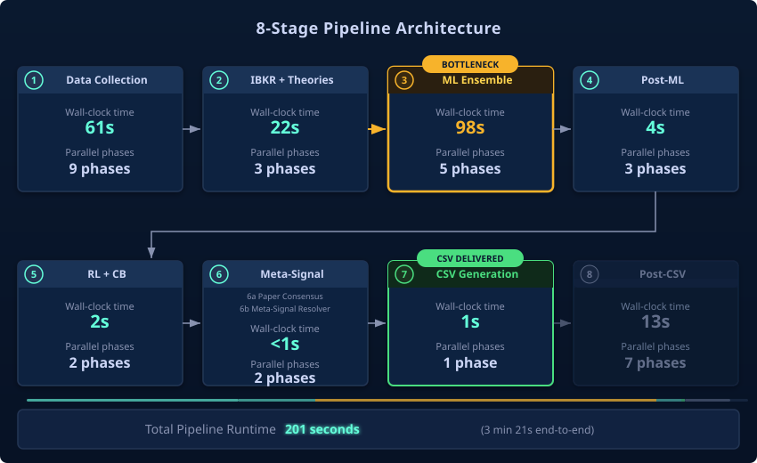
</p>

### 1.1 Design Philosophy

MoneyProd is a **fully autonomous, production-grade algorithmic trading system** that executes on the foreign exchange market every hour. The system's architecture is built on five foundational principles:

1. **Non-Circular Data Flow** — Three separate databases enforce strict write authority. No component reads its own output as input. This prevents feedback loops that could amplify systematic errors.

2. **Staged Parallelism with Dependency Gating** — The pipeline is decomposed into 8 stages, each containing phases that execute in parallel via `ThreadPoolExecutor`. Inter-stage gates enforce data dependencies (e.g., ML ensemble cannot run before theory calculations complete).

3. **Ensemble Diversity through Competitive Mixture of Experts** — Rather than relying on a single classifier, the system employs 4 specialist models (each tuned for a specific strategy–direction combination) plus a Meta-Classifier. All four specialists score every input simultaneously, and the Meta-Classifier selects the winner through direct competition — not through a gating network.

4. **Defense in Depth** — Five independent safety layers operate without coordination: an IV-based black swan filter, a PnL circuit breaker, a crowding penalty, a broker cross-validation, and a data integrity guard. Any single layer can halt trading autonomously.

5. **Progressive Trust** — New components (RL agent, Bayesian optimizer) begin in observation mode with minimal influence. Their weight in decision-making increases only as sufficient outcome data accumulates — a principled approach to cold-start in non-stationary environments.

### 1.2 Pipeline Execution Model

The pipeline executes as a Python process (`unified_pipeline.py`) triggered every H4 bar close. Its 8 stages form a directed acyclic graph with parallel phases within each stage:

```
STAGE 1: Data Collection          ████████████████████████░░░░░░░░░  61s   (9 parallel phases)
STAGE 2: IBKR + Theories          ████████████░░░░░░░░░░░░░░░░░░░░░  22s   (3 parallel phases)
STAGE 3: ML Ensemble + Concurrent ████████████████████████████████░░  98s   (5 parallel phases)
STAGE 4: Post-ML Fan-out          █░░░░░░░░░░░░░░░░░░░░░░░░░░░░░░░   4s   (3 parallel phases)
STAGE 5: RL + Circuit Breaker     █░░░░░░░░░░░░░░░░░░░░░░░░░░░░░░░   2s   (2 parallel phases)
STAGE 6: Meta-Signal Resolution   ░░░░░░░░░░░░░░░░░░░░░░░░░░░░░░░░  <1s   (1 phase)
STAGE 7: Position Sizing + CSV    █░░░░░░░░░░░░░░░░░░░░░░░░░░░░░░░   1s   (1 phase) ◄ CSV DELIVERED
STAGE 8: Post-CSV Deferred        ████░░░░░░░░░░░░░░░░░░░░░░░░░░░░  13s   (7 sequential phases)
                                                                    ─────
                                                              TOTAL: 201s
```

**Critical path analysis**: Stage 3 (ML Ensemble) is the bottleneck at 98 seconds. The 5-Model MoE trains and infers on all 8 currency pairs using walk-forward validation with a 2-bar gap to prevent lookahead bias.

### 1.3 Stage Dependency Graph

Each stage depends on the output of previous stages. Time budgets enforce hard limits:

| Stage | Depends On | Produces | Wall-Clock | Max Budget |
|---|---|---|---|---|
| **1: Data Collection** | External sources | Sentiment, calendar, IV, ATR, GV health | 61s | 120s |
| **2: IBKR + Theories** | Stage 1 (ATR, sentiment) | IBKR positions, 30 theories/pair, cross-validation | 22s | 90s |
| **3: ML Ensemble** | Stage 2 (theories, positions) | Regime classifications, confidence scores | 98s | 180s |
| **4: Post-ML** | Stage 3 (ML classifications) | Bayesian weights, 4-day forecasts, outcomes | 4s | 30s |
| **5: RL + CB** | Stage 4 (outcomes) | RL recommendations, sizing scale | 2s | 10s |
| **6: Meta-Signal** | Stages 3-5 (ML, forecast, RL) | Final direction, strategy, confidence | <1s | 10s |
| **7: Position Sizing** | Stage 6 (meta-signals) + IV data | CSV file with 32 strategy allocations | 1s | 60s |
| **8: Post-CSV** | All above | RL training, crowding, diagnostics, report | 13s | 300s |

**Timeout guard**: A daemon thread fires after 25 minutes, terminating the process and sending a Discord alert. Normal execution completes in ~3 minutes.

### 1.4 Memory Guardian: Pre-Flight Resource Manager

Before any pipeline stage executes, the **Memory Guardian** (`scripts/memory_guardian.py`) verifies that minimum RAM is available. On a 16 GB server running dual IB Gateways, 32 live strategies, a persistent liveboard, and development tools, memory contention is a production risk.

**Mechanism**: The guardian reads available physical memory via Windows `kernel32.GlobalMemoryStatusEx` (zero-dependency, no pip packages). If free RAM falls below the configured threshold (default: 3 GB), it terminates non-essential processes using a tiered priority system:

| Tier | Priority | Targets | Min Keep |
|---|---|---|---|
| 1 | Kill first | Browsers (Edge, Chrome, Firefox), media players | 0 |
| 2 | Kill second | Email clients (Thunderbird, Outlook), messaging (Slack, Teams) | 0 |
| 3 | Last resort | Dev tools (Claude Code, VS Code) | 1 |

**Protected processes** (never killed): Python, IB Gateway, Java, AT Center, Windows Defender, all OS services, remote access (SSH, RDP).

Within each tier, processes are sorted by RSS (resident memory) descending — the heaviest are terminated first. After reclaiming memory, the guardian elevates the pipeline to `HIGH_PRIORITY_CLASS` for CPU scheduling priority.

```python
# Integration in unified_pipeline.py (runs before pipeline_start timestamp)
from scripts.memory_guardian import ensure_memory
mem = ensure_memory(min_free_gb=3.0, log_fn=log)
# Returns: {"free_before_gb", "free_after_gb", "killed": [(pid, rss_mb, name)], "priority_elevated"}
```

**Discord notification**: When processes are terminated, a summary is sent (`Freed RAM: 0.70→3.21 GB, Freed 8 excessive process(es)`). If RAM remains below 2 GB after cleanup, a critical `@here` alert is dispatched.

### 1.5 Non-Critical Failure Handling

The system explicitly tolerates failures in non-critical components:

```python
NON_CRITICAL = (
    "FXSSI", "CALENDAR", "ECONOMIC", "DISCORD", "GV_HEALTH",
    "GV TELEMETRY", "GV CROSS-VALIDATION", "EXHAUSTIVE REPORT",
    "DATA INTEGRITY", "PREDICTION MARKETS", "NEWS SENTIMENT"
)
```

If a non-critical phase fails, the pipeline continues and sends a Discord alert. If a **critical** phase fails (ML Ensemble, IBKR Positions, Position Sizing), the pipeline halts immediately.

---

## Chapter 2 — Data Collection: The Oracle Network

<p align="center">
  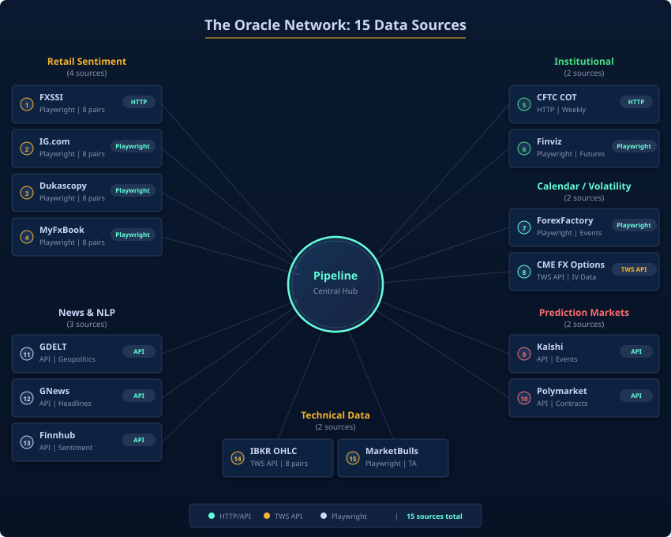
</p>

### 2.1 The 15-Source Architecture

The system aggregates data from **15 distinct sources** across 9 parallel threads. Each source provides a unique perspective on market conditions:

**Retail Sentiment (4 sources)**

| Source | Method | Coverage | Output |
|---|---|---|---|
| FXSSI | Playwright browser automation | 16 pairs | Long%/Short% ratio |
| IG.com | HTTP scraping | 8 pairs | Client sentiment |
| Dukascopy | HTTP scraping | 8 pairs | Currency strength scores |
| MyFxBook | HTTP scraping | 8 pairs | Retail trader positioning |

**Institutional Data (2 sources)**

| Source | Method | Coverage | Output |
|---|---|---|---|
| CFTC COT (InsiderWeek) | Jina API | 8 currencies | Net positioning, commercials, open interest |
| Finviz | HTTP scraping | 8 currencies | Relative currency performance vs basket |

**Calendar & Events (1 source)**

| Source | Method | Coverage | Output |
|---|---|---|---|
| ForexFactory | HTTP / JSON feed | All currencies | Event impact, proximity, country |

**Volatility Data (1 source)**

| Source | Method | Coverage | Output |
|---|---|---|---|
| CME FX Options | IBKR TWS API (CurrencyShares ETF IV) | 6 direct + 2 cross | IV percentile, term structure, VRP |

**Prediction Markets (2 sources)**

| Source | Method | Coverage | Output |
|---|---|---|---|
| Kalshi | API | Interest rate probabilities | Hawkish score, momentum |
| Polymarket | API | FX-adjacent markets | Divergence, consensus |

**News Sentiment (3 sources)**

| Source | Method | Coverage | Output |
|---|---|---|---|
| GDELT Project | API (broad query) | Global headlines | VADER sentiment [-100, +100] |
| Google News RSS | Feed parsing | Per-pair keywords | Pair-specific sentiment |
| Finnhub | API (8 calls) | Market + ETF news | Financial sentiment score |

### 2.2 Parallel Execution Model

All 9 data collection phases launch simultaneously via `ThreadPoolExecutor`. The wall-clock time is determined by the slowest scraper (typically the ForexScraper runner at ~61 seconds), not the sum of all scrapers.

**Thread safety** is guaranteed by SQLite's WAL (Write-Ahead Logging) mode, which allows concurrent reads from multiple threads while serializing writes. Each scraper writes to its own set of tables, preventing write conflicts.

**Error handling** follows a graceful degradation pattern:
- HTTP timeouts: Finnhub 8s, GDELT 12s, GNews 8s
- Stale data fallback: If a scraper fails, the previous cycle's data remains valid (freshness tracked in `scraper_status`)
- Deduplication: MD5 hash of `(pair, source, sentiment_value, hour)` prevents duplicate records

### 2.3 Implied Volatility Pipeline

The IV pipeline bridges equity options markets with spot FX:

1. **CurrencyShares ETFs** (FXE, FXB, FXY, FXF, FXA, FXC) serve as IV proxies for their respective currencies
2. **IBKR TWS API** provides historical IV bars for these ETFs (122+ bars per ETF)
3. **Cross-pair IV** is synthesized mathematically:
   - `IV(EURJPY) = sqrt(σ²_EUR + σ²_JPY + 2ρ·σ_EUR·σ_JPY)`
   - `IV(AUDJPY) = sqrt(σ²_AUD + σ²_JPY + 2ρ·σ_AUD·σ_JPY)`
4. **Derived features** include IV percentile rank (30-day rolling), Volatility Risk Premium (IV − RV via Garman-Klass), term structure ratio (30d/10d), and vol-of-vol

---

## Chapter 3 — Feature Engineering: From Raw Data to 134 Dimensions

<p align="center">
  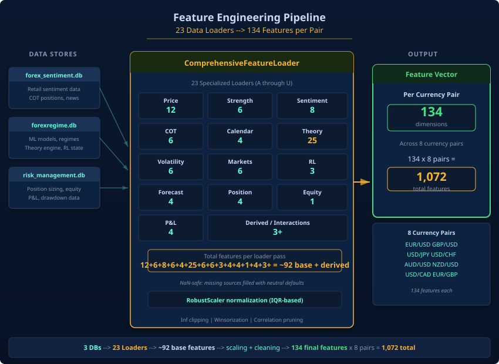
</p>

### 3.1 The ComprehensiveFeatureLoader

All raw data is transformed into a unified feature vector by the `ComprehensiveFeatureLoader` class, which calls **23 specialized data loaders** (labeled A through U). Each loader extracts features from a specific database table or computed source. The feature vector for each currency pair contains **70–134 features** depending on data availability.

### 3.2 Feature Taxonomy

**A. Price Microstructure (12 features)**

These features describe the statistical properties of recent price action and serve as the primary **regime discriminators**:

| Feature | Description | Regime Signal |
|---|---|---|
| `hurst` | Hurst exponent via R/S analysis (90 H4 bars) | H > 0.5 = trending, H < 0.5 = mean-reverting |
| `half_life` | Mean-reversion half-life (Ornstein-Uhlenbeck log regression) | Short = fast reversion, Long = persistent trend |
| `var_ratio` | Lo-MacKinlay variance ratio test | VR > 1.05 = trending, VR < 0.95 = mean-reverting |
| `acf_1`, `acf_5`, `acf_avg` | Autocorrelation at lag 1, 5, and average | Positive = trending, Negative = reverting |
| `adx` | Average Directional Index (14-bar Wilder) | High = strong trend regardless of direction |
| `mom_5d`, `mom_10d`, `mom_20d` | Log returns at 5, 10, 20-day horizons | Direction + magnitude of price movement |
| `vol_10d`, `vov` | 10-day volatility and volatility-of-volatility | Vol stability; high vov = regime instability |

**Why these matter**: The Hurst exponent and variance ratio are the core regime indicators. A Hurst value above 0.5 with VR > 1.05 strongly suggests a trending environment. Conversely, H < 0.4 with VR < 0.95 indicates mean-reversion conditions. The Meta-Classifier uses these to compute a symmetric structural bonus (see Chapter 4, §4.5).

**B. Currency Strength (6 features)**

| Feature | Description |
|---|---|
| `ccy_base`, `ccy_quote` | Individual currency strength scores (Dukascopy) |
| `ccy_diff` | Base − Quote differential (primary anchor signal) |
| `finviz_base`, `finviz_quote` | Relative performance vs currency basket (Finviz) |
| `finviz_diff` | Finviz differential |

**C. Sentiment (8 features)**

| Feature | Description |
|---|---|
| `sent_mean` | Average sentiment across all retail sources |
| `sent_std` | Sentiment dispersion (disagreement between brokers) |
| `sent_extreme` | Binary flag: > 85th percentile bullish or bearish |
| `sent_consensus` | Agreement level across sources |
| `sent_momentum` | Sentiment change over 24 hours |
| `sent_range` | Max − Min sentiment (volatility of opinion) |
| `sent_contrarian` | Inverted mean (contrarian signal: −sent_mean) |
| `sent_cot_align` | Retail × Institutional alignment (sent_mean × cot_net) |

**D. COT Positioning (6 features)**

| Feature | Description |
|---|---|
| `cot_net` | Net commercial positioning |
| `cot_chg` | Week-over-week change |
| `cot_orient` | Orientation (net long/short/neutral) |
| `cot_accel` | Rate of change in positioning (acceleration) |
| `cot_extreme` | Extreme positioning flag (> 2σ from mean) |
| `cot_oi_chg` | Open interest change (new money entering) |

**E. Calendar & Events (4 features)**

| Feature | Description |
|---|---|
| `cal_impact` | Weighted impact of upcoming events |
| `cal_proximity` | Inverse time to nearest high-impact event |
| `cal_density` | Number of events in next 48 hours |
| `cal_asymmetry` | Ratio of bullish to bearish event surprises |

**F–U: Additional Feature Groups (52+ features)**

The remaining groups include: Seasonal tendencies (MarketBulls decomposition), Theory scores (25 pre-computed from `calculate_theories.py`), Volatility features (IV percentile, VRP z-score, term structure ratio, vol ratio), Prediction market signals (hawkish, momentum, divergence, Kalshi-Polymarket divergence), RL performance feedback (average reward, trend), Forecast signals (direction, confidence, regime), Position data (active/inactive, direction, size, P&L), Account equity, Realized P&L history, PnL snapshots, and Derived composites (trend/reversion evidence scores, regime balance).

### 3.3 The Theory Engine: 30 Hypotheses per Pair

The Theory Engine (`calculate_theories.py`) computes 30 independent financial hypotheses for each of the 8 currency pairs. These theories encode quantitative finance principles organized into categories:

**Momentum Theories (#1-10)**: COT momentum (net position change week-over-week), relative strength (pair vs currency basket), sentiment momentum (source change in signal), multi-factor trend (COT + strength + retail convergence), base/quote currency momentum (individual components), momentum differential (TF vs MR divergence).

**Sentiment Confirmations (#11-15)**: Strength-sentiment confirmation (do they agree?), sentiment-COT agreement (retail vs institutional alignment), COT acceleration (rate of position change), seasonal bias (MarketBulls seasonal decomposition), retail bias (IG.com + Dukascopy consensus).

**Extremes & Calendar (#16-22)**: Extreme sentiment (retail panic: >85th %ile), sentiment range, sentiment volatility, retail-institutional divergence, weighted sentiment (source-weighted aggregate), upcoming events (ForexFactory: impact × proximity), calendar density, event asymmetry, COT positioning.

**Prediction Markets (#23-25)**: Hawkish lean (Kalshi interest rate prob vs forward guidance), momentum (prediction market trend: is prob_up trending?), divergence (PM signal vs retail sentiment).

Each theory outputs a normalized score in **[-1, +1]** and is stored in the `theory_scores` table. These are used as **features** for the ML ensemble, never as labels — the ensemble learns which theories are predictive in which market conditions.

### 3.4 Normalization and Temporal Alignment

- **Sentiment/theory features**: Normalized to `[-1, +1]` using 7-day P95 auto-calibration
- **Price features**: Standardized per 90-bar lookback window
- **Temporal alignment**: All features aligned to H4 bar close timestamp
- **Forward-fill**: Features with different sampling frequencies (e.g., weekly COT) are forward-filled to ensure no lookahead bias
- **Anti-lookahead validation**: `_validate_no_lookahead()` explicitly verifies `min(test_idx) > max(train_idx) + gap_bars`

---

## Chapter 4 — The ML Ensemble: 5-Model Mixture of Experts

<p align="center">
  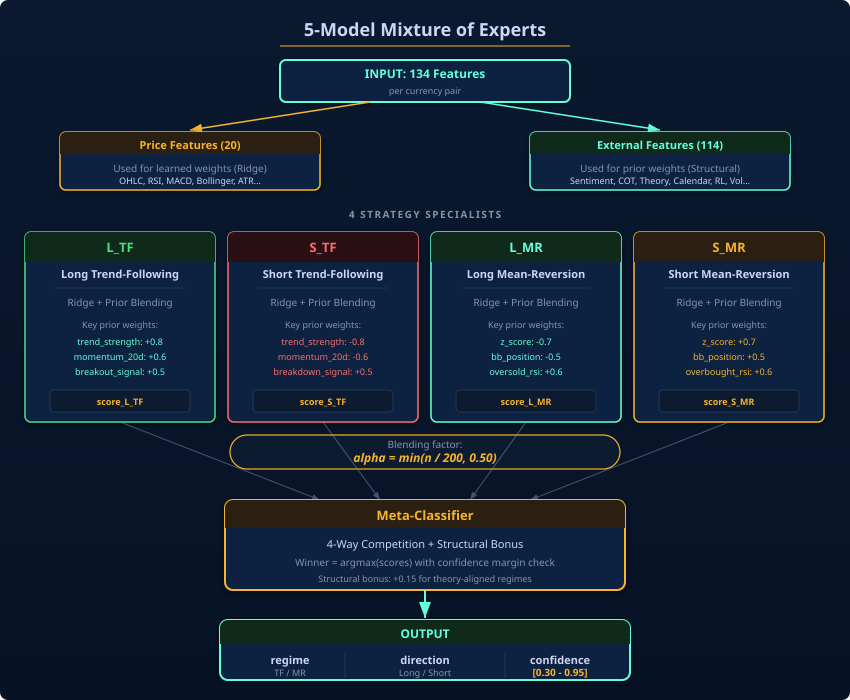
</p>

### 4.1 Architecture Overview

The ML ensemble uses a **competitive Mixture of Experts** (MoE) design with **4 Strategy Specialists** and **1 Meta-Classifier**. Unlike gating-network MoEs (where a learned router assigns inputs to experts), this is a **direct competition** model: all four specialists score every input, and the Meta-Classifier selects the winner based on composite scores.

**Key design decision**: Linear Ridge Regression was chosen over neural networks or gradient boosted trees for three reasons:

1. **Interpretability** — Every weight has a clear economic meaning (e.g., "how much does COT momentum contribute to the trend-following long decision?")
2. **Robustness** — Ridge regression with strong priors prevents catastrophic overfitting on limited samples (forex training windows are typically 90 bars ≈ 15 days)
3. **Speed** — Closed-form solution trains in milliseconds: `w = (X'X + λI)⁻¹X'y`

### 4.2 The Four Strategy Specialists

Each specialist is a `StrategySpecialist` class implementing Ridge regression (L2 regularization) with **prior knowledge blending**:

| Specialist | Thesis | Key Positive Priors | Key Negative Priors |
|---|---|---|---|
| **L_TF** (Long Trend Following) | "Trend will continue upward" | hurst=1.5, ccy_diff=2.5, pm_direction=1.8, mom_5d=1.0 | sent_extreme=−0.5 |
| **S_TF** (Short Trend Following) | "Trend will continue downward" | hurst=1.5, ccy_diff=−2.5, pm_direction=−1.8 | sent_extreme=−0.5 |
| **L_MR** (Long Mean-Reversion) | "Oversold, expect bounce" | sent_extreme=1.5, half_life=1.2, vov=1.0 | hurst=−1.0 |
| **S_MR** (Short Mean-Reversion) | "Overbought, expect pullback" | sent_extreme=1.5, half_life=1.2, vov=1.0 | hurst=−1.0 |

All 4 specialists share the **same feature space** (63 prior weights); only the weight values differ according to their directional and regime thesis. The prior weights encode domain knowledge that never changes.

### 4.3 Prior + Learned Weight Blending

This is the most important design element of the ML system. Each specialist maintains two sets of weights:

1. **Prior weights** (63 features × 4 strategies = 252 fixed weights): Domain knowledge encoded by the system designer. These are **immutable**.
2. **Learned weights** (price features only, ~20 features in the `price_keys` set): Trained via Ridge regression on realized returns. These adapt every cycle.

The blending formula controls how much the model trusts learned weights versus prior knowledge:

```
α = min(n / 200, 0.50)

score = α × learned_score(price_features) + (1 − α) × prior_score(all_features)
```

| Training Samples (n) | Blend Factor (α) | Interpretation |
|---|---|---|
| 0 (cold start) | 0.00 | 100% prior knowledge |
| 30 (minimum) | 0.15 | 85% prior, 15% learned |
| 100 | 0.50 | 50% prior, 50% learned |
| 200+ | 0.50 (capped) | 50% prior, 50% learned — **never fully learned** |

**Why cap at 50%?** In low-sample regimes (which forex always is), pure data-driven models overfit catastrophically. The prior acts as a regularizer with **economic meaning**, preventing the learned weights from driving the model into unstable territory.

### 4.4 Training Pipeline

1. **Label generation**: For each pair, extract 500 H4 bars. The `LabelGenerator` classifies 6-bar forward returns using the agreement between prior 20-bar trend and forward movement:
   - If forward return **continues** the prior trend → `L_TF` or `S_TF`
   - If forward return **reverses** the prior trend → `L_MR` or `S_MR`

2. **Subsampling**: Select 160 distributed points to avoid temporal clustering (prevents memorizing a single trending period)

3. **Cross-pair pooling**: Labels from **ALL 8 pairs** are pooled into a single training set. This gives each specialist 100+ training samples instead of ~20 per pair.

4. **Soft labeling**: Specialists receive positive labels for matching thesis and negative (penalty) labels for opposite thesis:
   - An `L_TF` label gives `+magnitude × 100` to the L_TF specialist
   - The same label gives `−magnitude × 50` to the S_MR specialist

5. **Ridge training**: `w = solve(X'X + I, X'y)` — closed-form, no iterative optimization

6. **Walk-forward validation**: 80/20 split with a **2-bar gap** between training and test sets (the gap prevents information leakage from autocorrelated price series)

### 4.5 The Meta-Classifier: 4-Way Direct Competition

The Meta-Classifier performs a **pure 4-way competition** — no cascade, no fallback, no regime pre-selection bias:

**Step 1 — Collect specialist scores**: All 4 specialists score the current feature vector simultaneously.

**Step 2 — Compute structural regime environment** (symmetric, no directional bias):
```
tf_env = f(hurst, var_ratio, acf, adx, pm_consensus)
mr_env = f(hurst, half_life, vol_of_vol, cal_risk, pm_divergence)
```

**Step 3 — Add structural bonus** (capped at 30% of specialist spread):
```
specialist_range = max(scores) − min(scores)
tf_bonus = (tf_env / max(tf_env, mr_env)) × specialist_range × 0.30
mr_bonus = (mr_env / max(tf_env, mr_env)) × specialist_range × 0.30
```

**Step 4 — Winner-takes-all**: `winner = argmax(specialist_score + structural_bonus)`

**Step 5 — Confidence from margin** (margin between 1st and 2nd place):
```
confidence = 0.5 + 0.3 × (1st_place − 2nd_place) / (1st_place − 4th_place)
confidence = clip(confidence, 0.30, 0.95)
```

**Step 6 — Track record adjustment** (mild ±5%): If the winning strategy has recent wins, confidence += 5%. Recent losses, confidence −= 5%.

**Design rationale**: The structural bonus ensures that even if all specialists score similarly, the regime environment (trending vs mean-reverting) breaks the tie. But the bonus is capped at 30% of the specialist spread — it **cannot override** a strong specialist signal.

### 4.6 Hysteresis and Persistence

To prevent rapid regime switching (whipsaw), the classifier enforces three anti-churn mechanisms:

- **Minimum hold time**: 1 hour before any regime change is permitted
- **Hysteresis margin**: 4% base margin + 2% extra to exit current state (6% total to switch)
- **EMA smoothing**: α = 0.90 (90% current score, 10% history)

These mechanisms ensure that momentary feature noise does not cause regime oscillation. In production, average regime persistence is **0.94** (94% probability the current regime continues to the next bar).

---

## Chapter 5 — Bayesian Optimization: MCMC Weight Calibration

<p align="center">
  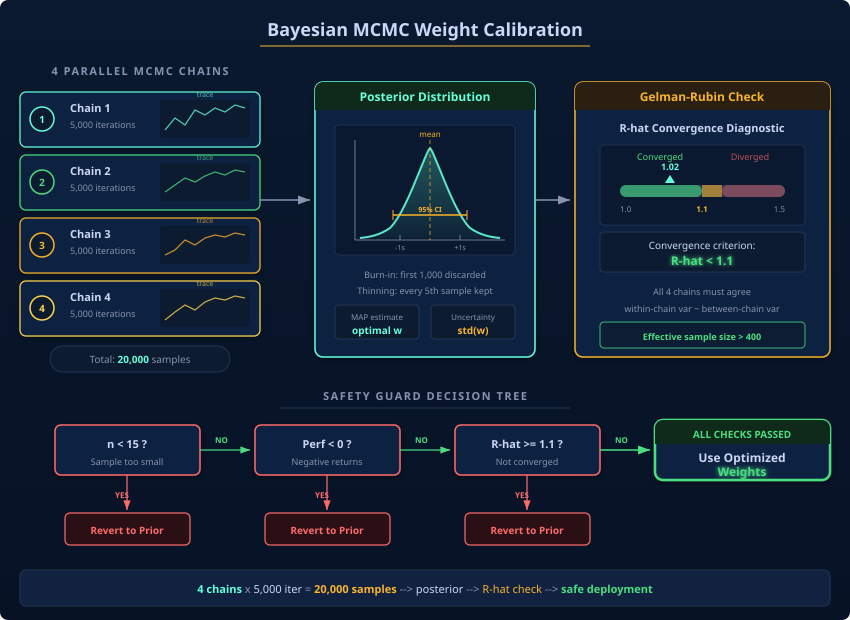
</p>

### 5.1 Purpose

The Bayesian Optimizer tunes **prior feature weights** for the TF and MR strategies simultaneously. While the Ridge specialists learn price feature weights from data, the Bayesian optimizer adjusts the **external feature weights** (sentiment, COT, prediction markets) based on realized trade outcomes.

### 5.2 MCMC Algorithm: Metropolis-Hastings

The optimizer uses **Markov Chain Monte Carlo** with Metropolis-Hastings sampling:

```
For chain_id in range(4):              # 4 parallel chains
  For iteration in range(5000):         # 5000 samples per chain
    proposed_w = current_w + N(0, σ=0.12)      # Gaussian proposal
    proposed_w = clip(proposed_w, 0.1, 4.0)     # Weight bounds

    # Metropolis-Hastings acceptance
    likelihood_ratio = L(proposed | outcomes) / L(current | outcomes)
    acceptance = min(1, likelihood_ratio × prior_ratio)

    if random() < acceptance:
      current_w = proposed_w                    # Accept proposal

    # Adaptive temperature (simulated annealing)
    if accept_ratio > 0.234:                    # Target acceptance rate
      temperature *= 1.02
    else:
      temperature *= 0.98
```

The target acceptance rate of **0.234** is the theoretically optimal rate for high-dimensional Metropolis-Hastings (Roberts et al., 1997). The adaptive temperature ensures the chains explore the posterior efficiently.

### 5.3 Gelman-Rubin Convergence Diagnostic

**Why 4 chains?** Multiple chains enable the **Gelman-Rubin R-hat statistic**:

```
R-hat = sqrt(var_pooled / W)

Where:
  B = Between-chain variance (chain disagreement)
  W = Within-chain variance (individual chain exploration)
  var_pooled = ((n−1)/n) × W + (1/n) × B
```

| R-hat Value | Interpretation | Action |
|---|---|---|
| < 1.05 | Excellent convergence | Use optimized weights |
| < 1.10 | Good convergence | Use optimized weights |
| ≥ 1.10 | Chains disagree | **Revert to prior weights** |

If R-hat ≥ 1.10, the chains have not converged to the same posterior distribution. Rather than risk a poorly converged solution, the system reverts to prior weights.

### 5.4 Safety Guard

```python
def _bayesian_guard(n_samples, performance, weights_path):
    if n_samples < 15:         # Not enough data
        revert_to_prior()
        return False
    if performance < 0:         # Optimization made things worse
        revert_to_prior()
        return False
    return True
```

**Rationale**: In forex with limited data, a Bayesian optimizer can easily overfit to noise. The guard ensures optimization only proceeds with sufficient evidence and positive expected value. The 15-sample threshold accounts for both hard outcomes (weight 1.0) and soft outcomes (fractional weight).

---

## Chapter 6 — The Reinforcement Learning Agent

<p align="center">
  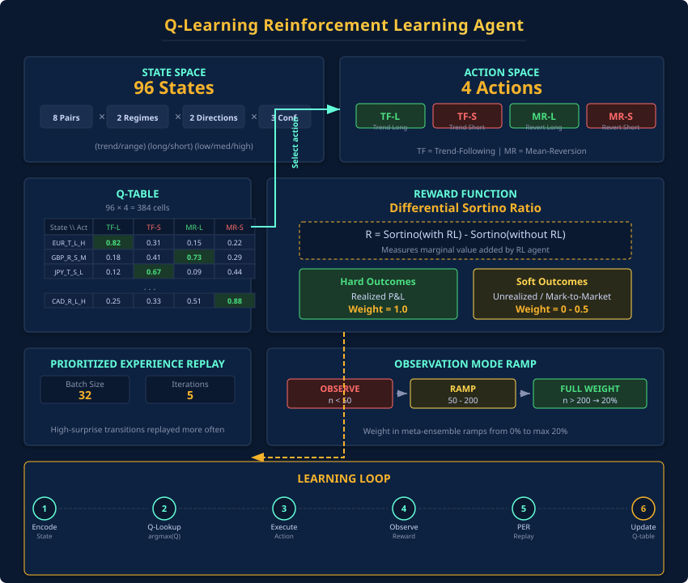
</p>

### 6.1 Agent Design

The RL agent uses **tabular Q-Learning** — a model-free, off-policy temporal difference method. The choice of tabular Q-Learning over Deep RL (DQN, PPO) is deliberate:

- **Stability**: Tabular methods have guaranteed convergence under mild conditions. Deep RL can diverge catastrophically in non-stationary environments.
- **Interpretability**: Each Q-value is a scalar that can be inspected directly.
- **Sample efficiency**: With only 96 possible states, tabular methods need far fewer samples than function approximators.

### 6.2 State Space (96 States)

```
State = (pair, regime, direction_signal, confidence_bucket)

  pair:               8 forex pairs (EURUSD, USDJPY, GBPUSD, USDCHF, AUDUSD, USDCAD, EURJPY, AUDJPY)
  regime:             'trend_following' or 'mean_reversion'
  direction_signal:   'P' (positive tf_score) or 'N' (negative)
  confidence_bucket:  'lo' (<55%), 'md' (55-70%), 'hi' (>70%)

  Total: 8 × 2 × 2 × 3 = 96 states
```

**Why discretize?** Continuous state spaces require function approximation, which is prone to instability in non-stationary environments. 96 states provides enough granularity for meaningful patterns while remaining tractable with small sample sizes.

### 6.3 Action Space (4 Actions)

```
Actions = [
  ('trend_following', 'L'),    # Follow trend LONG
  ('trend_following', 'S'),    # Follow trend SHORT
  ('mean_reversion', 'L'),     # Reversal LONG
  ('mean_reversion', 'S')      # Reversal SHORT
]
```

### 6.4 Reward Function: Differential Sortino

The reward is based on the **Differential Sortino Ratio** (Moody & Saffell, NeurIPS 1998):

```
dSortino_t = (D_{t-1} × δA_t − 0.5 × A_{t-1} × δD_t) / D_{t-1}^{3/2}

Where:
  A_t = EMA of returns
  D_t = EMA of min(return, 0)²     (downside semi-variance only)
  δA_t = η × (R_t − A_{t-1})       (return update)
  δD_t = η × (min(R_t, 0)² − D_{t-1})  (downside update)
  η = 0.1 (EMA decay rate)
```

**Why Differential Sortino over Sharpe?** The Sharpe ratio penalizes all volatility equally. In forex, a profitable trend-following trade can exhibit high upside variance — Sharpe would penalize this "good" volatility. The Sortino ratio only penalizes losses, making it the correct reward signal for directional trading.

### 6.5 Q-Learning Update

```
Q(s, a) ← Q(s, a) + α × [r + γ × max_{a'} Q(s', a') − Q(s, a)]

  α = 0.10    (learning rate — conservative for non-stationary FX)
  γ = 0.95    (discount factor — high future-orientation; FX regimes persist)
  ε = 0.15    (base exploration rate, adaptive: max(0.15, 0.50 − n_explored × 0.10))
```

### 6.6 Soft Outcomes: Accelerated Learning

Closed trades (hard outcomes) are rare — sometimes only a few per day. To accelerate learning, the agent also consumes **soft outcomes** from open positions:

| Outcome Type | Weight | Trigger | Purpose |
|---|---|---|---|
| **Hard** | 1.0 | Trade closed (realized P&L) | Ground truth signal |
| **Soft** | 0.0 – 0.5 | Position held > 4 hours | Faster feedback loop |

**Soft outcome weight formula:**
```
w = time_factor × stability × 0.50 × volatility_penalty

  time_factor = min(hours_held / 48, 1.0)
  stability = 1 − exp(−hours_held / 12)
  volatility_penalty = max(0.5, 1 − coefficient_of_variation × 0.3)
```

A position held for 48+ hours with stable P&L receives the maximum soft weight of **0.50** (half of a hard outcome). A position held for only 4 hours with volatile P&L receives near-zero weight.

### 6.7 Prioritized Experience Replay (PER)

Following Schaul et al. (ICLR 2016), the agent stores all experiences and resamples them with priority-weighted sampling:

- **Priority**: `|TD_error| + 0.01` (experiences with large prediction errors are replayed more frequently)
- **Batch size**: 32 per training iteration
- **Iterations**: 5 per training cycle
- **Persistence**: Q-table serialized to `rl_q_table.pkl` (survives restarts)

### 6.8 Observation Mode (Progressive Trust)

| Effective Outcomes | RL Behavior | Weight in Meta-Resolver |
|---|---|---|
| < 50 | **Observation only** (no recommendations) | 0% |
| 50 – 200 | Recommendations issued, capped | 0% → 20% (linear ramp) |
| > 200 | Full recommendations | 20% (maximum) |

The RL weight scales as: `rl_scale = min((n_effective − 50) / 150, 1.0)` — ensuring a smooth ramp from observation to full participation.

---

## Chapter 7 — Meta-Signal Resolution: Arbitrating Three Intelligences

<p align="center">
  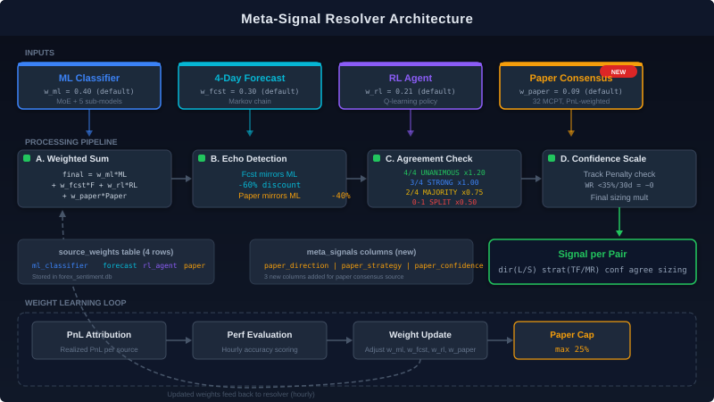
</p>

### 7.1 The Three-Source Ensemble

The Meta-Signal Resolver combines three independent intelligence sources into a single actionable signal:

| Source | Default Weight | Strength | Weakness |
|---|---|---|---|
| **ML Classifier** | 55% | Rich 134-feature analysis, regime detection | Slow adaptation to regime shifts |
| **4-Day Forecast** | 25% | Forward-looking, transition probabilities | Extrapolates from historical persistence |
| **RL Agent** | 20% | Adapts to recent P&L outcomes | Requires 50+ outcomes to activate |

### 7.2 Weighted Consensus Algorithm

```python
for source_name, signal in [ml, forecast, rl]:
    weight = W[source_name] × signal['confidence']
    direction_votes[signal['direction']] += weight
    strategy_votes[signal['strategy'] + '_' + signal['direction']] += weight

best_direction = argmax(direction_votes)
best_strategy = argmax(strategy_votes)
```

### 7.3 Conflict Arbitration

| Agreement Level | Condition | Confidence Adjustment |
|---|---|---|
| **Unanimous** | All 3 agree (direction + strategy) | +10% bonus |
| **Majority** | 2 of 3 agree | No adjustment |
| **Split** | All 3 disagree | −30% penalty |

### 7.4 Echo Detection

A subtle mechanism: if the 4-Day Forecast mirrors the ML signal exactly (same regime and direction), the resolver detects this as an **echo** — the forecast is likely derived from the same ML classification, not an independent signal. The forecast vote is downweighted to prevent double-counting ML influence.

### 7.5 Live P&L Adjustment (LEVIER 5)

Open positions receive a confidence adjustment based on current performance:

- **Profitable position** (P&L > 0): `confidence × min(1.10, 1.0 + pnl_pct × 0.02)` — up to +10% boost
- **Unprofitable position** (P&L < 0): `confidence × max(0.85, 1.0 + pnl_pct × 0.03)` — up to −15% penalty

This makes the system less likely to add to losing positions while reinforcing winning ones.

### 7.6 Output

The resolver produces a `meta_signals` record per pair:

| Field | Example (EURUSD) | Description |
|---|---|---|
| `final_direction` | S | Short |
| `final_strategy` | mean_reversion | Regime type |
| `final_confidence` | 0.79 | Blended confidence [0.30, 0.95] |
| `ml_direction` | S | ML classifier vote |
| `forecast_direction` | S | 4-day forecast vote |
| `rl_direction` | S | RL agent vote (if active) |
| `agreement_level` | unanimous | All sources agree |

---

## Chapter 8 — Position Sizing: The Kelly Criterion and Beyond

<p align="center">
  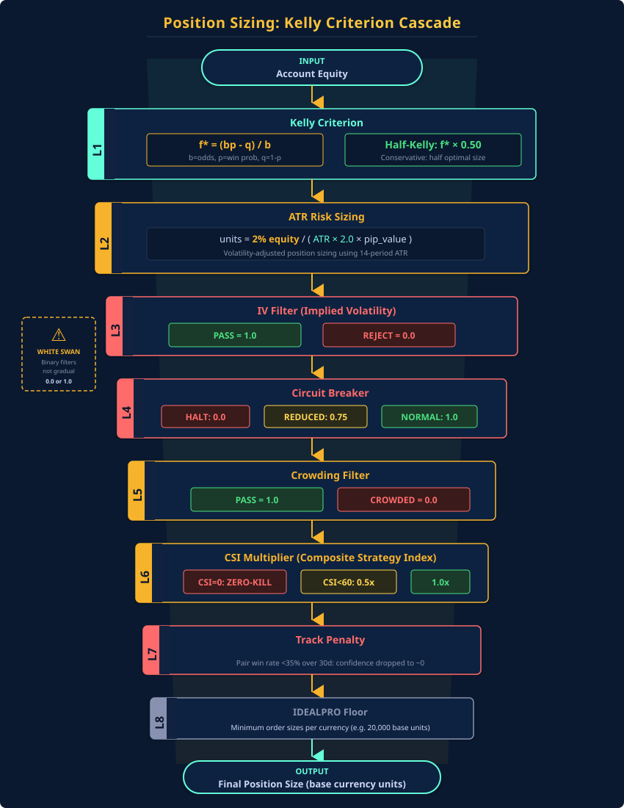
</p>

### 8.1 The Kelly Criterion

The system uses the **Kelly Criterion** for optimal bet sizing — the formula that maximizes the logarithmic growth rate of capital:

```
f* = (b × p − q) / b

Where:
  b = average_win / average_loss (from realized trades)
  p = win_rate
  q = 1 − p (loss rate)
```

**Half-Kelly**: The raw Kelly fraction is multiplied by **0.50** to reduce variance. Full Kelly produces optimal long-run growth but with extreme short-term drawdowns. Half-Kelly sacrifices ~25% of expected growth for ~50% less variance — a trade-off well-suited to production trading with real capital.

### 8.2 Position Size Calculation

```
RiskDollars = Equity × 2.0% × KellyFraction × CircuitBreakerScale

StopDistancePips = ATR(14) × 2.0 × SpreadAdjustment
    SpreadAdjustment: EURUSD=0.8, USDJPY=0.9, GBPUSD=1.2, USDCHF=1.5, ...

PositionSize = RiskDollars / (StopDistancePips × PipValue × FXRate)
```

**Bounds**:
- **Minimum**: IDEALPRO minimum order size (20K–35K native currency units)
- **Maximum**: 8% of equity per trade (`MAX_KELLY = 0.08`)
- **Portfolio leverage cap**: 5× maximum total exposure
- **Safety buffer**: 95% of available margin (`SAFETY_BUFFER = 0.95`)

### 8.3 The Sizing Cascade

Every position passes through a cascade of **multiplicative filters**, most of which are binary:

```
final_size = base_kelly_size
           × IV_filter          (0.0 or 1.0 — binary accept/reject)
           × circuit_breaker    (0.0, 0.75, or 1.0)
           × crowding_filter    (0.0 or 1.0 — binary accept/reject)
           × strategy_weight    (0.5 – 1.0 from IV-adjusted weighting)
```

**The White Swan Principle applied to sizing**: Most filters are binary (full size or zero), not gradual. Trade at full conviction when conditions are favorable, or don't trade at all.

### 8.4 IDEALPRO Compliance

Interactive Brokers' IDEALPRO exchange enforces minimum order sizes in the base currency:

| Currency | Min Native Units | Approx USD Equivalent |
|---|---|---|
| EUR, GBP | 20,000 | ~$22,000 |
| USD, CHF, AUD, CAD | 25,000 | $25,000 |
| NZD | 35,000 | ~$21,000 |
| JPY | 2,500,000 | ~$17,000 |

Orders below these minimums are **rejected entirely** (not rounded up) — the White Swan philosophy applied to order flow.

---

## Chapter 9 — Risk Management: Circuit Breakers and White Swan Philosophy

<p align="center">
  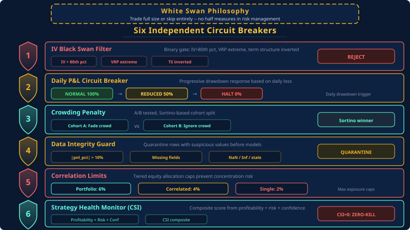
</p>

### 9.1 The White Swan Philosophy — *"Le Cygne Blanc s'envole"*

The system's risk management is built on a principle inspired by Nassim Taleb, refined with a directional insight: **don't trade black swans at reduced size — and when a surprise has a clear directional bias, the white swan flies opposite**.

Traditional risk systems reduce position size gradually as conditions deteriorate. This creates a dangerous middle ground:
- Positions too small to be meaningful if right
- Positions still large enough to cause pain if wrong

The White Swan approach eliminates this ambiguity with **directional accept/reject filters**:

1. **SURPRISE regime detected** (low IV + high RV = market underpricing risk)
2. **Semi-variance decomposition** separates H4 log returns into downside (`rv_down`) and upside (`rv_up`) components
3. **Directional bias**: `rv_down / rv_up > 1.30` = BEARISH, `< 0.77` = BULLISH, else NEUTRAL
4. **Black Swan** = trading into the surprise direction → **REJECT**
5. **White Swan** = trading opposite the surprise direction → **AUTHORIZE at full size**
6. **NEUTRAL** (no clear directional asymmetry) → **meta-signal direction = dangerous**, opposite authorized
7. **Invariant**: exactly **1 authorized strategy per pair, 8 total** — the White Swan always flies

### 9.2 Five Independent Circuit Breakers

**Layer 1 — IV-Based Black Swan Filter (with Directional Surprise Override)**

| Condition | Threshold | Action |
|---|---|---|
| IV percentile | > 80th %ile | **REJECT** (options market pricing extreme risk) |
| Vol ratio (RV/IV) | < 0.50 | **REJECT** (market pricing unseen risk) |
| VRP z-score | < −2.0 | **REJECT** (extreme variance risk premium) |
| VRP z-score | > +3.0 | **REJECT** (IV bubble) |
| Term structure | > 1.40 | **REJECT** (inverted term structure) |
| SURPRISE + BEARISH | rv_down/rv_up > 1.30 | **REJECT Long** / **AUTHORIZE Short** (White Swan override) |
| SURPRISE + BULLISH | rv_down/rv_up < 0.77 | **REJECT Short** / **AUTHORIZE Long** (White Swan override) |
| SURPRISE + NEUTRAL | 0.77 ≤ ratio ≤ 1.30 | **Meta-signal dir = dangerous** → authorize opposite (White Swan) |

**Layer 2 — Daily P&L Circuit Breaker**

| Condition | Threshold | Action |
|---|---|---|
| Daily loss | > −3.5% | REDUCED mode (sizing × 0.75) |
| Weekly loss | > −6.0% | HALT mode (sizing × 0.00) |
| Consecutive losses | ≥ 7 | REDUCED mode |

State machine: `NORMAL (1.0×)` → `REDUCED (0.75×)` → `HALT (0.0×)`

**Layer 3 — Crowding Penalty Filter**

| Condition | Threshold | Action |
|---|---|---|
| Strategy concentration | > 70% | **REJECT** (too many signals in same regime) |
| A/B testing | Enabled | Track outcomes for self-calibration |

**Layer 4 — Data Integrity Guard**

| Condition | Threshold | Action |
|---|---|---|
| |pnl_pct| | > 10% | Quarantine (impossible in spot FX) |
| position_size | < 100 units | Quarantine (data garbage) |
| entry_price | outside [0.5, 2.0] | Quarantine (IBKR cost basis error) |
| Duplicate trades | Same pair/direction/time | Quarantine (cross-join bug) |

**Layer 5 — Correlation Risk Limits**

| Condition | Threshold | Action |
|---|---|---|
| Total portfolio risk | > 6% | HALT new entries |
| Correlated pair risk | > 4% | HALT correlated entries |
| Single position risk | > 2% | Reject oversized orders |
| Margin utilization | > 80% | CRITICAL alert |

### 9.3 Shock Opportunity Detector

When IV collapses and ATR expands simultaneously, the system detects a **White Swan opportunity** — a high-probability mean-reversion setup:

- Detection: Sudden >2σ price move on H4 close + negative VRP
- Action: Trade at **full position size** (not reduced)
- Active shocks reduce Kelly defensively (e.g., 0.70× sizing for shocked pairs)

---

## Chapter 10 — Implied Volatility Regime Classification

<p align="center">
  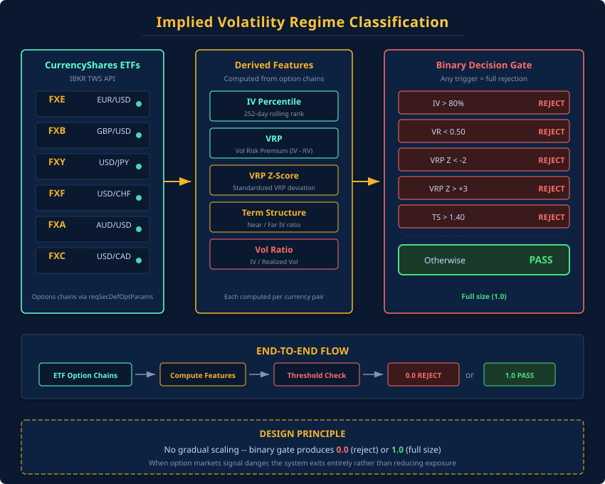
</p>

### 10.1 From Equity Options to FX Volatility

Since CME FX options are thinly traded, the system uses **CurrencyShares ETF options** as IV proxies:

| ETF | Currency | Method |
|---|---|---|
| FXE | EUR | IBKR historical IV bars |
| FXB | GBP | IBKR historical IV bars |
| FXY | JPY | IBKR historical IV bars |
| FXF | CHF | IBKR historical IV bars |
| FXA | AUD | IBKR historical IV bars |
| FXC | CAD | IBKR historical IV bars |
| EURJPY | Cross | `sqrt(σ²_EUR + σ²_JPY + 2ρ·σ_EUR·σ_JPY)` |
| AUDJPY | Cross | `sqrt(σ²_AUD + σ²_JPY + 2ρ·σ_AUD·σ_JPY)` |

### 10.2 Derived Volatility Features

| Feature | Formula | Interpretation |
|---|---|---|
| **IV Percentile** | Rank of current IV in 30-day window | > 80% = expensive = REJECT |
| **VRP** | IV − RV (Realized Vol via Garman-Klass) | < 0 = market pricing unseen risk |
| **VRP Z-Score** | (VRP − μ) / σ | < −2 or > +3 = extreme conditions |
| **Term Structure** | IV(30d) / IV(10d) | > 1.40 = inverted (contango risk) |
| **Vol Ratio** | RV / IV | < 0.50 = fear exceeds realized = REJECT |
| **Vol-of-Vol** | Std(10-day IV changes) | High = unstable volatility regime |

### 10.3 Strategy Weighting by IV Regime

The system maintains 8 strategy archetypes, each with IV-dependent preference:

| Archetype | Favorable IV Regime | Unfavorable IV Regime |
|---|---|---|
| S1_CARRY | Low IV, positive carry | High IV (carry disappears) |
| S2_MOMENTUM | Any (trend overrides vol) | Extreme VRP (trend breaks) |
| S3_MEAN_REV | High IV (overextension likely) | Low IV (no reversion trigger) |
| S4_BREAKOUT | Rising IV (expansion phase) | Declining IV (false breakouts) |
| S5_RANGE | Low IV, stable term structure | Rising IV (range breaks) |
| S6_SENTIMENT | Any (contrarian always valid) | N/A |
| S7_FUNDAMENTAL | Any (macro overrides vol) | N/A |
| S8_EVENT | Pre-event elevated IV | Post-event IV crush |

---

## Chapter 11 — Continuous Learning and Self-Improvement

<p align="center">
  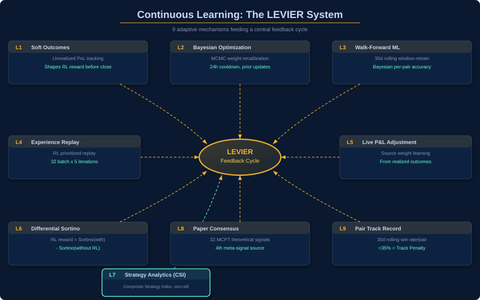
</p>

### 11.1 The LEVIER System (6 Feedback Mechanisms)

The system's continuous learning operates through 6 feedback mechanisms (*levier* = lever in French):

| LEVIER | Mechanism | Effect |
|---|---|---|
| **1: Soft Outcomes** | Unrealized P&L → weighted RL signals | Faster learning without waiting for closes |
| **2: Bayesian Optimization** | MCMC tunes prior weights every cycle | Adapts external feature importance |
| **3: Walk-Forward ML** | Specialists retrain on latest 90-bar data | Price features adapt to current regime |
| **4: Experience Replay** | Priority sampling of high-value experiences | Reuses rare, informative trades |
| **5: Live P&L Adjustment** | Position performance → confidence modulation | Reinforces winners, penalizes losers |
| **6: Differential Sortino** | Downside-risk-only RL reward | Aligns optimization with actual objective |

### 11.2 Retraining Triggers

The continuous learning system monitors performance and triggers retraining when degradation is detected:

| Metric | Threshold | Action |
|---|---|---|
| Sortino Ratio (7-day rolling) | < −0.3 | Flag retraining needed |
| Rolling 30-day Accuracy | < 55% | Marginal edge alert |
| Maximum Drawdown | > 12% | Position sizing review |
| Profit Factor | < 1.2 | Strategy weight reduction |

**Sortino is the decisional metric**: Sharpe is logged for industry comparability but does not independently trigger retraining. This distinction matters because trend-following strategies naturally exhibit high return variance (many small losses, few large wins), making Sharpe an unreliable health indicator.

### 11.3 Persistence Layer

All learning state persists across restarts:

| State | Storage | Purpose |
|---|---|---|
| ML specialist weights | RAM (per-cycle) | Retrained every pipeline execution |
| Q-table | `rl_q_table.pkl` | 96-state × 4-action value function |
| Bayesian weights | `optimizer_weights` table | MCMC-optimized prior weights |
| Learning metrics | `continuous_learning_state` table | Historical Sortino, Sharpe, drawdown |
| Model version | Auto-incremented counter | Currently v17.0 |

---

## Chapter 12 — Database Architecture: Three-Database Normalization

<p align="center">
  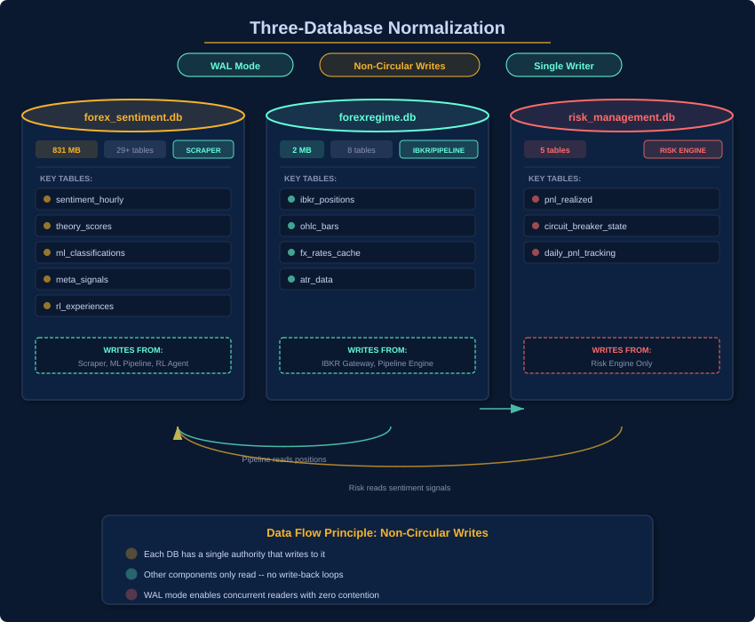
</p>

### 12.1 Design Principle: Non-Circular Writes

The system uses **three separate SQLite databases**, each with strict write authority. This design prevents feedback loops that could amplify systematic errors — no component reads its own output as input within the same cycle.

### 12.2 Database 1: forex_sentiment.db (Primary — 831 MB)

**Write Authority**: Scrapers, ML outputs, RL experiences, meta-signals

**Key Tables (29+):**

| Category | Tables | Total Records |
|---|---|---|
| Sentiment | `sentiment_hourly`, `dukascopy_pair_scores` | ~550K |
| Fundamental | `cot_data`, `calendar_events`, `finviz_relperf`, `seasonal_tendency` | ~15K |
| Theories | `theory_scores` (30 per pair per cycle) | ~100K |
| Prediction Markets | `prediction_market_data`, `prediction_market_derived` | ~20K |
| ML Outputs | `ml_classifications`, `strategy_assignments`, `meta_signals` | ~50K |
| RL Data | `rl_experiences`, `rl_recommendations` | ~7K |
| Outcomes | `strategy_outcomes`, `trade_outcomes`, `soft_outcomes` | ~12K |
| Bayesian | `optimizer_weights`, `optimizer_samples` | ~5K |
| Learning | `continuous_learning_state`, `learning_metrics_history` | ~1K |
| Crowding | `crowding_decisions`, `crowding_cohorts`, `crowding_parameters` | ~3K |
| Regime | `market_regime`, `transition_probs` | ~10K |
| Source Meta | `source_weights`, `scraper_status` | ~1K |

### 12.3 Database 2: forexregime.db (Live State — 2 MB)

**Write Authority**: IBKR API, pipeline live state

| Table | Purpose |
|---|---|
| `ibkr_positions` | Current broker positions (account, symbol, qty, cost, market price, P&L) |
| `ibkr_live_state` | JSON snapshots (3-second refresh from liveboard) |
| `fx_rates_cache` | USD conversion rates for all currencies |
| `atr_data` | ATR-14 values per pair (H4 and D1 timeframes) |
| `fx_vol_features` | IV percentile, VRP z-score, term structure ratio, `surprise_dir` (BEARISH/BULLISH/NEUTRAL) |
| `fx_implied_vol` | Raw IV snapshots per pair/tenor |
| `ohlc_bars` | H4 price bars (8 pairs × 500 bars) |
| `ensemble_classifications` | Ensemble regime outputs |

### 12.4 Database 3: risk_management.db (Risk Engine)

**Write Authority**: Risk management engine, P&L tracking

| Table | Purpose |
|---|---|
| `ibkr_account_metrics` | Account health (equity, buying power, margin) |
| `pnl_realized` | Closed trade P&L (pair, direction, size, entry/exit, realized P&L) |
| `rl_pnl_snapshots` | P&L trajectory for RL reward computation |
| `daily_pnl_tracking` | Daily loss limits per account |
| `circuit_breaker_state` | Current CB mode (NORMAL / REDUCED / HALT) |

### 12.5 Concurrency Model

- **WAL mode** (Write-Ahead Logging) on all databases for concurrent read access
- **Write serialization**: Only one writer per table per cycle
- **Transaction timeout**: 30 seconds default
- **Auto-migration**: `ALTER TABLE ADD COLUMN IF NOT EXISTS` for schema evolution
- **Backups**: Automated snapshots pre-audit in `backups/` directory

---

## Chapter 13 — Execution Bridge: From Signal to Live Trade

<p align="center">
  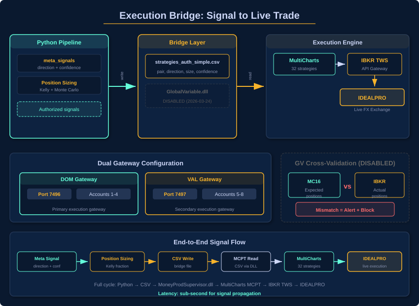
</p>

### 13.1 Two-Platform Architecture

The system operates across two execution platforms connected by a CSV file:

| Platform | Role | Technology |
|---|---|---|
| **Python Pipeline** | Intelligence (data, ML, RL, sizing) | Python 3.14, SQLite, IBKR API |
| **MultiCharts (MC16)** | Execution (order routing, 32 strategies) | GlobalVariable.dll, TWS API |

**Bridge**: `strategies_auth_simple.csv` — the final position sizing output consumed by MC16 every ~3 seconds.

### 13.2 Account Architecture

| Account | Gateway | Port | Role |
|---|---|---|---|
| Account 1 | DOM | 7496 | Live trading |
| Account 2 | DOM | 7496 | Live trading |
| Account 3 | DOM | 7496 | Live trading |
| Account 4 | DOM | 7496 | Live trading |
| Account 5 | VAL | 7497 | Validation / backup |
| Account 6 | VAL | 7497 | Validation / backup |
| Account 7 | VAL | 7497 | Validation / backup |
| Account 8 | VAL | 7497 | Validation / backup |

**Dual-gateway design**: Two IB Gateway instances provide load balancing (4 accounts each) and redundancy. Each Python script receives a unique `clientId` via `port_registry.py` to prevent IBKR connection conflicts.

### 13.3 GlobalVariable.dll Interface

The execution bridge uses a Windows DLL (`GlobalVariable.dll`) for inter-process shared memory between Python and MultiCharts:

- **Write path**: Python → DLL → MultiCharts (authorization, sizes, regime tags)
- **Read path**: MultiCharts → DLL → Python (heartbeats, positions, P&L)

Each of the 32 strategies has named variables:
```
{PAIR}_{SESSION}_{STRATEGY_NAME}_{DIRECTION}_{REGIME}_AUTH   → 1.0 or 0.0
{PAIR}_{SESSION}_{STRATEGY_NAME}_{DIRECTION}_{REGIME}_QTY    → Position size
{PAIR}_{SESSION}_{STRATEGY_NAME}_{DIRECTION}_{REGIME}_ALIVE  → Heartbeat
```

### 13.4 CSV Authorization Protocol

The final pipeline output (`strategies_auth_simple.csv`):

```csv
strategy_name,authorized,direction,regime,qty_base,pair,account
EURUSD_NY_Strategy 1.2.47_S MR,1,S,MR,50000,EURUSD,Account 1
EURJPY_NY_Strategy 3.11.191_L TF,1,L,TF,52000,EURJPY,Account 1
AUDUSD_NY_Strategy 2.8.143_S MR,0,S,MR,0,AUDUSD,Account 5
```

Of 32 total strategies, only ~8 receive `authorized=1` per cycle (matching the meta-signal's direction per pair). The other 24 are blocked, preventing counter-signal trades.

### 13.5 GV Cross-Validation

The `gv_position_xval.py` script continuously validates position integrity:
- Every IBKR-reported position must match a MC16 position
- **Phantom positions** (IBKR flat, MC16 long) trigger desync alerts
- **Stale prices** (market_price unchanged > 2 hours) are flagged
- Per-account, per-pair, per-direction matching handles hedged positions

---

## Chapter 14 — Monitoring, Diagnostics, and Observability

<p align="center">
  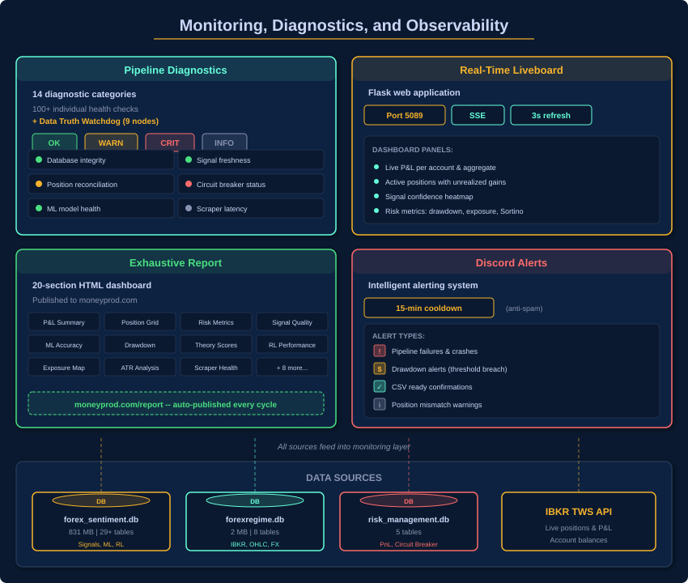
</p>

### 14.1 Pipeline Diagnostics (11 Categories, 100+ Checks)

| Category | Checks | Example |
|---|---|---|
| **DATA** | Scraper freshness, prediction markets, vol features | "FXSSI data > 60 min old → WARN" |
| **ML** | Classification coverage, lookahead leakage | "ML covers 8/8 pairs → OK" |
| **FORECAST** | 4-day forecast freshness, regime propagation | "Forecast generated 3 min ago → OK" |
| **RL** | Q-table learning, outcome coverage (min 50) | "Effective outcomes: 127 → OK" |
| **META** | Signal coverage, circular consensus, source weights | "Meta-signals: 8/8 pairs → OK" |
| **POSITIONS** | IBKR ↔ GV cross-validation, phantom positions | "0 phantom positions → OK" |
| **CIRCUIT_BREAKER** | Margin monitoring, daily/weekly loss limits | "Daily P&L: −1.2% → OK" |
| **SIZING** | Strategy authorization rate, position validity | "32/32 strategies authorized → OK" |
| **EDGE** | Trade volume, profitability, Sharpe/Sortino | "No realized trades yet → INFO" |
| **EQUITY** | Account health, margin utilization, CV | "$964,242 across 8 accounts → OK" |
| **SYSTEM** | Pipeline runtime, PnL tracker freshness, TZ check | "Pipeline: 201s → OK" |

**Status levels**: `OK` | `WARN` | `CRIT` | `INFO`
- **CRIT** → Auto-reduce sizing or halt pipeline
- **WARN** → Discord alert + human review
- **INFO** → Dashboard only

### 14.2 Real-Time Liveboard

A Flask application running on port 5089 with Server-Sent Events (SSE):

- **Refresh cycle**: Every 3 seconds
- **Data source**: Direct IBKR TWS API (`reqMktData` + `reqAccountUpdates` + `reqExecutions`)
- **Displays**: Account equity, live positions (qty, entry, market, P&L), recent executions, order rejections, market data (bid/ask for 8 pairs), GV health (32 strategies), pipeline status
- **Persistence**: Writes to `ibkr_live_state` table (JSON snapshots)
- **Published**: `moneyprod.com/live/` via IIS reverse proxy

### 14.3 Exhaustive Report (20 Sections)

Phase 10 generates a comprehensive HTML dashboard:

1. Pipeline status and timing
2. Equity summary across all accounts
3. Position detail with unrealized P&L
4. ML classifications (per pair: regime, direction, confidence)
5. RL agent state and recommendations
6. 4-day forecast signals
7. IV metrics and regime classification
8. Crowding analysis
9. Theory scores evolution (30 theories × 8 pairs)
10. Calendar events (next 7 days)
11. News sentiment summary (109 articles/cycle)
12. Prediction market data (10 markets)
13. Strategy outcomes (win/loss records)
14. Continuous learning metrics (Sortino, Sharpe, drawdown)
15. ATR values per pair
16. MC16 strategy health (32/32 alive, AOE status)
17. Liveboard health
18. Data freshness checks
19. Risk metrics summary
20. Diagnostics summary (0 CRIT | 5 WARN | 28 OK | 8 INFO)

**Published** to `moneyprod.com/exhaustive_report.html` after every cycle.

### 14.4 Discord Alert System

Real-time notifications with **anti-spam protection** (15-minute cooldown per title hash):

| Alert Type | Trigger | Urgency |
|---|---|---|
| CSV Ready | Position sizing complete | INFO |
| Pipeline Failure | Critical stage failed | CRITICAL |
| Drawdown Alert | Daily P&L < −5% | WARNING |
| GV Desync | MC16 ≠ IBKR position | WARNING |
| Liveboard Down | HTTP health check failed | CRITICAL |
| Strategy Death | GV strategy stopped responding | WARNING |
| Active Shock | Pair in shock mode | WARNING |

---

## Technical Appendix

### A. Key Algorithms Summary

| Algorithm | Component | Purpose | Reference |
|---|---|---|---|
| Ridge Regression (L2) | Strategy Specialists | Feature weight learning with regularization | Hoerl & Kennard, 1970 |
| MCMC (Metropolis-Hastings) | Bayesian Optimizer | Posterior sampling for weight calibration | Hastings, 1970 |
| Q-Learning | RL Agent | Tabular action-value function learning | Watkins & Dayan, 1992 |
| Kelly Criterion (Half) | Position Sizing | Optimal bet fraction for log-growth | Kelly, 1956 |
| Differential Sortino | RL Reward | Downside-risk-only performance metric | Moody & Saffell, 1998 |
| Gelman-Rubin (R-hat) | MCMC Convergence | Multi-chain convergence diagnostic | Gelman & Rubin, 1992 |
| Hurst Exponent (R/S) | Regime Detection | Long-range dependence estimation | Hurst, 1951 |
| Garman-Klass | Realized Volatility | Efficient range-based vol estimator | Garman & Klass, 1980 |
| Lo-MacKinlay | Variance Ratio | Random walk test for regime | Lo & MacKinlay, 1988 |
| VADER | News Sentiment | Valence-based text scoring | Hutto & Gilbert, 2014 |
| Prioritized Experience Replay | RL Training | Priority-weighted batch sampling | Schaul et al., 2016 |

### B. Hyperparameter Reference

| Component | Parameter | Value | Rationale |
|---|---|---|---|
| **ML Training** | LOOKBACK_BARS | 90 | 15 days H4 data |
| | FORWARD_BARS | 6 | 1 day forward label |
| | MIN_TRAIN_SAMPLES | 30 | Minimum for Ridge stability |
| | Blend α cap | 0.50 | Never fully data-driven |
| | STRUCT_INFLUENCE | 0.30 | Structural bonus cap |
| **RL Agent** | α (learning rate) | 0.10 | Conservative for non-stationary FX |
| | γ (discount) | 0.95 | High future-orientation |
| | ε (exploration) | 0.15 | Adaptive base rate |
| | MIN_RL_OUTCOMES | 50 | Observation threshold |
| | Batch size | 32 | Experience replay |
| | Replay iterations | 5 | Per training cycle |
| **Bayesian** | Chains | 4 | For R-hat diagnostic |
| | Iterations/chain | 5,000 | Posterior sampling |
| | R-hat target | < 1.1 | Convergence criterion |
| | Weight bounds | [0.1, 4.0] | Prior weight range |
| | Learning rate | 0.12 | Proposal noise std |
| | Min samples | 15 | Guard threshold |
| **Position Sizing** | RISK_PER_TRADE | 2.0% | Of account equity |
| | ATR_MULTIPLIER | 2.0 | Stop distance |
| | KELLY_FRACTION | 0.50 | Half-Kelly |
| | MAX_KELLY | 0.08 | Per-trade ceiling |
| | MAX_LEVERAGE | 5.0× | Portfolio cap |
| | SAFETY_BUFFER | 0.95 | Margin safety |
| **Circuit Breaker** | DAILY_LOSS_LIMIT | −3.5% | REDUCED trigger |
| | WEEKLY_LOSS_LIMIT | −6.0% | HALT trigger |
| | CONSEC_LOSSES | 7 | REDUCED trigger |
| **IV Filter** | IV_PCT_REJECT | 80th %ile | Black swan reject |
| | VOL_RATIO_REJECT | 0.50 | Fear reject |
| | KILL_VRP_Z_NEG | −2.0 | Extreme negative VRP |
| | KILL_VRP_Z_POS | +3.0 | IV bubble |
| | KILL_TS_RATIO | 1.40 | Inverted term structure |
| | SEMI_VARIANCE_THRESHOLD | 1.30 | Directional surprise (rv_down/rv_up) |
| **Crowding** | THRESHOLD | 70% | Concentration reject |
| | PENALTY | 0.0 (binary) | White Swan: reject, not reduce |
| **Hysteresis** | Base margin | 0.04 | Regime switch margin |
| | Exit margin | 0.02 | Extra to flip (6% total) |
| | Min hold | 1 hour | Churn prevention |
| | EMA α | 0.90 | Smoothing factor |
| **Meta-Resolver** | ML weight | 55% | Primary intelligence |
| | Forecast weight | 25% | Confirmation |
| | RL weight | 20% | Adaptive component |
| | Disagree penalty | −30% | Split vote confidence reduction |
| | Agree bonus | +10% | Unanimous confidence boost |
| **Confidence** | Min confidence | 0.45 | Below = NEUTRAL |
| | Range | [0.30, 0.95] | Never 0% or 100% |
| **Continuous Learning** | Sortino threshold | −0.3 | Retrain trigger |
| | Accuracy threshold | 55% | Minimum edge for forex |
| | Max drawdown | 12% | Review threshold |
| | Profit factor | 1.2 | Minimum acceptable |

### C. Data Freshness Requirements

| Data Type | Max Age (WARN) | Max Age (CRIT) |
|---|---|---|
| Scraper data | 30 min | 60 min |
| ML classifications | 5 min | 10 min |
| 4-day forecast | 5 min | 10 min |
| RL outcomes | 15 min | 30 min |
| Meta-signals | 5 min | 10 min |
| IBKR positions | 5 min | 15 min |
| ATR data | 1 hour | 2 hours |
| FX rates | 15 min | 30 min |
| Account equity | 15 min | 30 min |

### D. File Structure

| File | Lines | Purpose |
|---|---|---|
| `unified_pipeline.py` | ~806 | 8-stage orchestrator |
| `ml_strategy_ensemble.py` | ~1,321 | 5-Model MoE, feature engine, training |
| `bayesian_optimizer.py` | ~751 | MCMC weight optimization |
| `rl_agent.py` | ~509 | Q-learning, experience replay |
| `continuous_learning.py` | ~526 | Sortino monitoring, retraining |
| `meta_signal_resolver.py` | ~341 | 3-source ensemble blending |
| `calculate_theories.py` | ~474 | 30 theory calculations |
| `pnl_tracker.py` | ~400 | Soft outcomes, Sortino feedback |
| `smart_position_sizing.py` | ~650 | Kelly + IV + correlation limits |
| `iv_position_sizer.py` | ~650 | IV-based white swan filter |
| `crowding_penalty.py` | ~250 | A/B-tested crowding rejection |
| `generate_exhaustive_report_v4.py` | ~2,500 | 20-section HTML dashboard |
| `ibkr_live_board.py` | ~1,600 | Real-time Flask liveboard |
| `pipeline_diagnostics.py` | ~500 | 11-category health checks |

---

## References

1. **Kelly, J.L.** (1956). "A New Interpretation of Information Rate." *Bell System Technical Journal*, 35(4), 917–926.

2. **Moody, J. & Saffell, M.** (1998). "Reinforcement Learning for Trading." *Advances in Neural Information Processing Systems (NeurIPS)*.

3. **Gelman, A. & Rubin, D.B.** (1992). "Inference from Iterative Simulation Using Multiple Sequences." *Statistical Science*, 7(4), 457–472.

4. **Lo, A.W. & MacKinlay, A.C.** (1988). "Stock Market Prices Do Not Follow Random Walks." *Review of Financial Studies*, 1(1), 41–66.

5. **Hurst, H.E.** (1951). "Long-Term Storage Capacity of Reservoirs." *Transactions of the American Society of Civil Engineers*, 116, 770–808.

6. **Garman, M.B. & Klass, M.J.** (1980). "On the Estimation of Security Price Volatilities from Historical Data." *Journal of Business*, 53(1), 67–78.

7. **Watkins, C.J.C.H. & Dayan, P.** (1992). "Q-Learning." *Machine Learning*, 8(3-4), 279–292.

8. **Taleb, N.N.** (2007). *The Black Swan: The Impact of the Highly Improbable*. Random House.

9. **Hutto, C.J. & Gilbert, E.E.** (2014). "VADER: A Parsimonious Rule-based Model for Sentiment Analysis." *AAAI Conference on Weblogs and Social Media*.

10. **Schaul, T., Quan, J., Antonoglou, I. & Silver, D.** (2016). "Prioritized Experience Replay." *International Conference on Learning Representations (ICLR)*.

11. **Hastings, W.K.** (1970). "Monte Carlo Sampling Methods Using Markov Chains." *Biometrika*, 57(1), 97–109.

12. **Hoerl, A.E. & Kennard, R.W.** (1970). "Ridge Regression: Biased Estimation for Nonorthogonal Problems." *Technometrics*, 12(1), 55–67.

13. **Roberts, G.O., Gelman, A. & Gilks, W.R.** (1997). "Weak Convergence and Optimal Scaling of Random Walk Metropolis Algorithms." *Annals of Applied Probability*, 7(1), 110–120.

14. **Sortino, F.A. & van der Meer, R.** (1991). "Downside Risk." *Journal of Portfolio Management*, 17(4), 27–31.

15. **Bollerslev, T., Tauchen, G. & Zhou, H.** (2009). "Expected Stock Returns and Variance Risk Premia." *Review of Financial Studies*, 22(11), 4463–4492.

---

<p align="center">
  
</p>

<p align="center" style="font-size:9pt; color:#64748b;">
  <strong>MoneyProd Architecture v1.0</strong> — February 2026<br>
  © <a href="https://linkedin.com/in/timothy-lokotar/">Timothy Lokotar</a> · <a href="https://www.moneyprod.com/">moneyprod.com</a>
</p>
