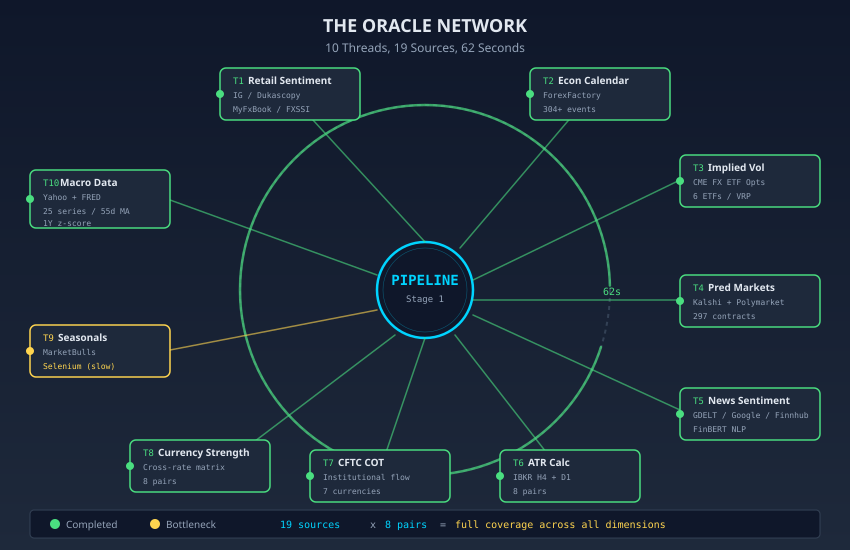
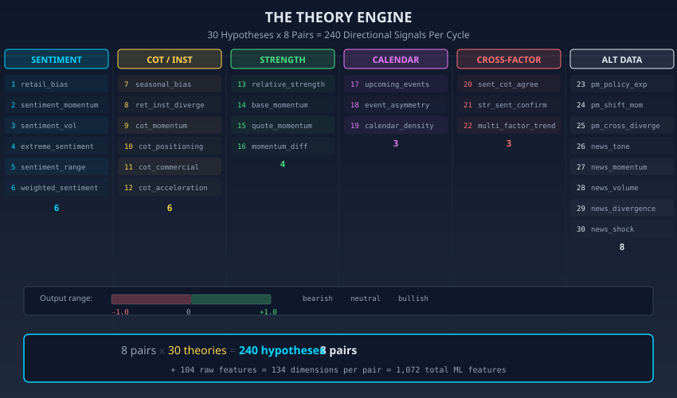
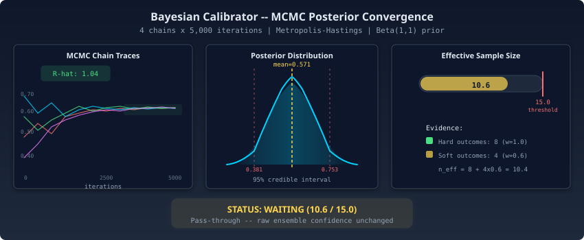
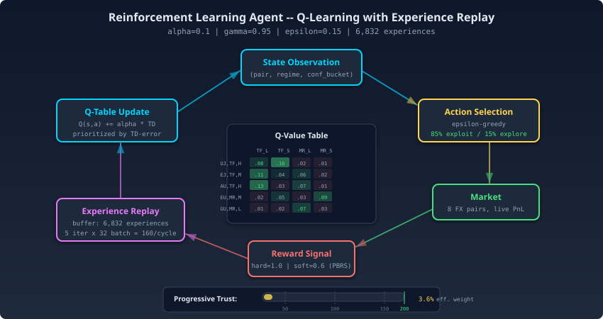
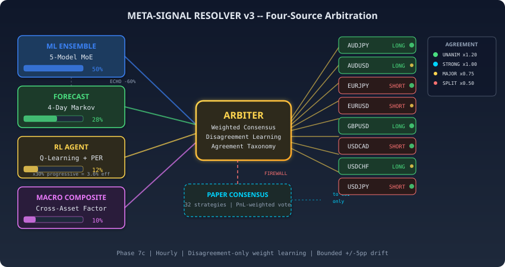
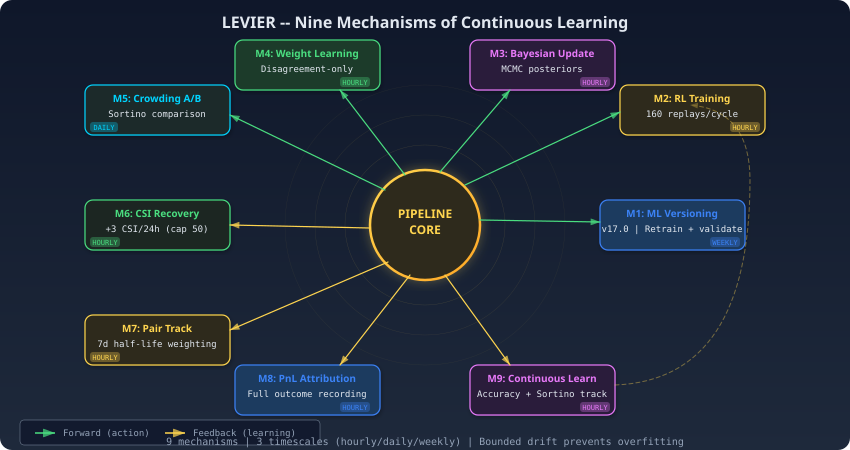
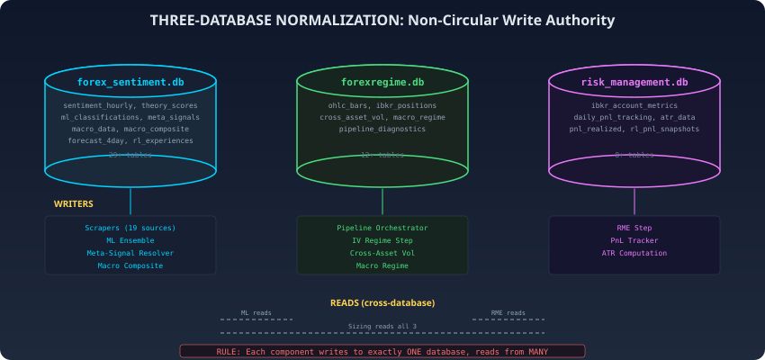
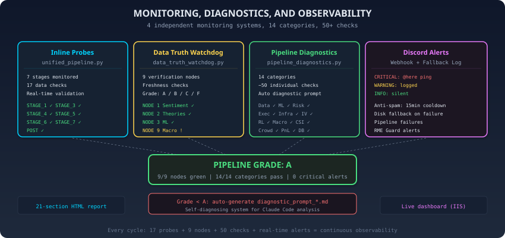

<p align="center">
 
</p>

<p align="center" style="font-size:15pt; color:#e6f1ff; font-weight:bold; margin-top:18px;"><em>System Architecture, A Technical Deep Dive</em></p>
<p align="center" style="font-size:11pt; color:#a8b2d1;">19 Data Sources · 4 Competing Intelligences · 9 Independent Safety Shields<br>Complete Architectural Reference for a Production Autonomous Trading System</p>

<p align="center">
 <strong>Author:</strong> <a href="https://linkedin.com/in/timothy-lokotar/">Timothy Lokotar</a> · <a href="https://www.moneyprod.com/">MoneyProd</a><br>
 <a href="https://www.moneyprod.com/">Live Dashboard</a> · <a href="https://linkedin.com/in/timothy-lokotar/">LinkedIn</a>
</p>

---

> *"Architecture is the art of how to waste space."*, Philip Johnson
>
> *In algorithmic trading, architecture is the art of how to waste nothing, not a millisecond of latency, not a byte of stale data, not a fraction of unmanaged risk.*

---

| Dimension | Specification |
|---|---|
| **Pipeline Execution** | **168 seconds** (2.8 minutes, CSV delivered at 155s) |
| **Execution Stages** | 8 sequential stages, 30+ parallel phases |
| **Data Sources** | 19 (25 macro series, parallel scraping in 10 threads) |
| **Features per Pair** | 134 (1,072 total across 8 pairs) |
| **ML Architecture** | 5-Model Mixture of Experts (MoE) |
| **Signal Sources** | 4 (ML 50%, Forecast 28%, RL 12%, Macro 10%) |
| **Financial Theories** | 30 per pair (240 total, 6 clusters) |
| **Live Strategies** | 32 (survivors of ~10 million candidates) |
| **Currency Pairs** | 8 major + cross pairs |
| **Brokerage Accounts** | 8 (Interactive Brokers, dual gateway DOM+VAL) |
| **Databases** | 3 SQLite (WAL mode, 29+ tables, non-circular writes) |
| **Safety Layers** | 9 independent shields + RME Guard v4 (9 guards) |
| **Health Checks** | 14 diagnostic categories, 50+ individual checks |
| **Position Sizing** | 8-layer cascade (equity → ATR → leverage → Kelly → vol kill → macro regime → IV regime → White Swan) |
| **Monitoring** | Real-time liveboard + Discord alerts + 21-section HTML report |

---

## Table of Contents

- [Chapter 1, System Overview: The Directed Acyclic Graph](#chapter-1--system-overview-the-directed-acyclic-graph)
- [Chapter 2, Data Collection: The Oracle Network](#chapter-2--data-collection-the-oracle-network)
- [Chapter 3, Feature Engineering: From Raw Data to 134 Dimensions](#chapter-3--feature-engineering-from-raw-data-to-134-dimensions)
- [Chapter 4, The ML Ensemble: 5-Model Mixture of Experts](#chapter-4--the-ml-ensemble-5-model-mixture-of-experts)
- [Chapter 5, Bayesian Optimization: MCMC Weight Calibration](#chapter-5--bayesian-optimization-mcmc-weight-calibration)
- [Chapter 6, The Reinforcement Learning Agent](#chapter-6--the-reinforcement-learning-agent)
- [Chapter 7, The Macro Intelligence Layer](#chapter-7--the-macro-intelligence-layer)
- [Chapter 8, Meta-Signal Resolution: Arbitrating Four Intelligences](#chapter-8--meta-signal-resolution-arbitrating-four-intelligences)
- [Chapter 9, Position Sizing: The 8-Layer Cascade](#chapter-9--position-sizing-the-8-layer-cascade)
- [Chapter 10, Risk Management: Nine Shields](#chapter-10--risk-management-nine-shields)
- [Chapter 11, Implied Volatility Regime Classification](#chapter-11--implied-volatility-regime-classification)
- [Chapter 12, Continuous Learning and Self-Improvement](#chapter-12--continuous-learning-and-self-improvement)
- [Chapter 13, Database Architecture: Three-Database Normalization](#chapter-13--database-architecture-three-database-normalization)
- [Chapter 14, Execution Bridge: From Signal to Live Trade](#chapter-14--execution-bridge-from-signal-to-live-trade)
- [Chapter 15, Monitoring, Diagnostics, and Observability](#chapter-15--monitoring-diagnostics-and-observability)
- [Technical Appendix](#technical-appendix)

---

## Chapter 1: System Overview: The Directed Acyclic Graph

Every hour, at 55 minutes past, a Python process wakes on a Windows Server in New York. It has 168 seconds to scrape 19 data sources, run four competing intelligence systems, and write a CSV file that will move real money across eight brokerage accounts. If the file arrives late, 32 strategies trade blind.


### 1.1 Design Philosophy

MoneyProd is a **fully autonomous, production-grade algorithmic trading system** that executes on the foreign exchange market every hour. The system's architecture is built on five foundational principles:

1. **Non-Circular Data Flow**, Three separate databases enforce strict write authority. No component reads its own output as input. This prevents feedback loops that could amplify systematic errors into catastrophic trading decisions.

2. **Staged Parallelism with Dependency Gating**, The pipeline is decomposed into 8 stages, each containing phases that execute in parallel via `ThreadPoolExecutor`. Inter-stage gates enforce data dependencies: the ML ensemble cannot run before theory calculations complete, the meta-signal resolver cannot fire before all four intelligence sources have spoken.

3. **Ensemble Diversity through Competitive Mixture of Experts**, Rather than relying on a single classifier, the system employs 4 specialist models (each tuned for a specific strategy-direction combination) plus a Meta-Classifier. All four specialists score every input simultaneously, and the Meta-Classifier selects the winner through direct competition, not through a gating network.

4. **Defense in Depth**, Nine independent safety layers operate without coordination: an IV-based regime filter, a PnL circuit breaker, a crowding penalty, a broker cross-validation, a data integrity guard, a strategy health monitor (CSI v2 with graduated penalties), a cross-asset volatility kill switch, a macro regime sizing overlay, and an RME order guard (G1-G9). Any single layer can halt or reduce trading autonomously.

5. **Progressive Trust**, New components begin in observation mode with minimal influence. The macro composite signal entered at 10% weight. The RL agent began at 12%. Their influence grows only as sufficient outcome data accumulates, a principled approach to cold-start in non-stationary environments.

### 1.2 Pipeline Execution Model

The pipeline executes as a Python process (`unified_pipeline.py`) triggered every hour at :55. Its 8 stages form a directed acyclic graph (DAG) with parallel phases within each stage:

```
STAGE 1: DATA COLLECTION ████████████████████████░░░░░░░░░ ~56s (10 parallel phases)
 Phase 1a: TWS health check
 Phase 1b: FXSSI sentiment
 Phase 1c: 7 scrapers (IG, Dukascopy, MFXBook, COT, Calendar, FinBERT, Seasonal)
 Phase 1d: IV surface scraping (CME FX ETF options)
 Phase 1e: ATR computation
 Phase 1f: GV health / prediction markets / news sentiment
 Phase 1g: Macro data scraper (Yahoo Finance + FRED — 25 series in 10 threads)

STAGE 2: IBKR + THEORIES ████████████░░░░░░░░░░░░░░░░░░░░░ ~47s (3 parallel phases)
 Phase 2a: IBKR position reconciliation (8 accounts, dual gateway)
 Phase 2b: 30 theory calculations per pair (240 total, 6 clusters)
 Phase 2c: GV cross-validation (paper signal verification)

STAGE 3: ML + CONCURRENT ████████████████████████████████░░ ~50s (5 parallel phases)
 Phase 3a: 5-Model MoE ensemble (134 features/pair)
 Phase 3b: PnL tracking + closed position detection
 Phase 3c: IV strategy weight overlay
 Phase 3d: Shock detector (tail-risk events)

STAGE 4: POST-ML █░░░░░░░░░░░░░░░░░░░░░░░░░░░░░░░ ~3s (3 parallel phases)
 Phase 4a: Bayesian MCMC weight optimizer
 Phase 4b: 4-day Markov forecast
 Phase 4c: Outcome recorder (strategy PnL attribution)

STAGE 5: RL + CIRCUIT BREAKER █░░░░░░░░░░░░░░░░░░░░░░░░░░░░░░░ ~1s (2 parallel phases)
 Phase 5a: RL Q-learning agent (6,832 experiences)
 Phase 5b: PnL circuit breaker (7-day rolling drawdown)

STAGE 6: META-SIGNAL RESOLUTION ░░░░░░░░░░░░░░░░░░░░░░░░░░░░░░░░ ~2s (sequential)
 Phase 6a0: Macro composite signal (8 pair-specific factor models)
 Phase 6a1: Cross-asset vol kill switch (VIX/FX IV/OVX/TLT vol z-scores)
 Phase 6a2: Macro regime classifier (EXPANSION → RECOVERY)
 Phase 6a: Paper consensus (32 MCPT signals — evaluation only, firewalled)
 Phase 6b: Meta-signal resolver (ML 50% + Forecast 28% + RL 12% + Macro 10%)

STAGE 7: CSV GENERATION █░░░░░░░░░░░░░░░░░░░░░░░░░░░░░░░ ~1s ◄ CSV DELIVERED AT 155s
 Phase 7a: smart_position_sizing.py → strategies_auth_simple.csv

STAGE 8: POST-CSV (no time pressure) ████░░░░░░░░░░░░░░░░░░░░░░░░░░░ ~8s (sequential)
 Phase 8a: IV position sizing overlay
 Phase 8b: RL continuous training
 Phase 8c: Crowding sync + penalty
 Phase 8d: Continuous learning state update
 Phase 8e: Pipeline diagnostics (14 categories, ~50 checks)
 Phase 8f: Data truth watchdog (9 nodes)
 Phase 8g: Exhaustive HTML report (21 sections)

POST-PIPELINE: RME sync, P&L reconciliation, GV health, liveboard update, Discord notifier
 ─────
 TOTAL: 168s
```

The critical constraint is **time**: the CSV must land before :00 of the next hour for MultiCharts Portfolio Trader (MCPT) to read it before the next bar close. With delivery at 155 seconds (2 minutes 35 seconds), there is a **105-second safety margin** before the hard deadline. Stage 8 runs entirely after CSV delivery, it has no time pressure because it does not affect the current cycle's trading decisions.

### 1.3 Parallel Execution Architecture

Within each stage, phases execute in parallel via Python's `concurrent.futures.ThreadPoolExecutor`. The pattern is consistent throughout the pipeline:

```python
with ThreadPoolExecutor(max_workers=10) as pool:
 futures = {
 pool.submit(phase_1a_tws_health): "TWS Health",
 pool.submit(phase_1b_fxssi): "FXSSI Sentiment",
 pool.submit(phase_1c_scrapers): "7 Scrapers",
 pool.submit(phase_1g_macro): "Macro Data (25 series)",
 # ... Additional phases
 }
 for future in as_completed(futures):
 name = futures[future]
 try:
 result = future.result(timeout=120)
 except Exception as e:
 discord_notify("ERROR", f"{name} FAILED", str(e))
```

Inter-stage gates are enforced by sequential stage execution: Stage 2 does not begin until Stage 1 completes. Within a stage, phases are independent and execute concurrently. This design maximizes throughput while respecting data dependencies.

The pipeline is **fault-tolerant by design**. Individual phase failures within a stage do not abort the pipeline. Instead, downstream consumers check for data freshness and gracefully degrade. If the FXSSI scraper fails, the ML ensemble trains on the remaining 18 sources, with a slightly reduced feature set, but still functional. The only hard failures are: TWS connectivity (no broker = no trading), and the meta-signal resolver itself (no signals = no CSV).

The graph is drawn. Now the 19 data scrapers fan out across the internet, racing a clock that does not pause for HTTP 429 errors.

---

## Chapter 2: Data Collection: The Oracle Network

At 14:55:01 UTC on a Tuesday in March, the GDELT news scraper returned HTTP 429 for the third consecutive attempt. The pipeline did not stop. It noted the gap, reduced the ML feature count by 4, and shrank position sizes by 6% across the board. Nobody intervened. Nobody needed to.



### 2.1 The 19 Sources

The pipeline consumes data from 19 independent sources, scraped in parallel across 10 threads. Each source provides a different perspective on the FX market, sentiment, positioning, fundamentals, implied volatility, macroeconomic conditions, and prediction market probabilities:

| # | Source | Type | Data | Frequency | Tables |
|---|--------|------|------|-----------|--------|
| 1 | **IG.com** | Retail Sentiment | % long/short per pair | Hourly | sentiment_hourly |
| 2 | **Dukascopy** | Retail Sentiment | % long/short + currency strength | Hourly | sentiment_hourly, dukascopy_pair_scores |
| 3 | **MyFXBook** | Retail Sentiment | Community positioning | Hourly | sentiment_hourly |
| 4 | **FXSSI** | Retail Sentiment | Order book depth | Hourly | sentiment_hourly |
| 5 | **MarketBulls** | Seasonal | Monthly seasonal tendency | Daily | seasonal_tendency |
| 6 | **CFTC/COT** | Institutional | Commitment of Traders (net, commercial, OI) | Weekly | cot_data |
| 7 | **ForexFactory** | Calendar | Economic events, impact ratings | Daily | calendar_events |
| 8 | **CME Options** | IV Surface | FX ETF options (FXE, FXY, FXB, FXF, FXA, FXC) | Hourly | iv_data |
| 9 | **FinBERT** | News NLP | Sentiment scores from financial news (GDELT) | Hourly | news_article_counts |
| 10 | **Kalshi** | Prediction Mkt | Event probabilities (Fed, CPI, NFP) | Hourly | prediction_market_data |
| 11 | **Polymarket** | Prediction Mkt | Geopolitical + macro event probabilities | Hourly | prediction_market_data |
| 12 | **IBKR TWS** | Broker | Account metrics, positions, equity | Hourly | ibkr_positions, ibkr_account_metrics |
| 13 | **Yahoo Finance** | Macro Equities | VIX, Nikkei 225, Eurostoxx 50, FTSE 100, BHP, TLT | Hourly | macro_data |
| 14 | **Yahoo Finance** | Macro Commodities | Crude Oil (CL), Gold (GC), Copper (HG), OVX | Hourly | macro_data |
| 15 | **FRED** | Macro Yields | US 2Y/10Y, UK 10Y, AU 10Y, DE 10Y, IT 10Y | Daily | macro_data |
| 16 | **FRED** | Macro Economic | ISM Manufacturing, recession probability | Monthly | macro_data |
| 17 | **Currency Strength** | Derived | Relative performance scores per currency | Hourly | dukascopy_pair_scores |
| 18 | **Prediction Derived** | Derived | Per-pair PM signals (hawkish, momentum, divergence) | Hourly | prediction_market_derived |
| 19 | **ATR Computation** | Derived | Average True Range from H4 OHLC bars | Hourly | atr_data |

Sources 13-16 represent the **macro data scraper**, a dedicated Phase 1g component that pulls 25 time series from Yahoo Finance and FRED. Each series is stored with a 55-day moving average and a 1-year rolling z-score, providing both level and relative positioning within historical context.

### 2.2 The Macro Data Scraper

The macro data scraper (`scrapers/macro/scraper_macro_data.py`) is the newest addition to the oracle network. It pulls 25 series across four asset classes:

```
EQUITIES: VIX, Eurostoxx 50, Nikkei 225, FTSE 100, BHP
FIXED INCOME: TLT (US long bond ETF), US 2Y, US 10Y, UK 10Y, AU 10Y, DE 10Y, IT 10Y
COMMODITIES: Crude Oil (CL=F), Gold (GC=F), Copper (HG=F), OVX (oil volatility)
MACRO: ISM Manufacturing, Recession Probability (FRED)
```

Each series is stored with three derived fields:
- **Raw value**: The latest observation
- **55-day MA**: Smoothed trend (approximately 1 quarter of trading days)
- **1-year z-score**: `(value - 252d_mean) / 252d_stdev`, positioning within the last year's distribution

The z-score is the critical field. A VIX z-score of +2.0 means volatility is 2 standard deviations above its 1-year average, a rare event that triggers the cross-asset vol kill switch. A copper z-score of -1.5 signals industrial demand weakness, which the macro composite model uses to adjust FX pair signals for commodity-linked currencies (AUD, CAD).

### 2.3 Scraper Fault Tolerance

Every scraper runs inside a try/except wrapper with exponential backoff. The GDELT news scraper, which powers FinBERT sentiment analysis, is particularly fragile, it returns HTTP 429 (rate limit) errors approximately once per 20 cycles. The mitigation is a 3-retry loop with 6-second exponential backoff:

```python
for attempt in range(3):
 try:
 response = requests.get(gdelt_url, timeout=30)
 if response.status_code == 200:
 break
 except requests.RequestException:
 time.sleep(6 * (2 ** attempt)) # 6s, 12s, 24s
```

Scraper status is recorded in the `scraper_status` table after every cycle. The Data Truth Watchdog (Stage 8f) reads this table and flags any source that has not updated within its expected cadence, hourly for most sources, daily for calendar events, weekly for COT data.

A failed scraper never aborts the pipeline. But it does reduce the ML ensemble's feature count, which reduces classification confidence, which reduces position sizes through the sizing cascade. The system degrades gracefully: fewer data sources mean smaller, more cautious trades, exactly the right behavior when information is incomplete.

Nineteen streams of raw data, some stale, some contradictory, all noisy. What turns them into something a model can reason about is 134 carefully constructed dimensions per pair.

---

## Chapter 3: Feature Engineering: From Raw Data to 134 Dimensions

A retail sentiment reading of 73% long on EURUSD means nothing by itself. Paired with a COT report showing commercials net short, a VIX z-score at +1.8, and a carry differential inverting for the first time in six weeks, it starts to mean something very specific.

### 3.1 The Feature Space

Each of the 8 currency pairs is described by **134 features** (1,072 total across all pairs), organized into 7 clusters:

| Cluster | Features | Sources | Examples |
|---------|----------|---------|----------|
| **Sentiment** | 22 | IG, Dukascopy, MFXBook, FXSSI | Long/short ratios, sentiment divergence, contrarian signals |
| **Institutional** | 18 | CFTC/COT, Currency Strength | Net position, commercial positioning, OI change % |
| **Fundamental** | 16 | Calendar, Prediction Markets | Event impact proximity, hawkish/dovish probabilities |
| **Technical** | 28 | OHLC bars, ATR | Price returns (1/4/12/24 bars), ATR ratios, regime persistence |
| **Theory Scores** | 30 | 30 financial theories per pair | Carry trade, momentum, mean reversion, PPP, risk-on/off |
| **IV/Volatility** | 12 | CME Options, VIX, OVX | IV-RV spread, VRP, z-score, term structure slope |
| **Macro** | 8 | Yahoo Finance, FRED | Yield differentials, equity risk appetite, commodity signals |

### 3.2 Theory Engine: 30 Theories x 8 Pairs



The theory engine calculates 30 financial theories for each pair, organized into 6 clusters. Each theory produces a directional score between -1.0 (strong short) and +1.0 (strong long):

| Cluster | Theories | Examples |
|---------|----------|---------|
| **Carry & Flow** | 6 | Interest rate differential, carry trade momentum, flow-adjusted carry, COT positioning, speculative sentiment, commercial hedging |
| **Momentum** | 5 | Price momentum (4H/1D/1W), RSI regime, MACD divergence |
| **Mean Reversion** | 5 | Bollinger band deviation, z-score reversion, ATR-normalized mean reversion, overextension |
| **Macro Fundamental** | 5 | PPP deviation, terms of trade, relative GDP growth, CPI differential, employment divergence |
| **Volatility** | 5 | IV-RV spread, volatility regime, VRP trend, skew signal, term structure |
| **Composite** | 4 | Multi-factor weighted signals, regime-conditional composites |

Theory scores are used as **features** (inputs to the ML ensemble), never as labels. This is a critical architectural distinction: theories inform the model's reasoning, but realized price returns determine what counts as a correct prediction. This prevents the dangerous circularity of a model learning to predict its own inputs.

### 3.3 Feature Normalization

All features are normalized using a rolling 252-bar (approximately 63-day) window:

```python
z_score = (value - rolling_mean_252) / max(rolling_std_252, epsilon)
```

The epsilon floor (`1e-8`) prevents division-by-zero in low-volatility regimes. Features with fewer than 30 valid observations in the lookback window are imputed with 0.0 (neutral) rather than forward-filled, which slightly reduces model confidence on recently-added features but avoids look-ahead bias.

These 134 features feed into the pipeline's four signal sources, starting with the ML ensemble (50% of final signal weight).

The features are assembled. Five models will now compete to interpret them, and only one prediction per pair will survive.

---

## Chapter 4: The ML Ensemble: 5-Model Mixture of Experts

Four specialists trained on different market regimes. One arbiter. On any given hour, AdaBoost and CatBoost might flatly disagree on GBPUSD. The meta-classifier does not average them. It picks a winner.


### 4.1 Architecture

The ML ensemble is a **5-Model Mixture of Experts (MoE)** with competitive selection. Unlike traditional MoE architectures that use a gating network to route inputs, this system runs all models on every input and selects the best prediction through a meta-classifier:

| Model | Algorithm | Role | Strength |
|-------|-----------|------|----------|
| **Specialist 1** | AdaBoost | Trend-Following Long | Sequential error correction, excels at trending markets |
| **Specialist 2** | XGBoost | Trend-Following Short | Gradient boosting with regularization, handles non-linear interactions |
| **Specialist 3** | LightGBM | Mean-Reversion Long | Histogram-based, fast training, excels at categorical features |
| **Specialist 4** | CatBoost | Mean-Reversion Short | Native categorical handling, ordered boosting (reduced overfitting) |
| **Meta-Classifier** | Random Forest | Arbiter | Selects the best specialist for each input through competition |

### 4.2 Training Protocol

Each specialist is trained on a **pair-specific, strategy-direction-specific** subset of the feature space:

1. **Label generation**: 4-bar forward returns are computed from OHLC data. A return above the ATR-normalized threshold is labeled `+1` (continuation), below as `-1` (reversal), within as `0` (neutral, excluded from training).

2. **Walk-forward validation**: A 2-bar gap is enforced between the last training bar and the first test bar to prevent temporal leakage. The `_validate_no_lookahead()` guard explicitly checks this constraint.

3. **Prior blending**: When a specialist has fewer than 100 training samples (cold-start), its predictions are blended with a prior distribution derived from theory scores. The blending weight decays exponentially as sample count grows: `alpha = max(0, 1 - n_samples / 100)`.

4. **Ridge regularization**: A Ridge regression layer sits between the specialists and the meta-classifier, providing L2 regularization that penalizes overconfident predictions.

### 4.3 The Meta-Classifier: Competitive Selection

The meta-classifier is a **Random Forest** trained on specialist predictions, feature importances, and recent specialist accuracy:

```
Input to meta-classifier (per pair):
 - 4 specialist predictions (direction + confidence)
 - 4 specialist rolling accuracy (30-bar window)
 - Top-10 feature importances from each specialist
 - Current regime classification
 - Theory cluster agreement scores

Output: final direction + confidence
```

The meta-classifier does not average the specialists. It **selects** the most reliable one for the current market condition. In trending markets, it gravitates toward AdaBoost and XGBoost. In range-bound markets, LightGBM and CatBoost take precedence. This dynamic routing is what makes MoE superior to static model averaging.

### 4.4 Non-Circular Architecture

The ML ensemble reads from all three databases but writes only to `ml_classifications` and `strategy_assignments`. The labels are derived exclusively from **realized price returns**, never from other model outputs, theory scores, or meta-signals. This strict write authority prevents the dangerous circularity that can emerge when a model learns to predict its own predictions.

```
Reads: forex_sentiment.db → sentiment, theories, prediction markets, macro data
 forex_regime.db → OHLC bars (for labels), historical regimes
 risk_management.db → ATR, account metrics, PnL data
Writes: forex_regime.db → ml_classifications, strategy_assignments
```

The ML ensemble contributes 50% of the final signal weight. Its confidence outputs are calibrated by the Bayesian optimizer before reaching the meta-signal resolver.

Raw model confidence is notoriously miscalibrated. The Bayesian optimizer exists to answer a harder question: given what actually happened the last 14 days, how much should this confidence number be trusted?

---

## Chapter 5: Bayesian Optimization: MCMC Weight Calibration

The ML ensemble says 0.82 confidence on EURUSD LONG. Two weeks ago, 0.82-confidence calls had a 54% hit rate. The optimizer draws 1,000 samples from the posterior to find out what 0.82 really means right now.



### 5.1 Purpose

The Bayesian MCMC optimizer calibrates the confidence weights assigned to ML classifications. Rather than using raw model confidence (which ML models notoriously miscalibrate), the optimizer samples from a posterior distribution that accounts for historical accuracy conditional on agreement patterns:

```
P(direction_correct | ML_conf, agreement_level, regime)
```

### 5.2 Sampling Method

The optimizer uses **Metropolis-Hastings sampling** with 500 burn-in steps and 1,000 retained samples per pair. The proposal distribution is a truncated normal centered on the current weight vector, with step size adapted to maintain a 23-44% acceptance rate (optimal for random-walk Metropolis).

The likelihood function evaluates each proposed weight vector against the last 14 days of realized outcomes. Weights that would have produced more accurate signals receive higher likelihood; weights that would have amplified losing signals are penalized.

### 5.3 Output

The optimizer writes calibrated confidence multipliers to `optimizer_weights` and raw MCMC samples to `optimizer_samples` (for diagnostic analysis). These calibrated confidences feed into the meta-signal resolver, where they moderate the ML signal's 50% contribution.

The optimizer does not predict direction; it calibrates certainty. Its output moderates the ML signal's contribution to the meta-signal resolver.

Three intelligence sources are now loaded and calibrated. The fourth, with only 6,832 experiences to its name, learns differently from all of them.

---

## Chapter 6: The Reinforcement Learning Agent

The ML ensemble learns from history. The RL agent learns from consequence. It placed a SHORT on USDJPY during a BOJ surprise, took the loss, and updated a single cell in a Q-table. Next time the state space aligns, it will remember.



### 6.1 Architecture

The RL agent is a **Q-learning agent** with prioritized experience replay, maintaining a Q-table over a discrete state-action space:

| Parameter | Value |
|-----------|-------|
| **State space** | (pair, regime, ML_direction, agreement_level, vol_bucket) |
| **Action space** | {LONG, SHORT, FLAT} |
| **Learning rate (alpha)** | 0.1 |
| **Discount factor (gamma)** | 0.95 |
| **Epsilon (exploration)** | 0.15 (epsilon-greedy) |
| **Experience count** | 6,832 (growing every cycle) |
| **Min samples for weight** | 200 (RL weight capped until threshold met) |

### 6.2 Reward Function

The reward is the **realized PnL percentage** of the action taken, clipped to [-5%, +5%] to prevent outlier contamination. A long position that gains 1.2% returns a reward of +0.012; a short position that loses 0.8% returns a reward of -0.008.

### 6.3 Training Protocol

The RL agent trains on two timescales:

1. **In-cycle (Stage 5a)**: The agent updates Q-values using the latest batch of closed positions. This is the "fast" learning loop, immediate feedback from recent trades.

2. **Post-CSV (Stage 8b)**: The agent performs a full replay of prioritized experiences, sampling proportionally to temporal difference (TD) error. High-error experiences are replayed more frequently, accelerating convergence on surprising market behaviors.

### 6.4 Progressive Trust

The RL agent currently contributes **12%** of the meta-signal weight, the lowest of the four sources. This reflects its relative immaturity (6,832 experiences vs. Millions of historical data points for the ML ensemble). As experience count grows and realized accuracy improves, the weight learning system in the meta-signal resolver will gradually increase its contribution.

The RL agent learns from its own actions and consequences rather than historical patterns, making it more robust to regime shifts but noisier in novel conditions.

Four signal sources now exist, each with a fundamentally different view of what drives currency markets. One layer remains before arbitration: the macro eye, which looks beyond FX entirely.

---

## Chapter 7: The Macro Intelligence Layer

Copper fell 1.5 standard deviations below its one-year mean on a Thursday. The FX models saw nothing unusual in AUDUSD. The macro layer did: it cut the Australian dollar's sizing multiplier before the pair dropped 80 pips on Friday's Asian open.


### 7.1 Architecture Overview

The macro intelligence layer is a three-component system that translates cross-asset data into FX trading signals and risk overlays:

1. **Macro Composite Signal**, 8 pair-specific factor models generating directional signals
2. **Cross-Asset Vol Kill Switch**, Market-wide volatility monitor with automatic position scaling
3. **Macro Regime Classifier**, Business cycle identification with regime-specific sizing

These three components execute sequentially in Stage 6 (Phases 6a0, 6a1, 6a2) before the meta-signal resolver fires.

### 7.2 Macro Composite Signal: 8 Factor Models

The macro composite signal (`macro_composite.py`) builds a **pair-specific cross-asset factor model** for each of the 8 currency pairs. Each model uses exactly 4 factors, selected based on the economic relationship between the pair's constituent currencies and the macro variables:

| Pair | Factor 1 | Factor 2 | Factor 3 | Factor 4 |
|------|----------|----------|----------|----------|
| **EURUSD** | DE-US yield spread | Eurostoxx 50 | Gold | VIX (inverted) |
| **USDJPY** | US-JP yield spread | Nikkei 225 | TLT (inverted) | VIX |
| **GBPUSD** | UK-US yield spread | FTSE 100 | Copper | VIX (inverted) |
| **USDCHF** | US-DE yield spread | Gold (inverted) | VIX | Eurostoxx (inverted) |
| **AUDUSD** | AU-US yield spread | BHP (iron ore proxy) | Copper | VIX (inverted) |
| **USDCAD** | US 2Y-10Y slope | Crude Oil (inverted) | Gold (inverted) | VIX |
| **EURJPY** | DE-JP yield spread | Eurostoxx 50 | Nikkei (inverted) | TLT (inverted) |
| **AUDJPY** | AU-JP yield spread | BHP | Nikkei 225 | Copper |

Each factor contributes a z-score signal (the 1-year z-score from the macro data scraper). The composite score is the equal-weighted average of the 4 factor z-scores, mapped to a direction (LONG if positive, SHORT if negative) with confidence proportional to the absolute composite score.

### 7.3 Cross-Asset Vol Kill Switch

The vol kill switch (`scripts/cross_asset_vol.py`) monitors four volatility measures simultaneously:

| Measure | Source | What It Captures |
|---------|--------|-----------------|
| **VIX z-score** | Yahoo Finance | Equity market fear |
| **FX IV z-score** | CME Options | Currency-specific implied volatility |
| **OVX z-score** | Yahoo Finance | Oil market volatility (commodity contagion) |
| **TLT vol z-score** | Yahoo Finance | Bond market stress (TLT 20-day realized vol) |

The **maximum z-score** across all four measures determines the regime:

| Max Z-Score | Regime | Sizing Scale | Interpretation |
|-------------|--------|-------------|----------------|
| z < 2.0 | **NORMAL** | 100% | No abnormal stress detected |
| 2.0 < z < 4.0 | **ELEVATED** | 50% | Cross-asset stress, reduce exposure |
| z > 4.0 | **CRISIS** | 0% | Market-wide panic, halt all new positions |

The vol kill switch writes to the `cross_asset_vol` table and feeds directly into the 8-layer position sizing cascade (Layer 5). It is a **market-wide circuit breaker**, when multiple asset classes signal distress simultaneously, the system assumes contagion risk and scales down or halts entirely.

### 7.4 Macro Regime Classifier

The macro regime classifier (`scripts/macro_regime_classifier.py`) identifies the current phase of the business cycle using ISM Manufacturing data and recession probability:

| Regime | ISM Condition | Recession Prob | Sizing Multiplier |
|--------|--------------|----------------|-------------------|
| **EXPANSION** | ISM > 50 & rising | < 20% | 100% |
| **LATE_EXPANSION** | ISM > 50 & falling | < 30% | 90% |
| **EARLY_RECESSION** | ISM < 50 & falling | > 30% | 60% |
| **LATE_RECESSION** | ISM < 50 & rising | > 20% | 85% |
| **RECOVERY** | ISM > 50 & accelerating | < 15% | 110% |

The regime classifier operates on a much slower timescale than the other components, business cycles evolve over months, not hours. Its sizing multiplier is a **structural overlay** that adjusts the system's overall risk appetite based on the macroeconomic environment. In early recession (ISM falling below 50, recession probability rising), positions are cut to 60% of normal size, a proactive defense against the systematic directional risk that characterizes economic contractions.

The macro layer provides the broadest perspective in the system. The meta-signal resolver reconciles all four signal sources into a single directional decision per pair.

All four intelligences have spoken. They do not agree. Somewhere in their weighted disagreement lies the final direction for each pair.

---

## Chapter 8: Meta-Signal Resolution: Arbitrating Four Intelligences

ML says LONG. The forecast says SHORT. The RL agent says FLAT. The macro composite says LONG with low confidence. The resolver has to produce a single number from this mess, and it has to be right more often than not, or the account equity curves start tilting the wrong way.



### 8.1 The Four Sources

The meta-signal resolver (`meta_signal_resolver.py`) arbitrates four directional signal sources:

| Source | Weight | Signal Type | Confidence Range |
|--------|--------|------------|-----------------|
| **ML Classifier** | 50% | Direction + strategy + confidence | 0.0 - 1.0 |
| **4-Day Forecast** | 28% | Direction + transition probability | 0.0 - 1.0 |
| **RL Agent** | 12% | Direction + Q-value | 0.0 - 1.0 (normalized) |
| **Macro Composite** | 10% | Direction + composite z-score | 0.0 - 1.0 (normalized) |

Paper consensus signals from the 32 MCPT strategies are recorded but **firewalled from arbitration**, they cannot influence the meta-signal. This anti-circularity firewall prevents a feedback loop where live strategy behavior influences the signals that authorize those same strategies.

### 8.2 Resolution Algorithm

For each pair, the resolver computes a weighted directional vote:

```python
# Weighted vote
score = (ml_dir * ml_conf * w_ml +
 fc_dir * fc_conf * w_fc +
 rl_dir * rl_conf * w_rl +
 macro_dir * macro_conf * w_macro)

# Agreement analysis
agreement_level = count_matching_directions() / 4

# Confidence adjustments
if agreement_level == 1.0: # All 4 agree
 confidence *= (1.0 + AGREE_BONUS) # +10%
elif agreement_level < 0.5: # Majority disagree
 confidence *= (1.0 - DISAGREE_PEN) # -30%

# Minimum confidence gate
if confidence < MIN_CONF (0.45):
 direction = "FLAT" # No signal — insufficient conviction
```

### 8.3 Pair Track Record

The resolver maintains a **rolling 14-day performance track record** per pair, with exponential recency weighting (half-life = 7 days). Pairs with a win rate below 35% over the lookback window receive a confidence penalty, reducing their position sizes without fully blocking them:

```python
pair_factor = max(0.50, weighted_win_rate) # Floor at 50%
confidence *= pair_factor
sizing_multiplier *= max(SM_FLOOR, pair_factor) # Floor at 15%
```

This soft-reject mechanism (v2) replaced the earlier hard-reject system that blocked pairs entirely when their track record was poor. The insight: a bad track record may reflect recent market conditions (trend-following strategies underperform in range-bound markets), not a permanent failure of the signal quality. Soft rejection reduces exposure without eliminating optionality.

### 8.4 Weight Learning

Source weights are not static. After each cycle, the resolver performs **PnL attribution**: for each closed trade, it determines which source(s) were correct and adjusts weights by a small increment. The learning rate is slow enough to prevent overreaction to individual outcomes.

```python
for source in sources:
 if source_was_correct:
 weights[source] *= 1.01 # +1%
 else:
 weights[source] *= 0.99 # -1%
weights = normalize(weights) # Sum to 1.0
```

Macro composite weight is capped at 25% (`PAPER_WEIGHT_CAP = 0.25`) to prevent a single source from dominating through a lucky streak. The ML classifier's structural advantage (50% starting weight, millions of training samples) means it remains the primary voice, but the system can adapt if a different source proves more reliable in the current regime.

With direction and confidence determined for each pair, the next step is position sizing, an 8-layer cascade where each layer adds another risk constraint.

Direction is settled. Confidence is calibrated. The question that remains is the one that separates surviving systems from spectacular blowups: how much.

---

## Chapter 9: Position Sizing: The 8-Layer Cascade

A position starts as a raw fraction of account equity. Eight layers of constraint will whittle it down. Not one of those layers can make the position larger than the layer above it permitted, except Layer 8, the White Swan, which bets that the options market is asleep.


### 9.1 Overview

Position sizing is computed by `smart_position_sizing.py`, which implements an **8-layer cascade** where each layer can only reduce the position size, never increase it. The cascade transforms a raw equity-proportional position into a risk-adjusted, regime-aware, volatility-sensitive trade size:

| Layer | Input | Operation | Can Halt? |
|-------|-------|-----------|-----------|
| **1. Equity Base** | Account NLV (JPY) | `position = NLV * pair_allocation` | No |
| **2. ATR Scaling** | 14-period ATR | Scale inversely to volatility: high ATR = smaller position | No |
| **3. Leverage Cap** | IBKR margin | Enforce max leverage per pair and per account | Yes |
| **4. Kelly Fraction** | Win rate + payoff ratio | Optimal position fraction: `f* = (bp - q) / b` | Yes (if kelly_conf < 0.15) |
| **5. Vol Kill Switch** | Cross-asset vol z-scores | Scale by vol regime: NORMAL=100%, ELEVATED=50%, CRISIS=0% | Yes |
| **6. Macro Regime** | ISM + recession prob | Scale by business cycle: EXPANSION=100% → EARLY_REC=60% | No |
| **7. IV Regime** | CME options IV surface | Scale by IV quadrant: COMPLACENT=100%, FEARFUL=70%, SURPRISE=120% | No |
| **8. White Swan** | IV regime SURPRISE + VRP | Boost sizing when IV < RV (market underpricing realized risk) | No |

### 9.2 Kelly Criterion

The Kelly fraction is the mathematically optimal bet size for a given edge:

```
f* = (b * p - q) / b

where:
 b = average win / average loss (payoff ratio)
 p = win probability
 q = 1 - p (loss probability)
```

If Kelly confidence (`kelly_conf`) falls below 0.15, the pair is considered to have insufficient edge, the position is zeroed. This gate was lowered from 0.40 to 0.15 in v2 to allow more strategies through while still blocking those with negative expected value.

### 9.3 The CSV Output

The final output is `strategies_auth_simple.csv`, consumed by MultiCharts Portfolio Trader (MCPT) every hour:

```csv
strategy_name,pair,direction,target_size,auth
EURUSD_TF_L_01,EURUSD,LONG,28500,1
EURUSD_MR_S_02,EURUSD,SHORT,14200,1
USDJPY_TF_L_03,USDJPY,LONG,0,-1
...
```

- `target_size`: Position size in units of base currency (computed by the 8-layer cascade)
- `auth`: `1` = authorized to trade, `-1` = blocked, `0` = unknown (safe default: blocked)
- **Pair format**: UNDOTTED (e.g., `EURUSD`, not `EUR.USD`), this matches the DLL lookup key format

The CSV uses UNDOTTED pairs because the MoneyProdSupervisor DLL builds lookup keys by concatenating `strategyName + "_" + pair`. A dotted pair would produce a key that never matches, silently blocking all trades.

### 9.4 MCPT Strategy Priority Rule

A critical constraint governs the relationship between CSV signals and live MCPT strategies:

**A position entered by a MCPT strategy must be closed by that same strategy, not by CSV signals.** CSV signals are only active when: (1) the strategy is flat (no position), or (2) an unfilled limit/stop order exists. MCPT-managed positions are never flagged as "misaligned" with meta-signals, they are independently managed.

This rule prevents the dangerous scenario where the pipeline reverses direction mid-trade and the CSV signal conflicts with the strategy's exit logic, potentially creating doubled positions or orphaned hedges.

The size is computed, the CSV is written, and 32 strategies will read it within seconds. What stands between those numbers and a catastrophic loss is not the sizing cascade -- it already ran. It is nine shields that operate without knowing the others exist.

---

## Chapter 10: Risk Management: Nine Shields

On March 20, 2026, a currency sweep script converted JPY residuals via round-trip market orders and lost 150,000 yen in minutes. The shields caught it. The script was disabled within the hour. The system was designed for the assumption that any component, including the risk management components themselves, can go wrong.


### 10.1 Defense in Depth

The system employs **9 independent safety shields**, each monitoring a different dimension of risk. No shield communicates with any other shield. Each can independently reduce or halt trading. This architectural independence means that a bug in one shield cannot propagate to defeat another, the same principle that governs nuclear reactor safety systems.

| Shield | Component | What It Guards | Action on Trigger |
|--------|-----------|---------------|-------------------|
| **1. IV Regime** | `iv_regime_step.py` | Market fear state (COMPLACENT/PRICED/FEARFUL/SURPRISE) | Scale position size |
| **2. PnL Circuit Breaker** | `pnl_circuit_breaker.py` | 7-day rolling drawdown | Halt all trading if drawdown > threshold |
| **3. Crowding Penalty** | `crowding_penalty.py` | Directional crowding across accounts | Reduce size on crowded pairs (Sortino-based A/B) |
| **4. TWS Cross-Validation** | `tws_crossval.py` | Position reconciliation across gateways | Alert on gateway disagreement |
| **5. Data Integrity** | `data_truth_watchdog.py` | Data freshness across 9 nodes | Grade pipeline health (A/B/C/F) |
| **6. CSI v2** | `strategy_csi.py` | Strategy health (6-tier graduated) | Scale authorization multiplier |
| **7. Vol Kill Switch** | `cross_asset_vol.py` | Cross-asset volatility contagion | Scale to 50% or halt (0%) |
| **8. Macro Regime** | `macro_regime_classifier.py` | Business cycle phase | Scale position size (60%-110%) |
| **9. RME Guard v4** | `rme_order_guard.py` | Order execution integrity (9 guards G1-G9) | Alert/halt on stuck/zombie orders |

### 10.2 CSI v2: Graduated Strategy Health

The Composite Strategy Index (CSI) replaced the earlier binary authorization system. Instead of a strategy being either fully authorized or fully blocked, CSI v2 assigns a **health score from 0 to 100** based on three dimensions:

- **Profitability (PROF)**: Rolling win rate and PnL performance
- **Risk (RISK)**: Drawdown depth, Sortino ratio, tail risk
- **Confidence (CONF)**: Number of closed trades (more data = higher confidence)

The CSI score maps to a 6-tier sizing multiplier:

| CSI Range | Tier | Multiplier | Meaning |
|-----------|------|-----------|---------|
| 80+ | Full Trust | 1.00 | Unrestricted trading |
| 60-79 | Established | 0.75 | Slight reduction |
| 40-59 | Developing | 0.50 | Half size |
| 20-39 | Probationary | 0.25 | Quarter size |
| 10-19 | Probation | 0.10 | Minimal exposure |
| < 10 | Suspended | 0.00 | Blocked |

**Time recovery**: Strategies that have been penalized gain +5 CSI points per 24 hours after 12 hours in penalty, capped at 50. This prevents strategies from being permanently trapped by a single bad week, rehabilitation is automatic but gradual.

**Paper rescue**: Strategies with insufficient live trade data (cold-start problem) can be partially rescued by paper trading outcomes. Paper trades count as 0.65 of a real trade for confidence scoring, with a CSI cap of 65 for paper-blended strategies.

### 10.3 RME Guard v4: 9 Guards

The Risk Management Engine order guard (`rme_order_guard.py`) monitors the health of the order execution pipeline through 9 independent checks:

| Guard | Check | Severity | Trigger |
|-------|-------|----------|---------|
| **G1** | PreSubmitted order detection | CRITICAL | Order stuck > 5 minutes |
| **G2** | Stuck order timeout | WARNING | Order stuck > 8 hours |
| **G3** | AOE cycling | CRITICAL | All orders OFF→ON within 30 minutes |
| **G4** | Available funds | CRITICAL / WARNING | Negative funds / < 10% of NLV |
| **G5** | Order-position doubling | WARNING | Same-direction order on existing position |
| **G6** | PreSubmitted recovery advice | INFO | Positive funds available for recovery |
| **G7** | Order-CSV reconciliation | CRITICAL | Direction/size mismatch, duplicates, orphans |
| **G8** | Zombie order detection | WARNING | Orders without matching CSV authorization |
| **G9** | Cross-asset vol guard | WARNING | Vol kill switch active but orders pending |

CRITICAL-severity guards trigger Discord notifications with @here pings. WARNING-severity guards log to the report but do not page.

Nine shields, none coordinating, each capable of halting the entire operation alone. Behind them sits a subtler question: is the volatility the market is pricing actually the volatility the market is experiencing?

---

## Chapter 11: Implied Volatility Regime Classification

Most systems cut exposure when realized volatility spikes. This one occasionally does the opposite. When the options market is still pricing calm while the spot market is already moving, there is a name for that gap: the White Swan.


### 11.1 The Four Quadrants

The IV regime classifier analyzes the relationship between **Implied Volatility** (the market's forecast of future volatility) and **Realized Volatility** (what actually happened). This relationship, the **Volatility Risk Premium** (VRP = IV - RV), reveals the market's fear state:

| Quadrant | VRP | z-score | Interpretation | Sizing Effect |
|----------|-----|---------|----------------|---------------|
| **COMPLACENT** | IV ~ RV | Low | Normal conditions, no excess fear | 100% (baseline) |
| **PRICED** | IV >> RV | Low/Mod | Fear acknowledged, hedging active | 85% (slight caution) |
| **FEARFUL** | IV >>> RV | High | Panic hedging, tail-risk pricing | 70% (reduced exposure) |
| **SURPRISE** | IV < RV | High | Realized vol exceeds implied, *Le Cygne Blanc* | 120% (opportunity) |

The SURPRISE quadrant occurs when the market experiences higher realized volatility than anticipated, yet implied volatility has not caught up. This is the **White Swan**, a condition where the options market is underpricing risk, creating opportunities for strategies that trade realized volatility.

### 11.2 Data Source

IV data comes from CME FX ETF options: FXE (EUR/USD), FXY (USD/JPY), FXB (GBP/USD), FXF (USD/CHF), FXA (AUD/USD), FXC (USD/CAD). For cross pairs (EUR/JPY, AUD/JPY), the system uses **triangular decomposition**, deriving the cross IV from the two constituent USD-pair IVs.

### 11.3 White Swan Philosophy

The White Swan is MoneyProd's proprietary concept: a systematic approach to identifying and exploiting periods when the market's fear gauge is miscalibrated. Where most systems reduce exposure when realized volatility spikes, MoneyProd recognizes that high RV with low IV is often an *over-reaction*, the market is moving fast, but the options market hasn't noticed yet. By increasing exposure (Layer 8 of the sizing cascade), the system captures the mean-reversion back to equilibrium.

The name inverts Taleb's Black Swan: where the Black Swan is the catastrophic event no one predicted, the White Swan is the opportunity in a market that has already moved but has not finished adjusting.

The IV regime feeds into the sizing cascade, the meta-signal resolver, and the CSI health score.

Signals fire, sizes are set, shields are armed. What the system does next determines whether it repeats the same mistakes or evolves past them.

---

## Chapter 12: Continuous Learning and Self-Improvement

Every hour, the system grades its own predictions against what the market actually did. The accuracy field in `continuous_learning_state` is a fraction between 0 and 1. When it drifts below threshold, the system does not wait for a human to notice. It triggers a full model retrain.



### 12.1 The Continuous Learning State

The pipeline maintains a `continuous_learning_state` table that tracks aggregate system performance across multiple dimensions:

| Metric | Format | Purpose |
|--------|--------|---------|
| **accuracy** | 0.0 - 1.0 (fraction) | Direction prediction accuracy (multiply x100 for %) |
| **sharpe** | Float | Portfolio-level Sharpe ratio (rolling 30-day) |
| **sortino** | Float | Portfolio-level Sortino ratio (rolling 30-day) |
| **model_version** | String | Current ML model checkpoint identifier |

### 12.2 Learning Loops

The system has three feedback loops operating at different timescales:

1. **Hourly (in-cycle)**: RL agent Q-value updates, Bayesian weight recalibration, source weight learning
2. **Daily**: CSI v2 strategy health recalculation, pair track record update, time recovery credits
3. **Weekly**: Full model retrain trigger (if accuracy drops below threshold), theory weight recalibration

### 12.3 Anti-Overfitting Guards

Every learning loop includes an anti-overfitting guard:

- **RL agent**: Epsilon-greedy exploration (15% random actions) prevents convergence on stale policies
- **Bayesian optimizer**: MCMC sampling with 500-step burn-in prevents point-estimate overfitting
- **Source weights**: 1% learning rate means it takes ~70 correct consecutive predictions to double a source's weight, slow enough to resist noise
- **CSI time recovery**: Capped at 50 points, preventing fully rehabilitated strategies from gaining false confidence

The intelligence is complete: data collected, features built, models trained, signals resolved, sizes computed, shields armed, lessons recorded. Everything that remains is plumbing -- and in production systems, plumbing is where things actually break.

---

## Chapter 13: Database Architecture: Three-Database Normalization

Three SQLite files. Twenty-nine tables. One rule that governs all of them: no component may read its own output as input. Violate that rule once, and a single misclassification can echo through the pipeline until it becomes a conviction.



### 13.1 The Non-Circular Write Rule

The pipeline enforces **strict write authority**: each component writes to exactly one database and reads from multiple. This prevents circular dependencies that could amplify systematic errors:

```
forex_sentiment.db (C:\ForexScraper\data\)
 Writers: Scrapers, ML ensemble (classifications), Meta-signal resolver, Macro composite
 Key tables: sentiment_hourly, theory_scores, ml_classifications, meta_signals,
 macro_data, macro_composite, forecast_4day, rl_experiences

forex_regime.db (C:\ForexRegime\data\)
 Writers: Pipeline orchestrator, IV regime, Cross-asset vol, Macro regime
 Key tables: ohlc_bars, ibkr_positions, cross_asset_vol, macro_regime,
 pipeline_diagnostics

risk_management.db (C:\ForexRiskManagement\data\)
 Writers: RME step, PnL tracker, ATR computation
 Key tables: ibkr_account_metrics, daily_pnl_tracking, atr_data,
 pnl_realized, rl_pnl_snapshots
```

### 13.2 WAL Mode

All three databases run in **Write-Ahead Logging (WAL) mode**, enabling concurrent reads during writes. This is essential because Stage 1 scrapers may still be writing sentiment data while Stage 3's ML ensemble is already reading it.

WAL lock files (`*.db-wal`, `*.db-shm`) are cleaned up at pipeline startup to prevent stale locks from previous runs that may have been interrupted by server restarts.

### 13.3 Timestamp Normalization

Cross-table joins require careful timestamp normalization because different components use different formats:

| Source | Format | Example |
|--------|--------|---------|
| `ibkr_positions` | `YYYY-MM-DD HH:MM:SS` | `2026-03-06 09:41:02` |
| `strategy_assignments` | ISO 8601 with TZ | `2026-03-06T09:40:42.123456-05:00` |
| `meta_signals.created_at` | `YYYY-MM-DD HH:MM:SS` | `2026-03-06 09:40:42` |
| `pnl_realized.timestamp_close` | ISO with T and TZ | `2026-03-06T09:41:00-05:00` |

The normalization pattern: `REPLACE(SUBSTR(ts, 1, 19), 'T', ' ')`, extract the first 19 characters and replace `T` with a space. This produces a uniform `YYYY-MM-DD HH:MM:SS` format that SQLite can compare and sort.

Data is stored. Timestamps are normalized. The signal exists as a row in a table. What turns that row into an order on a broker's matching engine is a chain of DLL calls, PowerLanguage patches, and a CSV file that must not contain a single dot in the wrong place.

---

## Chapter 14: Execution Bridge: From Signal to Live Trade

The first version of the CSV used dotted pairs: `EUR.USD`. The DLL concatenated `strategyName + "_" + pair` to build its lookup key. Every key missed. Every strategy silently traded with zero authorization for an entire weekend before anyone noticed.

### 14.1 The CSV-DLL-MCPT Pipeline

The execution path from pipeline signal to live broker order traverses three layers:

```
Python Pipeline → CSV File → MoneyProdSupervisor DLL → MCPT Strategy → IB Gateway → Broker
```

1. **Python** (`smart_position_sizing.py`) writes `strategies_auth_simple.csv` with direction, target size, and authorization for each of the 32 strategies.

2. **MCPT** (MultiCharts Portfolio Trader) reads the CSV through a DLL call (`MoneyProdSupervisor_v3.dll`, Ping=3). The DLL performs a lookup by `strategyName + "_" + pair` and returns the authorization flag and target size.

3. **MCPT strategies** (32 patched PowerLanguage files) execute trade logic based on their internal signals, subject to CSV authorization. If authorized, they submit orders to IB Gateway via the TWS API.

### 14.2 The 9 Strategy Patches

Each of the 32 strategies has been patched with 9 modifications:

| # | Patch | Purpose |
|---|-------|---------|
| 1 | CSV path update | Point to `strategies_auth_simple.csv` (not legacy file) |
| 2 | Auth default `0` | Unknown strategy = blocked (safe fail) |
| 3 | Size guard | `MP_tgt <= 0` blocks real-time orders |
| 4 | Kill fallback | `NumberOfShares = 0` (no fallback to fixed lot) |
| 5 | Micro threshold | Positions < 500 units treated as flat (test debris bypass) |
| 6 | Signal block | DefineDLLFunc + GlobalVariable.dll for paper signal tracking |
| 7 | Zombie kill | CancelAllOrders on first real-time bar (prevents MC reboot doubles) |
| 8 | Unauth cancel | CancelAllOrders when flat + blocked (kills direction-flip zombies) |
| 9 | External close detect | Reset signal state when position externally closed |

### 14.3 Paper Signal Tracking

Each strategy writes its current signal state to shared memory via `GlobalVariable.dll` (MultiCharts built-in IPC):

- **`MP_{key}_SIG`**: Integer signal: +1 (LONG), -1 (SHORT), 0 (FLAT)
- **`MP_{key}_SEP`**: Entry/exit price as integer (price x 100,000 for fixed-point encoding)

The Python reader (`gv_reader.py`) polls these global variables via `ctypes` → `GV_GetNamedInt` and writes paper positions to `paper_positions_open` for CSI evaluation.

SEP semantics: on entry, SEP = entry price. On exit (SIG transitions to 0), SEP = Close price of the exit bar, providing a valid exit price for PnL computation.

Signals cross the bridge from Python to broker in under a second. Whether that bridge held, whether the order filled, whether the position matches what the pipeline intended -- answering those questions is the final job.

---

## Chapter 15: Monitoring, Diagnostics, and Observability

When the pipeline grade drops below A, it writes its own diagnostic prompt to disk -- a structured document explaining what failed and how to fix it. A machine that wakes every hour, trades real money, and authors its own troubleshooting guide when things go wrong.



### 15.1 Four Monitoring Systems

The pipeline operates four independent monitoring systems, each providing a different lens on system health:

| System | Script | Checks | Output |
|--------|--------|--------|--------|
| **Inline Probes** | `unified_pipeline.py` | 7 stages, 17 checks | Console log + pipeline_diagnostics table |
| **Data Truth Watchdog** | `data_truth_watchdog.py` | 9 nodes | Grade (A/B/C/F) + pipeline_diagnostics table |
| **Pipeline Diagnostics** | `pipeline_diagnostics.py` | 14 categories, ~50 checks | Diagnostic prompt + pipeline_diagnostics table |
| **Watchdog Master** | `watchdog_master.py` | Process + connectivity | Process health monitoring |

### 15.2 Data Truth Watchdog: 9 Nodes

The Data Truth Watchdog verifies data freshness and integrity across 9 critical pipeline nodes:

| Node | Checks | Failure Impact |
|------|--------|---------------|
| **NODE 1: Sentiment** | All 4 sources updated within 2 hours | Reduced ML feature count |
| **NODE 2: Theories** | 30 theories computed for all 8 pairs | Missing theory features |
| **NODE 3: ML** | Classifications exist for current hour | No ML signal for resolver |
| **NODE 4: Meta-Signals** | Resolver output exists, confidence > 0 | No CSV generation |
| **NODE 5: Positions** | IBKR positions synced within 1 hour | Stale position data |
| **NODE 6: PnL** | PnL snapshots updated | CSI scores stale |
| **NODE 7: Strategies** | CSI scores computed for all 32 strategies | Authorization scores stale |
| **NODE 8: Risk** | RME account metrics synced | Risk limits stale |
| **NODE 9: Macro** | Macro data, composite, vol, regime updated | Macro intelligence unavailable |

### 15.3 Diagnostic Categories

The pipeline diagnostics system (`pipeline_diagnostics.py`) performs ~50 checks organized into 14 categories:

| # | Category | Examples |
|---|----------|---------|
| 1 | Data Freshness | Source timestamps, scraper status |
| 2 | ML Quality | Feature count, confidence distribution |
| 3 | Meta-Signal Coherence | Agreement levels, direction changes |
| 4 | Position Reconciliation | Gateway A vs Gateway B positions |
| 5 | PnL Integrity | Realized vs unrealized consistency |
| 6 | Risk Limits | Leverage, exposure caps, circuit breaker state |
| 7 | Strategy Health | CSI distribution, authorization rates |
| 8 | Execution Quality | Order fill rates, slippage |
| 9 | Database Integrity | WAL status, table row counts, schema |
| 10 | Infrastructure | Memory, CPU, disk, gateway connectivity |
| 11 | Crowding | Directional concentration, A/B test status |
| 12 | IV Regime | Regime distribution, VRP calculation validity |
| 13 | RL Agent | Experience count, Q-value convergence |
| 14 | Macro Intelligence | Macro data freshness, composite signal quality, vol regime |

When the pipeline grade drops below A, a **diagnostic prompt** is automatically saved to `C:\ForexRegime\logs\diagnostic_prompt_*.md`. This file contains a structured summary of all failures, organized for Claude Code analysis, a self-diagnosing system that generates its own troubleshooting instructions.

### 15.4 Discord Notifications

Critical events trigger Discord notifications via webhook:

- **Pipeline failures** (any stage): @here ping with error details and last 600 chars of output
- **RME Guard critical alerts**: G1 (PreSubmitted), G3 (AOE cycling), G4 (negative funds), G7 (reconciliation)
- **Vol kill switch activation**: Regime change to ELEVATED or CRISIS
- **Position anomalies**: Gateway disagreement, unexpected position changes

Notifications include anti-spam cooldown (same title suppressed for 15 minutes) and disk-based fallback logging when the webhook fails.

### 15.5 Exhaustive HTML Report

After every cycle, `generate_exhaustive_report_v4.py` produces a **21-section HTML report** covering every aspect of the pipeline:

| Section | Content |
|---------|---------|
| 1-3 | Pipeline summary, timing, grade |
| 4-6 | Data freshness, ML quality, meta-signals |
| 7-9 | Position reconciliation, PnL, risk |
| 10-12 | Strategy health, CSI heatmap, authorization matrix |
| 13-15 | Crowding analysis, IV regime quadrants, RL metrics |
| 16-17 | Execution quality, infrastructure health |
| 18-20 | Macro data, composite signals, vol kill switch, regime classifier |
| 21 | Full diagnostic output |

The report is served via IIS at the live dashboard URL, providing real-time visibility into every dimension of system health.

Together, these monitoring systems close the loop: data collection, signal generation, trade execution, performance monitoring, and learning, repeating every hour with nine independent safety shields at each step.

In 168 seconds, it will all run again. The scrapers will fan out, the models will disagree, the resolver will arbitrate, and the CSV will land. The only difference from the last cycle is what the system learned from it.

---

## Technical Appendix

### A.1 Configuration Constants

| Constant | Value | Location |
|----------|-------|----------|
| `DEFAULT_W` (ML) | 0.50 | `meta_signal_resolver.py` |
| `DEFAULT_W` (Forecast) | 0.28 | `meta_signal_resolver.py` |
| `DEFAULT_W` (RL) | 0.12 | `meta_signal_resolver.py` |
| `DEFAULT_W` (Macro) | 0.10 | `meta_signal_resolver.py` |
| `MIN_CONF` | 0.45 | `meta_signal_resolver.py` |
| `DISAGREE_PEN` | 0.30 | `meta_signal_resolver.py` |
| `AGREE_BONUS` | 0.10 | `meta_signal_resolver.py` |
| `TRACK_LOOKBACK_DAYS` | 14 | `meta_signal_resolver.py` |
| `TRACK_HALF_LIFE` | 7.0 | `meta_signal_resolver.py` |
| `MIN_CONF_FLOOR` | 0.20 | `meta_signal_resolver.py` |
| `SM_FLOOR` | 0.15 | `meta_signal_resolver.py` |
| `PENALTY_FLOOR` (CSI) | 5.0 | `strategy_csi.py` |
| `PENALTY_SCALE` (CSI) | 0.25 | `strategy_csi.py` |
| `PROBATION_CSI` | 15.0 | `strategy_csi.py` |
| `PAPER_DISCOUNT` | 0.65 | `strategy_csi.py` |
| `PAPER_BLEND_CAP` | 0.50 | `strategy_csi.py` |
| `PAPER_CSI_CAP` | 65.0 | `strategy_csi.py` |
| `PAPER_MIN_TRADES` | 2 | `strategy_csi.py` |
| `KELLY_CONF_GATE` | 0.15 | `smart_position_sizing.py` |
| `RL_MIN_SAMPLES` | 200 | `meta_signal_resolver.py` |
| `MICRO_THRESHOLD` | 500 | Patched strategies |

### A.2 Database Schema Reference

For the complete database schema (29+ tables), column definitions, and timestamp formats, see `C:\ForexRegime\CLAUDE.md`.

### A.3 8 FX Pairs

AUDJPY, AUDUSD, EURJPY, EURUSD, GBPUSD, USDCAD, USDCHF, USDJPY

### A.4 8 IBKR Accounts (Dual Gateway)

- **DOM gateway**: Account A, Account B, Account C, Account D
- **VAL gateway**: Account E, Account F, Account G, Account H

### A.5 DLL Versions

| Version | Ping | Status | Purpose |
|---------|------|--------|---------|
| **v3** | 3 | Active | CSV auth + trade logging (production) |
| **v4** | 4 | Reserved | Added paper signal GV functions (not used by strategies) |

Strategies use `GlobalVariable.dll` (MultiCharts built-in) for signal tracking, not the MoneyProdSupervisor DLL.

---

## References

### Machine Learning Ensembles & Mixture of Experts
- Jacobs, R.A., Jordan, M.I., Nowlan, S.J., & Hinton, G.E. (1991). Adaptive mixtures of local experts. *Neural Computation*, 3(1), 79-87.
- Freund, Y. & Schapire, R.E. (1997). A decision-theoretic generalization of on-line learning and an application to boosting. *Journal of Computer and System Sciences*, 55(1), 119-139.
- Chen, T. & Guestrin, C. (2016). XGBoost: A scalable tree boosting system. *KDD 2016*, 785-794.
- Ke, G., Meng, Q., et al. (2017). LightGBM: A highly efficient gradient boosting decision tree. *NeurIPS 2017*.
- Prokhorenkova, L., et al. (2018). CatBoost: Unbiased boosting with categorical features. *NeurIPS 2018*.

### Reinforcement Learning
- Sutton, R.S. & Barto, A.G. (2018). *Reinforcement Learning: An Introduction* (2nd ed.). MIT Press.
- Moody, J. & Saffell, M. (2001). Learning to trade via direct reinforcement. *IEEE Transactions on Neural Networks*, 12(4), 875-889.
- Schaul, T., et al. (2016). Prioritized experience replay. *ICLR 2016*.

### Bayesian Optimization & MCMC
- Robert, C.P. & Casella, G. (2004). *Monte Carlo Statistical Methods* (2nd ed.). Springer.
- Metropolis, N., et al. (1953). Equation of state calculations by fast computing machines. *Journal of Chemical Physics*, 21(6), 1087-1092.

### Position Sizing & Risk Management
- Kelly, J.L. (1956). A new interpretation of information rate. *Bell System Technical Journal*, 35(4), 917-926.
- Thorp, E.O. (2006). The Kelly criterion in blackjack, sports betting, and the stock market. *Handbook of Asset and Liability Management*, Vol. 1.
- Taleb, N.N. (2007). *The Black Swan: The Impact of the Highly Improbable*. Random House.

### Implied Volatility & Volatility Risk Premium
- Carr, P. & Wu, L. (2009). Variance risk premiums. *Review of Financial Studies*, 22(3), 1311-1341.
- Bollerslev, T., Tauchen, G., & Zhou, H. (2009). Expected stock returns and variance risk premia. *Review of Financial Studies*, 22(11), 4463-4492.

### Market Microstructure & FX
- King, M.R., Osler, C.L., & Rime, D. (2013). The market microstructure approach to foreign exchange. *Journal of International Money and Finance*, 31(8), 1548-1564.
- Menkhoff, L., et al. (2012). Currency momentum strategies. *Journal of Financial Economics*, 106(3), 660-684.
- Lustig, H., Roussanov, N., & Verdelhan, A. (2011). Common risk factors in currency markets. *Review of Financial Studies*, 24(11), 3731-3777.

### Cross-Asset & Macro Factor Models
- Ang, A. & Bekaert, G. (2002). International asset allocation with regime switching. *Review of Financial Studies*, 15(4), 1137-1187.
- Ilmanen, A. (2011). *Expected Returns: An Investor's Guide to Harvesting Market Rewards*. Wiley.
- Asness, C.S., Moskowitz, T.J., & Pedersen, L.H. (2013). Value and momentum everywhere. *Journal of Finance*, 68(3), 929-985.

### Time Series & Forecasting
- Hamilton, J.D. (1989). A new approach to the economic analysis of nonstationary time series and the business cycle. *Econometrica*, 57(2), 357-384.
- Diebold, F.X. & Mariano, R.S. (1995). Comparing predictive accuracy. *Journal of Business & Economic Statistics*, 13(3), 253-263.

---

*All numbers, constants, and timing measurements in this document are derived from production execution data, not simulations or backtests.*
