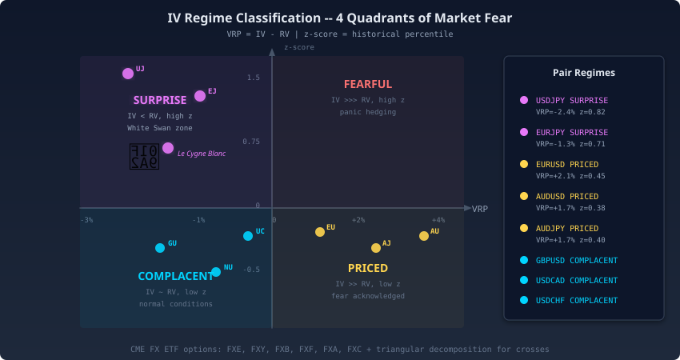

 

<h3 align="center"><em>MoneyProd for Dummies</em></h3>
<h4 align="center">The Complete Guide to Understanding an Autonomous Trading System Without a PhD in Computer Science</h4>

 <strong>Author:</strong> <a href="https://linkedin.com/in/timothy-lokotar/">Timothy Lokotar</a> · <a href="https://www.moneyprod.com/">MoneyProd</a> 
 <a href="https://www.moneyprod.com/">Live Dashboard</a> · <a href="https://linkedin.com/in/timothy-lokotar/">LinkedIn</a>

---

> *You do not need to understand how a combustion engine works to appreciate that a car goes faster than a horse. But if someone hands you the keys to a Formula 1 car and says "it drives itself," you might want to understand what is under the hood.*
>
> *This document is the hood, lifted.*

---

## Part I: The Big Picture

### Chapter 1: What Is MoneyProd?

> **IN THIS CHAPTER:**
> - What the system does in plain English
> - Why it exists
> - How it makes decisions

Somewhere in a data center, a machine wakes up 120 times a week, reads the global financial pulse, and decides what to do with real money before most humans have finished their coffee.

Imagine you hired 19 researchers, each one an expert in a different area of the financial world. One watches what retail traders are doing. Another reads the news. A third studies the options market. A fourth tracks the global economy, stock markets, bond yields, oil prices, gold.

Every hour, all 19 researchers submit their reports. A panel of 4 judges, each using a different analytical framework, reviews the reports and votes on what the currency market will do next. A risk manager then decides how much money to bet on that vote. And a safety officer checks 9 independent alarm systems to make sure nothing dangerous is happening.

The entire process takes **168 seconds**. Less than 3 minutes. Then it repeats. Every hour. Five days a week. Without human intervention.

That is MoneyProd.

In technical terms, it is a **fully autonomous algorithmic trading system** that trades 8 currency pairs (like EUR/USD and USD/JPY) across 8 brokerage accounts at Interactive Brokers. But you do not need to know what "algorithmic" means to understand the rest of this document.

> **TIP:** MoneyProd is like a very disciplined employee who never sleeps, never gets emotional, and follows the same decision process every single hour. No hunches, no excitement after a win, no depression after a loss. Just data.

But what exactly happens in those 168 seconds? It turns out quite a lot can fit into less time than it takes to boil an egg.

---

### Chapter 2: The 168-Second Heartbeat

> **IN THIS CHAPTER:**
> - What happens every hour
> - The pipeline in plain English
> - Why timing matters

It is 6:55 AM in New York. The London session is in full swing, Tokyo is winding down, and a clock somewhere ticks past the 55-minute mark. That tick sets everything in motion.

Every hour, at 55 minutes past the hour (6:55, 7:55, 8:55...), MoneyProd wakes up. In the next 168 seconds, it will:

| Step | Time | What Happens | The Analogy |
|------|------|-------------|-------------|
| **1. Gather Data** | 0-56s | Scrape 19 data sources simultaneously | 19 reporters calling their sources |
| **2. Analyze** | 56-103s | Calculate 240 theories + train ML models | Detectives analyzing the evidence |
| **3. Forecast** | 103-106s | Generate 4-day probability forecasts | Weather forecasters drawing maps |
| **4. Debate** | 106-108s | 4 judges vote on market direction | A courtroom deliberation |
| **5. Size** | 108-109s | Calculate how much to trade (8 safety layers) | The risk manager saying "this much, no more" |
| **6. Execute** | 109-155s | Write the CSV that controls 32 strategies | Sending orders to the trading floor |
| **7. Clean Up** | 155-168s | Diagnostics, reports, health checks | The janitor checking every door is locked |

At **155 seconds**, the CSV file is written. This file tells MultiCharts (the trading platform) which of the 32 strategies should be active, in which direction (buy or sell), and with what position size. The platform reads it, and orders flow to the broker.

> **REMEMBER:** The system does not trade directly. It writes a file that *tells* the trading platform what to do. A general who writes orders that soldiers execute, the general never swings the sword.

The orders have been written. But where did the intelligence come from? Meet the 19 researchers who brief the generals.

---

### Chapter 3: The 19 Researchers

> **IN THIS CHAPTER:**
> - Where the data comes from
> - What each source tells us
> - Why more sources are better

MoneyProd gathers data from **19 different sources**, running in parallel (all at the same time) to save time. Like sending 19 reporters out simultaneously rather than one by one:

**Sentiment Sources** (What are other traders doing?)
- 4 brokers and platforms report what percentage of their clients are buying vs. Selling each currency pair. When 80% of retail traders are buying, it is often a contrarian signal, the crowd tends to be wrong at extremes.

**Institutional Sources** (What are the big players doing?)
- The CFTC (a US government agency) publishes weekly data on how large institutions are positioned. When hedge funds are massively short the Euro, it means serious money expects the Euro to fall.

**News & Calendar** (What is happening in the world?)
- A natural language processing model (FinBERT) reads financial news headlines and scores them as positive, negative, or neutral for each currency. The economic calendar flags upcoming events (interest rate decisions, employment reports) that could move markets.

**Options Market** (How scared are people?)
- Options prices reveal how much volatility the market *expects*. When options prices are unusually high, the market is scared. When they are low, the market is complacent. MoneyProd classifies each pair into one of four "fear states", we will cover this in Chapter 9.

**Prediction Markets** (What do bettors think will happen?)
- Platforms like Kalshi and Polymarket let people bet on specific outcomes (Will the Fed raise rates? Will inflation exceed 3%?). These prediction market prices are remarkably accurate because bettors have real money at stake.

**Macro Data** (What is the global economy doing?)
- This is the newest addition: 25 data series from Yahoo Finance and the Federal Reserve, covering stock markets (VIX, Nikkei, Eurostoxx), bond yields (US, UK, Australia, Germany, Italy), commodities (oil, gold, copper), and economic indicators (ISM Manufacturing, recession probability).

> **TIP:** The 19 sources are 19 different windows into the same room. Each shows a different angle. No single window gives you the full picture, but together they reveal things that no single perspective could.

The researchers have filed their reports. Now four very different minds will argue about what it all means.

---

## Part II: The Four Judges

### Chapter 4: The ML Detective

> **IN THIS CHAPTER:**
> - How the machine learning model works
> - The "5 detectives in a room" analogy
> - Why ensemble methods beat single models

Most trading systems have one brain. This one has five, and they compete for the right to be heard.

The ML (Machine Learning) model is the **loudest voice** in the system, it accounts for 50% of the final decision. But it is not a single model. It is 5 models working together in a setup called a **Mixture of Experts**.

**The Detective Analogy:**

Imagine a crime scene. You bring in 5 detectives, each trained in a different investigative technique:

| Detective | Specialty | Real Model |
|-----------|----------|-----------|
| **Detective A** | Reads body language (sequential clues) | AdaBoost |
| **Detective X** | Analyzes physical evidence (data patterns) | XGBoost |
| **Detective L** | Speed-reads thousands of documents | LightGBM |
| **Detective C** | Expert in witness categories | CatBoost |
| **Detective R** | Coordinates and picks the best theory | Random Forest |

Each detective examines the same evidence (134 data points per currency pair) and reaches their own conclusion: the market will go UP, DOWN, or SIDEWAYS.

Then Detective R (the "Meta-Classifier") reviews all four conclusions and picks the one that is most likely to be right, based on which detective has been most accurate recently and in similar situations.

That is why the ML model is called a "Mixture of Experts", five brains competing, and the smartest one wins.

> **TECHNICAL STUFF:** The 134 features per pair come from the 19 data sources: sentiment scores, institutional positioning, theory calculations, volatility measures, prediction market probabilities, and macro indicators. The ML model treats all of these as "evidence" and classifies the most likely market direction.

The detectives have reached a verdict. But one of the other judges would like to talk about probability, and what the weather might do four days from now.

---

### Chapter 5: The Weather Forecaster

> **IN THIS CHAPTER:**
> - How the 4-day forecast works
> - The Markov chain concept (simplified)
> - Why probability beats certainty

Anyone can tell you what happened. The hard part is telling you what happens next, and how sure you should be about it.

The second judge (28% of the vote) is a **4-day probabilistic forecaster**. Instead of predicting what *will* happen, it predicts the *probability* of different outcomes.

**The Weather Forecast Analogy:**

A weather forecaster does not say "it will rain tomorrow at 2:37 PM." They say "there is a 70% chance of rain." This is more useful because it tells you *how confident* to be. A 70% chance of rain means bring an umbrella; a 95% chance means cancel the picnic.

The forecast model uses **Markov transition matrices**, a fancy way of saying "what happens next depends on what is happening now." If the market is currently trending up, the transition matrix tells you the probability of it continuing up (say 60%), reversing down (25%), or going sideways (15%).

The model computes these probabilities for each of the next 4 days, for each pair, by analyzing how markets have historically transitioned between different states (trending, ranging, volatile, calm).

> **TIP:** The forecast contributes 28% of the final vote. When the forecast strongly agrees with the ML model, confidence goes up. When they disagree, confidence drops, and the system trades smaller or not at all. Disagreement between judges is treated as a warning sign, not a bug.

Two judges have spoken. The third one does not care about statistics or transition matrices. It only cares about one thing: what worked last time.

---

### Chapter 6: The Reinforcement Learning Agent

> **IN THIS CHAPTER:**
> - What reinforcement learning means
> - The "poker player" analogy
> - Why learning from mistakes matters

The third judge (12% of the vote) is a **Reinforcement Learning (RL) agent**. Unlike the other models, which learn from historical data, the RL agent learns from its own *actions and their consequences*.

**The Poker Player Analogy:**

Imagine a poker player who keeps a mental scoreboard: "Every time I bluffed on a low pair in late position, I lost money. Every time I raised with two high cards when the table was cautious, I won." Over thousands of hands, the player develops an intuition for which actions work in which situations.

The RL agent does exactly this. It has played 6,832 "hands" (trades), recording the outcome of each one. Its "scoreboard" (called a Q-table) maps every combination of market state + action to an expected reward.

| Market State | Action | Expected Reward |
|-------------|--------|----------------|
| Trending + ML says LONG + sources agree | BUY | +0.8% |
| Ranging + ML says LONG + sources disagree | BUY | -0.3% |
| Volatile + ML says SHORT + high conviction | SELL | +0.5% |
| Volatile + ML says SHORT + low conviction | DO NOTHING | +0.1% |

The RL agent sees the current market state, looks up which action has historically produced the best outcome in similar situations, and votes accordingly.

> **REMEMBER:** The RL agent only has 12% of the vote because it is still young, 6,832 experiences is a lot for a human but relatively little for a learning algorithm. As it accumulates more data and its predictions prove accurate, the system will gradually increase its voting weight. This is called *progressive trust*.

Three judges have weighed in on the details. The fourth one walks to the window and looks at the whole economy.

---

### Chapter 7: The Macro Economist

> **IN THIS CHAPTER:**
> - What the macro layer does
> - The "global weather system" analogy
> - How cross-asset data improves FX predictions

The fourth judge (10% of the vote) is the newest addition: a **macro composite signal** that looks beyond the currency market to understand what the global economy is saying about FX direction.

**The Global Weather System Analogy:**

Currency movements do not happen in a vacuum. When the US stock market crashes, the Japanese yen rises (it is a "safe haven" currency). When copper prices fall, the Australian dollar tends to fall too (Australia exports a lot of copper). When European bond yields rise, the euro strengthens.

The macro economist tracks these relationships through **8 pair-specific factor models**, one for each currency pair. Each model watches exactly 4 factors that are most relevant to that pair:

| Pair | What It Watches | Why |
|------|----------------|-----|
| **AUD/USD** | AU-US yield spread, BHP (iron ore), Copper, VIX | Australia is a commodity exporter |
| **USD/JPY** | US-JP yield spread, Nikkei, TLT bond ETF, VIX | Japan is sensitive to US yields and equity risk |
| **EUR/USD** | DE-US yield spread, Eurostoxx, Gold, VIX | Euro follows European growth and safe-haven flows |
| **GBP/USD** | UK-US yield spread, FTSE, Copper, VIX | Sterling follows UK growth and global risk |

> **TIP:** The macro economist is the "big picture" voice in the room. While the ML detective examines 134 tiny clues, the macro economist steps back and says: "Wait, the global economy is in recession. Commodity currencies are going to struggle regardless of what the sentiment data says." This broader perspective is why the macro signal was added.

The four judges have cast their votes. But before a single dollar moves, the decision must survive an obstacle course designed by a deeply paranoid safety engineer.

---

## Part III: The Safety Officer

### Chapter 8: Nine Alarm Systems

> **IN THIS CHAPTER:**
> - Why safety matters more than signals
> - The "submarine" analogy
> - What each of the 9 shields does

In trading, the thing that kills you is never the risk you were watching. It is the one you forgot to check.

MoneyProd has **9 independent safety systems**, borrowing a design philosophy from nuclear power plants and submarines: **defense in depth**.

**The Submarine Analogy:**

A submarine has multiple hull layers, multiple air systems, multiple communication systems, and multiple propulsion backups. If one fails, the others keep the crew alive. No single failure can sink the boat.

MoneyProd's 9 shields work the same way. Each one monitors a different type of risk. None of them talk to each other (so a bug in one cannot disable another). Any single shield can reduce or halt trading *independently*.

| Shield | What It Watches | The Analogy |
|--------|----------------|-------------|
| **1. IV Regime** | How scared the options market is | The smoke detector |
| **2. PnL Circuit Breaker** | Weekly loss limits | The emergency stop button |
| **3. Crowding Penalty** | Too many bets in one direction | The "don't put all eggs in one basket" rule |
| **4. TWS Cross-Validation** | Broker connection health | The backup communication system |
| **5. Data Integrity** | Data freshness (9 checkpoints) | The quality inspector |
| **6. CSI v2 Strategy Health** | Individual strategy performance | The personnel review board |
| **7. Vol Kill Switch** | Global market panic | The tsunami warning system |
| **8. Macro Regime** | Economic cycle phase | The seasonal weather forecast |
| **9. RME Order Guard** | Order execution integrity | The traffic controller |

> **WARNING:** The most dangerous moment in trading is when everything appears to be working perfectly. Complacency kills. The 9 shields are designed to catch problems *before* they become catastrophic, even when human operators would see nothing wrong.

Nine shields sounds thorough. But shield number one deserves its own chapter, because it does something most safety systems would never dare: sometimes, it tells the system to take *more* risk.

---

### Chapter 9: The Fear Quadrant

> **IN THIS CHAPTER:**
> - What implied volatility means (simply)
> - The 4 fear states
> - The White Swan concept

One of the most powerful safety systems is the **IV Regime Classifier**. It answers a simple question: *how scared is the market?*

**The Insurance Analogy:**

Insurance premiums tell you how risky the insurance company thinks you are. High premiums = high perceived risk. The options market works the same way: when traders pay more for options (higher "implied volatility"), they expect bigger price moves.

MoneyProd compares what the market *expects* (implied volatility) with what *actually happened* (realized volatility). This comparison reveals 4 states:

| State | What It Means | Real-World Analogy | System Response |
|-------|-------------|-------------------|----------------|
| **COMPLACENT** | Expected vol matches actual vol | Clear skies, normal insurance rates | Trade normally |
| **PRICED** | Expected vol much higher than actual | Buying flood insurance during a drought | Slight caution (85% size) |
| **FEARFUL** | Everything is elevated, panic hedging | Buying ALL the insurance at ANY price | Reduce exposure (70% size) |
| **SURPRISE** | Actual vol exceeds expected vol | A storm hitting when no one bought insurance | *Increase* exposure (120% size) |

The SURPRISE state is called **Le Cygne Blanc** (The White Swan), the opposite of Nassim Taleb's Black Swan. Where a Black Swan is a catastrophe no one predicted, a White Swan is an *opportunity* hiding in plain sight. The market is moving fast but has not figured it out yet. MoneyProd sees this as a chance to increase exposure while the market adjusts.

> **REMEMBER:** Most trading systems reduce exposure when volatility spikes. MoneyProd asks *why* volatility spiked. If the options market has not caught up to reality yet, the system increases exposure, trading against the market's miscalibrated fear gauge.

The White Swan hunts for hidden opportunity. But what about the moments when the danger is real and everywhere at once? That is when the loudest alarm in the building goes off.

---

### Chapter 10: The Tsunami Warning System

> **IN THIS CHAPTER:**
> - What the vol kill switch does
> - The "multiple weather stations" analogy
> - When the system shuts down completely

The **Cross-Asset Volatility Kill Switch** is the most powerful safety system. It monitors 4 different measures of market stress simultaneously:

1. **VIX**, US stock market fear gauge
2. **FX Implied Volatility**, Currency-specific fear
3. **OVX**, Oil market volatility
4. **TLT Volatility**, Bond market stress

**The Multiple Weather Stations Analogy:**

Imagine you have 4 weather stations, each measuring a different thing: wind speed, barometric pressure, water temperature, and seismic activity. If any *one* station shows extreme readings, you issue a warning. If *multiple* stations show extreme readings simultaneously, you order a full evacuation.

The vol kill switch works the same way. It computes a z-score (a measure of "how unusual is this?") for each of the 4 volatility measures:

| Condition | Classification | What Happens |
|-----------|---------------|-------------|
| All z-scores < 2.0 | **NORMAL** | Trade normally (100% size) |
| Any z-score > 2.0 | **ELEVATED** | Cut all positions to 50% |
| Any z-score > 4.0 | **CRISIS** | Halt ALL trading (0% size) |

A z-score of 2.0 means "this level of volatility is more extreme than 97.5% of the last year." A z-score of 4.0 means "this has almost never happened in the past year." When the vol kill switch activates, it overrides everything, no matter what the 4 judges say, no matter how confident the ML model is, the system will not trade.

> **TIP:** The vol kill switch has been triggered only a few times since deployment. Each time, markets were experiencing genuine multi-asset stress (like a geopolitical crisis or a surprise central bank decision). In every case, reducing exposure was the right call. The switch does not prevent you from *missing* a trade, it prevents you from being *destroyed* by one.

So far we have met the researchers, the judges, and the safety officers. But who, exactly, are the 32 soldiers carrying out the orders? They have quite the origin story.

---

## Part IV: How Strategies Were Born

### Chapter 11: The Strategy Forge

> **IN THIS CHAPTER:**
> - How 10 million strategies became 32
> - The "talent show" analogy
> - Why destruction is the goal

What if you could audition ten million candidates for a job and only hire the 32 who survived every test you could invent?

The 32 trading strategies that MoneyProd manages were not designed by a human. They were **discovered by a machine** through a process that started with 10 million random candidates and destroyed 99.99968% of them.

**The World's Longest Talent Show:**

Imagine a talent show with 10 million contestants. But this is not a normal talent show, it has **9 rounds**, and each round tests something completely different:

| Round | Test | Contestants Remaining |
|-------|------|----------------------|
| 1 | Can you perform at all? (Genetic evolution) | 50,000 |
| 2 | Can you perform when we add random noise? (Monte Carlo) | 5,000 |
| 3 | Can you perform on a different stage? (Walk-forward) | 500 |
| 4 | Can you perform with slightly different equipment? (Parameters) | 150 |
| 5 | Can you perform in a different country? (Multi-market) | 80 |
| 6 | Can you perform with weights on your ankles? (Slippage) | 50 |
| 7 | Final audition with the hardest judges (Final verdict) | **32** |

Each round tests a *different* dimension of ability. A contestant who has a beautiful voice (profitable backtest) but cannot sing with a different microphone (parameter sensitivity) or in a different venue (multi-market testing) is eliminated. Only the genuinely versatile survive all 9 rounds.

### The 32 Survivors

The surviving strategies form a perfectly balanced team:

- **16 buy-side + 16 sell-side** (when buyers lose, sellers win)
- **16 trend-followers + 16 mean-reverters** (different skills for different markets)
- **4 per currency pair** across 8 pairs
- **4 per account** across 8 brokerage accounts

> **REMEMBER:** The 32 strategies are not "smart." They are *simple*, each one uses at most 2 rules for entering a trade. Their power comes from surviving an incredibly brutal selection process. Marathon runners who made it not because of fancy shoes, but because a training program that destroyed 99.99% of candidates could not break them.

The 32 survivors know *what* to do. Now someone has to decide how much money to put on the line.

---

## Part V: The Control Room

### Chapter 12: The 8-Layer Sizing Cascade

> **IN THIS CHAPTER:**
> - How the system decides trade size
> - The "8 speed bumps" analogy
> - Why every layer can only reduce, never increase

Knowing which way to go is only half the problem. The other half, the one that separates survivors from casualties, is knowing how much to wager.

Once the 4 judges have decided *what* to trade (direction), the system must decide *how much* to trade. This is arguably more important than direction, a good direction with terrible sizing can still lose money.

MoneyProd uses an **8-layer cascade** where each layer can only reduce the position size, never increase it:

**The 8 Speed Bumps Analogy:**

Imagine driving down a street with 8 speed bumps. You start at the speed limit (maximum position size based on account equity). Each speed bump can slow you down but never speed you up:

| Speed Bump | What It Checks | How It Slows You Down |
|------------|---------------|----------------------|
| **1. Equity Base** | How much money is in the account? | Sets the maximum speed |
| **2. ATR Scaling** | How volatile is this pair right now? | Slower in volatile conditions |
| **3. Leverage Cap** | Are we using too much borrowed money? | Hard limit on borrowing |
| **4. Kelly Criterion** | What is the mathematically optimal bet size? | Slows you if edge is thin |
| **5. Vol Kill Switch** | Is the global market in crisis? | Can stop you completely |
| **6. Macro Regime** | Are we in a recession? | Slower in bad economies |
| **7. IV Regime** | How scared is the options market? | Slower when fear is high |
| **8. White Swan** | Is there a hidden opportunity? | Can *slightly* speed up (only case) |

> **WARNING:** Layer 5 (Vol Kill Switch) is the only layer that can bring the position to **zero**, a full stop. Layers 6-7 reduce but never fully block. Layer 8 (White Swan) is the only layer that can slightly increase size, and only in the rare SURPRISE regime where implied volatility is underpricing realized risk.

The cascade decides the size. But how does the system know whether a strategy even deserves to trade at all? That requires a performance review, and these strategies get one every single hour.

---

### Chapter 13: The Strategy Health Monitor

> **IN THIS CHAPTER:**
> - How CSI v2 works
> - The "employee performance review" analogy
> - Why graduated penalties beat on/off switches

Each of the 32 strategies is monitored by **CSI v2** (Composite Strategy Index), a health scoring system that works like an employee performance review:

| CSI Score | Rating | What Happens |
|-----------|--------|-------------|
| 80-100 | Excellent | Full trading size (100%) |
| 60-79 | Good | Slightly reduced (75%) |
| 40-59 | Developing | Half size (50%) |
| 20-39 | Needs Improvement | Quarter size (25%) |
| 10-19 | On Probation | Minimal exposure (10%) |
| 0-9 | Suspended | No trading (0%) |

The CSI score is computed from three dimensions:
- **Profitability**: Is the strategy making money?
- **Risk**: Is the strategy taking reasonable risks?
- **Confidence**: Do we have enough data to judge?

**The Rehabilitation Path:**

Unlike the old system (which either fully authorized or fully blocked strategies), CSI v2 allows **gradual rehabilitation**. A strategy that drops to CSI 25 gets reduced duties, not the boot. Over time, if it performs well on paper trades and its metrics improve, it climbs back up the ladder.

> **TIP:** The graduated approach prevents a common problem in trading systems: permanently blocking a good strategy because of a bad week. Markets go through cycles, and a trend-following strategy will underperform in range-bound markets without actually being broken. CSI v2 reduces exposure during bad periods while preserving the option to recover when conditions change.

Individual strategies are monitored. But what about the world outside the currency market? Currencies do not move in isolation, and the system knows it.

---

## Part VI: The Global View

### Chapter 14: The Macro Layer (Simplified)

> **IN THIS CHAPTER:**
> - Why the global economy matters for currency trading
> - Three macro safety systems
> - The "seasons" analogy

The macro layer steps back from the detailed currency analysis to ask a bigger question: *What is the state of the world?*

**The Seasons Analogy:**

You would not plant tomatoes in December. Similarly, you should not trade the same way in an economic recession as you would in an economic expansion. The macro layer identifies the current "economic season":

| Season | Economic State | How the System Responds |
|--------|---------------|------------------------|
| **Spring** (RECOVERY) | Economy bouncing back | Slightly larger trades (+10%) |
| **Summer** (EXPANSION) | Economy growing steadily | Normal trade sizes |
| **Autumn** (LATE EXPANSION) | Growth slowing, risks building | Slightly smaller trades (-10%) |
| **Winter** (RECESSION) | Economy contracting | Much smaller trades (-40%) |

The system determines the season by watching two key indicators:
- **ISM Manufacturing Index**: Above 50 = factories are busy = economy growing. Below 50 = contraction.
- **Recession Probability**: A number from 0% to 100% published by the Federal Reserve.

> **REMEMBER:** The macro regime changes slowly, over months, not hours. This is by design. The system should not panic because of a single bad economic report. Instead, it slowly adjusts its risk appetite as the economic environment evolves.

The system trades, adjusts, and adapts. But who watches the watcher? As it turns out, MoneyProd does not trust itself either.

---

### Chapter 15: Monitoring: The Night Watch

> **IN THIS CHAPTER:**
> - How the system watches itself
> - The "hospital ICU" analogy
> - Discord alerts and the diagnostic prompt

A trading system that cannot detect its own failures is a bomb with a slow fuse. MoneyProd was built by someone who understands this.

**The Hospital ICU Analogy:**

In a hospital ICU, patients are connected to dozens of monitors: heart rate, blood pressure, oxygen levels, temperature. A single abnormal reading triggers an alert. Multiple abnormal readings trigger a code blue.

MoneyProd monitors itself with the same intensity:

- **17 inline probes** (Stage 1 through POST) check data quality as it flows through the pipeline
- **9 watchdog nodes** verify data freshness across all critical databases
- **50+ diagnostic checks** organized into 14 categories (data, ML, risk, execution, infrastructure, macro...)
- **Discord notifications** fire instantly for critical events (stuck orders, negative account funds, vol kill switch activation)

When the pipeline grade drops below A, the system automatically generates a **diagnostic prompt**, a structured document that describes exactly what went wrong and how to fix it. A car that prints its own repair manual when the check-engine light comes on.

> **TIP:** The monitoring systems are more complex than the trading systems themselves, and deliberately so. In production trading, a bad signal costs you one trade. A monitoring failure can cost you days of undetected problems. The greatest risk is always a system that *thinks* it is working correctly when it is not.

Researchers, judges, safety officers, strategies, sizing, monitoring. It is time to see the full picture.

---

## Part VII: Putting It All Together

### Chapter 16: The Complete Picture

> **IN THIS CHAPTER:**
> - How all the pieces connect
> - The "orchestra" analogy
> - Why the whole is greater than the sum

If you have made it this far, you have met every department in the building. Now step outside and watch the whole thing move.

**The Orchestra Analogy:**

MoneyProd is an orchestra. The 19 data sources are the musicians. The 4 judges (ML, Forecast, RL, Macro) are the section leaders. The meta-signal resolver is the conductor. The 8-layer sizing cascade is the sound engineer. And the 9 safety shields are the fire marshals stationed at every exit.

No single musician makes the music, and no single judge makes the decision. The power comes from coordinating many independent voices, each contributing a different perspective, all constrained by a system that values caution over confidence.

The result:
- 19 data sources, scraped every hour
- 134 features per pair, 1,072 total
- 4 competing intelligences with different analytical frameworks
- 8 layers of position sizing, each one a constraint
- 9 independent safety systems
- 32 strategies, each a survivor of 10 million candidates
- 8 currency pairs across 8 brokerage accounts

All coordinated by a single 168-second pipeline that repeats every hour, autonomously, without human intervention.

> **REMEMBER:** The system is designed to be *boring*. Exciting trading systems blow up. MoneyProd aims to be the most reliably unexciting machine in the room, making small, well-considered decisions, hour after hour, day after day, a metronome that turns data into alpha.

---

### Chapter 17: Frequently Asked Questions

> **IN THIS CHAPTER:**
> - Common questions answered simply
> - Misconceptions corrected

Every explanation raises new questions. Here are the ones people ask most often.

**Q: Can the system lose money?**
A: Yes. The system has losing trades, losing days, and losing weeks. No trading system wins every time. The goal is to win *more often* and *more profitably* than it loses over longer periods. The 9 safety shields exist to prevent catastrophic losses, not to prevent all losses.

**Q: What happens if the internet goes down?**
A: The system monitors connectivity to both IB Gateway instances. If either gateway is unreachable, the pipeline aborts before generating any signals. Existing positions remain in place (protected by their own exit logic inside MultiCharts), and the system retries on the next hourly cycle.

**Q: What happens during a flash crash?**
A: The Vol Kill Switch monitors 4 independent volatility measures. During a flash crash, at least one (usually VIX) will spike above the z-score threshold, triggering ELEVATED or CRISIS mode. In CRISIS mode, all new trading is halted. Existing positions are managed by their MultiCharts strategies, which have their own exit logic.

**Q: Why 32 strategies and not 100?**
A: The 9-stage gauntlet is calibrated to produce approximately 32 survivors from 10 million candidates. More strategies would mean lower quality thresholds. Fewer strategies would mean insufficient diversification. 32 provides the optimal balance: 4 per pair, perfectly balanced across direction and style.

**Q: Why 8 accounts?**
A: Risk isolation. Each account holds 4 strategies (2 Long + 2 Short, 2 Trend + 2 Mean-Reversion). If one account experiences an unusual drawdown, the other 7 accounts are unaffected. The dual-gateway architecture (4 accounts per gateway) adds another layer of isolation: if one gateway fails, the other 4 accounts continue trading.

**Q: Does the system need a human to work?**
A: For daily operations, no. The system is fully autonomous. However, a human monitors the Discord alerts, reviews the weekly diagnostic report, and makes strategic decisions about system configuration. Think of it as a self-driving car that still has a human in the passenger seat monitoring the dashboard.

---

### Glossary

| Term | Plain English |
|------|-------------|
| **ATR** | Average True Range, how much a pair typically moves in one bar |
| **CSV** | Comma-Separated Values, a simple spreadsheet file |
| **CSI** | Composite Strategy Index, the strategy health score |
| **DLL** | Dynamic Link Library, a small program that the trading platform calls |
| **IV** | Implied Volatility, how much movement the options market expects |
| **Kelly Criterion** | A math formula for the optimal bet size given your edge |
| **MCPT** | MultiCharts Portfolio Trader, the trading platform |
| **MoE** | Mixture of Experts, 5 ML models competing for the best prediction |
| **NLV** | Net Liquidation Value, total account value |
| **OOS** | Out-of-Sample, data never seen during strategy development |
| **PnL** | Profit and Loss |
| **RL** | Reinforcement Learning, learning from action-reward feedback |
| **RV** | Realized Volatility, how much a pair actually moved |
| **VRP** | Volatility Risk Premium, difference between IV and RV |
| **z-score** | How many standard deviations from the average (2 = unusual, 4 = extreme) |

---

*You have reached the end of MoneyProd for Dummies. The system is more complex than any single document can fully capture, but if you understood the 19 researchers, the 4 judges, the 9 safety shields, the 8-layer sizing cascade, and the 32 strategies forged from 10 million candidates, you understand the essential architecture of a production autonomous trading system.*

*The machine runs without sleep, without panic, without hope, executing hour after hour with the mechanical precision of a system built to be right more often than wrong, and to survive the times when it is wrong.*
