

 

<h3 align="center"><em>MoneyProd pour les Nuls</em></h3>
<h4 align="center">Le guide complet pour comprendre un système de trading autonome sans doctorat en informatique</h4>

 <strong>Auteur :</strong> <a href="https://linkedin.com/in/timothy-lokotar/">Timothy Lokotar</a> · <a href="https://www.moneyprod.com/">MoneyProd</a> 
 <a href="https://www.moneyprod.com/">Dashboard en direct</a> · <a href="https://linkedin.com/in/timothy-lokotar/">LinkedIn</a>

---

> *On n'a pas besoin de comprendre le fonctionnement d'un moteur à combustion pour apprécier qu'une voiture va plus vite qu'un cheval. Mais si quelqu'un vous tend les clés d'une Formule 1 en disant "elle conduit toute seule," il serait peut-être sage de jeter un œil sous le capot.*
>
> *Ce document, c'est le capot, soulevé.*

---

## Partie I : Vue d'ensemble

### Chapitre 1: Qu'est-ce que MoneyProd ?

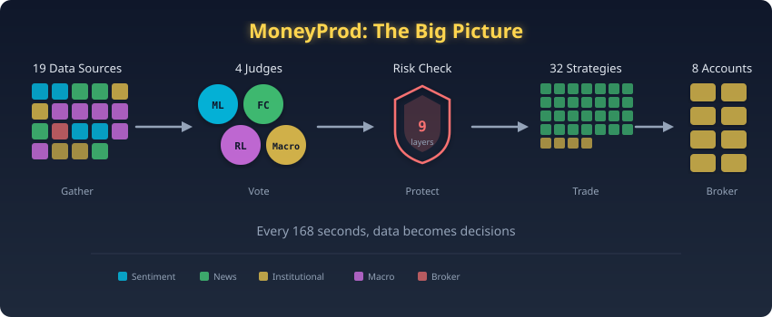

> **DANS CE CHAPITRE :**
> - Ce que le système fait, en français simple
> - Pourquoi il existe
> - Comment il prend ses décisions

Il existe, quelque part entre New York et Tokyo, une machine qui ne dort jamais, ne doute jamais, et prend 120 décisions par semaine avec l'argent d'autrui. Voici comment elle raisonne.

Imaginez que vous engagiez 19 chercheurs, chacun expert dans un domaine différent du monde financier. L'un observe ce que font les traders particuliers. Un autre lit les actualités. Un troisième étudie le marché des options. Un quatrième suit l'économie mondiale, marchés boursiers, rendements obligataires, cours du pétrole, de l'or.

Toutes les heures, les 19 chercheurs remettent leurs rapports. Un panel de 4 juges, chacun utilisant une méthode d'analyse différente, examine les rapports et vote sur ce que le marché des devises va faire ensuite. Un gestionnaire des risques décide alors combien d'argent miser sur ce vote. Et un officier de sécurité vérifie 9 systèmes d'alarme indépendants pour s'assurer que rien de dangereux ne se passe.

L'ensemble du processus prend **168 secondes**. Moins de 3 minutes. Puis il se répète. Toutes les heures. Cinq jours par semaine. Sans intervention humaine.

Voilà MoneyProd.

En termes techniques, c'est un **système de trading algorithmique entièrement autonome** qui négocie 8 paires de devises (comme EUR/USD et USD/JPY) sur 8 comptes de courtage chez Interactive Brokers. Mais vous n'avez pas besoin de savoir ce qu'"algorithmique" signifie pour comprendre la suite de ce document.

> **ASTUCE :** MoneyProd fonctionne comme un employé extrêmement discipliné qui ne dort jamais, ne ressent aucune émotion, et suit le même processus de décision chaque heure. Il n'a pas d'intuitions. Il ne s'excite pas après un gain ni ne déprime après une perte. Il suit les données, point final.

Mais que se passe-t-il, exactement, dans ces 168 secondes ? Il se trouve qu'on peut faire tenir un monde entier dans moins de temps qu'il n'en faut pour faire cuire un œuf.

---

### Chapitre 2: Le battement de cœur de 168 secondes

> **DANS CE CHAPITRE :**
> - Ce qui se passe chaque heure
> - Le pipeline en langage courant
> - Pourquoi le timing est crucial

Il est 6h55 du matin à New York. Londres bat son plein, Tokyo ferme les yeux, et une horloge quelque part franchit la barre des 55 minutes. Ce tic-tac déclenche tout.

Toutes les heures, à 55 minutes passees (6h55, 7h55, 8h55...), MoneyProd se reveille. Dans les 168 secondes qui suivent, il va :

| Étape | Temps | Ce qui se passe | L'analogie |
|-------|-------|----------------|-----------|
| **1. Collecter** | 0-56s | Aspirer 19 sources de données simultanément | 19 reporters appelant leurs sources |
| **2. Analyser** | 56-103s | Calculer 240 théories + entrainer les modèles ML | Des détective analysant les preuves |
| **3. Prévoir** | 103-106s | Générer des prévisions probabilistes à 4 jours | Des météorologues dessinant des cartes |
| **4. Débattre** | 106-108s | 4 juges votent sur la direction du marché | Une délibération de tribunal |
| **5. Dimensionner** | 108-109s | Calculer combien trader (8 couches de sécurité) | Le gestionnaire des risques disant "ce montant, pas plus" |
| **6. Executer** | 109-155s | Écrire le fichier CSV qui contrôle 32 stratégies | Envoyer les ordres au parquet |
| **7. Nettoyer** | 155-168s | Diagnostics, rapports, vérifications | Le gardien vérifiant chaque porte |

A la **155eme seconde**, le fichier CSV est écrit. Ce fichier indique a MultiCharts (la plateforme de trading) quelles stratégies parmi les 32 doivent être actives, dans quelle direction (achat ou vente), et avec quelle taille de position. La plateforme le lit, et les ordres partent vers le courtier.

> **RETENIR :** Le système ne trade pas directement. Il écrit un fichier qui *dit* à la plateforme de trading quoi faire. Pensez à un général qui rédige des ordres que les soldats exécutent. Le général ne manie pas l'épée.

Les ordres sont rédigés. Mais d'ou vient l'intelligence qui les nourrit ? Faisons connaissance avec les 19 chercheurs qui briefent l'état-major.

---

### Chapitre 3: Les 19 chercheurs

> **DANS CE CHAPITRE :**
> - D'où viennent les données
> - Ce que chaque source nous apprend
> - Pourquoi plus de sources, c'est mieux

MoneyProd collecte des données auprès de **19 sources différentes**, en parallèle (toutes en même temps) pour gagner du temps. C'est comme envoyer 19 reporters simultanément plutôt que l'un après l'autre :

**Sources de sentiment** (Que font les autres traders ?)
- 4 courtiers et plateformes rapportent quel pourcentage de leurs clients achète ou vend chaque paire de devises. Quand 80% des traders particuliers achetent, c'est souvent un signal contrarian, la foule a tendance à avoir tort aux extrêmes.

**Sources institutionnelles** (Que font les gros joueurs ?)
- La CFTC (une agence gouvernementale américaine) publie chaque semaine la position des grandes institutions. Quand les hedge funds sont massivement vendeurs sur l'Euro, cela signifie que l'argent sérieux s'attend à une baisse de l'Euro.

**Actualités et calendrier** (Que se passe-t-il dans le monde ?)
- Un modèle de traitement du langage naturel (FinBERT) lit les titres d'actualités financières et les note comme positifs, négatifs ou neutres pour chaque devise. Le calendrier économique signale les événements à venir (décisions de taux d'intérêt, rapports sur l'emploi) susceptibles de faire bouger les marchés.

**Marche des options** (A quel point les gens ont-ils peur ?)
- Les prix des options révèlent combien de volatilité le marché *anticipe*. Quand les prix des options sont anormalement élevés, le marché a peur. Quand ils sont bas, le marché est complaisant. MoneyProd classe chaque paire dans l'un des quatre "états de peur", nous en parlerons au Chapitre 9.

**Marches de prédiction** (Que pensent les parieurs ?)
- Des plateformes comme Kalshi et Polymarket permettent aux gens de parier sur des résultats spécifiques (La Fed va-t-elle relever ses taux ? L'inflation va-t-elle dépasser 3% ?). Ces prix sont remarquablement précis parce que les parieurs ont de l'argent réel en jeu.

**Données macro** (Que fait l'économie mondiale ?)
- C'est l'ajout le plus récent : 25 séries de données provenant de Yahoo Finance et de la Réserve Fédérale, couvrant les marchés boursiers (VIX, Nikkei, Eurostoxx), les rendements obligataires (US, UK, Australie, Allemagne, Italie), les matières premières (pétrole, or, cuivre), et les indicateurs économiques (ISM Manufacturing, probabilité de récession).

> **ASTUCE :** Les 19 sources sont comme 19 fenêtres différentes donnant sur la même pièce. Chaque fenêtre montre un angle différent. Aucune ne donne l'image complète, mais ensemble elles révèlent des choses qu'aucune perspective isolée ne pourrait montrer.

Les chercheurs ont déposé leurs rapports sur la table. Maintenant, quatre esprits très différents vont se disputer le sens de tout cela.

---

## Partie II : Les quatre juges

### Chapitre 4: Le détective ML

> **DANS CE CHAPITRE :**
> - Comment fonctionne le modèle de machine learning
> - L'analogie des "5 détective dans une pièce"
> - Pourquoi les ensembles battent les modèles uniques

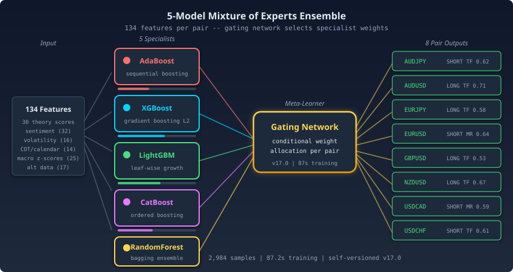

La plupart des systèmes de trading ont un cerveau. Celui-ci en possède cinq, et ils se livrent une guerre silencieuse à chaque cycle.

Le modèle ML (Machine Learning) est la **voix la plus forte** du système, il represente 50% de la décision finale. Mais ce n'est pas un modèle unique. C'est 5 modèles travaillant ensemble dans une configuration appelée **Mixture of Experts** (mélange d'experts).

**L'analogie du détective :**

Prenons une scene de crime. Vous faites venir 5 détective, chacun forme à une technique d'investigation différent :

| Détective | Specialite | Vrai modèle |
|-----------|-----------|------------|
| **Détective A** | Lit le langage corporel (indices sequentiels) | AdaBoost |
| **Détective X** | Analyse les preuves physiques (patterns de données) | XGBoost |
| **Détective L** | Lit des milliers de documents à toute vitesse | LightGBM |
| **Détective C** | Expert en catégories de temoins | CatBoost |
| **Détective R** | Coordonne et choisit la meilleure théorie | Random Forest |

Chaque détective examine les mêmes preuves (134 points de données par paire de devises) et arrive à sa propre conclusion : le marché va monter, descendre, ou stagner.

Ensuite, le Détective R (le "Meta-Classificateur") examine les quatre conclusions et choisit celle qui a le plus de chances d'être juste, en fonction de quel détective a été le plus précis récemment et dans des situations similaires.

C'est pour cela que le modèle ML s'appelle un "Mélange d'Experts", ce n'est pas un cerveau, ce sont cinq cerveaux en compétition, et le plus malin l'emporte.

> **DÉTAIL TECHNIQUE :** Les 134 features par paire proviennent des 19 sources de données : scores de sentiment, positionnement institutionnel, calculs de théories, mesures de volatilité, probabilités des marches de prédiction et indicateurs macro. Le modèle ML traite tout cela comme des "preuves" et classifie la direction de marché la plus probable.

Les détective ont rendu leur verdict. Mais un autre juge demande la parole, et celui-ci ne s'interesse qu'aux probabilités et à ce que le temps fera dans quatre jours.

---

### Chapitre 5: Le météorologue

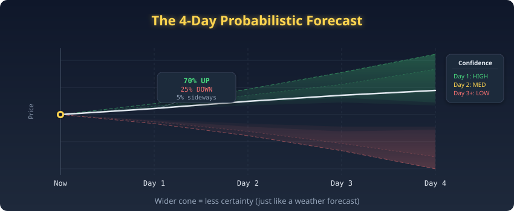

> **DANS CE CHAPITRE :**
> - Comment fonctionnent les prévisions à 4 jours
> - Le concept de chaine de Markov (simplifie)
> - Pourquoi la probabilité bat la certitude

Dire ce qui s'est passe, tout le monde sait faire. Le vrai talent, c'est de dire ce qui va se passer, et à quel point on devrait y croire.

Le deuxième juge (28% du vote) est un **prévisionniste probabiliste à 4 jours**. Il ne prédit pas ce qui *va* se passer, il prédit la *probabilité* de différents résultats.

**L'analogie de la météo :**

Un météorologue ne dit pas "il pleuvra demain a 14h37." Il dit "il y a 70% de chances de pluie." C'est plus utile parce que cela vous dit *à quel point être confiant*. 70% de chances de pluie signifie prenez un parapluie ; 95% signifie annulez le pique-nique.

Le modèle de prévision utilise des **matrices de transition de Markov**, une façon élégante de dire "ce qui se passe ensuite dépend de ce qui se passe maintenant." Si le marché est actuellement en tendance haussière, la matrice de transition vous donne la probabilité qu'il continue à monter (disons 60%), qu'il inverse à la baisse (25%), ou qu'il stagne (15%).

> **ASTUCE :** La prévision contribue à 28% du vote final. Quand la prévision est fortement en accord avec le modèle ML, la confiance augmente. Quand ils sont en désaccord, la confiance chute, et le système trade moins ou pas du tout. Le désaccord entre juges est traite comme un signal d'alerte, pas comme un défaut.

Deux juges se sont exprimés. Le troisième se moque des statistiques et des matrices de transition. Il n'a qu'une seule question : la dernière fois qu'on a fait ça, est-ce qu'on a gagné ?

---

### Chapitre 6: L'agent d'apprentissage par renforcement

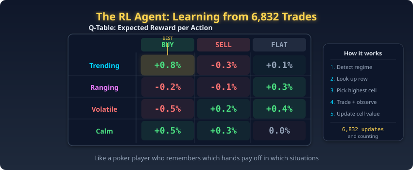

> **DANS CE CHAPITRE :**
> - Ce que signifie l'apprentissage par renforcement
> - L'analogie du "joueur de poker"
> - Pourquoi apprendre de ses erreurs compte

Le troisième juge (12% du vote) est un **agent de Reinforcement Learning (RL)**, un modèle qui apprend non pas à partir de données historiques, mais de ses propres *actions et de leurs conséquences*.

**L'analogie du joueur de poker :**

Prenons un joueur de poker qui tient un tableau de bord mental : "Chaque fois que j'ai bluffe avec une petite paire en position tardive, j'ai perdu de l'argent. Chaque fois que j'ai relance avec deux grosses cartes quand la table etait prudente, j'ai gagné." Au fil de milliers de mains, le joueur développe une intuition pour savoir quelles actions fonctionnent dans quelles situations.

L'agent RL fait exactement cela. Il a joué 6 832 "mains" (trades), enregistrant le résultat de chacune. Son "tableau de bord" (appelé Q-table) associe chaque combinaison d'état de marché + action à une récompense attendue.

> **RETENIR :** L'agent RL n'a que 12% du vote parce qu'il est encore jeune, 6 832 expériences, c'est beaucoup pour un humain mais relativement peu pour un algorithme d'apprentissage. A mesure qu'il accumule plus de données et que ses prédictions s'avèrent précises, le système augmentera graduellement son poids de vote. C'est ce qu'on appelle la *confiance progressive*.

Trois juges ont délibéré sur les détails. Le quatrième s'approche de la fenêtre et contemple l'économie dans son ensemble.

---

### Chapitre 7: Le macro-économiste

> **DANS CE CHAPITRE :**
> - Ce que fait la couche macro
> - L'analogie du "système météorologique mondial"
> - Comment les données cross-asset améliorent les prévisions FX

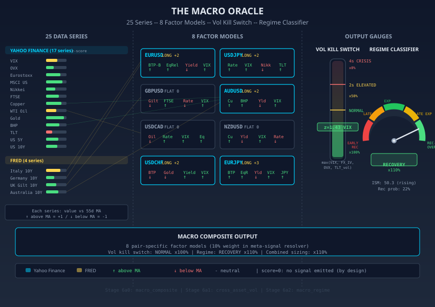

Le quatrième juge (10% du vote) est le plus récent ajout : un **signal composite macro** qui regarde au-delà du marché des devises pour comprendre ce que l'économie mondiale dit sur la direction du FX.

**L'analogie du système météorologique mondial :**

Les mouvements de devises ne se produisent pas dans le vide. Quand le marché boursier américain s'effondre, le yen japonais monte (c'est une devise "refuge"). Quand le prix du cuivre baisse, le dollar australien a tendance à baisser aussi (l'Australie exporte beaucoup de cuivre). Quand les rendements obligataires européens montent, l'euro se renforce.

Le macro-économiste suit ces relations à travers **8 modèles factoriels spécifiques à chaque paire**, un pour chaque paire de devises. Chaque modèle surveille exactement 4 facteurs les plus pertinents pour cette paire :

| Paire | Ce qu'il surveille | Pourquoi |
|-------|-------------------|----------|
| **AUD/USD** | Écart de taux AU-US, BHP (minerai de fer), Cuivre, VIX | L'Australie est un exportateur de matières premières |
| **USD/JPY** | Écart de taux US-JP, Nikkei, ETF obligataire TLT, VIX | Le Japon est sensible aux taux US et au risque actions |
| **EUR/USD** | Écart de taux DE-US, Eurostoxx, Or, VIX | L'Euro suit la croissance européenne et les flux refuges |
| **GBP/USD** | Écart de taux UK-US, FTSE, Cuivre, VIX | La Livre suit la croissance britannique et le risque mondial |

> **ASTUCE :** Le macro-économiste est la voix "vue d'ensemble" dans la pièce. Pendant que le détective ML examine 134 petits indices, le macro-économiste prend du recul et dit : "Attendez, l'économie mondiale est en récession. Les devises de matières premières vont souffrir, peu importe ce que les données de sentiment disent." C'est cette perspective plus large qui justifie l'ajout du signal macro.

Les quatre juges ont vote. Mais avant qu'un seul centime ne bouge, la décision doit survivre à un parcours d'obstacles conçu par un ingénieur profondément paranoïaque.

---

## Partie III : L'officier de sécurité

### Chapitre 8: Neuf systèmes d'alarme

> **DANS CE CHAPITRE :**
> - Pourquoi la sécurité compte plus que les signaux
> - L'analogie du "sous-marin"
> - Ce que fait chacun des 9 boucliers

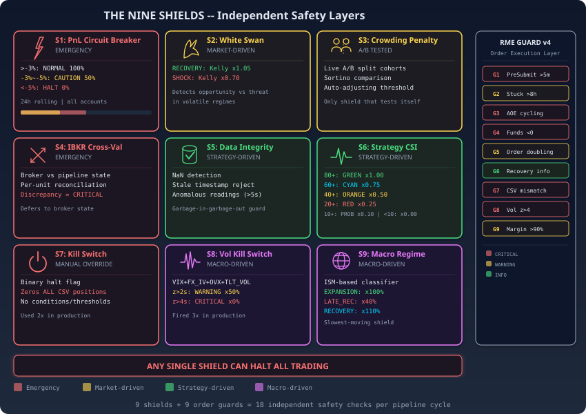

En trading, ce qui vous tue n'est jamais le risque que vous surveilliez. C'est celui que vous aviez oublie de vérifier.

MoneyProd dispose de **9 systèmes de sécurité indépendant**, et ce n'est pas un hasard. C'est une philosophie de conception empruntée aux centrales nucléaires et aux sous-marins : la **défense en profondeur**.

**L'analogie du sous-marin :**

Un sous-marin possède plusieurs couches de coque, plusieurs systèmes d'air, plusieurs systèmes de communication et plusieurs systèmes de propulsion de secours. Si l'un tombe en panne, les autres maintiennent l'équipage en vie. Aucune défaillance unique ne peut couler le bateau.

Les 9 boucliers de MoneyProd fonctionnent de la même manière. Chacun surveille un type de risque différent. Aucun ne communique avec les autres (ainsi un bug dans l'un ne peut pas désactiver un autre). N'importe quel bouclier peut réduire ou arrêter le trading *indépendamment*.

| Bouclier | Ce qu'il surveille | L'analogie |
|----------|-------------------|-----------|
| **1. Régime IV** | Le niveau de peur du marché des options | Le détecteur de fumée |
| **2. Coupe-circuit PnL** | Les limites de perte hebdomadaires | Le bouton d'arrêt d'urgence |
| **3. Penalite de crowding** | Trop de paris dans une seule direction | La regle "ne mettez pas tous vos œufs dans le même panier" |
| **4. Cross-validation TWS** | Sante de la connexion courtier | Le système de communication de secours |
| **5. Intégrité des données** | Fraîcheur des données (9 points de contrôle) | L'inspecteur qualité |
| **6. Sante CSI v2** | Performance individuelle des stratégies | Le comite d'évaluation du personnel |
| **7. Vol Kill Switch** | Panique sur les marchés mondiaux | Le système d'alerte tsunami |
| **8. Régime macro** | Phase du cycle économique | Les prévisions météo saisonnières |
| **9. Garde RME** | Intégrité de l'exécution des ordres | Le controleur aerien |

> **ATTENTION :** Le moment le plus dangereux en trading, c'est quand tout semble fonctionner parfaitement. La complaisance tue. Les 9 boucliers sont conçus pour attraper les problèmes *avant* qu'ils ne deviennent catastrophiques, même quand les opérateurs humains ne verraient rien d'anormal.

Neuf boucliers, c'est méticuleux. Mais le premier mérite un chapitre à lui seul, car il fait quelque chose qu'aucun système de sécurité n'oserait normalement : parfois, il dit au système de prendre *plus* de risque.

---

### Chapitre 9: Le quadrant de la peur

> **DANS CE CHAPITRE :**
> - Ce que signifie la volatilité implicite (simplement)
> - Les 4 états de peur
> - Le concept du Cygne Blanc

L'un des systèmes de sécurité les plus puissants est le **classificateur de régime IV**. Il répond à une question simple : *à quel point le marché a-t-il peur ?*

**L'analogie de l'assurance :**

Les primes d'assurance vous disent à quel point la compagnie d'assurance vous considere comme risque. Primes élevées = risque percu élevé. Le marché des options fonctionne de la même façon : quand les traders paient plus cher pour les options (volatilité "implicite" plus élevée), ils anticipent des mouvements de prix plus importants.

MoneyProd compare ce que le marché *anticipe* (volatilité implicite) avec ce qui *s'est réellement passe* (volatilité réalisée). Cette comparaison révèle 4 états :

| État | Ce que cela signifie | Analogie | Reponse du système |
|------|---------------------|----------|-------------------|
| **COMPLAISANT** | Vol attendue = vol réelle | Ciel degage, primes normales | Trader normalement |
| **PRICE** | Vol attendue >> vol réelle | Acheter une assurance inondation pendant la sécheresse | Legere prudence (85%) |
| **APEURÉ** | Tout est élevé, hedging panique | Acheter TOUTES les assurances à N'IMPORTE quel prix | Réduire l'exposition (70%) |
| **SURPRISE** | Vol réelle > vol attendue | Une tempête frappant quand personne n'a acheté d'assurance | *Augmenter* l'exposition (120%) |

L'état SURPRISE est le plus fascinant. Il s'appelle **Le Cygne Blanc**, l'opposé du Cygne Noir de Nassim Taleb. Là où un Cygne Noir est une catastrophe que personne n'avait prédite, un Cygne Blanc est une *opportunité* cachée à la vue de tous. Le marché bouge vite mais ne l'a pas encore compris. MoneyProd voit cela comme une chance d'augmenter l'exposition pendant que le marché s'ajuste.

*Le Cygne Blanc s'envole*, quand la peur est mal calibrée, l'opportunité prend son envol.

> **RETENIR :** Le concept du Cygne Blanc est unique a MoneyProd. La plupart des systèmes de trading reduisent leur exposition quand la volatilité augmente. MoneyProd demande *pourquoi* la volatilité a augmente. Si la réponse est "le marché des options n'a pas encore rattrape la realite," le système augmente son exposition, tradant contre la jauge de peur mal calibrée du marché.

Le Cygne Blanc chasse l'opportunité cachee. Mais que faire quand le danger est réel, partout, et simultane ? C'est alors que la plus forte alarme du bâtiment se déclenche.

---

### Chapitre 10: Le système d'alerte tsunami

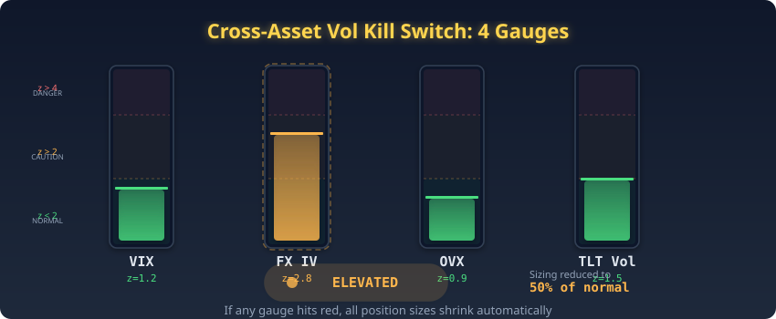

> **DANS CE CHAPITRE :**
> - Ce que fait le vol kill switch
> - L'analogie des "stations meteorologiques multiples"
> - Quand le système s'arrête complètement

Le **Kill Switch de Volatilité Cross-Asset** est le système de sécurité le plus puissant. Il surveille 4 mesures différentes de stress du marché simultanément :

1. **VIX**, Jauge de peur du marché boursier américain
2. **Volatilité implicite FX**, Peur spécifique aux devises
3. **OVX**, Volatilité du marché pétrolier
4. **Volatilité TLT**, Stress du marché obligataire

**L'analogie des stations meteorologiques multiples :**

Prenons 4 stations meteorologiques, chacune mesurant une chose différent : la vitesse du vent, la pression barometrique, la température de l'eau et l'activité sismique. Si une *seule* station montre des lectures extrêmes, vous emettez un avertissement. Si *plusieurs* stations montrent des lectures extrêmes simultanément, vous ordonnez une évacuation totale.

Le vol kill switch fonctionne de la même façon. Il calcule un z-score (une mesure de "à quel point c'est inhabituel ?") pour chacune des 4 mesures de volatilité :

| Condition | Classification | Ce qui se passe |
|-----------|---------------|----------------|
| Tous les z-scores < 2.0 | **NORMAL** | Trader normalement (100%) |
| Un z-score > 2.0 | **ÉLEVÉ** | Réduire toutes les positions à 50% |
| Un z-score > 4.0 | **CRISE** | Arreter TOUT le trading (0%) |

Un z-score de 2.0 signifie "ce niveau de volatilité est plus extrême que 97.5% de l'année écoulée." Un z-score de 4.0 signifie "cela ne s'est presque jamais produit dans l'année écoulée." Quand le vol kill switch s'active, il prend le dessus sur tout, peu importe ce que disent les 4 juges, peu importe la confiance du modèle ML, le système ne tradera pas.

> **ASTUCE :** Le vol kill switch n'à ete déclenche que quelques fois depuis le déploiement. À chaque fois, les marchés subissaient un véritable stress multi-actifs (comme une crise géopolitique où une décision surprise de banque centrale). À chaque fois, réduire l'exposition etait la bonne décision.

Nous avons rencontre les chercheurs, les juges, et les gardiens. Mais qui sont, au juste, les 32 soldats qui exécutent les ordres ? Leur histoire d'origine vaut le detour.

---

## Partie IV : Comment les stratégies sont nées

### Chapitre 11: La forge à stratégies

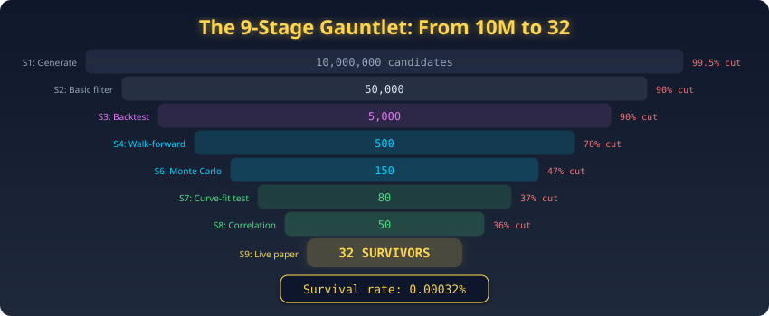

> **DANS CE CHAPITRE :**
> - Comment 10 millions de stratégies sont devenues 32
> - L'analogie du "concours de talents"
> - Pourquoi la destruction est l'objectif

Et si l'on pouvait auditionner dix millions de candidats pour n'en garder que les 32 qu'aucune épreuve n'a reussi a briser ?

Les 32 stratégies de trading que MoneyProd gère n'ont pas ete conçues par un humain. Elles ont ete **découvertes par une machine** à travers un processus qui a commencé àvec 10 millions de candidates aleatoires et en a détruit 99,99968%.

**Le plus long concours de talents au monde :**

Imaginez un concours de talents avec 10 millions de candidats. Mais ce n'est pas un concours ordinaire, il comporte **9 tours**, et chaque tour teste quelque chose de complètement différent :

| Tour | Test | Candidats restants |
|------|------|-------------------|
| 1 | Savez-vous performer ? (Évolution génétique) | 50 000 |
| 2 | Avec du bruit aléatoire ? (Monte Carlo) | 5 000 |
| 3 | Sur une scene différent ? (Walk-forward) | 500 |
| 4 | Avec un équipement légèrement différent ? (Parametres) | 150 |
| 5 | Dans un pays différent ? (Multi-marché) | 80 |
| 6 | Avec des poids aux chevilles ? (Slippage) | 50 |
| 7 | Audition finale avec les juges les plus sévères | **32** |

Chaque tour teste une *dimension différente* de compétence. Un candidat qui a une belle voix (backtest profitable) mais qui ne peut pas chanter avec un micro différent (sensibilité aux paramètres) ou dans un lieu différent (test multi-marché) est éliminé.

### Les 32 survivants

Les stratégies survivantes forment une équipe parfaitement équilibrée :

- **16 acheteurs + 16 vendeurs** (quand les acheteurs perdent, les vendeurs gagnent)
- **16 suiveurs de tendance + 16 retour à la moyenne** (différentes compétences pour différents marches)
- **4 par paire de devises** sur 8 paires
- **4 par compte** sur 8 comptes de courtage

> **RETENIR :** Les 32 stratégies ne sont pas "intelligentes." Elles sont *simples*, chacune utilise au plus 2 règles pour entrer dans un trade. Leur puissance ne vient pas de la complexité mais du fait qu'elles ont survécu à un processus de sélection incroyablement brutal. Elles sont comme des marathoniens : pas rapides grâce à des chaussures spéciales, mais rapides parce qu'ils ont survécu à un programme d'entraînement qui a détruit tous ceux qui n'étaient pas genuinement, constitutionnellement, irrévocablement faits pour la distance.

Les 32 survivantes savent *quoi* faire. Reste a décider combien d'argent mettre en jeu, et c'est la que la prudence devient un art.

---

## Partie V : La salle de contrôle

### Chapitre 12: La cascade de dimensionnement à 8 couches

> **DANS CE CHAPITRE :**
> - Comment le système décide la taille des trades
> - L'analogie des "8 ralentisseurs"
> - Pourquoi chaque couche ne peut que réduire, jamais augmenter

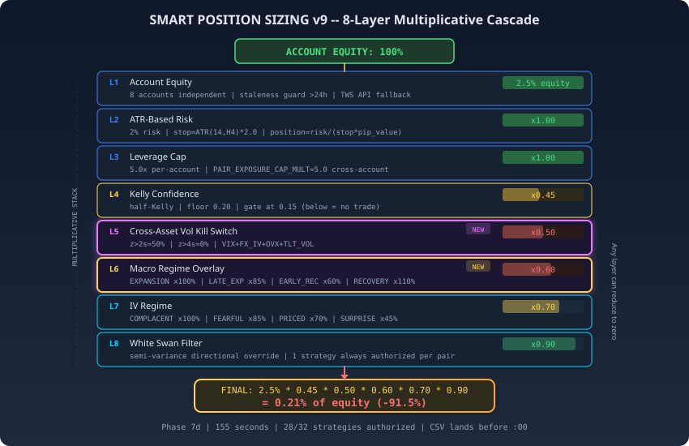

Savoir ou aller ne represente que la moitie du problème. L'autre moitie, celle qui séparé les survivants des victimes, c'est de savoir combien miser.

Une fois que les 4 juges ont décide *quoi* trader (direction), le système doit décider *combien* trader. C'est sans doute plus important que la direction, une bonne direction avec un mauvais dimensionnement peut quand même faire perdre de l'argent.

MoneyProd utilise une **cascade à 8 couches** où chaque couche ne peut que réduire la taille de la position, jamais l'augmenter :

**L'analogie des 8 ralentisseurs :**

Prenons une rue avec 8 ralentisseurs. Vous démarrez à la vitesse maximale (taille de position maximale basee sur les capitaux propres du compte). Chaque ralentisseur peut vous freiner mais jamais vous accélérer :

| Ralentisseur | Ce qu'il vérifie | Comment il vous freine |
|-------------|-----------------|----------------------|
| **1. Base d'équité** | Combien d'argent y a-t-il dans le compte ? | Fixe la vitesse maximale |
| **2. Echelle ATR** | A quel point cette paire est-elle volatile en ce moment ? | Plus lent en conditions volatiles |
| **3. Plafond de levier** | Utilisons-nous trop d'argent emprunte ? | Limite dure sur l'emprunt |
| **4. Critere de Kelly** | Quelle est la taille de pari mathematiquement optimale ? | Freine si l'avantage est mince |
| **5. Vol Kill Switch** | Le marché mondial est-il en crise ? | Peut vous arrêter complètement |
| **6. Régime macro** | Sommes-nous en récession ? | Plus lent en mauvaise économie |
| **7. Régime IV** | A quel point le marché des options a-t-il peur ? | Plus lent quand la peur est élevée |
| **8. Cygne Blanc** | Y a-t-il une opportunite cachee ? | Peut *légèrement* accélérer (seul cas) |

> **ATTENTION :** La couche 5 (Vol Kill Switch) est la seule qui peut amener la position a **zero**, un arrêt complet. Les couches 6-7 reduisent mais ne bloquent jamais complètement. La couche 8 (Cygne Blanc) est la seule qui peut légèrement augmenter la taille, et uniquement dans le rare régime SURPRISE.

La cascade décide de la taille. Mais comment savoir si une stratégie mérite encore de trader ? Cela nécessite une évaluation de performance, et ces stratégies en subissent une toutes les heures.

---

### Chapitre 13: Le moniteur de santé des stratégies

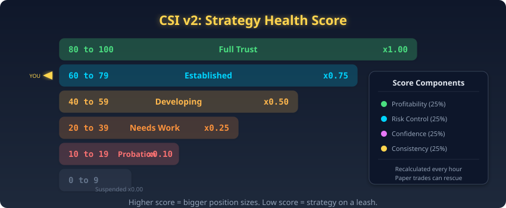

> **DANS CE CHAPITRE :**
> - Comment fonctionne CSI v2
> - L'analogie de "l'évaluation de performance de l'employé"
> - Pourquoi les pénalités graduées battent les interrupteurs marche/arrêt

Chacune des 32 stratégies est surveillée par **CSI v2** (Composite Strategy Index), un système de notation de santé qui fonctionne comme une évaluation de performance :

| Score CSI | Evaluation | Ce qui se passe |
|-----------|-----------|----------------|
| 80-100 | Excellent | Taille de trading complete (100%) |
| 60-79 | Bon | Légèrement réduit (75%) |
| 40-59 | En développement | Demi-taille (50%) |
| 20-39 | A améliorer | Quart de taille (25%) |
| 10-19 | En probation | Exposition minimale (10%) |
| 0-9 | Suspendu | Pas de trading (0%) |

> **ASTUCE :** L'approche graduée empeche un problème courant dans les systèmes de trading : bloquer définitivement une bonne stratégie à cause d'une mauvaise semaine. Les marches passent par des cycles. Une stratégie de suivi de tendance sous-performera dans les marchés à range, mais cela ne signifie pas qu'elle est cassée. CSI v2 réduit l'exposition pendant les mauvaises périodes tout en préservant la possibilite de récupération quand les conditions changent.

Les stratégies individuelles sont surveillees. Mais qu'en est-il du monde au-delà du marché des devises ? Les monnaies ne bougent pas dans le vide, et le système le sait.

---

## Partie VI : La vue globale

### Chapitre 14: La couche macro (simplifiée)

> **DANS CE CHAPITRE :**
> - Pourquoi l'économie mondiale compte pour le trading de devises
> - Trois systèmes de sécurité macro
> - L'analogie des "saisons"

La couche macro est la façon dont le système prend du recul par rapport à l'analyse détaillée des devises pour poser une question plus large : *Quel est l'état du monde ?*

**L'analogie des saisons :**

On ne plante pas de tomates en décembre. De même, on ne devrait pas trader de la même manière en récession économique qu'en expansion. La couche macro identifie la "saison économique" actuelle :

| Saison | État économique | Comment le système réagit |
|--------|----------------|--------------------------|
| **Printemps** (REPRISE) | L'économie rebondit | Trades légèrement plus grands (+10%) |
| **Été** (EXPANSION) | L'économie croit régulièrement | Tailles de trade normales |
| **Automne** (EXPANSION TARDIVE) | Croissance ralentissant, risques s'accumulant | Trades légèrement plus petits (-10%) |
| **Hiver** (RECESSION) | L'économie se contracte | Trades beaucoup plus petits (-40%) |

> **RETENIR :** Le régime macro change lentement, sur des mois, pas des heures. C'est par conception. Le système ne devrait pas paniquer à cause d'un seul mauvais rapport économique. Au lieu de cela, il ajuste lentement son appétit pour le risque à mesure que l'environnement économique évolue.

Le système trade, s'ajuste, s'adapte. Mais qui surveille le surveillant ? Il s'avere que MoneyProd ne se fait pas confiance à lui-même non plus.

---

### Chapitre 15: La veille de nuit

> **DANS CE CHAPITRE :**
> - Comment le système se surveille lui-même
> - L'analogie du "service de reanimation"
> - Alertes Discord et le prompt de diagnostic

Un système de trading incapable de détecter ses propres défaillances est une bombe à retardement. MoneyProd a été construit par quelqu'un qui le sait.

**L'analogie du service de reanimation :**

Dans un service de reanimation, les patients sont connectes à des dizaines de moniteurs : rythme cardiaque, pression artérielle, niveaux d'oxygène, température. Une seule lecture anormale déclenche une alerte. Plusieurs lectures anormales déclenchent un code bleu.

MoneyProd se surveille avec la même intensite :

- **17 sondes inline** (Stage 1 a POST) vérifient la qualité des données au fur et à mesure qu'elles traversent le pipeline
- **9 noeuds de surveillance** vérifient la fraîcheur des données dans toutes les bases de données critiques
- **50+ contrôles diagnostiques** organises en 14 catégories (données, ML, risque, exécution, infrastructure, macro...)
- **Notifications Discord** se déclenchent instantanement pour les événements critiques (ordres bloques, fonds négatifs, activation du vol kill switch)

Quand la note du pipeline descend en dessous de A, le système génère automatiquement un **prompt de diagnostic**, un document structuré qui décrit exactement ce qui s'est mal passé et comment le réparer. C'est le système qui *se diagnostique lui-même*, comme une voiture qui imprime son propre manuel de réparation quand le voyant moteur s'allume.

> **ASTUCE :** Les systèmes de surveillance sont plus complexes que les systèmes de trading eux-mêmes. C'est délibéré. En trading de production, le plus grand risque n'est pas un mauvais signal, c'est un système qui *pense* fonctionner correctement alors que ce n'est pas le cas.

Chercheurs, juges, gardiens, stratégies, dimensionnement, surveillance. Il est temps de voir le tableau complet.

---

## Partie VII : Vue d'ensemble

### Chapitre 16: L'image complète

> **DANS CE CHAPITRE :**
> - Comment toutes les pièces s'emboîtent
> - L'analogie de "l'orchestre"
> - Pourquoi le tout est supérieur à la somme des parties

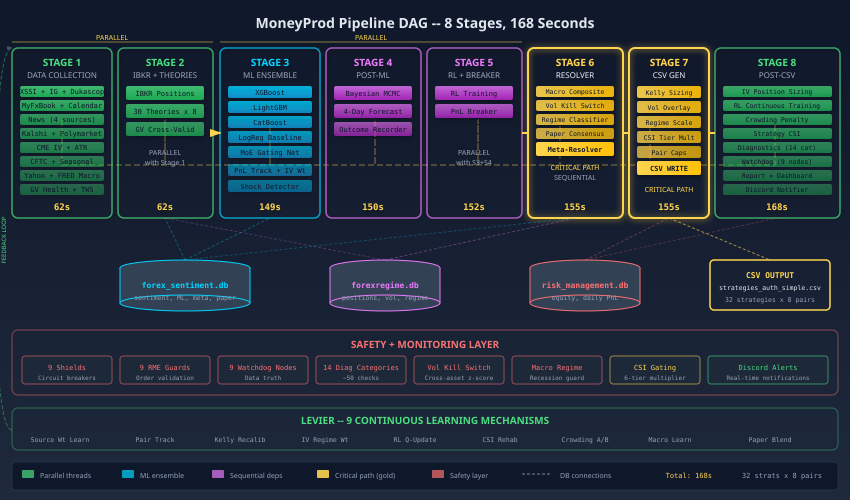

Si vous êtes arrivé jusqu'ici, vous avez visite chaque departement du bâtiment. Sortez maintenant et regardez l'ensemble fonctionner.

**L'analogie de l'orchestre :**

MoneyProd est un orchestre. Les 19 sources de données sont les musiciens. Les 4 juges (ML, Prévision, RL, Macro) sont les chefs de section. Le résolveur de meta-signal est le chef d'orchestre. La cascade de dimensionnement à 8 couches est l'ingénieur du son. Et les 9 boucliers de sécurité sont les pompiers postés à chaque sortie.

Aucun musicien seul ne fait la musique. Aucun juge seul ne prend la décision. La puissance vient de la *coordination* de nombreuses voix indépendantes, chacune apportant une perspective différente, chacune contrainte par un système qui valorise la prudence plus que la confiance.

Le résultat :
- 19 sources de données, collectees toutes les heures
- 134 features par paire, 1 072 au total
- 4 intelligences concurrentes avec des cadres analytiques différents
- 8 couches de dimensionnement, chacune une contrainte
- 9 systèmes de sécurité indépendant
- 32 stratégies, chacune survivante de 10 millions de candidates
- 8 paires de devises sur 8 comptes de courtage

Le tout coordonne par un unique pipeline de 168 secondes qui se répète chaque heure, de manière autonome, sans intervention humaine.

> **RETENIR :** Le système est conçu pour être *ennuyeux*. Ennuyeux, c'est bien. Les systèmes de trading excitants explosent. MoneyProd vise à être la machine la plus fiablement inintéressante de la pièce, prenant de petites décisions bien réfléchies, heure après heure, jour après jour, comme un métronome qui transforme les données en alpha.

---

### Chapitre 17: Questions fréquemment posées

> **DANS CE CHAPITRE :**
> - Questions courantes, réponses simples
> - Idees fausses corrigees

Toute explication suscite de nouvelles questions. Voici celles que l'on pose le plus souvent.

**Q : Le système peut-il perdre de l'argent ?**
R : Oui. Le système à des trades perdants, des jours perdants et des semaines perdantes. Aucun système de trading ne gagné à chaque fois. L'objectif est de gagner *plus souvent* et *plus profitablement* qu'il ne perd sur des périodes plus longues. Les 9 boucliers de sécurité existent pour prévenir les pertes catastrophiques, pas toutes les pertes.

**Q : Que se passe-t-il si internet tombe en panne ?**
R : Le système surveille la connectivité aux deux instances IB Gateway. Si l'une des deux est injoignable, le pipeline s'interrompt avant de générer le moindre signal. Les positions existantes restent en place (protégées par leur propre logique de sortie dans MultiCharts), et le système réessaie au cycle horaire suivant.

**Q : Que se passe-t-il pendant un flash crash ?**
R : Le Vol Kill Switch surveille 4 mesures de volatilité indépendantes. Pendant un flash crash, au moins une (généralement le VIX) va dépasser le seuil de z-score, déclenchant le mode ÉLEVÉ ou CRISE. En mode CRISE, tout nouveau trading est arrête.

**Q : Pourquoi 32 stratégies et pas 100 ?**
R : Le gauntlet a 9 étapes est calibré pour produire environ 32 survivantes sur 10 millions de candidates. Plus de stratégies signifierait des seuils de qualité plus bas. Moins de stratégies signifierait une diversification insuffisante. 32 offre l'équilibre optimal : 4 par paire, parfaitement équilibrées entre direction et style.

**Q : Le système a-t-il besoin d'un humain pour fonctionner ?**
R : Pour les opérations quotidiennes, non. Le système est entièrement autonome. Cependant, un humain surveille les alertes Discord, examine le rapport diagnostique hebdomadaire et prend des décisions stratégiques sur la configuration du système. Pensez à une voiture autonome qui a toujours un humain sur le siège passager surveillant le tableau de bord.

---

### Glossaire

| Terme | En français simple |
|-------|-------------------|
| **ATR** | Average True Range, combien une paire bouge typiquement en une barre |
| **CSV** | Comma-Separated Values, un fichier tableur simple |
| **CSI** | Composite Strategy Index, le score de santé de la stratégie |
| **DLL** | Dynamic Link Library, un petit programme appelé par la plateforme |
| **IV** | Implied Volatility, combien de mouvement le marché des options anticipe |
| **Kelly** | Un critere mathematique pour la taille de pari optimale |
| **MCPT** | MultiCharts Portfolio Trader, la plateforme de trading |
| **MoE** | Mixture of Experts, 5 modèles ML en compétition pour la meilleure prédiction |
| **NLV** | Net Liquidation Value, valeur totale du compte |
| **OOS** | Out-of-Sample, données jamais vues lors du développement |
| **PnL** | Profit and Loss, profits et pertes |
| **RL** | Reinforcement Learning, apprentissage par retour d'expérience |
| **RV** | Realized Volatility, combien une paire a réellement bouge |
| **VRP** | Volatility Risk Premium, difference entre IV et RV |
| **z-score** | Combien d'écarts-types par rapport à la moyenne (2 = inhabituel, 4 = extrême) |

---

*Vous êtes arrivé à la fin de MoneyProd pour les Nuls. Le système est plus complexe que ce qu'un seul document peut pleinement capturer, mais si vous avez compris les 19 chercheurs, les 4 juges, les 9 boucliers de sécurité, la cascade de dimensionnement à 8 couches et les 32 stratégies forgées à partir de 10 millions de candidates, vous comprenez l'architecture essentielle d'un système de trading autonome en production.*

*La machine ne dort pas. Elle ne panique pas. Elle n'espere pas. Elle exécute simplement, heure après heure, avec la précision mécanique d'un système conçu pour avoir raison plus souvent qu'il n'a tort, et pour survivre aux moments où il a tort.*
