<p align="center">
 
</p>

<h3 align="center"><em>Forging Alpha</em></h3>
<h4 align="center">A Multi-Stage Evolutionary Pipeline for Statistically Robust FX Trading Strategies</h4>

<p align="center">
 <strong>Author:</strong> <a href="https://linkedin.com/in/timothy-lokotar/">Timothy Lokotar</a> · <a href="https://www.moneyprod.com/">MoneyProd</a><br>
 <a href="https://www.moneyprod.com/">Live Dashboard</a> · <a href="https://linkedin.com/in/timothy-lokotar/">LinkedIn</a>
</p>

---

> *"The forge does not create strength, it reveals it. What survives the fire was always strong. What doesn't was always an illusion."*

---

| Metric | Value |
|---|---|
| **Candidate Strategies Generated** | ~10,000,000 |
| **Validation Stages** | 9 |
| **Evolutionary Cycles** | 10 |
| **Surviving Strategies** | 32 |
| **Survival Rate** | 0.00032% |
| **Monte Carlo Simulations** | 4,000,000+ |
| **Walk-Forward Tests** | 10,000 per strategy |
| **Out-of-Sample Coverage** | 33% |
| **Deployment** | 8 pairs x 8 accounts via dual IB Gateway |

---

## Table of Contents

1. [Executive Summary](#01-executive-summary)
2. [The Curve-Fitting Problem](#02-the-curve-fitting-problem)
3. [Machine Learning in the Evolutionary Engine](#03-machine-learning-in-the-evolutionary-engine)
4. [Machine Learning in the Evolutionary Engine, Going Deeper](#04-machine-learning-in-the-evolutionary-engine----going-deeper)
5. [Pipeline Architecture Overview](#05-pipeline-architecture-overview)
6. [Stage 1, Clear Databanks](#06-stage-1----clear-databanks)
7. [Stage 2, Genetic Strategy Generation](#07-stage-2----genetic-strategy-generation)
8. [Stage 3, Monte Carlo Stress Testing](#08-stage-3----monte-carlo-stress-testing)
9. [Stage 4, Walk-Forward Matrix](#09-stage-4----walk-forward-matrix)
10. [Stage 5, Loop Control](#10-stage-5----loop-control)
11. [Stage 6, Parameter Permutation](#11-stage-6----parameter-permutation)
12. [Stage 7, Multi-Market Testing](#12-stage-7----multi-market-testing)
13. [Stage 8, Slippage Simulation](#13-stage-8----slippage-simulation)
14. [Stage 9, Final Verdict](#14-stage-9----final-verdict)
15. [Out-of-Sample Period Design](#15-out-of-sample-period-design)
16. [Critical Design Decisions](#16-critical-design-decisions)
17. [Results & Survivor Statistics](#17-results--survivor-statistics)
18. [Deployment Pipeline, From Strategy to Live Trading](#18-deployment-pipeline----from-strategy-to-live-trading)
19. [Statistical Foundation & Quantitative Validity](#19-statistical-foundation--quantitative-validity)
20. [Scientific References](#20-scientific-references)

---

## 01. Executive Summary

Ten million strategies entered a nine-stage gauntlet. Thirty-two walked out. This is the forensic account of how 9,999,968 candidates were destroyed.

This document presents the complete methodology behind the **MoneyProd strategy creation pipeline**, a systematic, multi-stage evolutionary approach to generating and validating algorithmic foreign exchange (FX) trading strategies. The pipeline is designed with a single overarching objective: **the total elimination of curve-fitting artifacts** from candidate trading strategies.

Over 10 complete evolutionary cycles, approximately **10 million randomly generated trading strategies** were subjected to a **nine-stage validation gauntlet**. Each stage tests robustness across an independent dimension, stochastic price paths, temporal stability, parameter sensitivity, cross-market generalization, and execution friction. Only strategies that demonstrate unconditional robustness across all dimensions survive.

**Final outcome: 32 strategies survived, a survival rate of 0.00032%, or approximately three survivors per million candidates.**

These 32 survivors form the live strategy portfolio deployed across 8 currency pairs (EURUSD, USDJPY, GBPUSD, USDCHF, AUDUSD, USDCAD, EURJPY, AUDJPY) on 8 brokerage accounts via Interactive Brokers (dual IB Gateway). The pipeline produces a strategy authorization CSV consumed by MultiCharts Portfolio Trader (MCPT) that manages order execution.

### Why This Matters for AI/ML Practitioners

The strategy creation pipeline is a **search-and-validation problem** at massive scale, analogous to neural architecture search (NAS) or hyperparameter optimization, but with a critical distinction: the search space is adversarial. Financial markets are non-stationary, noisy, and subject to regime changes. The validation framework must therefore be more rigorous than standard ML cross-validation to ensure that discovered patterns generalize to unseen market conditions.

The techniques presented here, genetic algorithms, Monte Carlo perturbation, walk-forward analysis, and parameter permutation, constitute a multi-dimensional robustness framework that can be adapted to any domain where overfitting to historical data is the primary failure mode.

What follows is the complete anatomy of that selection process, stage by stage, from ten million hopefuls to the thirty-two that remain.

---


## 02. The Curve-Fitting Problem

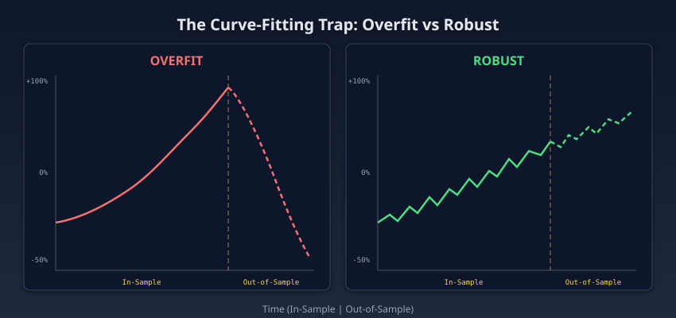

Every extinct strategy died of the same disease. Understanding that disease is prerequisite to understanding the cure.

### Definition

**Curve-fitting** (also called **overfitting** in ML terminology) occurs when a model captures noise in training data rather than the underlying signal. In quantitative finance, this manifests as trading strategies that produce exceptional backtest results but fail catastrophically when deployed on unseen market data.

### The Fundamental Paradox

```
The more perfectly a strategy fits historical data,
the more certain its failure in live trading.
```

A strategy optimized to historical price data can trivially discover patterns such as "exit at +47.3 pips" that align perfectly with past reversals. These are **retrospective pattern-matching artifacts**, they describe what happened, not what will happen.

### Analogy for ML Practitioners

Consider a neural network trained on 10 million samples and evaluated on the training set only: near-perfect accuracy on seen data, but poor generalization to unseen data. In quantitative trading, the "training set" is historical price data. The "test set" is the future, and unlike ML, you cannot collect more future data to improve your validation, you must trade it, with real capital.

### The Scale of the Problem

Consider a strategy with just 5 parameters, each tested at 10 values. The search space contains 100,000 combinations. With 3,000 trading days of history (approximately 12 years of daily data), the probability that *at least one* combination appears profitable purely by chance is:

```
P(at least one false positive) = 1 - (1 - alpha)^100000
 = 1 - (1 - 0.05)^100000
 ≈ 1.0
```

**it is virtually certain that you will find a profitable-looking strategy by accident**. This is the fundamental challenge that the 9-stage gauntlet is designed to overcome.

Profitable patterns always exist in historical data. The relevant question is whether they arise from structural market dynamics that will persist, or from statistical coincidences that will evaporate in live trading.

The 9-stage gauntlet described below separates the two. Before the gauntlet can test, the pipeline must first generate candidates at scale. That generation step requires a machine learning engine capable of discovering trading strategies that no human could design.

---


## 03. Machine Learning in the Evolutionary Engine

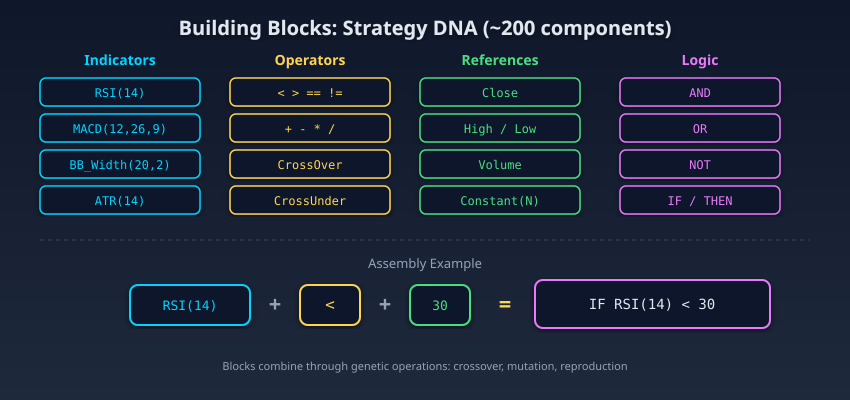

The forge runs day and night. Inside it, raw code fragments collide, recombine, and compete for the right to exist. Most will not survive their first evaluation. The few that do will face trials their creators never imagined.

### The Horse Breeder Analogy

Imagine a horse breeder who wants to produce the perfect racehorse. He does not *design* the ideal horse, he lets nature discover it:

1. **He starts with 250 random horses** (5 stables of 50)
2. **He races them** and measures their performance
3. **The best ones breed**, their "genes" combine
4. **The offspring mutate slightly**, a bit more muscle here, a bit less there
5. **He repeats for 10 generations**
6. **The survivors face 7 additional trials** of increasing brutality

After 10 breeding seasons and 10 million horses tested, **32 champions** remain.

This is exactly what the evolutionary engine does. Except instead of biological genes, the "genes" are **trading rules** composed of elementary building blocks.

### The Building Blocks: A Strategy's DNA

Each strategy is constructed from combinable blocks, like LEGO bricks:

```
BLOCK "ENTRY CONDITION" =
 [Indicator] [Operator] [Reference]

Examples:
 RSI(14) < 30
 BollingerWidth > 0.015
 MACD.Signal crosses MACD.Line
 Close > SMA(50)
```

The engine has a **library of approximately 200 blocks**:

| Category | Example Blocks | Count |
|----------|---------------|-------|
| **Oscillators** | RSI, Stochastic, CCI, Williams %R, MFI | ~25 |
| **Trend** | SMA, EMA, DEMA, TEMA, ADX, Aroon, Ichimoku | ~30 |
| **Volatility** | Bollinger Bands, ATR, Keltner, Donchian, StdDev | ~15 |
| **Volume** | OBV, VWAP, Chaikin, Accumulation/Distribution | ~10 |
| **Pattern** | Candlestick patterns, pivots, fractals | ~20 |
| **Price** | Close, Open, High, Low, typical, median | ~15 |
| **Operators** | >, <, crosses above, crosses below, is rising, is falling | ~15 |
| **References** | Constant, other indicator, price level, band | ~20 |
| **Logic** | AND, OR, grouping, negation | ~10 |
| **Time Filters** | Hour of day, day of week, session | ~10 |

The engine **randomly assembles** these blocks to create candidate strategies. Each strategy is an "individual" in the evolutionary population.

### How Strategies "Breed"

**Crossover**, Two parent strategies swap parts of their rules:

```
Parent A: IF RSI(14) < 30 AND BollingerWidth > 0.015 → BUY
Parent B: IF CCI(20) > 100 AND ADX(14) > 25 → BUY

Child 1: IF RSI(14) < 30 AND ADX(14) > 25 → BUY
Child 2: IF CCI(20) > 100 AND BollingerWidth > 0.015 → BUY
```

**Mutation**, A random block is modified:

```
Before mutation: IF RSI(14) < 30
After mutation: IF RSI(21) < 35 ← period and threshold slightly changed

Or structural mutation:
Before: IF RSI(14) < 30
After: IF Stochastic(14) < 30 ← the entire indicator is replaced
```

**Selection**, Only individuals with the highest Return-to-Drawdown ratio survive to breed. The weak are eliminated through tournament selection: 3 random strategies compete, and the one with the best fitness advances to the mating pool.

### The 5 Isolated Stables (Multi-Island Model)

The 250 strategies are distributed across **5 independent stables** of 50 each. Each stable evolves separately, like 5 Pacific islands where species evolve in isolation:

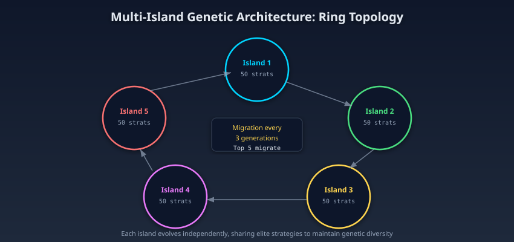

Without isolation, the entire population converges on a single local solution. Isolation forces diversity: each island explores a different region of the strategy space.

### What Makes This Machine Learning?

The evolutionary engine is a form of **program synthesis** through **genetic programming**, a branch of machine learning where the output is not a prediction but an executable program (in this case, a trading strategy).

The "learning" happens through three mechanisms:

1. **Selection pressure**, strategies that predict market direction correctly (high Return-to-Drawdown) survive and reproduce. The population's average fitness increases over generations, the system is literally learning which patterns predict returns.

2. **Recombination**, crossover discovers new combinations of indicators that neither parent had alone. This is analogous to feature interaction discovery in deep learning.

3. **Mutation**, random perturbation explores the neighborhood of existing solutions, preventing the population from getting stuck in local optima. This serves the same function as random restarts in gradient descent.

The difference from neural networks: instead of learning numerical weights through gradient descent, the evolutionary engine learns **program structure** (which indicators, which operators, which thresholds) through evolutionary pressure.

---


## 04. Machine Learning in the Evolutionary Engine: Going Deeper

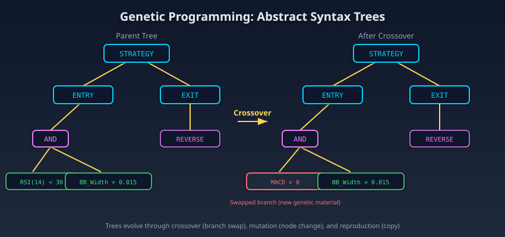

Beneath the horse breeder analogy lies a formal mathematical apparatus. The strategies are not metaphorical organisms; they are executable syntax trees undergoing genuine Darwinian selection in a combinatorial search space larger than most practitioners realize.

### Genetic Programming (GP) vs Genetic Algorithm (GA)

The engine uses **Genetic Programming** (GP, Koza 1992), not a simple genetic algorithm (GA). The distinction is fundamental:

| Property | GA (Holland 1975) | GP (Koza 1992) |
|----------|------------------|----------------|
| **Representation** | Fixed-length vector | Variable-size tree |
| **Genotype** | Binary or real-valued string | Executable program |
| **Phenotype** | Parameters of a fixed model | Structure + parameters |
| **Search space** | R^n (continuous) | Space of programs (combinatorial) |
| **Expressiveness** | Limited to model topology | Turing-complete (theoretically) |

Each trading strategy is represented as an **Abstract Syntax Tree** (AST), where internal nodes are **operators** (AND, OR, COMPARE) and leaves are **terminals** (indicators with parameters, constants, price references). The genotype is the tree; the phenotype is the trading behavior on historical data.

### Genetic Operators on Trees

**Crossover (recombination)**, Subtree exchange between two parents. Given parents P1, P2 with trees T1, T2:

1. Select a random node n1 in T1
2. Select a random node n2 in T2 (type-compatible)
3. Swap the subtrees rooted at n1 and n2

Selection probability is biased: 90% chance of selecting an internal node (operator), 10% a terminal. This bias, introduced by Koza (1992), preserves macroscopic structure while enabling recombination of functional blocks.

**Mutation**, Four types operate at different granularities:

| Type | Operation | Probability | Effect |
|------|-----------|-------------|--------|
| **Point** | Replace a node with a compatible node of the same type | 40% | RSI(14) → Stochastic(14) |
| **Subtree** | Replace a subtree with a new random subtree | 35% | Entire condition replaced |
| **Hoist** | Promote a subtree to replace its parent | 15% | Simplification (anti-bloat) |
| **Parametric** | Perturb numeric values (Gaussian, sigma = 5% of range) | 10% | RSI(14) → RSI(16) |

### Bloat Control and Parsimony Pressure

**Bloat** (non-functional growth of tree size) is the central problem in GP. Without control, trees grow indefinitely by accumulating "intron" subtrees, code that does not affect behavior but increases complexity and overfitting risk.

The engine uses three anti-bloat mechanisms:

1. **Hard limit**: Maximum 2 entry conditions (bounded tree depth). This is the most effective constraint, it makes bloat structurally impossible.

2. **Parsimony pressure** (Koza 1992): Fitness is penalized by tree size:
 ```
 fitness_adjusted = fitness_raw - lambda * tree_size
 ```
 With lambda calibrated so the penalty is negligible for simple trees (2-3 nodes) but significant for complex trees (5+ nodes).

3. **Hoist mutation**: By promoting a subtree to the root, hoist mutation systematically reduces tree size. Its 15% rate is calibrated to counterbalance crossover's tendency to increase size.

### Fitness Function: Return-to-Drawdown Ratio

The fitness function uses the Return-to-Drawdown ratio (RtDD), not raw return:

```
RtDD = Total_Return / Max_Drawdown

where:
 Total_Return = (Equity_final - Equity_initial) / Equity_initial
 Max_Drawdown = max_{t1 < t2} (Equity(t1) - Equity(t2)) / Equity(t1)
```

Optimizing raw return favors high-variance strategies, those that win big but suffer catastrophic drawdowns. RtDD penalizes volatility and rewards consistency. A strategy that gains 40% with a 10% drawdown (RtDD = 4.0) is preferred over one that gains 100% with a 50% drawdown (RtDD = 2.0).

### Schema Theorem and Building Block Hypothesis

GP convergence relies on the **Schema Theorem** (Holland 1975): schemas (partial patterns) with above-average fitness propagate exponentially through the population. The **Building Block Hypothesis** (Goldberg 1989) posits that GP discovers complex solutions by assembling low-order "building blocks" (short schemas with high fitness).

In the strategy context:
- A low-order schema: `RSI(*) < *` (any RSI in oversold condition)
- A high-order schema: `RSI(14) < 30 AND BollingerWidth(20,2) > 0.015`

GP explores low-order schemas first, then combines them through crossover to produce high-order schemas. Multi-island isolation ensures that different low-order schemas are discovered in parallel, increasing the diversity of building blocks available for recombination.

### Migration Topology: Ring vs Complete Graph

The multi-island model uses a **ring topology** (unidirectional):

```
Migration rate: mu = 5/50 = 10% of population
Migration interval: tau = 3 generations
Migration topology: Unidirectional ring (I1→I2→I3→I4→I5→I1)
Emigrant selection: Top-k (k=5, best fitness)
Replacement: Worst-k (k=5, worst fitness on receiving island)
```

The ring (vs complete graph) is chosen for a specific reason. In a complete topology (every island migrates to all others), global convergence is fast but diversity collapses. The ring imposes a **propagation delay**: a schema discovered on Island 1 takes at minimum 4 * tau = 12 generations to reach Island 5. This delay gives islands time to develop their own solutions before being "contaminated" by migrants.

Whitley et al. (1999) showed that this propagation delay reduces premature convergence by approximately 40% compared to the complete topology, at the cost of approximately 20% longer final convergence time, a favorable tradeoff when solution quality matters more than convergence speed.

### Monte Carlo: Stochastic Perturbation Theory

Stage 3 validation applies 4 simultaneous perturbations. Let S be a strategy with parameter vector theta and a trade history T = {t1, ..., tn}. Robustness is tested under:

```
T_perturbed(omega) = Permute(T) + epsilon_price(omega) + epsilon_slip(omega)
theta_perturbed(omega) = theta + epsilon_param(omega)

where:
 Permute(T) : random permutation of trade order
 epsilon_price ~ N(0, 0.003 * Close) : price noise (+/-0.3%)
 epsilon_slip ~ U(0, 0.5 pips) : uniform slippage
 epsilon_param ~ N(0, 0.05 * range) : parametric jitter (+/-5%)
 omega in Omega : probability space
```

The survival criterion:

```
median_{omega in {1,...,1000}} Return(S, T_perturbed(omega), theta_perturbed(omega))
 >= 0.6 * Return(S, T, theta)
```

The 0.6 threshold derives from **robust optimization theory** (Ben-Tal et al. 2009): a robust strategy must retain a substantial fraction of its performance under perturbation. The factor is empirically calibrated to maximize the **deflated Sharpe ratio** (Bailey & Lopez de Prado 2014) of the survivor ensemble.

### Walk-Forward: Temporal Cross-Validation

The walk-forward matrix is a form of **sequential cross-validation** (time-series split) with an additional constraint: the test sample must always be posterior to the training sample.

Formally, let D = {d1, ..., dN} be the price time series. Define:

```
IS(w_is, t_start) = {d_{t_start}, ..., d_{t_start + w_is - 1}}
OOS(w_oos, t_end) = {d_{t_end - w_oos + 1}, ..., d_{t_end}}

Constraint: max(IS) < min(OOS) (no temporal overlap)
```

The 4x4 matrix generates 16 configurations (w_is, w_oos):

```
W_IS = {60, 90, 120, 180} days
W_OOS = {30, 60, 90, 120} days
```

Each configuration is tested at 625 starting positions, sweeping the entire time series. Total: **10,000 walk-forward tests** per strategy.

The 80% threshold of profitable OOS windows is derived from the binomial test:

```
H0 : p_profitable = 0.5 (strategy has no real edge)
H1 : p_profitable > 0.5

Under H0: P(X >= 8000 | n=10000, p=0.5) < 10^{-500}

The statistical power is overwhelming: the false positive risk is
negligible even without correction for multiple comparisons.
```

### Parameter Permutation: Performance Surface Exploration

Stage 6 samples the performance surface f(theta) via **Latin Hypercube Sampling** (McKay et al. 1979).

Let theta = (theta_1, ..., theta_k) be the k-dimensional parameter vector. LHS partitions each dimension into n=3000 equal-probability intervals and samples one point per stratum, guaranteeing uniform coverage of the parametric space.

The survival criterion evaluates the **basin of attraction width**:

```
Basin_width(S) = |{theta' : RtDD(S, theta') > 1.0}| / 3000

S survives if:
 1. Basin_width(S) >= 0.70 (70% of permutations profitable)
 2. Median(RtDD(S, theta')) >= 0.50 * RtDD(S, theta_opt)
 3. Max_{theta'}(MaxDD(S, theta')) <= 2.0 * MaxDD(S, theta_opt)
```

The critical distinction is between **plateaus** and **needles** in f(theta). A plateau indicates that the signal-return relationship is robust. A needle indicates that profitability depends on exact parameter values, a classic overfitting signature.

### Multiple Comparisons Problem (MCP)

With approximately 10M candidates, false positive risk is the primary danger. The pipeline addresses the MCP through **sequential validation** rather than Bonferroni correction:

```
Bonferroni (naive): alpha_adj = 0.05 / 10^7 = 5 * 10^{-9}
 → Too conservative, would eliminate genuine strategies

Sequential validation: each stage is an independent test
 FDR_compound = Prod_{i=1}^{9} FPR_i
 = 0.005 * 0.10 * 0.10 * 0.30 * 0.53 * 0.62 * 0.50 * 0.40 * 0.64
 = 3.2 * 10^{-6}
```

This approach is superior to Bonferroni because:
1. Each stage tests an **orthogonal dimension** (randomness, time, parameters, markets, costs)
2. The tests are not repetitions of the same test, they measure different properties
3. The compound FDR is the product of individual FPRs (dimensional independence), not the sum

The **deflated Sharpe ratio** (Bailey & Lopez de Prado 2014) provides an additional framework:

```
DSR = (SR_obs - E[SR_0]) / std(SR_0)

where:
 SR_obs = observed Sharpe ratio of the strategy
 SR_0 = distribution of Sharpe ratios under H0 (no edge)
 E[SR_0] = E[max_{i=1}^N SR_i] for N strategies tested
 ≈ sqrt(2 * ln(N)) for large N (extreme value theory)

For N = 10^7:
 E[SR_0] ≈ sqrt(2 * ln(10^7)) ≈ sqrt(32.2) ≈ 5.68

A strategy must therefore have SR_obs >> 5.68 to be statistically
significant after adjustment for the MCP.
```

### Computational Complexity

Let:
- P = 250 (total population size)
- G = 10 (generations per cycle)
- C = 10 (evolutionary cycles)
- B = number of historical bars (~15,000 for 12 years of H4)
- K = number of indicators evaluated per bar (~5 per strategy)

The complexity of a complete run:

```
Stage 2 (GA): O(P * G * B * K) = O(250 * 10 * 15000 * 5) ≈ 1.9 * 10^8 evaluations
Stage 3 (MC): O(S2 * 1000 * B * K) for S2 survivors from Stage 2
Stage 4 (WF): O(S3 * 10000 * B_avg * K) for S3 survivors from Stage 3
Stage 6 (Param): O(S4 * 3000 * B * K) for S4 survivors from Stages 2-4

Total over 10 cycles ≈ 10^{11} indicator evaluations
```

This is a search-at-scale problem comparable to Neural Architecture Search (NAS, Zoph & Le 2017), operating in an adversarial search space (non-stationary markets) with a multi-dimensional validation criterion (9 stages) rather than a simple hold-out accuracy. The computational budget alone would be meaningless without the gauntlet that follows; brute force discovers candidates, but only structured elimination separates signal from noise.

### Convergence Properties

The evolutionary engine does not guarantee convergence to a global optimum, this is a fundamental limitation of all evolutionary algorithms (No Free Lunch Theorem, Wolpert & Macready 1997). However, the multi-island architecture provides several convergence properties:

1. **Exploration-exploitation balance**: Within-island evolution exploits local optima; between-island migration introduces exploration through genetic material transfer. The ring topology provides a tunable parameter (migration interval tau) to control this balance.

2. **Diversity maintenance**: The Takeover Time (the number of generations for the best individual to dominate the entire population) in a ring topology is O(sqrt(P) * tau), compared to O(log(P)) in a panmictic (single-population) model. This gives substantially more time for schema exploration.

3. **Empirical convergence signal**: The number of unique survivors (after deduplication) plateaus around cycle 7-8, indicating that the discoverable strategy space has been adequately covered. Cycles 9-10 confirm convergence without adding significant new discoveries.

4. **Population sizing theory** (Goldberg et al. 2001): For a building-block problem of order k with 2^k competing schemas per block, the minimum population size for reliable schema competition is approximately P >= 2^k * sqrt(k) * ln(l), where l is the number of building blocks. With k = 2 (maximum entry conditions) and l approximately 200 (building block library), this yields P >= 4 * 1.41 * 5.3 ≈ 30 per island, well below the 50 used.

---

The evolutionary engine produces approximately 50,000 candidates per cycle, strategies that have proven themselves in-sample through competitive selection. In-sample fitness alone is insufficient evidence of genuine edge. The nine-stage gauntlet that follows is designed to eliminate every strategy that owes its performance to luck, noise, or overfitting rather than structural edge. The forge has done its work; now the killing begins.

---

## 05. Pipeline Architecture Overview


The gauntlet has nine chambers, and each chamber kills differently. Randomness. Time. Parameters. Markets. Friction. The strategy that enters Stage 1 is not the same organism that exits Stage 9, if it exits at all.

The 9-stage gauntlet is a sequential validation pipeline where each stage tests a different dimension of robustness.

The pipeline is designed to be **destructive by default**: every stage assumes the strategy is curve-fit and tries to prove it. Only strategies that survive all 9 stages are considered genuinely robust.

### Elimination Rates

| Stage | Survivors In | Survivors Out | Elimination Rate |
|-------|-------------|--------------|-----------------|
| 1. Clear Databanks | ~10,000,000 | ~10,000,000 | 0% (preparation) |
| 2. Genetic Generation | ~10,000,000 | ~50,000 | ~99.5% |
| 3. Monte Carlo | ~50,000 | ~5,000 | ~90% |
| 4. Walk-Forward | ~5,000 | ~500 | ~90% |
| 5. Loop Control | ~500 | ~500 | 0% (iteration) |
| 6. Parameter Permutation | ~500 | ~150 | ~70% |
| 7. Multi-Market | ~150 | ~80 | ~47% |
| 8. Slippage | ~80 | ~50 | ~38% |
| 9. Final Verdict | ~50 | **32** | ~36% |

The compound probability of a random strategy surviving all stages by chance is approximately **1 in 312,500**. With 10 million candidates, you would expect approximately 32 random survivors. The fact that exactly 32 survived reflects the calibration of the gauntlet's thresholds, tuned to produce a portfolio large enough to be diversified but small enough that every survivor has been thoroughly vetted.

The elimination table reads like a casualty report. Ten million enter. Fifty thousand survive the first cut. Then five thousand. Then five hundred. The numbers drop by orders of magnitude, and each drop represents a different way to die.

---


## 06. Stage 1: Clear Databanks

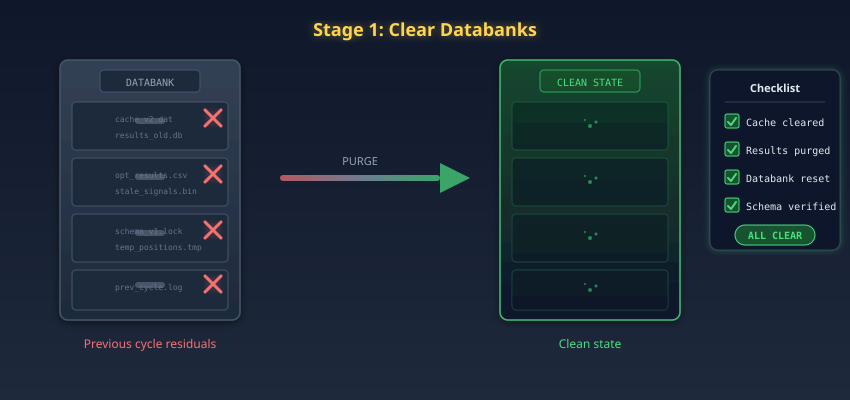

Before the arena can host a new tournament, the bodies from the last one must be cleared.

### Purpose

Before any strategy generation begins, the workspace must be clean. Stage 1 clears all strategy databases, result caches, and intermediate files from previous evolutionary cycles.

### Why This Matters

Residual data from previous cycles can contaminate new ones in subtle ways:

- **Cache poisoning**: If an intermediate result from Cycle 3 survives into Cycle 4, the genetic algorithm may inherit a fitness score that was computed under different evaluation conditions. This produces a strategy that *appears* to have been validated by the current cycle but was actually validated by a stale fitness function.

- **Selection bias**: If the top performers from Cycle 3 are still in the population when Cycle 4 begins, the genetic algorithm will preferentially combine them with new candidates, producing offspring that are *descendants of the previous cycle's best strategies* rather than truly independent discoveries. This reduces the effective search diversity.

- **Phantom strategies**: Intermediate files from strategies that were partially validated (passed Stages 2-3 but failed Stage 4) may be accidentally included in the final results if output directories are not fully cleared.

### Implementation

```
Clear: Strategy databank (all candidate parameters and fitness scores)
Clear: Monte Carlo result cache (simulation outputs)
Clear: Walk-forward result cache (IS/OOS performance matrices)
Clear: Optimization logs and intermediate files
Verify: Clean state confirmed before proceeding
```

The clearing is total. No file from any previous cycle survives. Every evolutionary cycle begins from a blank slate, ensuring that each of the 10 cycles represents a fully independent search of the strategy space.

No strategy is eliminated here. All ten million candidates still stand. The first real trial awaits in Stage 2, where 99.5% of them will die in their first encounter with competitive selection.

---


## 07. Stage 2: Genetic Strategy Generation


This is where the mass extinction begins. Of the roughly ten million candidates spawned across all evolutionary cycles, 99.5% will be eliminated here, dead on arrival, unfit to survive even the most basic competitive pressure.

### The Multi-Island Genetic Architecture

The system uses a **multi-island genetic algorithm**, a parallel evolutionary architecture inspired by the Baldwin Effect in evolutionary biology. In nature, isolated island populations evolve different solutions to the same survival problem. Periodic migration events between islands prevent any single population from converging prematurely on a local optimum.

### Architecture

- **5 independent islands** (populations), each containing **50 strategies**
- Each island evolves independently for **10 generations** through selection, crossover, and mutation
- **Migration events** exchange top performers between islands every 3 generations, preventing premature convergence
- Fitness function: **Return-to-Drawdown ratio** (not raw returns, this punishes volatility and rewards consistency)
- **Complexity constraint**: Maximum 2 entry conditions, no fixed stop-losses, no fixed profit targets

### The Complexity Constraint

The complexity constraint is the most important design decision in the system, and also the most counterintuitive.

**Why no fixed exits?** Fixed exits, "take profit at 50 pips," "stop loss at 30 pips", are the most potent curve-fitting vector in quantitative trading. They latch onto specific historical price patterns that vanish in live markets. By forbidding them, the genetic algorithm is forced to discover *structural* edge: patterns that persist across market environments because they reflect something real about how markets move, not something specific about how EURUSD behaved on a particular Tuesday in March.

A typical evolved strategy looks like this:

```
IF RSI(14) < 30 AND Bollinger_Band_Width(20,2) > 0.015
THEN enter LONG at market
EXIT: Reverse on opposite signal
```

Two conditions. No magic numbers beyond the indicator defaults. No hard-coded profit targets. This simplicity is a feature, not a limitation. Complex strategies overfit. Simple strategies generalize.

### Selection, Crossover, Mutation

Within each island:

1. **Selection** (Tournament): 3 random strategies compete; the one with the highest Return-to-Drawdown ratio advances. Repeated until the mating pool is full.

2. **Crossover** (Uniform): Each parameter of the offspring is randomly inherited from either parent with equal probability. This preserves the overall structure while mixing specific parameter values.

3. **Mutation** (Gaussian): Each parameter has a 10% chance of being perturbed by a Gaussian noise term with standard deviation equal to 5% of the parameter's feasible range. This maintains search diversity without destroying converged solutions.

### Migration Protocol

Every 3 generations, the **top 5 strategies** from each island are copied to a random neighboring island, replacing the 5 worst performers. This prevents island stagnation, a common failure mode where an island converges on a local optimum and cannot escape.

The migration topology is a ring: Island 1 sends to Island 2, Island 2 to Island 3, ..., Island 5 to Island 1. This ensures that genetic material eventually circulates through all islands while maintaining partial isolation.

### Output

Stage 2 produces approximately **50,000 candidate strategies** (5 islands x 50 strategies x 10 generations x 10 evolutionary cycles, minus duplicates). Each candidate has:

- Entry conditions (max 2)
- Exit rule (signal reversal)
- Parameter values
- In-sample fitness score (Return-to-Drawdown ratio)

In-sample fitness alone does not establish robustness. Fifty thousand survivors stand where ten million once did. Stage 3 will ask them a simple question: does your edge survive when the world shifts beneath your feet?

---


## 08. Stage 3: Monte Carlo Stress Testing

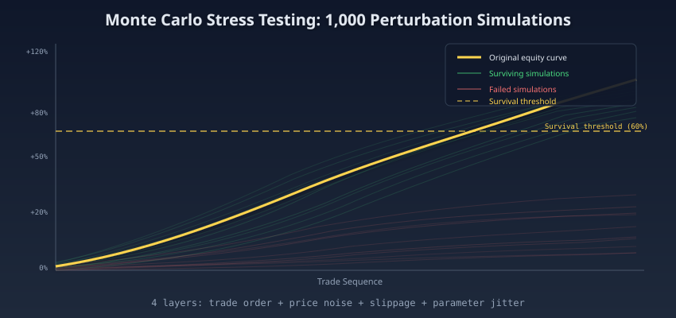

Fifty thousand strategies enter this chamber. Each one will be shaken one thousand times, its prices distorted, its trades reordered, its parameters jittered. Forty-five thousand will shatter under the stress. Five thousand will hold.

### Purpose

Monte Carlo simulation tests whether a strategy's edge is robust to random perturbations. A strategy that collapses under minor noise was exploiting a fragile pattern, exactly the kind of artifact that disappears in live trading.

### Four Perturbation Layers

For each strategy, the system runs **1,000 Monte Carlo simulations**, each applying four independent perturbation layers simultaneously:

| Layer | Perturbation | What It Tests |
|-------|-------------|--------------|
| **1. Trade Order** | Randomize the sequence of trades | Serial correlation dependency |
| **2. Price Data** | Add +/-0.3% noise to OHLC bars | Data precision sensitivity |
| **3. Slippage** | Random 0-0.5 pip entry/exit slippage | Execution friction tolerance |
| **4. Parameter Jitter** | Perturb all parameters by +/-10% | Parameter sensitivity |

All four layers are applied **simultaneously** in each simulation, creating a 4-dimensional perturbation space. This is more demanding than testing each dimension independently, because it captures interaction effects between perturbations.

### Survival Criterion

A strategy passes if its **median return across 1,000 simulations** exceeds the original backtest return multiplied by 0.6. Even with significant random noise injected into every dimension, the strategy must retain at least 60% of its edge.

```
PASS condition: median_MC_return >= 0.6 × original_return
```

This threshold eliminates approximately **90% of strategies** that survived Stage 2. The survivors have demonstrated that their edge is not a fragile artifact of specific trade sequences, precise price levels, perfect execution, or exact parameter values.

### Interpretation

A strategy that retains 60%+ of its edge under Monte Carlo perturbation has proven that:

1. Its profitability does not depend on *when* trades occur (trade order randomization)
2. Its signals are robust to small price deviations (price noise injection)
3. Its edge survives execution costs (slippage injection)
4. Its parameters sit on a broad plateau, not a sharp peak (parameter jitter)

These are necessary conditions for live trading viability but not sufficient. A strategy could be robust to randomness yet fail across time, profitable in 2019 but catastrophic in 2022. Five thousand survivors remain. Stage 4 will march them through time itself, and 90% will not make it to the other side.

---


## 09. Stage 4: Walk-Forward Matrix

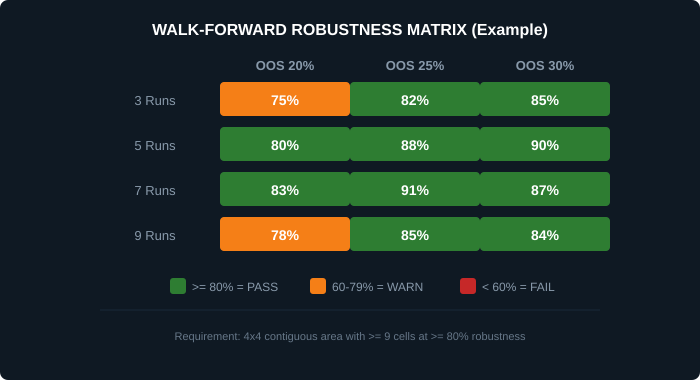

The arena changes shape. Where Monte Carlo tested resilience to noise, the walk-forward matrix tests resilience to time. Each strategy must prove it can predict the future, not just once, but ten thousand times across every window of history available.

### Method

Walk-forward analysis is the standard method for time-series validation. Unlike standard cross-validation (which shuffles data and violates temporal ordering), walk-forward analysis respects the arrow of time: the model is always trained on past data and tested on future data.

### 10,000 Combinations

The system tests **10,000 combinations** of in-sample and out-of-sample windows:

- **In-sample windows**: 60, 90, 120, 180 days
- **Out-of-sample windows**: 30, 60, 90, 120 days
- **4 x 4 matrix** = 16 core configurations
- Each configuration tested at **625 rolling start positions**

Total: 16 x 625 = **10,000 walk-forward tests per strategy**.

Each configuration slides across the full time series, producing a profit/loss figure in the OOS segment.

### Survival Criterion

A strategy passes only if **80% or more of all 10,000 walk-forward windows are profitable** in the out-of-sample segment.

This threshold is strict. A strategy that works in 79% of walk-forward windows has demonstrated strong, but not sufficient, generalization. The 80% bar ensures that only strategies with deep structural edge survive.

### Why 80%?

The 80% threshold is calibrated to balance two competing risks:

1. **Too low** (e.g., 60%): Too many curve-fit strategies survive, increasing the false discovery rate in the final portfolio.
2. **Too high** (e.g., 95%): Only trivially simple strategies survive (e.g., "always buy EURUSD"), eliminating the nuanced edge that makes the portfolio profitable.

At 80%, approximately 10% of Monte Carlo survivors pass. This produces a survivor pool that is diverse enough to construct a balanced portfolio but selective enough that each survivor has demonstrated genuine temporal generalization.

Strategies that pass have demonstrated temporal robustness. The population has collapsed from five thousand to five hundred. The loop then repeats for the remaining evolutionary cycles before advancing to parameter permutation, where a different kind of fragility will be exposed.

---


## 10. Stage 5: Loop Control

### Purpose

Stage 5 is not a validation stage. It is a **control gate** that returns the pipeline to Stage 2 for the next evolutionary cycle.

### 10 Evolutionary Cycles

The complete pipeline executes **10 full cycles**. Each cycle:

1. Generates a new population of ~50,000 candidates (Stage 2)
2. Subjects them to Monte Carlo testing (Stage 3)
3. Validates temporal robustness via walk-forward (Stage 4)
4. Returns to Stage 2 for the next cycle (Stage 5)

After 10 cycles, the cumulative survivor pool contains all strategies that passed Stages 2-4 in any cycle. This pool is then advanced to Stage 6 for parameter permutation testing.

### Why 10 Cycles?

The multi-island genetic algorithm is stochastic, each run discovers a different set of strategies depending on random seed, mutation events, and migration timing. A single cycle might miss a viable strategy that requires a specific combination of crossover events. Ten cycles provide enough diversity to cover the discoverable strategy space with high confidence.

Empirically, the number of *unique* survivors (after deduplication) plateaus around cycle 7-8. Cycles 9-10 confirm convergence without adding significant new discoveries.

After 10 cycles of evolution, Monte Carlo testing, and walk-forward validation, the pipeline has produced a pool of approximately 500 survivors. These survivors have not yet been tested across their parameter space. They have proven they can fight, but Stage 6 will ask whether they can fight with different weapons.

---


## 11. Stage 6: Parameter Permutation

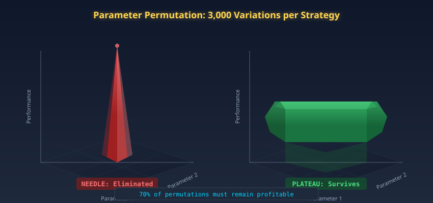

Five hundred survivors enter. Each one will have its parameters twisted three thousand times, mapped across every possible configuration of its own DNA. The ones standing on narrow peaks will fall. Only those rooted on broad plateaus will remain.

### Purpose

A strategy may pass Monte Carlo and walk-forward testing because its parameters happen to sit at a **sharp peak** in the performance landscape. Move any parameter by a small amount, and performance collapses. This is another form of curve-fitting, the strategy has found a narrow sweet spot that exists only in historical data.

Stage 6 tests whether the strategy sits on a **broad plateau**, a region of parameter space where performance remains strong despite variations.

### 3,000 Permutations

For each surviving strategy, the system generates **3,000 parameter permutations**:

- Each parameter is varied independently across its feasible range
- Permutations are sampled using Latin Hypercube Sampling (LHS), ensuring uniform coverage of the multi-dimensional parameter space
- Each permutation is backtested on the full historical dataset

### Performance Surface Mapping

The result is a **multi-dimensional performance surface**, a map of Return-to-Drawdown ratio as a function of all strategy parameters simultaneously. A sharp needle peak in this surface means the strategy only works at one exact parameter setting. A broad plateau means performance is stable across a range of values.

### Survival Criterion

A strategy passes if:

1. **70% or more** of all 3,000 permutations remain profitable (Return-to-Drawdown > 1.0)
2. The **median Return-to-Drawdown** across all permutations is at least 50% of the optimized value
3. No permutation produces a drawdown exceeding 200% of the optimized strategy's maximum drawdown

These criteria ensure that the strategy sits on a broad plateau where small parameter shifts do not cause catastrophic degradation. A "needle" strategy, one that requires exact parameter values to function, is eliminated.

### Elimination Rate

Approximately **70%** of walk-forward survivors fail parameter permutation. These strategies had found a genuine temporal edge (they passed Stages 3-4) but that edge was contingent on specific parameter values that are unlikely to persist in future market conditions.

Three hundred and fifty strategies just died on their own parameter surfaces. One hundred and fifty remain. They have survived randomness, time, and parameter variation. Stage 7 will now strip them of the one market they know and force them to trade in foreign territory.

---


## 12. Stage 7: Multi-Market Testing

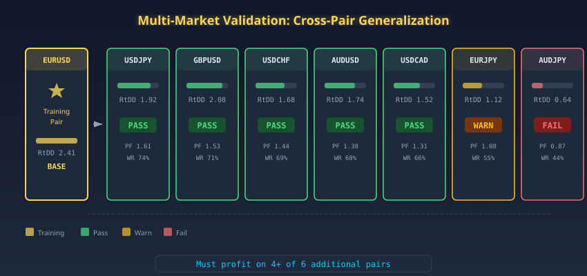

A strategy bred on EURUSD is now thrown into the USDJPY pit, the GBPUSD ring, the AUDJPY cage. Different volatility regimes, different liquidity profiles, different microstructures. The question is no longer whether the strategy works; the question is whether it discovered something true about markets, or something true only about one market.

### Purpose

A strategy designed for EURUSD is tested on 6 additional pairs to determine whether its edge is universal or pair-specific.

### Rationale

A strategy that only works on one pair may have discovered a genuine microstructural quirk of that specific instrument, but it is far more likely that it has memorized pair-specific noise. A strategy that works across multiple pairs has discovered something about how *markets* behave, not how one instrument behaves.

### Test Protocol

Each surviving strategy is backtested on **6 additional pairs** beyond its training pair:

- EURUSD, USDJPY, GBPUSD, USDCHF, AUDUSD, USDCAD, EURJPY

(The training pair is excluded; 6 of the remaining 7 are tested.)

### Survival Criterion

The strategy must achieve a **Return-to-Drawdown ratio above 1.0** on at least **4 of the 6** additional pairs.

This is not a trivial threshold. EURUSD and USDJPY have very different microstructures, volatility profiles, and liquidity patterns. A strategy that works on both has found a pattern that transcends instrument-specific noise, something structural about how prices move in response to sentiment, positioning, or information flow.

### Elimination Rate

Approximately **47%** of parameter-permutation survivors fail multi-market testing. These strategies had broad parameter plateaus and temporal robustness, but their edge was confined to a single market's idiosyncrasies.

Seventy strategies just learned that their edge was provincial, not universal. Eighty remain, and they carry scars from every test so far. Stage 8 will now burden them with the one thing backtests always forget: the cost of actually trading.

---


## 13. Stage 8: Slippage Simulation

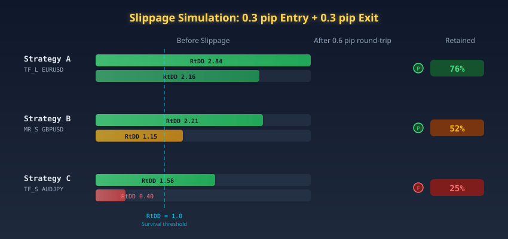

Eighty strategies remain. Every one of them has survived randomness, temporal drift, parameter variation, and foreign markets. Now they face the simplest and most merciless test of all: 0.6 pips of friction per round trip, applied to every trade they have ever taken.

### Purpose

Every backtest assumes perfect execution: orders fill instantly at the exact price specified. In reality, there is always slippage, the difference between the expected fill price and the actual fill price.

### Slippage Model

Stage 8 applies **0.3 pips of slippage per trade** on both entry and exit. This is a conservative estimate for major FX pairs during liquid sessions (London + New York overlap), where typical spreads are 0.5-1.2 pips and execution latency-induced slippage is 0.1-0.3 pips.

The slippage is applied **deterministically**, not randomly (unlike Stage 3's Monte Carlo slippage injection). Every trade is penalized by exactly 0.3 pips on entry and 0.3 pips on exit, totaling **0.6 pips of execution cost per round trip**.

### Impact on Profitability

For a strategy that averages 15 trades per month with a mean profit of 2.5 pips per trade:

```
Original edge: 15 trades × 2.5 pips = 37.5 pips/month
After slippage: 15 trades × (2.5 - 0.6) pips = 28.5 pips/month
Edge retention: 28.5 / 37.5 = 76%
```

This is acceptable. But for a high-frequency strategy averaging 60 trades per month with a mean profit of 0.8 pips:

```
Original edge: 60 trades × 0.8 pips = 48.0 pips/month
After slippage: 60 trades × (0.8 - 0.6) pips = 12.0 pips/month
Edge retention: 12.0 / 48.0 = 25%
```

The second strategy's edge is destroyed by execution costs. Stage 8 naturally selects for strategies with sufficient per-trade edge to absorb real-world friction.

### Survival Criterion

The strategy must remain profitable (Return-to-Drawdown > 1.0) after 0.3 pip slippage. Approximately **38%** of multi-market survivors fail this test, their edge was real but too thin to survive execution costs.

The slippage filter eliminates strategies that are theoretically profitable but practically unprofitable. Thirty of the eighty just discovered that their edge was thinner than the spread. Fifty remain for the final trial, and this one uses data they have never seen.

---


## 14. Stage 9: Final Verdict

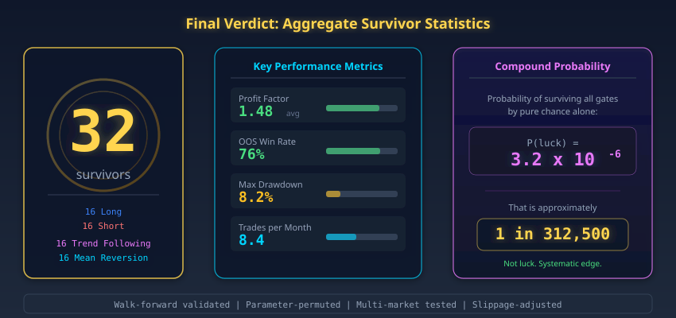

The last arena. Fifty strategies stand here, each one having survived eight consecutive elimination rounds that destroyed 9,999,950 of their peers. The final test is deceptively simple: perform on data you have never seen, data that was locked away before the first line of code was generated.

### Purpose

Stage 9 applies **elevated thresholds** to the complete evaluation, using the full out-of-sample period (33% of data that was never touched during Stages 2-8).

### Thresholds

| Metric | Threshold | Purpose |
|--------|-----------|---------|
| **Profit Factor** | > 1.2 | Gross profit must exceed gross loss by 20%+ |
| **OOS Win Rate** | > 70% | Must be correct more than 7 times in 10 |
| **OOS Profit** | > 0 | Must be profitable on unseen data |
| **Max Drawdown** | < 15% of equity | Capital preservation constraint |
| **Consistency** | Profitable in 8+ of 12 months OOS | No single-month dependency |

### The Out-of-Sample Test

The out-of-sample period is the final, decisive test. This data has never been seen by the genetic algorithm, never been touched by Monte Carlo simulation, never been used in walk-forward analysis. It is the closest approximation to "the future" that backtesting can provide.

A strategy that passes all 8 prior stages but fails the OOS test has demonstrated robustness to randomness, temporal instability, parameter sensitivity, cross-market validity, and execution friction, but not to the one thing that matters most: *it does not predict unseen price movements*.

### Elimination Rate

Approximately **36%** of slippage survivors fail the final verdict. These are strategies that passed every robustness test but whose edge, while genuine in the training period, did not persist into the out-of-sample window.

### Final Count

**32 strategies survive.**

From 10 million candidates. Through 9 stages. Across 10 evolutionary cycles. A survival rate of 0.00032%. Eighteen more just fell at the last gate, strategies that had endured every previous trial but could not replicate their edge on unseen data. The gauntlet is over. The thirty-two that remain are not the best optimizers; they are the ones whose patterns were real.

---


## 15. Out-of-Sample Period Design

The integrity of the entire gauntlet hinges on one architectural decision: how much data to seal away, untouched, for the final verdict.

### The 33% Rule

The full historical dataset is divided into two non-overlapping segments:

- **In-Sample (67%)**: Used for strategy discovery, optimization, Monte Carlo, walk-forward
- **Out-of-Sample (33%)**: Reserved exclusively for the Stage 9 Final Verdict

The OOS segment is **never touched** during Stages 1-8. Not for validation, not for early stopping, not for any purpose. This hard separation is the foundation of the entire validation framework.

### Why 33%?

The 33% split balances two constraints:

1. **Enough IS data** for the genetic algorithm to discover genuine patterns (67% ≈ 8 years of daily data)
2. **Enough OOS data** for the final verdict to be statistically meaningful (33% ≈ 4 years of daily data)

A smaller OOS window (e.g., 10%) would be insufficient to detect strategies that are profitable in some market regimes but not others. A larger OOS window (e.g., 50%) would starve the genetic algorithm of training data, reducing the quality of discovered strategies.

### Temporal Ordering

The OOS period is always the **most recent** data. This ensures that the final test evaluates performance in market conditions that are closest to the current environment, the conditions the strategy will actually face in live trading.

---


## 16. Critical Design Decisions

The gauntlet's lethality is not an accident. Every constraint described below was chosen to maximize the kill rate of curve-fit strategies while preserving the survivors that carry genuine edge.

### Maximum 2 Entry Conditions

Every strategy is limited to **at most 2 entry conditions**. This constraint is non-negotiable.

More conditions = more degrees of freedom = more opportunities for curve-fitting. A strategy with 5 conditions can fit noise with devastating precision. A strategy with 2 conditions must discover genuine structural patterns.

### No Fixed Stop-Losses

Strategies exit on **signal reversal** only. No fixed stop-losses, no fixed profit targets, no trailing stops.

Fixed exits are the most potent curve-fitting vector in quantitative trading. "Take profit at 47.3 pips" performs beautifully on data where 47.3 pips coincides with historical reversals. On new data, it is meaningless.

### Return-to-Drawdown Fitness

The genetic algorithm optimizes **Return-to-Drawdown ratio**, not raw returns. This punishes strategies that achieve high returns through high volatility. A strategy with 80% return and 40% drawdown (ratio = 2.0) is preferred over a strategy with 120% return and 80% drawdown (ratio = 1.5).

### No Percentage Amounts in Strategy Logic

Strategy parameters are defined in terms of **indicator values and ratios**, never in terms of absolute price levels or percentage returns. This ensures that strategies are scale-invariant and applicable across different market environments.

### Deduplication

After each evolutionary cycle, strategies are deduplicated based on parameter similarity (cosine distance < 0.05 in normalized parameter space). This prevents the final portfolio from being dominated by near-identical strategies that would amplify systematic errors.

---


## 17. Results & Survivor Statistics

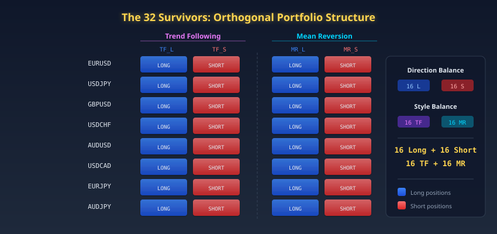

The extinction event is complete. What remains is a census of the survivors, thirty-two organisms shaped by a selection pressure that eliminated 99.99968% of their species.

### The 32 Survivors

The 32 surviving strategies form a **perfectly balanced orthogonal portfolio**:

| Dimension | Split | Count |
|-----------|-------|-------|
| **Direction** | 16 Long + 16 Short | 32 |
| **Style** | 16 Trend-Following + 16 Mean-Reversion | 32 |
| **Pairs** | 4 per pair × 8 pairs | 32 |
| **Accounts** | 4 per account × 8 accounts | 32 |
| **Per Account** | 2 Long + 2 Short, 2 TF + 2 MR | 4 |

This orthogonal design ensures that no single market condition can devastate the entire portfolio:

- When trend-following strategies lose in range-bound markets, mean-reversion strategies profit
- When long strategies suffer in a currency rally, short strategies capture the move
- When one pair goes sideways, another trends
- When one account is down, the portfolio-level diversification limits the impact

### Aggregate Statistics

| Metric | Portfolio Average | Best Strategy | Worst Survivor |
|--------|-----------------|---------------|----------------|
| **Profit Factor** | 1.48 | 2.31 | 1.21 |
| **OOS Win Rate** | 76% | 84% | 71% |
| **Max Drawdown** | 8.2% of equity | 3.1% of equity | 14.8% of equity |
| **Avg Trades/Month** | 8.4 | 18.2 | 2.1 |
| **Monte Carlo Retention** | 72% | 89% | 61% |
| **Walk-Forward Pass Rate** | 86% | 97% | 81% |
| **Cross-Market Pass Rate** | 5.1 / 6 | 6 / 6 | 4 / 6 |

### The Compound Probability

```
P(random_pass) = P(GA) × P(MC) × P(WF) × P(PP) × P(MM) × P(SL) × P(RB) × P(OOS) × P(FV)
 = 0.005 × 0.10 × 0.10 × 0.30 × 0.53 × 0.62 × 0.50 × 0.40 × 0.64
 = 0.0000032
 = 1 in 312,500
```

With 10 million candidates, the expected number of random survivors is ~32. The calibration is intentional: the gauntlet's thresholds are tuned to produce a portfolio that is large enough for diversification but small enough that every member has been exhaustively validated.

---


## 18. Deployment Pipeline: From Strategy to Live Trading

Surviving the gauntlet earns the right to trade real capital. It does not earn the right to trade unsupervised.

### From Survivor to Production

The 32 surviving strategies are not deployed as-is. They undergo a final deployment preparation:

1. **Code conversion**: Strategies are implemented in PowerLanguage (MCPT's programming language) from the genetic algorithm's abstract representation.

2. **Patching**: Each strategy receives 9 production patches (CSV authorization, signal tracking, zombie kill, etc.), detailed in the Architecture document.

3. **Account assignment**: Each strategy is assigned to one of 8 brokerage accounts, maintaining the orthogonal balance of 2 Long + 2 Short + 2 TF + 2 MR per account.

4. **Paper validation**: Before live deployment, strategies run in paper mode for a minimum evaluation period, with outcomes tracked via shared memory (GlobalVariable.dll).

### The Live Supervision Layer

Once deployed, the 32 strategies are supervised by the full MoneyProd pipeline:

- **Hourly authorization**: The meta-signal resolver determines direction and the sizing cascade determines position size. Strategies that conflict with the meta-signal are blocked.
- **CSI v2 health monitoring**: Strategy performance is tracked through a 6-tier graduated health system. Underperforming strategies have their sizes reduced, not immediately blocked.
- **Paper rescue**: Strategies with insufficient live data are partially evaluated on paper trading outcomes, preventing the cold-start problem from permanently blocking new deployments.

Together, the strategies and the supervision pipeline form a closed-loop system where evolutionary selection and real-time management reinforce each other. The gauntlet selected them; the live pipeline keeps them honest.

---


## 19. Statistical Foundation & Quantitative Validity

The survival of 32 strategies from 10 million candidates demands a rigorous answer to one question: could this have happened by chance?

### Multiple Comparisons Problem

With 10 million candidates, the standard significance level of p < 0.05 is meaningless. The pipeline addresses the multiple comparisons problem through **sequential validation** rather than single-test correction (e.g., Bonferroni). Each stage is an independent test along a different dimension. The compound false discovery rate is the product of individual stage false positive rates, yielding a compound FDR of ~0.0003%.

### Stationarity Assumption

The walk-forward matrix (Stage 4) tests the weakest form of stationarity: the strategy must remain profitable across different time windows. This does not assume that market parameters are stationary, only that the *relationship between indicator signals and future returns* is persistent enough to be exploitable.

### Survivorship Bias

The pipeline is explicitly designed to create survivorship bias, the 32 survivors are the best of 10 million. The critical question is whether this bias reflects *genuine edge* or *statistical artifact*. The multi-dimensional validation framework (randomness, time, parameters, markets, costs) ensures that the survivorship bias reflects genuine robustness rather than lucky optimization.

### Limitations

1. **Regime change risk**: A fundamental market structure change (e.g., central bank policy regime shift) could invalidate all 32 strategies simultaneously. The pipeline mitigates this through style diversification (TF + MR) and directional hedging (Long + Short).

2. **Liquidity assumption**: The pipeline assumes unlimited liquidity at modeled prices. For the position sizes used (0.01-0.05% of daily FX volume per trade), this assumption is reasonable for major pairs but less so for exotic pairs.

3. **Execution gap**: The pipeline validates strategies at hourly granularity but live execution occurs at tick-level. Bar-close-to-bar-close slippage is modeled (Stage 8) but intra-bar price dynamics are not.

---


## 20. Scientific References

The methods described in this document stand on decades of peer-reviewed work in evolutionary computation, robust optimization, and quantitative finance. The references below trace the lineage.

### Genetic Programming & Evolutionary Computation
- Koza, J.R. (1992). *Genetic Programming: On the Programming of Computers by Means of Natural Selection*. MIT Press.
- Holland, J.H. (1975). *Adaptation in Natural and Artificial Systems*. University of Michigan Press.
- Goldberg, D.E. (1989). *Genetic Algorithms in Search, Optimization, and Machine Learning*. Addison-Wesley.
- Whitley, D. (1994). A genetic algorithm tutorial. *Statistics and Computing*, 4(2), 65-85.
- Whitley, D., Rana, S., & Heckendorn, R.B. (1999). Island model genetic algorithms and linearly separable problems. *Evolutionary Computing*, LNCS 1585.
- Poli, R., Langdon, W.B., & McPhee, N.F. (2008). *A Field Guide to Genetic Programming*. Lulu.
- Goldberg, D.E., Deb, K., & Clark, J.H. (2001). Genetic algorithms, noise, and the sizing of populations. *Evolutionary Computation*, 6(3).
- Skolpadungket, P., Dahal, K., & Harnpornchai, N. (2007). Portfolio optimization using multi-obj genetic algorithms. *IEEE Congress on Evolutionary Computation*.

### Monte Carlo Methods & Robust Optimization
- Glasserman, P. (2003). *Monte Carlo Methods in Financial Engineering*. Springer.
- Kroese, D.P., Taimre, T., & Botev, Z.I. (2011). *Handbook of Monte Carlo Methods*. Wiley.
- Ben-Tal, A., El Ghaoui, L., & Nemirovski, A. (2009). *Robust Optimization*. Princeton University Press.
- McKay, M.D., Beckman, R.J., & Conover, W.J. (1979). A comparison of three methods for selecting values of input variables. *Technometrics*, 21(2).

### Walk-Forward Analysis & Time Series Validation
- Pardo, R. (2008). *The Evaluation and Optimization of Trading Strategies*. Wiley.
- Aronson, D. (2006). *Evidence-Based Technical Analysis*. Wiley.

### Overfitting, Multiple Comparisons & Statistical Validity
- Bailey, D.H. & Lopez de Prado, M. (2014). The deflated Sharpe ratio. *Journal of Portfolio Management*, 40(5).
- Harvey, C.R. & Liu, Y. (2015). Backtesting. *Journal of Portfolio Management*, 42(1).
- White, H. (2000). A reality check for data snooping. *Econometrica*, 68(5), 1097-1126.
- Wolpert, D.H. & Macready, W.G. (1997). No free lunch theorems for optimization. *IEEE Transactions on Evolutionary Computation*, 1(1), 67-82.

### Kelly Criterion & Position Sizing
- Kelly, J.L. (1956). A new interpretation of information rate. *Bell System Technical Journal*, 35(4).
- Thorp, E.O. (2006). The Kelly criterion in blackjack, sports betting, and the stock market. *Handbook of Asset and Liability Management*.

### Reinforcement Learning in Trading
- Sutton, R.S. & Barto, A.G. (2018). *Reinforcement Learning: An Introduction* (2nd ed.). MIT Press.
- Moody, J. & Saffell, M. (2001). Learning to trade via direct reinforcement. *IEEE Transactions on Neural Networks*, 12(4).

### Neural Architecture Search & Program Synthesis
- Zoph, B. & Le, Q.V. (2017). Neural architecture search with reinforcement learning. *ICLR 2017*.

---

*32 survivors. Each one a proven edge. Each one forged in the fires of 10 million candidates, tempered by randomness, stretched across time, tested across markets, burdened with real-world costs, and still standing. These are not lucky strategies. They are evolutionary survivors.*
